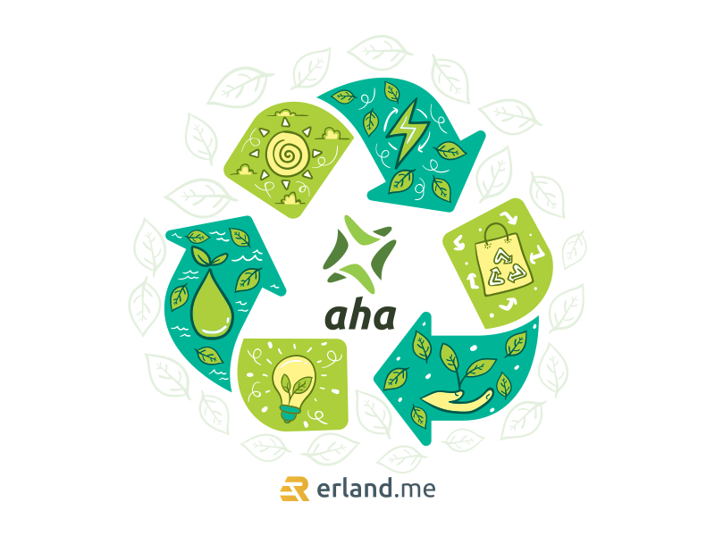

Kalian tentu sudah tau kan dengan cryptocurrency? Obrolan tentang [crypto](/blog/tag/crypto/) memang ramai dibahas di mana-mana. Namun, apakah kalian juga tau dengan fakta bahwa crypto memiliki dampak yang serius terhadap lingkungan yang kita tinggali selama ini, yaitu bumi.

Efek negatif yang ditimbulkan dari kegiatan cryptocurrency bisa timbul karena penggunaan daya listrik secara besar-besaran. Jadi, setiap transaksi cryptocurrency itu diverifikasi oleh perangkat komputer milik para penambang token. Nah, penggunaan perangkat komputer inilah yang membutuhkan daya listrik besar-besaran, karena spesifikasi komputernya juga sangat tinggi.

Jumlah penambang token juga sangat banyak, dan terus bertambah banyak. Ada yang berbentuk perusahaan, ada juga yang perorangan melakukan solo mining. Lebih buruknya lagi, komputer-komputer mereka selalu hidup 24 jam nonstop setiap hari. Bisa dibayangkan seberapa besar daya listrik yang habis digunakan untuk kegiatan transaksi crypto ini?

Sementara itu, untuk menghasilkan daya listrik berskala besar ini, dibutuhkan energi fosil berjumlah besar. Energi fosil seperti batubara, gas alam, atau minyak bumi memang didesain untuk produksi listrik skala besar secara terus-menerus, tapi kegiatan ini sangat jauh dari kata ramah lingkungan.

Untungnya akhir-akhir ini sudah banyak yang menyadari betapa tidak ramah lingkungannya kegiatan dalam transaksi crypto. Mulai bermunculan [token crypto berkonsep eco-friendly](/blog/token-aha-cryptocurrency-berkonsep-eco-friendly/) atau ramah lingkungan. Di antaranya yang sedang ramai diperbincangkan akhir-akhir ini adalah token AHA.

Alam Hijau Anagata atau AHA adalah token crypto yang mengusung misi mengurangi emisi karbon. Dampak kerusakan lingkungan di industri crypto yang menjadi latar belakang berdirinya <a href="https://token-aha.org">AHA token ramah lingkungan</a> ini. Diharapkan kehadiran token AHA dapat membantu mengurangi kerusakan yang terjadi pada lingkungan akibat dari pertambangan token crypto.

Kehadiran token crypto ini kelak akan mendukung proyek-proyek yang memiliki fokus pada energi hijau. Dengan begitu, diharapkan dampak buruk terdapat lingkungan akibat dari penambangan crypto dapat diminimalisir meskipun perkembangan crypto semakin pesat di dunia.

Token AHA memiliki tujuan untuk dapat menjalin kerjasama dengan pemerintah Indonesia dalam memenuhi target mencapai bauran energi sebanyak 23% dari energi baru terbarukan (EBT) pada tahun 2025 nanti. Token AHA ingin berkontribusi dalam merealisasikan target pemerintah tersebut dengan bekerja sama. Token AHA akan berperan dengan mengawasi transisi energi serta berkontribusi dalam proyek energi hijau. Beberapa contoh di antaranya seperti konservasi pengolahan air, perdagangan karbon, dan juga entitas lain-lainnya yang bernilai bisnis.

Sementara itu terkait dengan teknologinya, token AHA ini berbasis pada teknologi Binance Smart Chain (BSC). Dengan teknologi ini pula, token AHA mampu menciptakan transaksi yang aman dan menguntungkan bagi para investor berkat dukungan teknologi decentralized yield-generation utility eco-token.

Dan yang tidak kalah menariknya, token AHA memiliki rencana untuk merilis produk game yang memberikan dukungan untuk program penanaman pohon asli di sejumlah wilayah Indonesia. Tidak hanya itu, AHA juga berencana membuat NFT yang beranggotakan para komunitas yang memiliki mindset go green, sehingga tujuan untuk menjaga kelestarian lingkungan dapat lebih mudah terlaksana apabila anggotanya memiliki pola pikir yang sama.

Secara resmi, token AHA ini dirilis pada Desember 2021 dengan harga 1 token AHA seharga 0,0035 BUSD. Dijadwalkan tahap penjualan token dengan presale berlangsung 1 Maret - 20 April 2022 dan penjualan secara publik dimulai pada 22 April 2022.

Untuk kalian para investor pastilah penasaran dengan keunggulan dari token AHA ini. Apa yang membuat token ini layak dipertimbangkan untuk dimiliki?

Keunggulan dari AHA adalah diperdagangkan dalam bentuk koin dan token yang harganya stabil, tidak begitu fluktuatif seperti crypto pada umumnya. Kalian bisa bertransaksi dengan mudah dan aman karena terkoneksi langsung ke sistem yang sepenuhnya terdesentralisasi. Token AHA mematok biaya transaksi yang kecil, yaitu hanya 6% per transaksi. Biaya tersebut dibagi untuk pemeliharaan sistem 1%, dana amal 2%, refleksi ke pemegang lain 3%.
