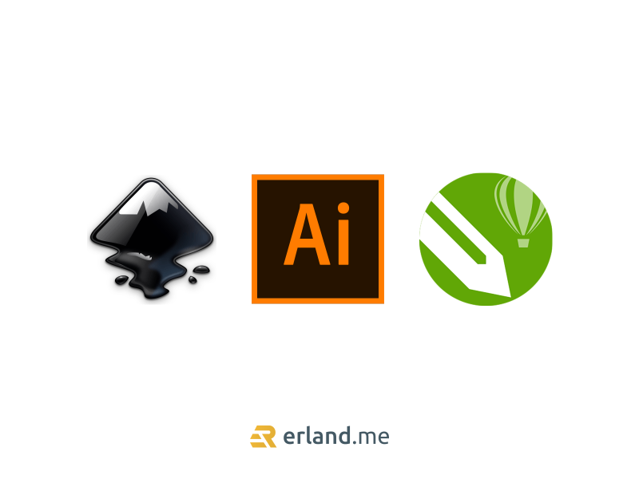

Selain perlu memahami prinsip [dasar desain grafis](/blog/dasar-desain-grafis/), para desainer grafis seyogyanya harus bisa memahami sedikit dari banyak aplikasi desain yang beredar saat ini. Ada banyak aplikasi desain grafis untuk PC yang bisa Anda gunakan untuk desain berbagai keperluan, seperti logo, edit foto atau lainnya.

Sekarang ini, banyak aplikasi yang menawarkan berbagai fasilitas yang menarik. Sebelum menentukan aplikasi desain yang hendak digunakan, Anda harus mempelajari masing-masing aplikasinya terlebih dahulu agar dapat memenuhi kebutuhan Anda dalam desain.

Berikut ini 10 aplikasi desain grafis terbaik tahun 2021 yang bisa dijadikan andalan.

## Adobe Illustrator

Aplikasi desain grafis terbaik di urutan pertama menurut saya adalah Adobe Illustrator. Aplikasi desain berbasis vektor terpopuler ini sering digunakan dalam pembuatan desain banner/spanduk, logo, sketsa/gambar, kaos, ilustrasi, ikon, dan masih banyak lagi. Aplikasi buatan Adobe ini sangat banyak penggunanya di seluruh dunia.

## Adobe Indesign

Aplikasi ini cocok bagi Anda untuk mendesain layout koran buku, majalah, annual report, company profile, dan sejenisnya. Adobe Indesign akan membantu Anda dalam peletakkan layout terbaik untuk disajikan. Adobe Indesign menjadi salah satu dari aplikasi desain yang wajib Anda miliki, terutama bagi Anda yang bekerja di perusahaan penerbit.

## Adobe Photoshop

Adobe Photoshop juga wajib dimiliki bagi para desainer grafis karena sebagus apapun Desain, Anda sangat membutuhkan aplikasi yang satu ini. Adobe Photoshop memiliki kelebihan lain, yaitu sangat baik dalam mendesain web, graphic creation, project layout, dan pelukis digital. Kelebihan dari aplikasi ini adalah dapat mengelola setiap elemen dengan manajemen layer terbaik, cepat dalam mengolah dan menciptakan gambar berbasis pixel, kaya warna.

## CorelDRAW Graphic Suite

Aplikasi satu ini sudah sangat familiar dengan desainer grafis di Indonesia, umumnya banyak digunakan di industri percetakan. Cara menggunakannya terbilang mudah. CorelDRAW tidak membutuhkan layer, karena cara menggambar di CorelDRAW sama dengan menggambar di atas satu kertas. Anda hanya perlu mengetahui fungsi fitur dan panel di dalamnya, tarik mouse, jadi deh desainnya.

## Inkscape

Jika Anda ingin mendapatkan aplikasi desain gratis berkualitas, Anda bisa menjatuhkan pilihan pada salah satu 10 aplikasi desain grafis, yaitu Inkscape. Aplikasi ini 100% gratis karena bersifat open source. Aplikasi desain vektor ini menggunakan format file SVG agar bisa digunakan fitur, seperti klon, spidol dan alpha blending.

## Jing

Salah satu dari 10 aplikasi desain grafis ini dapat disebut multifungsi karena bisa melakukan banyak hal, terlebih dalam hal merekam layar. Tidak hanya itu, Jing juga sering digunakan dalam pembuatan tutorial video dengan mudah karena adanya fitur pemberian text dan capture.

## 3DVIA

Aplikasi ini dapat digunakan untuk mendesain 3D dengan mudah, meskipun Anda masih pemula sekalipun. Meskipun demikian, shape juga cukup powerfull untuk digunakan oleh profesional. Anda akan menemukan banyak ide ketika mendesain 3D karena banyak fitur yang bisa digunakan.

## LibreCAD

Aplikasi satu ini sangat baik untuk membuat desain blue print atau desain 2D (CAD). LiberCAD menjadi salah aplikasi yang wajib dimiliki oleh draftsmen, arsitek, ataupun insinyur dalam melakukan tugasnya.

## LibreOffice Draw

Desain sederhana, seperti grafik, diagram atau lainnya, Anda bisa memilih aplikasi LibreOffice Draw sebagai pilihan yang tepat. Meskipun demikian, Anda masih bisa menggunakannya untuk karya seni lebih kompleks karena aplikasi ini juga memiliki bermacam fitur.

## Open Clip Art Library (OCAL)

Apabila Anda sedang mencari clip art, Anda bisa menggunakan Open Clip Art Library. Aplikasi ini memiliki koleksi clip art yang berlisensi Creative Commons Public Domain Lisensi. Pada umumnya, clip art yang ada di OCAL bisa digunakan sepenuhnya tanpa royalti.

Selain aplikasi di atas, sebenarnya masih banyak aplikasi lain dengan berbagai kelebihan dan kekurangan masing-masing. Oleh karena itu, Anda harus bisa melakukan pertimbangan sebelum memilih aplikasi desain. Tapi dari yang saya sebut diatas adalah aplikasi-aplikasi pilihan Anda bisa memilih apakah berbayar atau cukup yang gratis. Begitu juga dengan kebutuhan Anda, juga harus dipertimbangkan dalam memilih aplikasi desain grafis. Demikian 10 aplikasi desain grafis yang bisa dijadikan pilihan.
