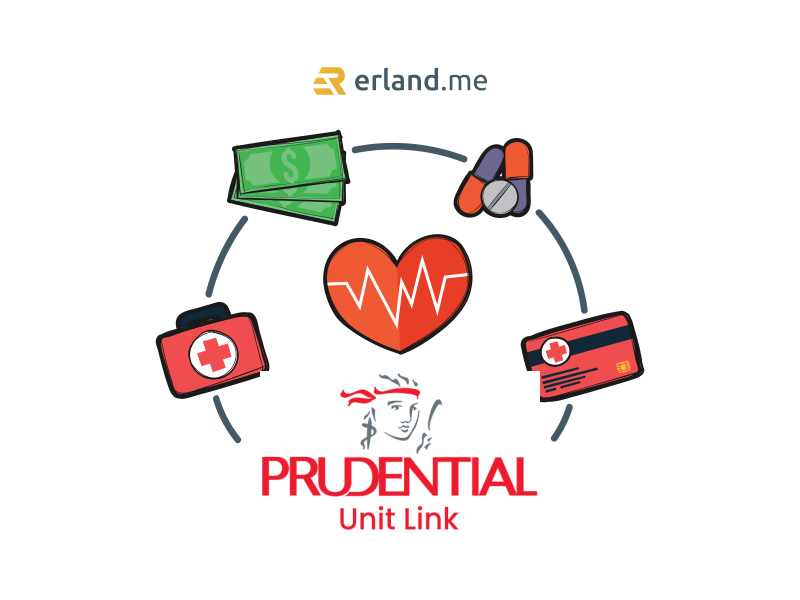

Di Indonesia ada beberapa produk asuransi yang beredar, salah satunya adalah produk Asuransi Unit Link. Tapi masalahnya adalah masih banyak orang yang belum memiliki asuransi, bahkan masih banyak orang yang belum paham apa itu asuransi atau manfaat asuransi, padahal asuransi itu terbilang penting di dalam kehidupan ini.

Asuransi memiliki fungsi di antaranya adalah untuk mengalihkan resiko. Kita pasti nggak mau dong mengalami kejadian yang nggak menyenangkan, tapi ya gimana? Amit-amit sih, tapi yang namanya musibah bisa datang kapan aja. Nah, ketika kita terkena musibah, risiko yang ditimbulkan berbeda-beda. Dengan memiliki asuransi, kita punya hak mengalihkan resiko. Jadi dengan memiliki asuransi maka sejumlah resiko yang mungkin aja kita terima bisa tertutupi oleh asuransi yang kita miliki.

## Asuransi Sebagai Investasi di Asuransi Unit Link

Asuransi nggak selalu terpakai. Tapi kan, kita udah keluar biaya. Apakah bisa asuransi itu jadi investasi? Di Asuransi Unit Link, itu bisa! Kenapa bisa jadi investasi? Ya kenapa nggak? Karena dana yang dihimpun dari nasabah akan dikembangkan oleh pihak asuransi, bahkan dana yang dikembangkan asuransi itu bisa menghemat biaya premi setiap bulannya. Jadi selain perasaan aman dan nyaman karena merasa terlindungi, eh dapet cuan juga.

Jadi Asuransi Unit Link ini adalah produk asuransi yang memberikan dua manfaat sekaligus, yakni manfaat proteksi finansial dan juga manfaat investasi. Produk ini cocok dipilih untuk kita yang sedang merencanakan masa depan melalui investasi. Apalagi kan, sekarang emang lagi gencar tuh soal investasi yang menyasar anak muda kayak kita.

## Manfaat Asuransi Unit Link

Apa sih manfaat Asuransi Unit Link ini? Yang pasti produk asuransi ini dapat digunakan sebagai investasi jangka panjang untuk mendapatkan potensi keuntungan dari hasil investasi. Tapi harus dikenali lebih lanjut karena hasil investasinya pasti terpengaruh oleh fluktiasi harga pasar dari jenis dana investasi yang dipilih nasabah. Tenang aja, informasi ini tercantum juga di dalam Surat Pengajuan Asuransi Jiwa (SPAJ).

Produk asuransi ini memiliki dua manfaat sekaligus, yaitu perlindungan dan investasi dalam satu polis. Jadi nggak usah pusing mengurus dana investasi dan dana perlindungan secara terpisah. Jangka waktu pertanggungan yang panjang sampai kita berusia 99 tahun! Lebih Panjang dari produk asuransi pada umumnya.

## Produk-produk Asuransi Unit Link

Ada produk apa saja di dalam Asuransi Unit Link ini? Ada beberapa, sih. Di antaranya adalah:

### 1\. PRULink Investor Account

Ini adalah produk asuransi jiwa yang ada manfaat investasi di dalamnya. Apa saja manfaat yang bisa didapat dari produk ini?

- Manfaat perlindungan jiwa hingga usia 99 tahun
- Ada 11 pilihan investasi yang bisa dipilih sesuai dengan kebutuhan dan tujuan kita
- Ada fasilitas withdrawal atau penarikan nilai tunai sebagian

### 2\. PRULink Capital Account

Produk ini memberikan manfaat atas resiko meninggal dunia dan manfaat perlindungan kondisi kritis disertai dengan manfaat investasi. Ada apa aja ini?

- Manfaat perlindungan jiwa hingga 99 tahun
- Memberikan perlindungan atas resiko kerugian finansial karena kondisi kritis (ada 34 kondisi kritis yang ditanggung)
- Manfaat uang pertanggungan hingga 100%
- Pilihan investasi yang fleksibel

### 3\. PRULink Syariah Investor Account

Selain asuransi konvensional, ada juga asuransi yang berkonsep syariah, salah satunya adalah PruLink Syariah Investor Account ini yang adalah produk asuransi jiwa dengan manfaat investasi Syariah. Manfaatnya adalah:

- Memberikan perlindungan hingga usia 99 tahun
- Mendapat manfaat santunan meninggal dunia atau cacat total sesuai dengan nilai santunan dan ditambah nila tunai
- Fleksibel dalam memilih jenis investasi yang sesuai dengan profit resiko
- Ada fasilitas withdrawal

Selain yang disebutkan di atas ada banyak lagi produk lain di Asuransi Unit Link ini. Silakan dicek dan dipilih sesuai kebutuhan.

Oke, udah paham soal Asuransi Unit Link ini ya? Udah tahu beberapa produknya, masih ragu? Jangan ragu! Karena Asuransi Unit Link ini cocok buat kita yang pengen dapat manfaat maksimal berupa manfaat proteksi dan juga manfaat investasi sekaligus. Jadi selain perlindungan jiwa atas resiko kematian, kita juga dapat untung dari investasi. Udah gitu bisa ditarik sebagian lagi!

Untuk mendapatkan informasi lebih lengkap kita bisa konsultasi langsung dengan agen asuransi biar bisa ngobrol lebih dalam soal perasaan. Maksudnya perasaan ragu produk asuransi apa yang mau diambil biar kita aman dan nyaman. Tapi jangan ragu-ragu lah, hari gini kayaknya perlu asuransi deh, apalagi kalau ada asuransi yang bermanfaat ganda seperti Asuransi Unit Link ini. Dengan kita mengikuti atau punya asuransi paling nggak kita bisa tenang hidupnya, beban agak berkurang karena kita tahu kita punya proteksi.
