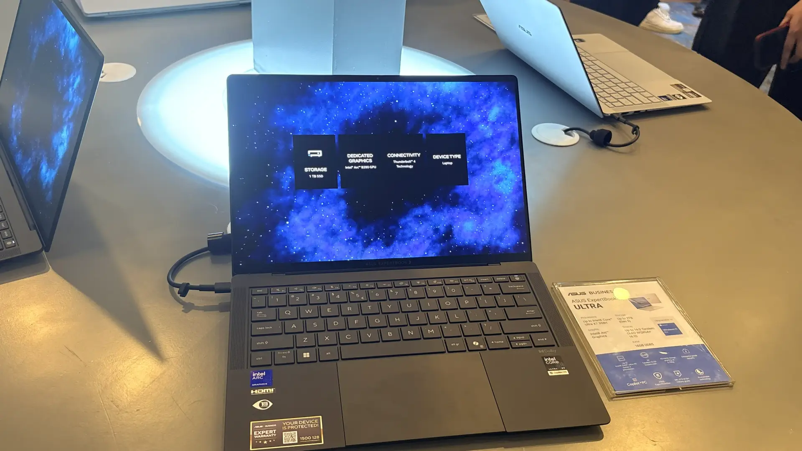
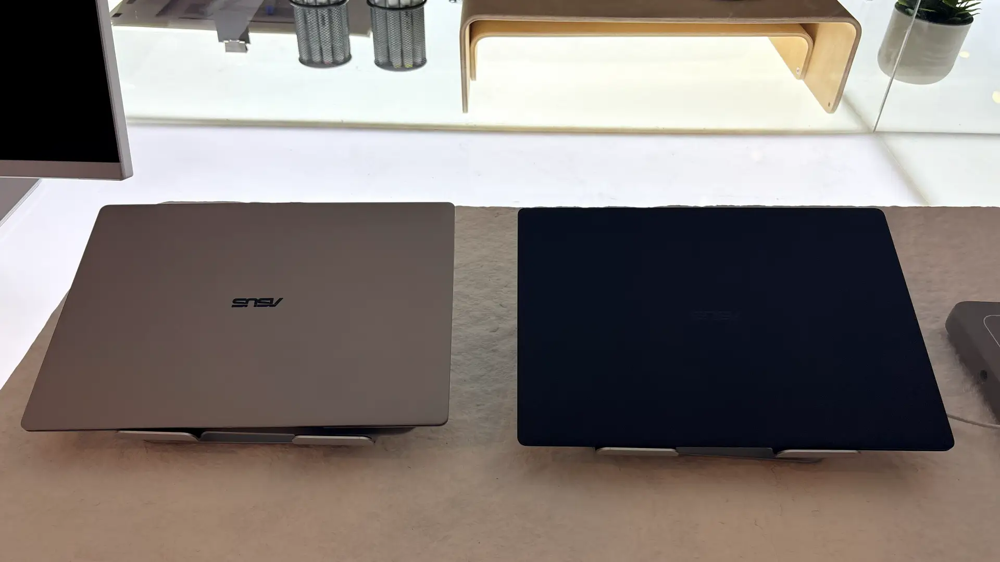

**Jakarta, 7 Mei 2026** - Di era kecanggihan kecerdasan buatan dan mobilitas tinggi saat ini, kebutuhan akan laptop yang mampu mendukung produktivitas profesional dengan performa tinggi dalam bodi yang ringan semakin meningkat. ASUS merespons kebutuhan tersebut dengan meluncurkan [ASUS ExpertBook Ultra](https://www.asus.com/id/laptops/for-work/expertbook/asus-expertbook-ultra/) B9406CAA.

Laptop ini hadir sebagai flagship terbaru di kategori laptop bisnis ultra-portabel yang dirancang khusus untuk profesional dan eksekutif yang menginginkan keseimbangan antara daya dan portabilitas. 

Mengusung tagline "The Flagship of the Industry. Period.", ASUS ExpertBook Ultra menawarkan teknologi mutakhir termasuk AI on-device yang mampu mengoptimalkan kerja tanpa kendala. Dengan berbagai fitur inovatif, laptop ini menjanjikan pengalaman kerja yang lebih efisien dan fleksibel. 

## Bobot Super Ringan yang Mendukung Mobilitas Tanpa Beban

Bobot yang ringan menjadi keunggulan utama ASUS ExpertBook Ultra untuk profesional yang membutuhkan mobilitas tinggi. Varian POLED hanya berbobot 0,99 kg, sementara varian Tandem OLED memiliki bobot 1,09 kg, angka yang sangat ringan untuk kelas flagship. 

:::gallery
,

:::

Dengan dimensi kompak 31,09 x 21,28 x 1,09 cm, laptop ini mudah dimasukkan ke dalam tas kerja atau ransel sehari-hari tanpa menimbulkan beban berlebih. Gita Wirjawan, Brand Ambassador ASUS Commercial Business Indonesia, menyatakan bahwa bobot ringan dan daya tahan baterai ExpertBook Ultra menghadirkan definisi baru mobilitas berdaya tinggi. 

Ringannya bobot laptop memungkinkan para profesional bergerak dengan leluasa, menunjang aktivitas kerja yang dinamis tanpa kelelahan. Keunggulan ini membuka jalan bagi pengalaman kerja yang lebih fleksibel dan nyaman.

## Performa CPU dan AI Canggih untuk Produktivitas Tinggi

Dalam hal performa, ASUS ExpertBook Ultra dilengkapi dengan prosesor Intel® Core™ Ultra X9-388H (Series 3) yang memiliki TDP sustained 50W. Prosesor ini didukung oleh teknologi pendingin ASUS ExpertCool Pro yang mencegah terjadinya throttling, menjaga kinerja laptop tetap optimal saat digunakan dalam beban berat. 

Selain itu, Neural Processing Unit (NPU) dengan kekuatan 50 TOPS memungkinkan eksekusi Large Language Models (LLM) secara lokal, terjemahan waktu nyata, dan aplikasi AI generatif langsung di perangkat dengan latensi nol. Simon Chan dari Intel APJ menyoroti efisiensi tinggi dan kemampuan menjalankan AI kompleks yang maksimal pada ASUS ExpertBook Ultra. Kombinasi performa tinggi dan kecanggihan AI on-device ini memastikan produktivitas profesional dapat terjaga tanpa kompromi.

## Layar OLED Berkualitas Tinggi untuk Visual yang Tajam dan Efisien

Layar menjadi aspek penting untuk mendukung pekerjaan visual profesional. ASUS ExpertBook Ultra mengusung layar utama Tandem OLED berukuran 14 inci 3K (2880x1800) dengan aspek rasio 16:10. Layar ini menawarkan kecerahan HDR hingga 1400 nits serta color gamut 100% DCI-P3 yang menampilkan warna akurat dan tajam. Keunggulan lain adalah refresh rate variabel 30-120Hz yang memberikan visual yang halus sekaligus menghemat daya hingga 40% dibandingkan OLED konvensional. 

Keyboard dan touchpad juga didesain ergonomis dengan fitur backlit dan glass haptic, meningkatkan kenyamanan saat mengetik maupun navigasi dalam berbagai kondisi pencahayaan. Kualitas layar dan input yang optimal ini sangat mendukung kebutuhan visual dan interaksi intuitif dalam lingkungan kerja profesional.

## Daya Tahan Baterai Superior Mendukung Aktivitas Seharian

Keandalan baterai merupakan faktor krusial bagi pengguna laptop untuk aktivitas kerja yang menyeluruh. ASUS ExpertBook Ultra dibekali baterai 70Wh berjenis 4-cell Li-Polymer yang dapat bertahan hingga 26 jam pemakaian dalam sekali pengisian. 

Laptop ini juga menyediakan dukungan fast charging dengan kemampuan pengisian 50% dalam 30 menit, serta pengisian selama 15 menit yang cukup untuk menyuplai daya guna 6 jam produktivitas. Pengisian daya dilakukan secara fleksibel melalui charger USB-C, power bank, atau soket listrik di pesawat komersial, sehingga cocok bagi para profesional yang sering melakukan perjalanan dan membutuhkan ketersediaan daya yang andal tanpa hambatan.

## Sistem Keamanan Enterprise Lengkap untuk Perlindungan Data Maksimal

Keamanan data bisnis menjadi fokus utama pada ASUS ExpertBook Ultra yang menghadirkan fitur keamanan tingkat enterprise. Laptop ini mengantongi sertifikasi keamanan NIST SP 800-193, FIPS 140-2, dan PC Secured-Core Windows, yang menjamin perlindungan dengan standar tinggi. 

Hardware keamanan mencakup ASUS Security Processor, TPM 2.0 FIPS 140-2, dan Microsoft Pluton, serta sensor sidik jari dan kamera IR Windows Hello untuk autentikasi biometrik yang aman. Fitur tambahan seperti Physical Webcam Shield dan Chassis Intrusion Alert juga melindungi privasi pengguna dan keamanan fisik perangkat. Paket keamanan lengkap ini memberikan rasa aman bagi para profesional dalam menjaga kerahasiaan data bisnis yang krusial.

Sebagai catatan, ASUS ExpertBook Ultra juga dibekali software AI MyExpert Suite yang dirancang untuk meningkatkan produktivitas pengguna. MyExpert Suite meliputi AI ExpertMeet yang menyediakan transkripsi dan terjemahan rapat secara real-time, sangat bermanfaat untuk kerja remote. 

Knowledge Hub lokal memudahkan pencarian dokumen berbasis Retrieval-Augmented Generation (RAG) tanpa memerlukan koneksi cloud, menjaga efisiensi dan privasi data. Integrasi penuh dengan Microsoft Copilot+ menghadirkan alat bantu produktivitas enterprise yang canggih dalam ekosistem AI on-device. 

Keunggulan software AI bawaan ini mendukung kerja profesional dengan teknologi mutakhir tanpa biaya langganan tambahan. Dengan spesifikasi di atas, ASUS ExpertBook Ultra hadir sebagai laptop bisnis pilihan utama bagi profesional yang mengutamakan performa, mobilitas, dan keamanan data.

### Laman resmi produk:

[ASUS ExpertBook Ultra｜AI PC for Work | ASUS Global](https://www.asus.com/id/laptops/for-work/expertbook/asus-expertbook-ultra/)

### Kontak ASUS Indonesia

[https://www.asus.com/id/](https://www.asus.com/id/) 

- ASUS Business: [https://www.asus.com/id/business/](https://www.asus.com/id/business/) 
- ASUS Indonesia Instagram: [https://www.instagram.com/asusid/](https://www.instagram.com/asusid/) 
- ASUS Indonesia TikTok: [https://www.tiktok.com/@asus_expert_official](https://www.tiktok.com/@asus_expert_official) 
- ASUS Indonesia Facebook: [https://facebook.com/ASUSIdOfficial](https://facebook.com/ASUSIdOfficial) 
- ASUS Indonesia LinkedIn: [https://www.linkedin.com/in/asus-indonesia-464958179/](https://www.linkedin.com/in/asus-indonesia-464958179/) 
- ASUS Indonesia YouTube: [https://www.youtube.com/@AsusIndonesia](https://www.youtube.com/@AsusIndonesia)
