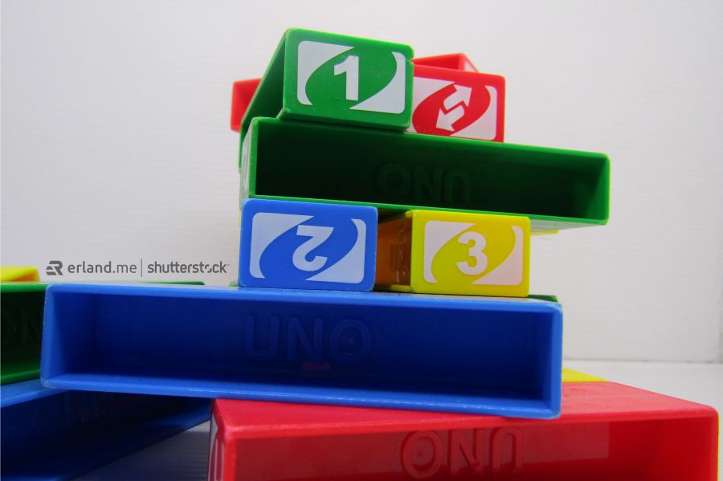

Ada banyak sekali permainan yang menyenangkan untuk dimainkan bersama-sama dengan teman atau keluarga, salah satunya adalah permainan UNO. Sebenarnya permainan UNO terdapat dua jenis, yaitu UNO Card dan UNO Stacko, atau dikenal juga dengan UNO block. Nah, yang akan kita bahas di sini adalah permainan UNO Stacko.

Pada dasarnya, permainan UNO Stacko adalah permainan susunan balok yang sederhana. Di dalam permainan, para pemainnya akan mengambil salah satu balok dan menjaganya supaya susunan baloknya tidak runtuh. Namun, tentu saja terdapat peraturan permainannya.

Di artikel ini, saya akan memberikan penjelasan tentang aturan permainan dan <a href="https://www.guinness.id/temu-santai/article/seru-ini-cara-dan-tips-bermain-uno-stacko">cara main UNO block</a> untuk kalian yang belum mengetahuinya atau untuk kalian yang lupa-lupa ingat. Langsung aja simak, yuk!

## Jenis Balok UNO Stacko

Sebelum mempelajari aturan dan cara bermainnya, terlebih dahulu kalian harus mengetahui jenis-jenis balok pada permainan UNO Stacko karena jika tidak, kalian akan kesulitan mempelajarinya nanti.

Bisa dikatakan permainan UNO Stacko ini tidak jauh berbeda dengan permainan UNO Card, karena ya dari namanya saja sudah sama-sama UNO, kan? Permainan UNO Stacko juga memiliki beberapa tanda pada setiap baloknya. Supaya kalian bisa dengan mudah mempelajari aturan permainannya, ketahui jenis-jenis balok pada UNO Stacko yang akan saya jelaskan berikut ini.

### Balok Angka

Balok pada permainan UNO Stacko yang punya angka di masing-masing sisinya. Yaitu angka 1 sampai 4, dan balok angka ini juga terdapat 4 warna yaitu merah, hijau, kuning, dan biru. Fungsi pada balok angka ini menentukan warna atau angka apa yang harus diambil.

### Balok Reserve

Balok pada permainan UNO Stacko ini memiliki simbol dua panah yang saling berlawanan arah. Fungsi balok reserve ini dapat memutar balik arah giliran bermain. Jadi, jika sebelumnya giliran bermain memutar ke kanan, maka dengan balok reserve ini arahnya akan berputar ke kiri.

### Balok Draw Two

Balok draw two pada UNO stacko memiliki simbol dua kartu sejajar. Balok draw two ini menandakan pemain selanjutnya harus mengambil dua balok. Hampir sama dengan UNO Card, bedanya jika di UNO card simbolnya adalah 2+.

### Balok Skip

Balok skip pada UNO stacko memiliki simbol lingkaran dicoret. Dengan balok skip ini, pemain selanjutnya tidak akan mendapatkan giliran bermain atau skip bermain dalam satu putaran.

### Balok Wild

Balok wild pada UNO stacko ini merupakan balok yang memiliki warna tersendiri, yaitu warna ungu. Jika salah satu pemain mengambil balok ini, maka pemain tersebut dapat memilih warna apa yang diambil oleh pemain selanjutnya.

Kurang lebih sama kan dengan UNO Card? Dari jenis-jenis balok UNO stacko di atas, jika dikumpulkan seluruhnya maka akan berjumlah 45 balok yang terdiri dari:

- 8 balok angka berwarna biru
- 8 balok angka berwarna merah
- 8 balok angka berwarna kuning
- 8 balok angka berwarna hijau
- 3 balok draw two
- 3 balok skip
- 3 balok reserve
- 4 balok wild

## Cara Menyusun UNO Balok

Sebelum memulai permainan ini, tentunya kita harus menyusun terlebih dahulu seluruh balok-balok UNO stacko. Cara menyusunnya cukup mudah, kalian harus membariskan 3 balok secara acak, 3 baris balok ini kita sebutlah sebagai tingkatan.

Kemudian di tingkatan selanjutnya bariskan kembali 3 balok acak secara menyilang dengan tingkatan di bawahnya. Begitu seterusnya, susun balok saling menyilang antar tingkatan hingga membentuk seperti menara atau sebutan lainnya adalah jenga.

## Cara Bermain UNO Balok

Sebenarnya ada dua cara bermain UNO stacko ini, yaitu bermain dengan dadu dan bermain tanpa dadu. Namun, kebanyakan di Indonesia kita ini bermain tanpa dadu karena emang produk UNO stacko yang dijual di Indonesia mayoritas tanpa ada dadu.

- UNO Stacko dapat dimainkan oleh 2 hingga 10 orang. Semakin banyak pemain, semakin menyenangkan.
- Pemain pertama harus mengambil salah satu balok angka yang posisinya berada di baris keempat dari atas hingga ke dasar baris kemudian meletakkannya ke bagian teratas.
- Pemain selanjutnya harus mengambil salah satu balok dengan pilihan warna atau angka yang diambil oleh pemain sebelumnya kemudian juga meletakan balok yang diambilnya ke bagian teratas.
- Begitu seterusnya hingga terdapat pemain yang kalah, yaitu pemain yang meruntuhkan menara UNO stacko.

Jadi, bisa dikatakan bahwa permainan UNO stacko ini tidak ditentukan siapa pemenangnya, melainkan hanya menentukan siapa yang kalah. Pemain yang kalah adalah yang pemain yang meruntuhkan menara ketika sedang giliran mengambil baloknya.

## Aturan Main UNO Stacko

Aturan dalam bermain UNO Stacko inilah yang justru membuat permainan semakin seru, kerena dengan aturan ini para pemain tidak bisa sembarangan dalam bermainnya dan permainan akan semakin menegangkan. Berikut ini beberapa aturan dalam permainan UNO Stacko.

- Penentuan giliran bermain pertama dapat dilakukan dengan diundi
- Pemain pertama hanya boleh mengambil jenis balok angka, tidak boleh mengambil balok bersimbol
- Dalam mengambil balok, pemain hanya boleh mengambilnya dengan 2 jari dan 1 tangan saja
- Tidak boleh mengambil balok yang posisinya berada di 3 baris teratas
- Pemain selanjutnya harus mengikuti aturan yang berlaku pada masing-masing simbol atau menyesuaikan warna dan angka pada balok yang diambil oleh pemain selanjutnya
- Pemain yang meruntuhkan menara harus menyusun kembali balok-baloknya agar dapat segera dimainkan kembali

Begitulah penjelasan tentang aturan dan cara bermain UNO Stacko. Permainan ini sangat cocok dimainkan ketika sedang berkumpul dengan orang-orang terdekat seperti teman-teman atau keluarga.

Seperti yang saya bilang tadi, semakin banyak pemain akan semakin seru dan menyenangkan permainannya. Pastikan ajak semuanya ikut bermain untuk mewarnai moment kumpul-kumpul seru kalian!