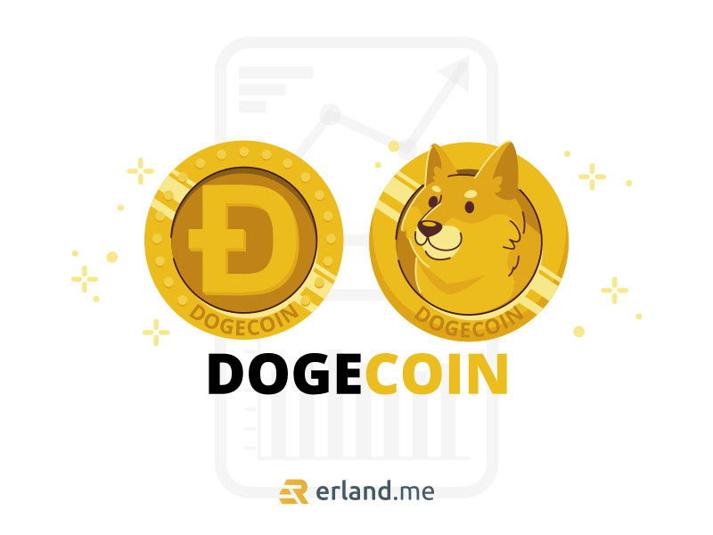

Tak bisa dimungkiri bahwa cryptocurrency sangat populer akhir-akhir ini, sepertinya selalu ada saja pembahasan tentang fluktuasi crypto di setiap obrolan dengan kerabat dan teman-teman. Kepopuleran cryptocurrency ini tak lepas dari harganya yang naik tajam dalam beberapa tahun terakhir, sehingga banyak orang-orang yang tertarik untuk menjadikan crypto sebagai salah satu instrumen investasi.

Dari sekian banyak jenis cryptocurrency, salah satunya yang populer adalah Dogecoin. Aset kripto ini terinspirasi dari meme populer yang beredar di internet, yaitu Doge dan menampilkan anjing Shiba Inu di logonya. Dogecoin merupakan aset kripto open source yang dibuat oleh Jackson Palmer, manajer produk di Adobe Inc. di Sydney, Australia pada tahun 2013.

Jackson Palmer mengatakan bahwa Dogecoin merupakan aset yang ringan dan memiliki daya tarik yang lebih besar. Faktanya, dalam sebuah cuitan di Twitter, CEO Tesla Elon Musk, memberikan pernyataan bahwa Dogecoin adalah koin favoritnya.

Sama seperti cryptocurrency lainnya, Dogecoin juga menggunakan teknologi blockchain. Teknologi ini seperti buku besar digital yang didistribusikan ke semua pengguna untuk mencatat transaksi dengan menggunakan uang kripto ini.

Dogecoin juga merupakan salah satu dari 229 cryptocurrency yang sudah diakui oleh BAPPEBTI (Badan Pengawas Perdagangan Berjangka Komoditi). Cryptocurrency boleh beredar di Indonesia sebagai komoditas perdagangan, sehingga siapapun bisa memiliki crypto sebagai aset investasi yang bisa diperjualbelikan. Namun, hingga saat ini cryptocurrency masih belum bisa menjadi alat tukar yang sah menggantikan rupiah di Indonesia.

## Pertumbuhan Dogecoin

Secara resmi, Dogecoin dirilis pada tanggal 6 Desember 2013. Fakta menariknya, ada lebih dari satu juta pengunjung website dogecoin.com dalam 30 hari pertama sejak rilis.Tercatat pada 19 Desember 2013, hanya dalam waktu 72 jam harga DOGE sempat naik tajam hingga nyaris 300%.

Kenaikan harga DOGE pada waktu itu terjadi saat beberapa aset cryptocurrency termasuk Bitcoin mengalami guncangan yang disebabkan oleh keputusan pemerintah Cina untuk melarang sejumlah bank-bank berinvestasi ke dalam cryptocurrency. Namun, sekitar 72 jam kemudian DOGE mengalami crash besar pertamanya, harganya turun hingga 80%.

Kemudian pada 25 Desember 2013, terdapat kejadian kasus pencurian besar dan pertama kalinya di Dogecoin yang menyebabkan hilangnya jutaan koin pada platform Doge Wallet. Lalu pada Januari 2014, volume perdagangan Dogecoin secara singkat mengalahkan Bitcoin dan seluruh aset kripto lainnya. Walaupun begitu, kapitalisasi DOGE tetap berada jauh di belakang Bitcoin.

Tercatat pula DOGE sempat mencapai puncak nilai sebesar 0,017 USD per koin pada cryptocurrency bubble, yakti antara akhir tahun 2017 sampai dengan awal tahun 2018. Hingga kemudian pada Juli 2020, harga DOGE kembali meroket setelah mengikuti tren di aplikasi TikTok yang bertujuan untuk membuat harga DOGE menjadi 1 USD.

Selanjutnya, pada Januari 2021, harga Dogecoin kembali naik tajam hingga lebih dari 800 persen hanya dalam waktu 24 jam karena hasil dari perhatian pengguna Reddit dan cuitan Elon Musk di Twitter. Lalu pada 16 April, Dogecoin tercatat kembali berhasil all time high sebesar 0,45 USD dengan total volume mencapai 70 miliar USD. Saat itu, kapitalisasi DOGE mencapai 50 miliar USD yang membuat DOGE menjadi aset cryptocurrency dengan nilai tertinggi kelima. Secara keseluruhan pada tahun 2021, nilai Dogecoin telah mengalami peningkatan mencapai 7.000%.

## Mendapatkan Dogecoin

Apakah kalian tertarik untuk memiliki Dogecoin? Jika kalian mau, salah satu cara untuk mendapatkan Doge adalah dengan cara mining Dogecoin. Ada banyak hal yang harus dipersiapkan untuk bisa mining Dogecoin, jadi bisa dibilang mendapatkan DOGE dengan cara mining Dogecoin adalah cara yang sulit. Ada cara lainnya yang lebih mudah, yaitu dengan membelinya di platform jual beli aset crypto. Pastikan kalian memilih platform yang sudah memiliki izin dari BAPPEBTI, ya! Kalian bisa memantau harga <a href="https://www.tokocrypto.com/trade/DOGE_BIDR">DOGE IDR</a> di website atau aplikasi milik platform jual beli aset crypto.

Namun, jika kalian lebih tertarik untuk mendapatkan DOGE dengan cara mining, berikut saya berikan sedikit penjelasan caranya. Ada dua cara mining Dogecoin, yaitu:

### Solo Mining

Sesuai namanya, kalian akan mining secara solo atau sendirian, yang mana kalian harus berlomba-lomba dengan banyak miner di dalam ekosistem Dogecoin. Berlomba-lomba yang dimaksud adalah berlomba adu cepat dalam memecahkan algoritma dengan miner lainnya.

Jika berhasil, kalian akan mendapatkan satu blok Dogecoin yang berjumlah 10.000 DOGE.

Tertarik ingin mencoba solo mining? Ada beberapa hal yang harus dipersiapkan. Di antaranya adalah Dogecoin Wallet dan Mining Software. Terkait mining software, ini tergantung pada hardware yang akan digunakan untuk mining. Misalnya jika menggunakan prosesor AMD atau Intel, mining software yang digunakan adalah CPU Miner. Lalu jika menggunakan komputer ASIC, bisa menggunakan CGMiner ataupun Easy Miner.

Keuntungan dari solo mining Dogecoin memang sangat besar, tetapi perlu diakui bahwa tingkat kesulitannya sangat tinggi. Saya berani mengatakan hampir mustahil solo mining bisa memenangkan persaingan dengan jutaan miner yang sebagian besar perusahaan yang khusus bergerak di bidang mining cryptocurrency serta kebanyakan menggunakan komputer ASIC yang dirancang khusus untuk memecahkan algoritma.

### Join Mining Pool

Mining pool merupakan suatu kelompok yang berisi para miner, kelompok yang bersepakat untuk melakukan mining secara bersama-sama. Kerja sama dalam mining pool bisa berupa penggabungan komputer yang dimiliki oleh masing-masing miner, sehingga dengan menggabungkan hardware-hardware komputer, otomatis power-nya akan meningkat dan kesempatan menang bisa lebih besar daripada solo mining,

Ada banyak pilihan mining pool yang tersedia jika kalian tertarik untuk bergabung, di antaranya yang terkenal adalah Litecoinpool dan AikaPool. Bergabung dengan mining pool akan membuat kesempatan menang menjadi lebih besar, kalian berpotensi mendapatkan Dogecoin sesuai kontribusi yang dilakukan di mining pool. Cara mining Dogecoin melalui mining pool ini dianjurkan untuk para pemula, khususnya yang tidak memiliki komputer untuk mining.

Namun, dibalik kelebihan dari join mining pool, tentu terdapat kekurangan juga. Salah satu kekurangannya adalah ketika kalian mendapatkan kontribusi dari mining Dogecoin, pengelola mining pool akan mengenakan biaya berupa potongan dengan persentase tertentu dari DOGE yang didapat dari setiap miner.

Itulah penjelasan singkat mengenai Dogecoin beserta cara mining Dogecoin. Jika kalian berniat investasi dengan Dogecoin, satu hal yang harus kalian ketahui ialah fluktuasi cryptocurrency sangat masif. Harganya bisa naik atau turun secara tajam sewaktu-waktu. Jadi, pastikan kalian sudah siap dengan risiko tersebut, ya!
