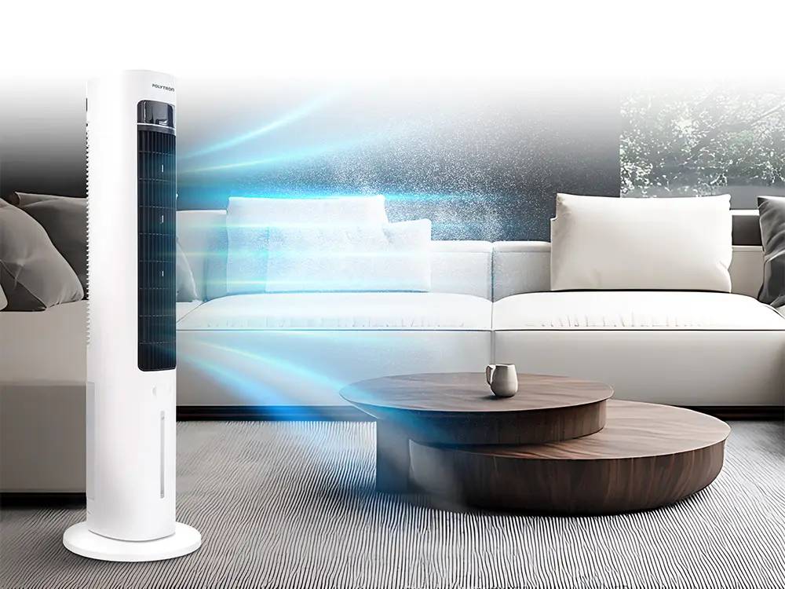

Saat ini, banyak pilihan air cooler yang menawarkan fitur canggih. Namun, penting untuk tahu cara yang tepat agar penggunaannya benar-benar efektif dan hemat energi. 

Menggunakan air cooler dengan cara yang tepat juga bisa membantu menjaga kenyamanan ruangan tanpa membuat tagihan listrik melonjak drastis.  Selain hemat listrik, pemilihan air cooler yang tepat juga berpengaruh pada kualitas udara dan kelembapan di ruangan. 

Kalau Anda sedang mencari [air cooler terbaik](https://polytron.co.id/kategori-produk/appliances/kipas-angin/air-cooler/?utm_source=backlink&utm_medium=article&utm_campaign=rankpillar_feb) yang tidak hanya mendinginkan tetapi juga efisien, memahami bagaimana memilih air cooler yang sesuai adalah langkah pertama yang penting. Berikut ini beberapa cara yang bisa Anda terapkan agar air cooler bekerja optimal dan tetap ramah listrik.

## Cara Memilih Air Cooler Agar Tidak Boros Listrik

Ketika memilih air cooler, ada beberapa faktor utama yang harus diperhatikan. Setiap aspek ini berkontribusi pada efektivitas perangkat dan konsumsi listriknya. Dengan mengetahui poin-poin penting ini, Anda bisa memastikan air cooler dapat berfungsi secara optimal tanpa membebani konsumsi daya.

### 1. Perhatikan Konsumsi Daya Listrik

Salah satu pertimbangan paling utama adalah seberapa banyak listrik yang digunakan air cooler tersebut. Pilihlah perangkat dengan konsumsi watt yang rendah namun tetap mampu memberikan pendinginan yang baik. Perangkat dengan daya lebih tinggi biasanya digunakan untuk ruangan besar, tapi pastikan daya tersebut seimbang dengan fungsinya agar tidak boros listrik.

### 2. Cek Kapasitas Tangki Air

Air cooler bekerja dengan menguapkan air untuk membantu menurunkan suhu. Kapasitas tangki air sangat berpengaruh terhadap waktu kerja alat tanpa harus sering diisi ulang. Tangki yang terlalu kecil akan membuat Anda sering mengisi ulang dan bisa jadi membebani penggunaan listrik jika sering dimatikan dan dihidupkan kembali. Pilih air cooler dengan kapasitas tangki yang sesuai dengan kebutuhan ruangan. 

### 3. Pastikan Aliran Udara Merata

Aliran udara yang merata membuat ruang lebih cepat dingin tanpa harus meningkatkan kecepatan kipas atau konsumsi listrik. Jadi, cari air cooler yang punya fitur seperti _swing mode_ atau kemampuan mengatur arah angin agar udara tersebar merata di seluruh ruangan. Ini juga membantu menjaga kelembapan pada level optimal sehingga udara tetap segar.

### 4. Fitur Tambahan untuk Efektivitas Pendinginan

Beberapa air cooler dilengkapi fitur tambahan seperti humidifikasi atau _aroma therapy_ yang menambah kenyamanan. Fitur humidifikasi membantu menjaga kelembapan agar tidak terlalu kering, sedangkan aroma therapy dapat memberikan sensasi segar tanpa penggunaan bahan kimia berlebih. Fitur-fitur ini tidak selalu bikin boros listrik jika dipilih dengan tepat.

### 5. Ukuran dan Desain Sesuai Ruangan

Ukuran air cooler harus proporsional dengan ruangan yang akan didinginkan. Jika ruangan besar menggunakan air cooler kecil, tentu tidak efektif dan kipas harus bekerja lebih keras sehingga boros listrik. Begitu pula sebaliknya, air cooler besar di ruangan kecil bisa jadi berlebihan dan menghabiskan energi tanpa manfaat ekstra. 

## Rekomendasi Air Cooler dari Polytron Untuk Efisiensi Maksimal

Untuk Anda yang sedang mencari air cooler yang efektif dan hemat listrik, Polytron menghadirkan model PCA 200D yang layak dipertimbangkan. Berikut beberapa keunggulan yang bisa Anda temukan:

- Fitur Ice Cool Humidification yang mendinginkan sekaligus melembapkan ruangan
- Big Air Flow yang mampu meratakan aliran udara hingga 10 meter
- Pengoperasian dengan Remote Control untuk kemudahan penggunaan
- Tampilan modern dengan LED Display
- Mode ayun (Swing Mode) untuk penyebaran udara optimal
- Fitur Aroma Therapy sebagai tambahan kenyamanan

Spesifikasi Polytron Kipas Angin Air Cooler PCA 200D:  

- Ukuran kemasan: 21.5 cm (lebar) x 23 cm (kedalaman) x 101 cm (tinggi)
- Ukuran produk: 29 cm x 29 cm x 97.5 cm
- Berat bersih: 4.5 kg (gross 5.4 kg)
- Konsumsi daya: 60 watt
- Ice pack: 2 buah
- Kapasitas tangki air: 3 liter

Harga produk ini cukup kompetitif dengan harga asli Rp1.099.000 dan diskon menjadi sekitar Rp799.000, memberikan nilai baik untuk kualitas dan fitur yang ditawarkan.

Memilih air cooler terbaik berarti memilih produk yang tidak hanya mendinginkan dengan baik, tapi juga hemat energi dan sesuai kebutuhan ruangan Anda. Maka dari itu, perhatikan konsumsi daya, kapasitas tangki air, kemampuan aliran udara, fitur tambahan, dan ukuran alat supaya efisiensi tetap terjaga. 

Jika Anda ingin mendapatkan perangkat pendingin ruangan yang efektif dan tahan lama, mempertimbangkan air cooler dengan fitur seperti yang ditawarkan Polytron tentu menguntungkan. Polytron PCA 200D bisa menjadi pilihan yang tepat karena menawarkan keseimbangan antara performa dan penggunaan listrik yang rendah.

Lebih dari itu, jangan ragu untuk membeli berbagai macam home appliances dari Polytron yang sudah terpercaya dalam kualitas dan inovasi. Dengan perangkat yang tepat, rumah Anda bisa menjadi lebih nyaman sekaligus hemat energi.
