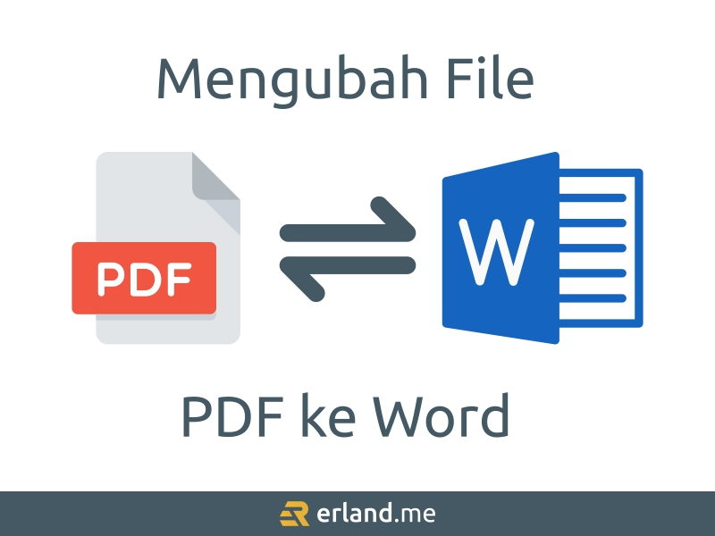

File PDF itu udah jadi “bahasa universal”-nya dokumen. Tinggal buka pakai PDF reader, nyaris semua perangkat modern sudah ada bawaannya—beres. Tapi kadang kamu butuh ngedit isinya, entah buat revisi kecil atau beneran ubah format. Nah, kalau kamu lebih nyaman ngedit di Microsoft Word, solusinya simpel: konversi dulu PDF ke Word.

Kabar baiknya, proses convert ini bisa dilakukan online, gratis, dan cepat. Berikut beberapa situs yang bisa kamu coba.

## Plagiarismdetector.net

Selain dikenal sebagai alat cek plagiarisme, situs ini juga menyediakan converter <a href="https://plagiarismdetector.net/id/pdf-to-word">pdf ke word</a> gratis. Cara pakainya gampang:

1. Unggah file PDF-mu.
2. Tunggu proses sebentar.
3. Unduh hasilnya dalam format Word.

Keunggulannya, kamu nggak perlu daftar akun atau install aplikasi tambahan. Selama ada browser, Android, Mac, atau Windows—langsung jalan. Cocok buat kebutuhan cepat yang penting beres.

## pdf2go.com

pdf2go.com adalah alat berbasis web yang fokus ke urusan PDF, termasuk convert ke DOCX. Kelebihan utamanya:

- 100% online, jadi nggak perlu install software.
- Tinggal upload → convert → download.
- Bisa diakses dari mana saja selama ada internet.

Buat kamu yang sering utak-atik dokumen kantor atau tugas, tool ini cukup “serba bisa” untuk urusan dasar PDF.

## ilovepdf.com

Satu lagi layanan populer yang ramah dipakai: ilovepdf.com. Selain cepat, ekosistem fiturnya lengkap—mulai dari konversi, kompres, gabung, sampai pecah PDF. Privasi juga jadi perhatian; prosesnya dibuat ringkas supaya kamu nggak perlu mutar-mutar lama saat upload/download.

## Kapan Perlu Convert PDF ke Word?

- Kamu mau nambahin paragraf, ganti gambar, atau rapikan layout.
- File PDF berasal dari laporan/riset dan perlu dikembangkan lagi.
- Kamu nggak punya software editor PDF berbayar, tapi butuh editan kilat.

Kalau kamu sering berkutat dengan PDF—misalnya nambah data atau gambar—ngedit langsung di PDF kadang terkunci fitur (butuh versi pro). Di sinilah converter gratisan tadi jadi penyelamat: ubah ke Word, edit dengan leluasa, lalu kalau perlu export balik ke PDF lagi.

## Tips Biar Hasilnya Maksimal

- Pakai file sumber yang jelas. PDF hasil scan kadang perlu OCR; beberapa situs sudah mendukung ini, tapi kualitas awal tetap pengaruh.
- Cek ulang formatting. Setelah di-convert, rapikan heading, list, dan tabel—biasanya 1–2 menit beres.
- Hindari dokumen sangat sensitif. Walau layanan-layanan di atas umum dipakai, untuk dokumen super rahasia pertimbangkan konversi offline.

Intinya: kalau kamu cuma butuh edit cepat tanpa install apa pun, tiga situs di atas sudah lebih dari cukup. Tinggal pilih yang paling klik sama workflow kamu, upload, tunggu, beres.