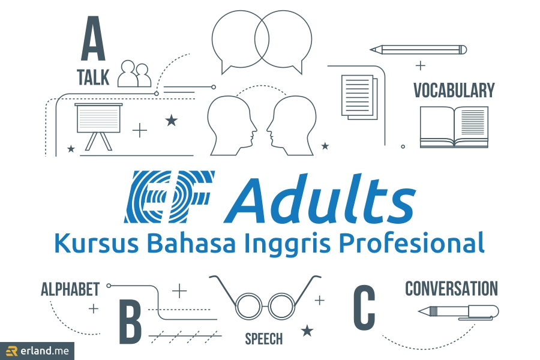

> Review layanan EF Adults kursus bahasa Inggris profesional, lembaga kursus bahasa Inggris dengan program-program inovatif dan sistematis.

Dari sekian banyaknya bahasa yang ada di seluruh dunia, bahasa Inggris menjadi bahasa paling utama yang patut dipelajari. Sebagian besar negara-negara di seluruh dunia menjadikan bahasa Inggris sebagai bahasa kedua setelah bahasa lokalnya, karena peran bahasa Inggris yang merupakan bahasa komunikasi internasional. Indonesia pun merupakan salah satu negara yang menjadikan bahasa Inggris sebagai bahasa kedua.

Bahasa merupakan alat komunikasi paling krusial, dan bahasa Inggris sebagai bahasa universal banyak digunakan di bidang teknologi, bisnis, pendidikan, politik, dan lain-lain. Bahasa Inggris sangat mendominasi semua aspek kehidupan masa kini, contohnya bisa dilihat dari mayoritas perangkat elektronik menggunakan bahasa Inggris.

## Pentingnya Belajar Bahasa Inggris

Belajar bahasa Inggris sangatlah penting, baik untuk akademik maupun profesional. Untuk Akademik, bahasa Inggris sangat penting untuk memperluas cakrawala wawasan terkait sumber ilmu pengetahuan seperti jurnal internasional. Dan bagi seorang pekerja profesional, kemampuan bahasa Inggris sangat bermanfaat untuk menambah _value_ diri untuk jenjang karier yang lebih tinggi. Pun bagi seorang pebisnis profesional, peran bahasa Inggris cukup vital untuk bekal [mengembangkan bisnis](/blog/mengembangkan-bisnis-dengan-pemasaran-online/) lebih luas lagi.

Berikut ini beberapa manfaat dari pentingnya kemahiran berbahasa Inggris.

### Bekal Berkarier

Saat ini, banyak perusahaan besar yang menerapkan standar tinggi bagi calon karyawannya. Bukan hanya dari sisi akademik dan pengalaman kerja, tapi juga dari kemampuan berbahasa Inggris. Jika Anda mampu berbahasa Inggris dengan fasih, itu akan memperbesar peluang mendapatkan pekerjaan impian di perusahaan ternama, dan hal ini juga berlaku untuk [fresh graduate mendapat kerja pertama](/blog/tips-fresh-graduate-cara-dapat-kerja-pertama/) setelah lulus kuliah.

### Bekal Melanjutkan Pendidikan

Jika Anda memiliki impian untuk melanjutkan pendidikan kuliah di luar negeri, tentu bahasa Inggris menjadi salah satu bekal penting untuk membantu mewujudkan impian itu. Tidak hanya itu, bahasa Inggris juga merupakan bekal penting untuk melanjutkan pendidikan pasacasarjana di Indonesia. Kemampuan bahasa Inggris akan menjadi nilai tambah dan modal utama untuk menyelesaikan pendidikan. Di kelas pascasarjana, hampir semua modul menggunakan pengantar berbahasa Inggris.

### Meningkatkan Kecerdasan

Menurut penelitian, menguasai lebih dari satu bahasa asing dapat meningkatkan kecerdasan. Ketika seseorang mempelajari suatu bahasa, akan berdampak pada perkembangan otaknya. Hal itu juga dapat menghindari dari risiko menderita penyakit pikun yang biasanya menyerang pada saat kita lanjut usia.

### Memahami Teknologi

Menurut <a href="https://penalis.com">penalis.com</a> dalam _update_ artikelnya, sebagian besar orang yang gagap teknologi dikarenakan pengaruh minimnya kemampuan berbahasa Inggris. Hal itu dikarenakan nyaris seluruh teknologi masa kini yang beredar di sekitar kita menggunakan bahasa Inggris. Mulai dari ponsel, komputer, mesin, televisi, dan lain sebagainya. Oleh sebab itu, penting sekali menguasai bahasa Inggris agar tidak kesulitan mengoperasikan perangkat tersebut dan membantu kita agar melek teknologi.

## Kursus Bahasa Inggris di EF Adults

Walau sebenarnya terdapat [cara cepat belajar bahasa Inggris secara otodidak](/blog/cara-cepat-belajar-bahasa-inggris-secara-otodidak/), tapi belajar kepada guru atau ahlinya jauh lebih direkomendasikan. Kursus bahasa Inggris adalah salah satu solusinya. Dengan kursus, proses belajar akan lebih efektif dibandingkan belajar dengan secara mandiri, juga akan lebih fokus karena setiap materi pembelajarannya terdapat tahap-tahap dari yang tingkat pemula hingga tingkat lanjutan.

Jika Anda tertarik untuk mencoba les, saya memiliki rekomendasi tempat kursus bahasa Inggris yang bagus, saya merekomendasikan **EF Adults kursus bahasa Inggris profesional** kepada Anda. Tempat les bahasa Inggris ini sangat terkenal, saya yakin Anda pun mengenalnya, atau minimal pernah mendengar namanya. Namun, kalau memeng belum, mari berikut ini saya informasikan sekilas tentang EF.

### Sekilas Tentang EF Adults

EF merupakan lembaga pendidikan swasta terbesar di dunia yang didirikan di Swedia pada tahun 1965. Memulai dengan hanya satu pengajar yang memiliki impian besar, meruntuhkan dinding pembatas dalam pembelajaran bahasa yang baik secara wilayah maupun budaya.

Hingga saat ini, EF menjadi penyedia layanan kursus bahasa Inggris terbesar dan terbaik di dunia yang menawarkan pembelajaran bahasa tersertifikasi kepada setiap orang dengan berbagai usia. EF juga telah lima kali ditunjuk sebagai penyedia jasa pelatihan bahasa dan jasa pendidikan resmi untuk Olimpiade, yaitu Olimpiade 1988 di Seoul, 2008 di Beijing, 2014 di Sochi, 2016 di Rio, dan 2018 di Pyeongchang.

Sementara di Indonesia, EF telah hadir sejak tahun 1986 dan hingga saat ini menyediakan program pelatihan intensif untuk orang dewasa dan pendidikan bagi anak-anak dengan memanfaatkan teknologi terbaru untuk menyediakan kursus, baik di sekolah maupun _online_ 24 jam sehari.

Sedangkan **EF Adults** adalah salah satu kelas kursus bahasa Inggris dari EF yang diperuntukan untuk orang dewasa seperti mahasiswa, pekerja, dan profesional. Kelas ini cocok untuk Anda yang kesulitan membagi waktu untuk ikut kursus bahasa Inggris karena kesibukan aktifitas sehari-hari seperti berbisnis, bekerja, atau pun kuliah. Kelas bahasa Inggris EF Adults ini memiliki iLab, yaitu _website_ yang berisi materi-materi untuk dipelajari dan diselesaikan kapan pun dan di mana pun.

### Kemudahan Belajar di EF Adults

EF Adults dikenal sebagai tempat kursus bahasa Inggris yang profesional, memiliki program-program belajar yang inovatif dan sistematis. Ada _SC_ atau semacam wali kelas yang siap mem-_follow up_ kita terkait program yang diadakan, dan menjadi tempat untuk mencurahkan keluh kesah dalam proses pembelajaran.

Juga ada banyak jenis kelas yang dibuka, dan kita bisa menyesuaikan hari belajar dengan _booking class_. Dengan begitu, akan lebih fleksibel terkait waktu dan meminimalisir kesibukan. Selain itu, tidak hanya belajar secara langsung di kelas, kita juga bisa <a href="https://www.ef.co.id/englishfirst/adults/courses/learn/">belajar bahasa Inggris online</a> di EF Adults kursus bahasa Inggris profesional.

### Metode Pembayaran di EF Adults

Untuk urusan administrasi atau pembayaran biaya kursus, EF Adults memberikan kemudahan dengan menyediakan berbagai metode pembayaran yang dapat dipilih sesuai dengan kebiasaan pembayaran yang dilakukan tiap muridnya.

Sistem pembayaran yang disediakan antara lain pembayaran tunai, transfer antar bank, serta kartu kredit dan cicilan. _Btw_, dari ketiganya itu, saya lebih suka transfer antar bank.

### Cara Menjadi _Student_ di EF Adults

Tertarik ingin kursus bahasa Inggris di EF Adults, tapi bingung caranya? Gampang. Cukup kunjungi situs web resminya **www.ef.co.id** lalu klik tombol "**Daftar Sekarang**". Setelah itu akan muncul _popup_ formulir pendaftaran, isi data diri yang diminta. Pastikan data-data yang Anda isi sudah benar sebelum klik tombol "**Kirim**".

Selain pendaftaran _online_ melalui _website_, bisa juga datang langsung ke _center class_ EF. Cek daftar lokasinya di bawah ini.

### EF _Center Location_

Jika Anda sedang mencari <a href="https://www.ef.co.id/englishfirst/adults/">tempat les bahasa Inggris Jakarta</a>, EF Adults punya banyak _center location_ di Jakarta. Berikut ini adalah beberapa _center location_ dari EF Adults di DKI Jakarta yang bisa Anda kunjungi, dapat dipilih lokasinya sesuai dengan yang terdekat dari domisili Anda.

1. **fX Sudirman**, Jl. Jendral Sudirman – Pintu Satu, Senayan, Jakarta 10270

3. **Mall Taman Anggrek**, Lt. 3, Jl. Letjen S. Parman, Kav. 21, Jakarta Barat 11470

5. **The Plaza Office Tower**, Level 22 # B, Jl. M.H. Thamrin Kav 28-30, Jakarta Pusat 10350

7. **Kuningan City**, Lt. 1. Jl. Prof. Dr, Satrio Kav. 8, Setiabudi Kuningan, Jakarta Selatan 12940

9. **Mall of Indonesia**, Lt 2, C9-C10, Jl. Boulevard Barat Raya, Kelapa Gading, Jakarta, 14240

11. **Lippo Mall Puri**, Lt 1. Unit L1-67C., Jl. Puri Indah Raya Blok U1, Puri Indah CBD, Jakarta 11610

Selain Jakarta, ada juga nih _center location_ EF di Surabaya. Bisa dikunjungi untuk Anda yang berdomisili di Surabaya dan sekitarnya. Lokasinya berada di **Tanjungan Plaza 6**, Lantai 5, Jl. Embong Malang 21-31, Surabaya 60261.

Sekian ulasan tentang layanan EF Adults kursus bahasa Inggris Profesional. Baca juga beberapa pertanyaan yang sering diajukan oleh calon _student_ terkait EF Adults di bawah ini.

* * *

## _Frequently Asked Questions_

* * *

\[rank\_math\_rich\_snippet id="s-099142cc-22f7-447c-ae13-6939b6ede876"\]

* * *

\[rank\_math\_rich\_snippet id="s-10879e42-bfd2-4220-a7c9-e0779e7f3339"\]

* * *

_**"Utamakan Bahasa Indonesia, lestarikan Bahasa Daerah, kuasai Bahasa Asing."**_  
\- _Badan Bahasa_

* * *
