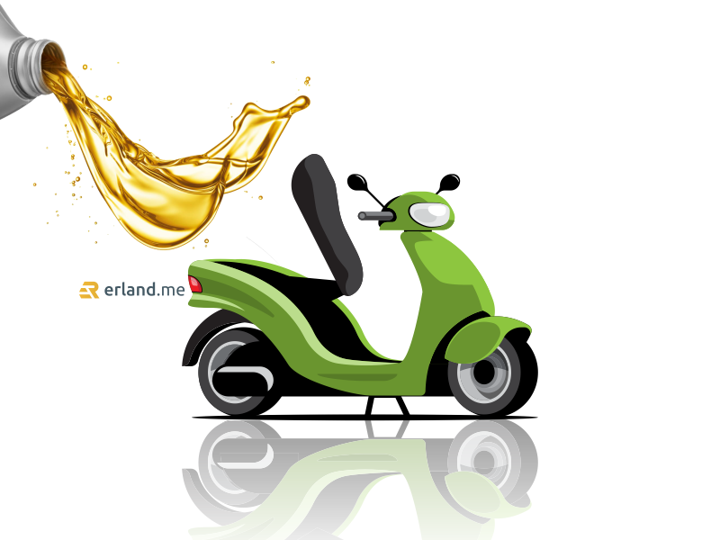

Anda pasti sepakat bahwa sepeda motor yang sering Anda tunggangi pastinya memerlukan perawatan berkala yang wajib hukumnya. Kalau Anda cuek dalam melakukan perawatan bisa dipastikan bakal kerepotan jika di tengah jalan motor mogok.

Bagi sebagian besar masyarakat Indonesia yang memiliki kendaraan roda dua, sepeda motor memiliki durasi pemakaian yang tinggi. Oleh karena itu perawatan sepeda motor secara teratur mutlak diperlukan. Apalagi terdapat beberapa komponen atau suku cadang pada sepeda motor yang mempunyai masa kedaluwarsa atau tidak bisa digunakan dalam jangka waktu panjang.

Sub Dept Head Technical Service PT Daya Adicipta Motora (DAM), Ade Rohman mengatakan, apabila tidak mengganti komponen tersebut dalam jangka waktu yang sudah ditentukan dapat mengalami hal-hal yang merugikan pemiliknya.

## Komponen Motor yang Perlu Diganti Berkala

Setidaknya terdapat lima komponen sepeda motor yang perlu diganti secara berkala, yaitu:

### Oli Mesin

Oli mesin mempunyai peran sangat penting pada sepeda motor. Pemilik motor diwajibkan mengganti oli mesin secara berkala dan rutin karena bagian ini berperan sebagai pelumas kinerja di dalam mesin kendaraan. Idealnya oli mesin diganti dengan batasan maksimal setiap empat bulan sekali atau ketika sudah memasuki jarak tempuh 4.000 km. Namun, perlu diperhatikan, penggantian oli turut didasarkan pada kondisi jalan atau jarak yang ditempuh bahkan kondisi cuaca atau lingkungan sekitar.

"_Karena semakin jauh jarak tempuh yang dilewati, maka penggantian oli bisa lebih cepat dari jadwal yang sudah ditentukan,_” ujar Ade.

Perawatan motor matic tentu berbeda dengan perawatan motor manual, begitupun juga oli yang digunakan juga harus sesuai dengan jenis kendaraan. Motor matic semakin menjadi pilihan para pengendara di Indonesia. Alasannya mungkin sangat simpel. Asal sudah bisa mengendarai sepeda, maka dapat dipastikan seorang bisa mengendarai motor matic.

Tinggal hidupkan mesin, main gas sedikit, maka Anda sudah bisa naik motor. Tidak perlu bolak-balik macet karena bingung mengendalikan kopling dan persneling seperti saat Anda belajar motor manual. Namun begitu, di balik semua kemudahannya, sepeda motor matic perlu perhatian lebih serius. Terutama dalam urusan oli motornya yang memang beda dari oli motor manual.

Oleh karena itu, Anda harus selalu memastikan untuk memberi oli motor matic secara cermat agar motor Anda selalu dalam keadaan prima. Khususnya bagi kamu pengendara sepeda motor matic honda, disini kami juga akan <a href="https://www.astra-honda.com/after-sales/ahm-oil/varian">rekomendasi oli motor matic</a> bagi kamu pecinta motor honda. <a href="https://www.astra-honda.com/after-sales/ahm-oil/varian">Oli honda matic</a> yang kami sarankan ini pastinya akan memberikan keuntungan dan kenyamanan saat berkendara. Mesin yang baik tentu berdasarkan oli yang dipakai. AHM oil merupakan salah satu jenis oli yang baik untuk kebutuhan motor kamu, untuk keunggulannya dapat kamu lihat langsung pada website **astra-honda.com**.

### Busi

Busi merupakan komponen yang berfungsi untuk memantik api agar pembakaran mesin bekerja. Apabila busi pada sudah kotor atau bahkan melewati batas jarak pemakaian, sebaiknya diganti dengan busi yang baru. Penggantian busi disarankan saat sepeda motor telah digunakan menempuh jarak 8.000 km.

### Saringan Udara

Saringan udara atau filter udara mempunyai fungsi yang sangat penting untuk menunjang keawetan komponen mesin. Terutama komponen yang berhubungan dengan sistem pembakaran seperti Piston, Cylinder Comp, Ring Piston dan komponen lainnya.

Jika saringan udara tidak diganti secara periodik akan menyebabkan komponen-komponen pada sistem pembakaran menjadi cepat aus dan perbaikannya memerlukan biaya yang besar karena harus dilakukan over houl di bagian atas mesin. Saringan udara perlu dilakukan penggantian secara rutin setiap jarak tempuh 16.000 km.

### Air Radiator

Sistem pendingin cairan atau radiator menjadi salah satu komponen penting pada motor. Perangkat tersebut memiliki fungsi untuk menjaga kondisi mesin agar tetap stabil.

Agar kinerja sistem pendingin selalu optimal maka cek kondisi air raditor secara berkala. Air radiator perlu dilakukan penggantian setiap 12.000 km atau dalam waktu 1 tahun.

### Kanvas Rem

Komponen ini biasanya diganti jika indikator keausan yang dipasangkan di dalam mekanisme rem sudah menunjukkan tanda keausan. Atau dengan estimasi sekitar 20.000 km atau tergantung dengan kondisi jalan dan cara pakai kendaraan.

Kanvas rem menjadi komponen yang harus rutin diganti karena berhubungan langsung dengan keselamatan pengendara saat berkendara. Kanvas rem yang tidak terawat atau sudah menipis bisa berakibat fatal bagi pengendaranya.

Siapa disini yang tidak tahu bahwa oli mempunyai fungsi yang sangat penting dalam menjalankan sepeda motor, karena oli mempunyai peranan penting maka seharusnya kita memang benar benar memperhatikan kondisi oli. Biasanya oli akan diganti jika sudah melewati batas KM sepeda motor yang dijalankan.

## Pentingnya Peranan Oli Motor

Adapun fungsi oli yang lebih spesifik dapat kami sampaikan dibawah ini, yaitu 8 macam fungsi oli sepeda motor sebagai berikut.

### Lubricating (Melumasi)

Fungsi oli pertama sudah pasti menjadi pelumas. Ia akan melumasi komponen-komponen dalam mesin yang sistem kerjanya saling bergesekan. Tentunya untuk mencegah keausan berlebih ketika saling bersinggungan satu sama lain.

### Protecting (Melindungi)

Selain melindungi mesin dari gesekan-gesekan kasar, oli juga berfungsi melindungi mesin dari korosi atau karat. Oli yang menempel pada komponen mesin akan mencegah reaksi oksidasi pada komponen-komponen mesin.

### Cleaning (Membersihkan)

Pada dasarnya keausan dalam komponen mobil yang bergesekan tidak dapat dihindari karena memang itulah sistem kerjanya. Keausan hanya bisa dikurangi saja. Namun saat keausan ini semakin tinggi, ada kotoran besi yang wajib dibersihkan. Pelumas bisa menjadi pembersih dari kotoran besi.

Pelumas yang mengalir akan membawa kotoran besi ke dalam bagian karter atau penampung oli. Di dalam penampung ini, kotoran besi akan disaring dan dikumpulkan oleh magnet yang telah terpasang. Kebersihan pelumas pun juga diperhatikan karena sebelum mengalir ke berbagai komponen mesin, terdapat proses penyaringan menggunakan filter oli.

### Cooling (Mendinginkan)

Oli bisa sekaligus menjadi pendingin. Lho kok begitu? Ketika ada dua komponen yang saling bergesekan, maka tercipta suhu panas yang cukup tinggi. Namun berkat pelumas yang mengalir ke komponen tersebut, panas akan terserap sehingga ukuran suhu kembali dingin dan tidak ada masalah overheat.

Oli dapat membantu menyerap dan mendinginkan suhu mesin. Cairan oli yang mengalir pada permukaan komponen akan membawa panas dimana selanjutnya panas akan dibuang bersama udara yang mengalir pada saat sepeda motor dikendarai.

### Menambah Performa

Oli membuat bagian mesin halus dan mengurangi gesekan berlebih. Bagian-bagian mesin yang bekerja dengan baik tentunya akan meningkatkan performa mesin secara keseluruhan. Pilihlah oli yang bisa menambah kecepatan laju motor yang dimiliki.

### Merapatkan Celah antara Piston dan Silinder

Fungsi lain dari oli adalah menjadi perapat. Maksudnya, oli bisa melumasi bagian-bagian presisi dalam mesin sehingga mencegah terjadinya kebocoran gas. Contohnya seperti saat pelumas melumasi bagian dinding silinder dan piston. Pelumas akan menjadi perapat untuk mencegah kebocoran gas di ruang atas dan bawah piston.

### Peredam Getaran dan Suara

Oli mesin juga berfungsi untuk menyerap getaran. Oli melakukan serapan pada getaran dengan peredam kejutan yang terjadi ketika mesin sedang melakukan langkah kerja. Proses ini terjadi pada komponen dalam mesin yang mengalami gaya tekan besar.

Permukaan yang licin menjadikan gesekan yang terjadi menjadi sangat minim. Hal ini akan menghindarkan mesin dari kondisi cepat aus. Oli melapisi bagian mesin sehingga meredam benturan dan suara mesin lebih halus.

### Sebagai Anti Karat

Komponen-komponen mesin sebagian besar terbuat dari logam. Dengan kondisi seperti ini, maka ada perubahan alami yang membuat logam tersebut berkarat. Apalagi sistem kerjanya selalu bergesekan. Sudah pasti Anda tidak mau komponen-komponen tersebut berkarat karena bisa membuat mobil menjadi rusak. Untungnya ada sistem pelumasan yang bisa mencegah karat.

Pelumas yang mengalir ke tiap komponen mobil akan memberikan perlindungan terhadap permukaan sisi luar termasuk dari udara atau air. Walaupun bergesekan, tetap terjaga dari masalah karat karena memiliki pelumas.

Dengan seluruh fungsi sistem pelumasan yang sangat berguna, Anda wajib memastikan bahwa selalu ada pelumas yang bekerja maksimal dalam motor. Sebaiknya lakukan pemeriksaan minyak pelumas secara rutin dan berkala.

Nah, itulah manfaat serta fungsi dari oli sepeda motor, jadi bagi kamu yang punya sepeda motor jangan lupa ya untuk di cek rutin oli kamu, agar kinerja kendaraan mu dapat berjalan dengan baik
