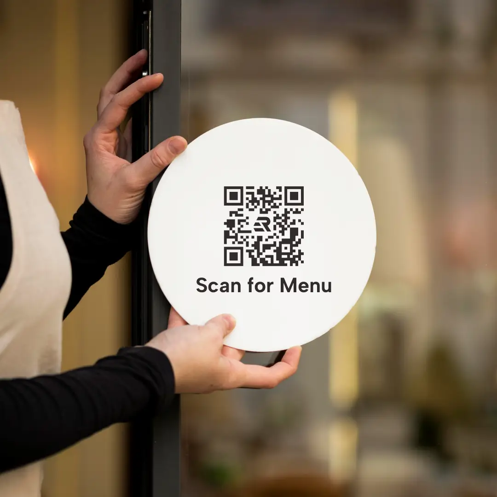

Neon box sudah lama jadi ujung tombak promosi offline. Ia jelas terlihat dari jauh, menyala konsisten, dan memancarkan identitas brand dengan kuat. Supaya efeknya makin terasa, sekarang banyak vendor <a href="https://bcomadvertising.com" title="neon box bogor">neon box bogor</a> atau jasa pembuatan reklame profesional yang merekomendasikan brand untuk menambahkan QR code di neon box sebagai "jembatan" ke dunia digital.

Dengan sekali scan, orang bisa langsung buka menu, follow akun sosial media, melihat katalog, hingga melakukan transaksi tanpa harus mengetik `URL`. Artikel ini bakal membahas kenapa integrasi QR di neon box itu efektif, bagaimana cara mendesainnya agar mudah dipindai, sampai langkah teknis agar hasilnya awet dan performanya bisa diukur.

## Kenapa QR di Neon Box Patut Dicoba

Ada momen ketika orang lewat, tertarik pada visual neon box, tetapi belum siap masuk ke toko. QR memberi opsi interaksi cepat. Mereka bisa menyimpan promosi, berlangganan WhatsApp broadcast, atau melihat peta lokasi untuk datang di lain waktu. Buat bisnis F&B, QR di neon box memotong jarak dari "penasaran" ke "lihat menu" dalam hitungan detik. Untuk jasa atau retail, QR bisa langsung mengarahkan ke katalog produk, form reservasi, atau marketplace resmi. Kamu tidak lagi menunggu pengunjung bertanya di tempat, karena kanal digital sudah siap mengambil alih.

## Prinsip Desain QR yang Terbaca di Neon Box

Desain adalah kunci. QR code harus punya kontras tinggi, biasanya modul gelap di atas latar putih. Hindari latar yang terlalu ramai, karena area tenang di sekitar QR atau quiet zone membantu kamera fokus. Jika ingin menambahkan logo di tengah QR, pilih level koreksi error yang lebih tinggi seperti Q atau H agar kode tetap bisa dipindai dengan stabil. Jangan lupa menuliskan ajakan singkat di bawahnya. Teks seperti "Scan untuk menu", "Ambil promo di sini", atau "Follow kami" membuat orang paham apa yang mereka dapat setelah scan.

Ukuran huruf pendamping juga perlu dipikirkan. Huruf yang terlalu kecil akan hilang dari jarak jalan. Gunakan font sans-serif tegas dan ringkas. Hindari terlalu banyak informasi di sekitar QR agar titik fokus tidak pecah. Ingat bahwa desain neon box yang baik adalah yang bisa dibaca cepat, jadi prioritaskan satu tujuan utama dan sisanya didorong ke halaman tujuan.

## Ukuran QR dan Jarak Scan

Tidak ada satu ukuran pasti untuk semua situasi, karena jarak baca tiap lokasi berbeda. Untuk etalase yang bisa dipindai dari jarak 1 sampai 2 meter, QR berukuran sisi 8 sampai 12 cm biasanya nyaman. Jika neon box menghadap jalan kendaraan dan ingin dipindai dari 3 sampai 5 meter, pertimbangkan sisi 15 sampai 25 cm. Tes langsung sangat disarankan. Cetak mockup, tempel di fasad, lalu uji dengan beberapa tipe ponsel di siang dan malam. Pastikan kamera bisa fokus cepat dan tidak terganggu pantulan cahaya.

## Teknis Produksi dan Pemasangan

Material face memengaruhi performa QR. Akrilik memberikan permukaan halus dan solid, sedangkan backlit flex cocok untuk ukuran besar. Apa pun bahan neon box yang dipakai, usahakan area di belakang QR punya pencahayaan yang merata. Hotspot dari modul LED dapat menciptakan bintik terang yang "memecah" modul QR. Solusinya adalah menambah diffuser atau layer blocking tipis di belakang area QR agar cahayanya rata. Jauhi finishing terlalu glossy yang mudah memantulkan lampu jalan. Untuk instalasi outdoor, pastikan film cetak dan laminasi tahan UV supaya tidak cepat menguning.

Penempatan juga penting. Taruh QR pada ketinggian yang mudah dipindai tanpa harus menjinjit. Kalau neon box terletak tinggi, pertimbangkan menambah satu QR lebih kecil di eye level pada panel samping atau di dekat pintu. Pastikan rangka kuat menahan getaran, kabel rapi, dan ada akses servis untuk mengganti face jika nanti kamu ingin memperbarui desain.

## Pengalaman Pengguna yang Mulus

Sering kali QR sudah dipasang bagus, tetapi halaman tujuan tidak ramah mobile. Pastikan landing page cepat dibuka, teks terbaca, dan CTA jelas. Gunakan URL pendek agar QR tidak terlalu rapat. Pertimbangkan dynamic QR sehingga tautan bisa diganti tanpa mencetak ulang face neon box. Untuk kebutuhan multi-link, gunakan halaman agregator yang ringan dan beridentitas merek sendiri. Jika menautkan ke WhatsApp, pakai tautan resmi dengan parameter pesan awal supaya pelanggan tidak bingung harus mengetik apa.

## Tracking dan Pengukuran Hasil

Supaya strategi ini tidak sekadar gimmick, pasang parameter analitik seperti `UTM` di URL. Kamu bisa memisahkan data berdasarkan lokasi neon box, kampanye musiman, atau desain tertentu. Data scan membantu membaca jam ramai, efektivitas CTA, dan dampak perubahan desain terhadap konversi. Cocokkan data ini dengan traffic toko fisik atau penjualan online untuk melihat korelasi yang nyata.

## Keamanan dan Kepercayaan

Keamanan adalah bagian dari pengalaman. Gunakan domain resmi yang mudah dikenali, selalu aktifkan HTTPS, dan hindari pengalihan yang berlapis. Sertakan petunjuk singkat yang meyakinkan, misalnya "Tautan resmi, tidak meminta data sensitif". Di area publik, pastikan QR sulit ditempeli stiker asing. Pemeriksaan rutin akan mencegah penyalahgunaan.

## Contoh Penerapan Sederhana

Bayangkan kedai kopi di ruko dengan neon box menghadap jalan. Di sudut kanan bawah face, terpasang QR 12 cm dengan teks "Scan untuk Menu & Promo". Saat malam, pencahayaan di area QR merata sehingga kamera cepat fokus. Pengunjung yang belum sempat masuk bisa menyimpan menu, melihat seasonal drink, dan menekan tombol pesan via chat. Esoknya, mereka datang karena sudah tahu kisaran harga dan rekomendasi best seller. Dari sisi bisnis, tautan diberi parameter khusus sehingga performa neon box mudah diukur.

## Checklist Ringkas

Pastikan kontras tinggi, quiet zone bersih, ukuran QR sesuai jarak, pencahayaan merata, posisi mudah dipindai, URL pendek dan aman, landing page cepat, CTA jelas, dan tracking aktif. Lakukan uji di siang dan malam, lalu catat hasilnya untuk iterasi desain berikutnya.

Integrasi QR code pada neon box bukan tren sesaat. Ini cara cerdas menghubungkan exposure offline ke tindakan online. Dengan desain yang terukur, eksekusi produksi yang rapi, dan analitik yang disiplin, neon box milikmu bukan hanya bersinar, tetapi juga menghasilkan data dan konversi yang nyata.
