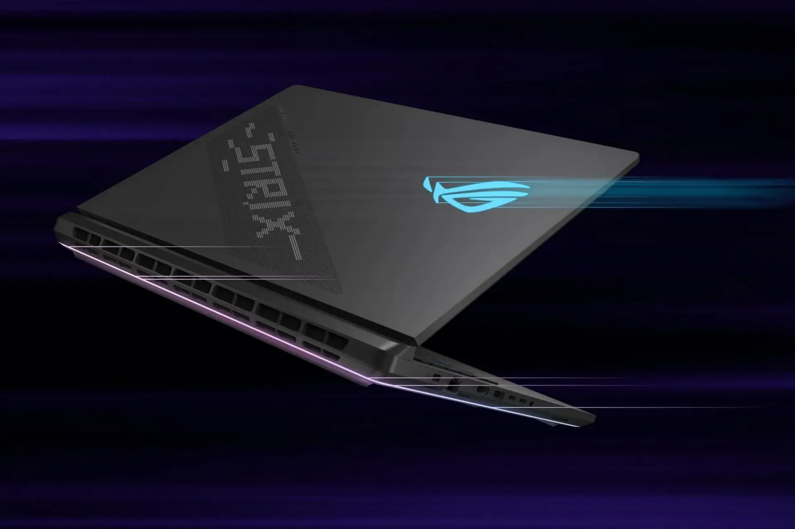

Di tahun 2026, tren [laptop](https://www.asus.com/id/laptops/for-home/all-series/) semakin berfokus pada desain futuristik dan spesifikasi canggih yang mendukung berbagai kebutuhan, mulai dari gaming hingga produktivitas profesional. Salah satu laptop yang memiliki spesifikasi ini adalah ROG Strix Scar 18 (2025) dari ASUS yang hadir dengan desain modern dan performa luar biasa.

Laptop dari ASUS menawarkan berbagai fitur unggulan yang akan memenuhi kebutuhan pengguna yang mengutamakan performa dan tampilan visual berkualitas tinggi. Berikut adalah beberapa hal yang membuat laptop ini menjadi pilihan yang menarik di tahun 2026.

## 1. Desain Futuristik dengan Layar 18 Inci

Laptop ROG Strix Scar 18 (2025) hadir dengan desain yang sangat modern dan futuristik. Layar 18 inci yang dimilikinya menawarkan tampilan visual yang luas dan sangat tajam, berkat teknologi Mini LED. Dengan resolusi 2.5K (2560 x 1600) dan refresh rate 240Hz, setiap detail gambar akan ditampilkan dengan sangat jelas dan mulus, baik untuk bermain game atau pekerjaan desain grafis.

Rasio aspek 16\:10 juga memberikan tampilan yang lebih tinggi dan pengalaman visual yang lebih imersif. Desainnya yang ramping namun besar sangat cocok untuk para profesional yang menginginkan tampilan layar lebar namun tetap stylish.

## 2. Performa Tinggi dengan Intel® Core™ Ultra 9 275HX

ROG Strix Scar 18 dilengkapi dengan prosesor Intel® Core™ Ultra 9 275HX yang menawarkan kecepatan hingga 5.4GHz. Prosesor ini memungkinkan laptop untuk menangani tugas-tugas berat seperti video editing, 3D rendering, dan gaming dengan lancar tanpa adanya hambatan. Dengan 24 inti dan 24 thread, prosesor ini menjanjikan performa multitasking tanpa hambatan.

Ditambah dengan GPU NVIDIA® GeForce RTX™ 5080, laptop ini dapat menjalankan aplikasi grafis berat dan game AAA terbaru dengan pengaturan grafis tertinggi tanpa lag. Spesifikasi ini membuat ROG Strix Scar 18 menjadi pilihan ideal untuk para gamer dan profesional yang membutuhkan laptop dengan kekuatan komputasi maksimal.

## 3. Sistem Pendingin Canggih untuk Kinerja Optimal

Salah satu aspek penting dari laptop gaming dan profesional adalah sistem pendingin yang dapat menjaga performa laptop tetap stabil meskipun digunakan dalam waktu lama. ROG Strix Scar 18 (2025) memiliki sistem pendinginan yang sangat efisien sehingga memungkinkan laptop untuk tetap dingin meskipun digunakan untuk gaming intensif atau pekerjaan berat.

Teknologi pendinginan ini memastikan bahwa CPU dan GPU tetap bekerja dalam suhu yang optimal untuk menghindari throttling yang dapat mengurangi performa. Dengan desain pendinginan yang canggih, Anda dapat bermain game atau bekerja tanpa khawatir laptop menjadi terlalu panas.

## 4. Memori dan Penyimpanan Super Cepat

Laptop ini dilengkapi dengan memori 16GB DDR5 dan penyimpanan 2TB PCIe® 4.0 NVMe™ SSD, yang memungkinkan akses data yang sangat cepat. Penyimpanan besar ini sangat berguna bagi para profesional yang membutuhkan ruang lebih untuk menyimpan file besar, seperti video 4K, proyek desain grafis, atau data game.

Selain itu, SSD dengan PCIe 4.0 menawarkan kecepatan transfer data yang jauh lebih cepat dibandingkan dengan SSD tradisional sehingga waktu booting dan waktu akses file akan semakin singkat. Sistem ini memberikan kenyamanan dalam bekerja dan bermain tanpa hambatan.

## 5. Audio Premium untuk Pengalaman Mendalam

ROG Strix Scar 18 dilengkapi dengan sistem audio berkualitas tinggi yang memungkinkan pengalaman gaming dan multimedia yang lebih mendalam. Dengan empat speaker dan teknologi Dolby Atmos, laptop ini dapat menghasilkan suara yang lebih jelas, imersif, dan kaya.

Fitur AI noise-canceling juga membantu mengurangi gangguan suara latar belakang saat bermain game atau melakukan konferensi video. Audio berkualitas tinggi ini memastikan bahwa Anda tidak hanya mendapatkan visual yang tajam, tetapi juga pendengaran dari audio yang berkualitas.

Dengan desain futuristik dan spesifikasi canggih, ROG Strix Scar 18 (2025) adalah pilihan yang sangat menarik bagi Anda yang mengutamakan performa tinggi dan tampilan visual yang nyaman. Baik untuk gaming, desain, maupun pekerjaan profesional yang memerlukan kekuatan komputasi, laptop ini siap memberikan pengalaman terbaik.

Jika Anda mencari laptop yang menggabungkan keindahan desain, kekuatan performa, dan keandalan, laptop dari ASUS ini patut dipertimbangkan. Jika mempunyai pertimbangan lain, Anda dapat menjelajahi lebih lanjut seri laptop lainnya dari ASUS yang sesuai dengan kebutuhan Anda.
