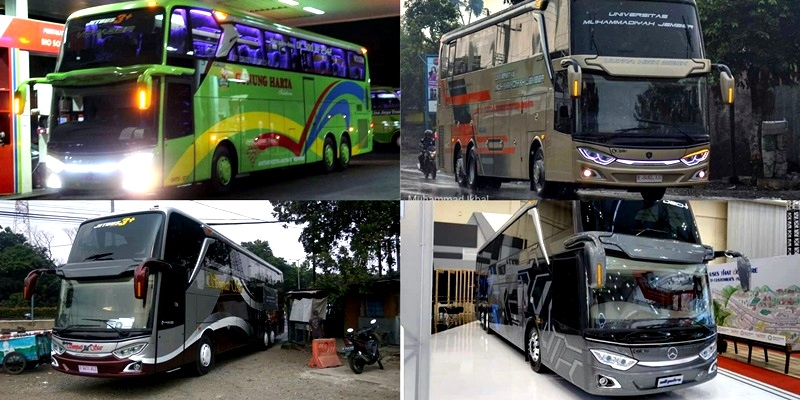
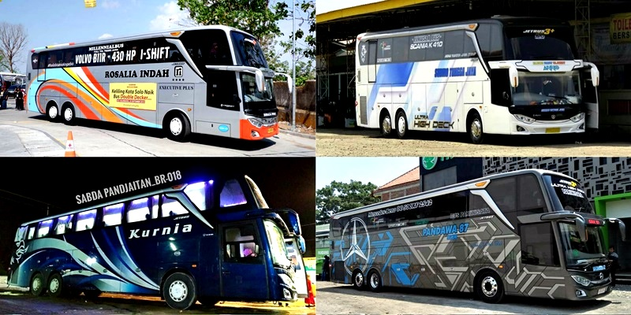

Dalam beberapa tahun terakhir, pekembangan bus bisa dibilang cukup pesat di Indonesia. Semakin banyak bus yang modelnya semakin modern seiring perkembangan zaman, hal ini juga membuat perjalanan darat menggunakan bus semakin menyenangkan karena banyak fasilitas mewah di dalam bus.

Perkembangan jenis-jenis bus terbaru tidak lepas dari <a href="https://www.hukumonline.com/pusatdata/detail/lt4fcdd63a00e84/node/pp-no-55-tahun-2012-kendaraan">Peraturan Pemerintah Nomor 55 Tahun 2012</a> tentang kendaraan yang mengatur ketentuan terbaru jenis kendaraan yang dapat dibuat di Indonesia. Hal tersebut menjadi peluang mengembangan usaha bagi perusahaan yang berbisnis dengan bus.

Setidaknya ada lima jenis bus yang terdapat di Indonesia. Bus-bus yang banyak kita jumpai di jalan raya. Bagi komunitas penggemar bus, membedakan bus-bus itu sangat mudah hanya dengan melihat tampilan luarnya. Namun bagi orang awam yang pikirannya "_yang penting naik bus_" itu tidak mudah membedakan bus-bus yang sekilas sama persis satu sama lain. Karena itu, di artikel ini saya akan membahas jenis-jenis bus yang ada di Indonesia. Mari disimak.

> Baca juga: **[SEVA Pusat Mobil Murah](/blog/seva-pusat-mobil-murah/)**

## Jenis Bus Nomal Deck

Dimulai dari yang paling lawas, yaitu bus _normal deck_. Bus ini memiliki ciri khas tonjolan di samping kursi pengemudi. Banyak orang yang menjulukinya sebagai kuburan mesin. Kalau kalian pengguna setia bus di bawah tahun 2010, tentu tidak akan asing dengan bus model ini. Bus ini sering dipakai untuk bus kelas ekonomi. Selain tonjolan di samping kursi pengemudi, ciri lain dari bus ini adalah kursi penumpang sejajar dengan kursi pengemudi dan bus ini memiliki tinggi _body_ sekitar 300 cm.

## Bus HD (High Deck)

Selanjutnya adalah bus HD atau _high deck_. Dari namanya aja sudah ketebak bus ini adalah bus lawannya non HD, bus yang memiliki lantai lebih tinggi. Kalau melihat perkembangan zaman yang makin canggih sekarang, bus ini sebenarnya masuk katagori bus lawas, tapi masih banyak yang menggunakan bus ini, khususnya bus antar kota untuk kelas ekonomi. Bus ini memiliki tinggi rata-rata 350 cm yang kalau dilihat sekilas dari luar akan terlihat mirip dengan bus _normal deck_ padahal sebenarnya sangat berbeda. Untuk melihat perbedaan paling kontras antar bus _normal deck_ dan bus _high deck_ adalah tempat duduk penumpang lebih tinggi dari kursi pengemudi dan tidak ada tonjolan di samping pengemudi.

## Bus HDD (High Deck Double Glass)

Bus ini bisa dikatakan sebagai kakak dari bus HD, memiliki tinggi yang relatif sama dengan bus HD atau lebih tinggi sedikit. Perbedaan paling mencolok jika dilihat dari luar adalah bus HDD ini memiliki sekat pembatas kaca di bagian depan bus. Sementara di bagian interiornya, bus HDD memiliki konfigurasi kursi 2-2 walau ada juga beberapa yang masih 2-3. Banyak fitur dan fasilitas mewah yang terdapat di bus ini yang menjadikannya banyak pula agen sewa bus pariwisata yang menggunakan bus model ini sebagai armandanya. Yang paling saya suka dari bus ini adalah desain _dashboard_ bagian depan yang terlihat elegan, enak dipandang mata.

## Bus SHD (Super High Deck)

Bus ini adalah model bus yang paling saya suka, model bus ini populer akhir-akhir ini, sering disebut dengan Jetbus. Bagian kaca depan bus ini sekilas mirip dengan bus HD _double glass_, yaitu memiliki kaca ganda dengan sekat pembatas atau bar kaca depan namun pada bagian belakang, _grill_ bus SHD lebih tinggi dari bus HD. Selain itu, bus SHD ini memiliki bagasi yang luas, hingga sepeda motor juga dapat diangkut di dalam bagasi bus yang memiliki tinggi sekitar 390 cm ini. Fasilitas interiornya? Jangan ditanya.. Udah pasti banyak fitur-fitur canggih dan mewah yang dapat memanjakan penumpang selama perjalanan naik bus ini.

## Bus DD (Double Decker)

Sesuai dengan namanya, bus ini adalah bus dengan dua lantai alias bus tingkat. Di kalangan bus AKAP (Angkutan Kota Antar Provinsi), bus ini adalah bus paling canggih saat ini. Memiliki banyak fitur dan fasilitas yang memanjakan penumpang dan desain interior yang sangat modern. Bus ini memiliki tinggi rata-rata sekitar 410 cm, dua tingkat _deck_ dihubungkan dengan tangga. Selain menjadi bus andalan oleh perusahaan bus AKAP, bus ini juga kerap digunakan sebagai bus [wisata](/blog/tempat-wisata-bogor/) kota atau _city tour_ yang atapnya dibiarkan dibuka agar penumpang bisa menikmati pemandangan selama perjalanan keliling kota. Bus _double decker_ pertama kali diperkenalkan oleh Adiputro pada GAIKINDO Indonesia International Auto Show (GIIAS) 2015, bersamaan dengan bus SHD.

Nah, itulah jenis-jenis bus yang beragam. Semoga dengan membaca artikel ini kalian dapat membedakan jenis-jenis bus. Khususnya untuk kalian yang akan melakukan perjalanan jauh menggunakan bus dan untuk kalian yang ingin [sewa bus pariwisata](/blog/sewa-bus-pariwisata-semarang/) agar dapat memilih bus yang sesuai dengan kebutuhan kalian. Saran saya, pilih jenis bus SHD karena fitur-fitur busnya super mewah, dijamin kalian nyaman selama perjalanan. Oke? Semoga perjalanan kalian menyenangkan!
