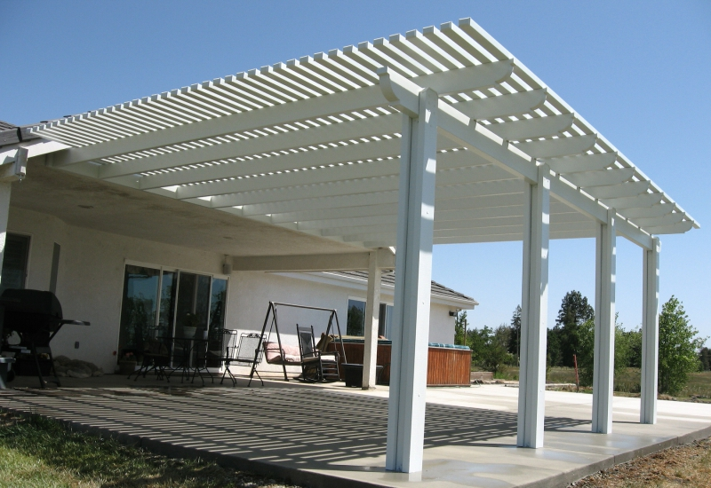
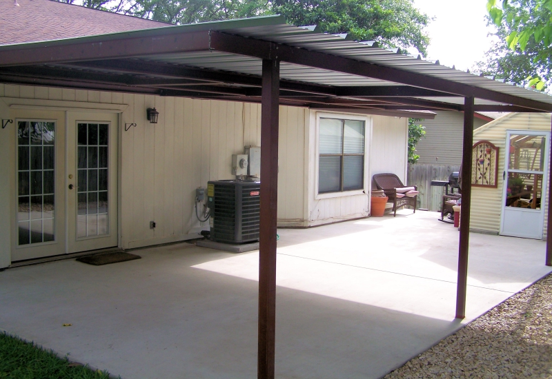

Seperti yang kita ketahui, kanopi pastinya berada di depan rumah. Namun, siapa sangka kanopi juga bisa digunakan untuk di belakang rumah, jendela atau tempat-tempat lain? Terlebih dari fungsinya kanopi melindungi rumah dari sinar matahari langsung dan hujan yang lebat agar tidak langsung masuk ke dalam rumah.

Kanopi juga bisa dijadikan sebagai dekorasi rumah dan manambah fungsi-fungsi lain di luar rumah. Sebagai contoh kanopi dijadikan sebagai dekorasi rumah adalah jika kita mempunyai ruang kosong di dalam rumah tanpa atap, sekarang kanopi juga bisa dijadikan atap dengan menambahkan motif-motif unik. Atapmu akan menjadi indah, bukan?

Kanopi juga membuat rumah semakin terlihat sejuk dan tanpa kita sadari kanopi juga dapat menghemat energi listrik. Ini adalah fungsi menguntungkan dari kanopi yang tidak diketahui kebanyakan orang, sekarang kita bayangkan jika di teras rumah dipasang kanopi, bukankah terlihat sejuk dan asri?

Jadi, kenapa kita perlu memasang kanopi agar menghemat energi listrik? Itu karena ruangan di dalam rumah menjadi lebih sejuk dan adem sehingga kamu tidak harus menyalakan kipas atau AC untuk mendinginkan ruangan. Sangat banyak kan manfaat dari atap kanopi. Itu lah sebabnya banyak orang yang memasang atap kanopi di rumahnya.

Ada beberapa jenis bahan untuk dijadikan atap kanopi, loh. Yuk kita simak apa saja bahan yang bisa dijadikan atap kanopi.

## Kanopi Baja Ringan

Kebanyakan orang menggunakan besi baja ringan untuk membuat atap kanopi. Selain harganya murah, kanopi dengan menggunkan besi baja ringan juga tidak ribet untuk dibongkar-pasang nantinya. Sudah banyak vendor penyedia <a href="https://laskanopi.com/pembuatan-kanopi-bogor/">jasa pasang kanopi</a> di mana-mana yang mengandalkan baja ringan untuk pembuatan kanopi. Namun, kebanyakan orang menggunakan kanopi berbahan baja ringan untuk melindungi garasi mereka. Karena menurut saya pribadi, baja ringan cocok untuk atap garasi dan modelnya pun sangat banyak.

## Kanopi Kaca

Untuk bahan kanopi yang satu ini biasanya kebanyakan orang gunakan untuk ditempatkan di teras rumah atau digunakan sebagai pelindung ruangan terbuka agar bisa menghalau paparan sinar matahari dan hujan. Seperti yang sudah dijelaskan tadi, menggunakan kanopi berbahan kaca bisa menghemat energi listrik sesuai fungsinya. Namun, saya pribadi tidak terlalu tertarik menggunakan banyak kanopi berbahan kaca. Selain mahal perwatan untuk kanopi ini cukup rumit, karena kita harus benar-benar tau cara merawat kacanya agar tidak terlihat kusam untuk pemakaian waktu jangka panjang. Tapi setiap orang memiliki persepsinya masing-masing agar rumahnya terlihat indah, bukan?

## Kanopi Kayu

Menjadi sebuah terobosan baru atap kanopi dengan bahan kayu juga bagus dan terlihat unik dan elegan. Kamu bisa memadukannya dengan besi baja hitam standar untuk kerangkanya dan di atasnya dipasang merenggang dengan kayu-kayu. Lalu kita tinggal tambahkan tanaman menjalar untuk menutupi lubang atap kanopi. Konsep _Go Green_ yang sangat aestetik. Rumahmu makin terlihat sangat mengagumkan dibandingkan dengan rumah tetanagga.

## Kanopi Polycarbonate, Fiber dan Vinyl

Di masa kini atap transparan sangat popular untuk keindahan rumah bahkan Gedung sekalipun. Ke empat bahan itu adalah bahan yang paling popular di pasaran. Pasti kalian sering sekali lihat rumah-rumah mewah atau Gedung-gedung mewah yang memakai kanopi transparan. Tapi sebenarnya atap transparan ini bukan untuk rumah mewah atau Gedung mewah saja, desain rumah minimalis juga cocok memakai atap ini. Selain bentuknya yang indah namun juga terlihat mewah.

Semua bahan di atas sudah dilengkapi dengan lapisan pelindung UV. Tentu akan menjaga rumah kalian dari paparan terik sinar matahari. Sebagai rekomendasi atap kanopi ini kalian bisa aplikasikan di samping rumah dengan lahan kosong atau bisa juga dijadikan atap rumah. Sangat indah jika malam hari yang cerah bisa memandang _skylight_.

* * *

Banyak sekali kegunaan, jenis, dan cara pemakaian untuk kanopi. Penjelasan di atas semoga dapat membantu kalian semua yang bingung untuk memasang atau menggunakan kanopi seperti apa yang cocok di pasang untuk di rumah. Semua jenis kanopi bagus dan bermanfaat untuk kenyaman rumah kalian semua. Fungsi dan jenisnya bisa disesuaikan dengan apa yang kalian perlukan. Semoga artikel ini bermanfaat dan membantu kalian semua, ya.
