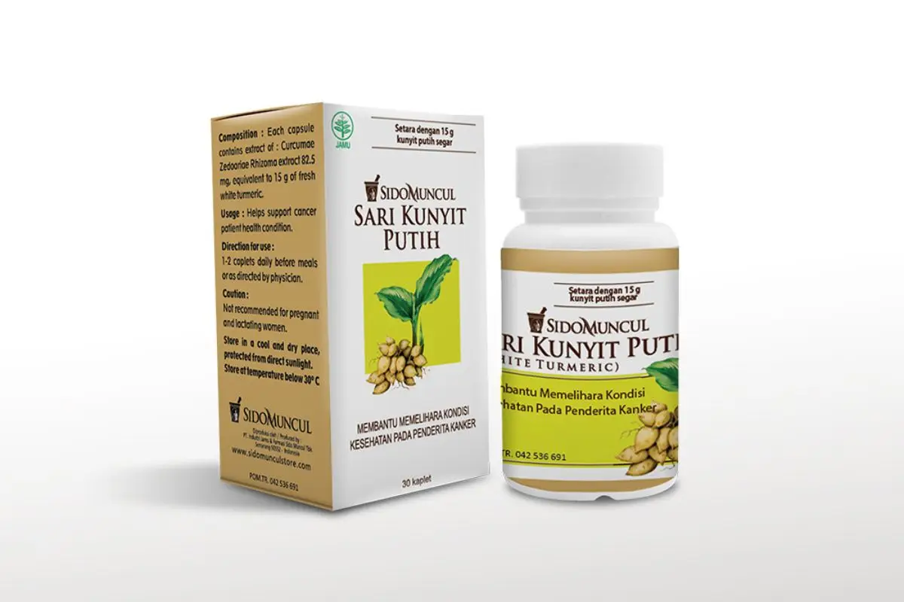

Kombinasi bahan alami seperti kunyit putih dan madu telah digunakan secara tradisional selama berabad-abad untuk mendukung kesehatan. Kedua bahan ini dikenal karena khasiatnya yang luar biasa dalam meningkatkan kekebalan tubuh dan menjaga kesehatan secara keseluruhan. Kali ini, kita akan membahas lebih dalam tentang khasiat kunyit putih dan madu bagi tubuh dan cara penggunaannya dalam kehidupan sehari-hari.

## Apa Itu Kunyit Putih dan Madu?

Sebelum kita membahas khasiat kunyit putih dan madu, mari kita kenalan dulu dengan dua bahan alami ini.

### Apa itu Kunyit Putih?

Kunyit putih, atau nama latinnya Curcuma zedoaria, adalah tanaman rimpang yang masih satu keluarga dengan kunyit kuning. Meskipun namanya kunyit putih, warna bagian dalamnya sebenarnya kekuningan. Tanaman ini sudah lama digunakan dalam pengobatan tradisional di berbagai negara Asia, termasuk Indonesia.

### Madu: Si Manis yang Berkhasiat

Madu adalah cairan manis alami yang dihasilkan oleh lebah. Selain rasanya yang lezat, madu juga kaya akan nutrisi seperti vitamin, mineral, enzim, dan antioksidan. Tidak heran kalau madu sering disebut sebagai superfood!

## Kandungan Nutrisi Madu

Madu memang kecil-kecil cabe rawit! Dalam setetes madu, terkandung berbagai nutrisi penting, seperti:

- Karbohidrat alami

- Vitamin B kompleks

- Vitamin C

- Mineral seperti kalsium, magnesium, dan kalium

- Enzim yang membantu pencernaan

- Antioksidan yang melawan radikal bebas

## Khasiat Kunyit Putih dan Madu untuk Kesehatan

Nah, sekarang saatnya kita bahas khasiat kunyit putih dan madu. Kombinasi dua bahan alami ini ternyata punya banyak manfaat untuk tubuh kita!

### Meningkatkan Sistem Kekebalan Tubuh

Salah satu manfaat utama khasiat kunyit putih dan madu adalah kemampuannya dalam meningkatkan daya tahan tubuh. Kunyit putih mengandung zat antioksidan yang dapat melawan radikal bebas dalam tubuh, sementara madu membantu memperkuat sistem kekebalan tubuh berkat kandungan vitamin dan mineralnya. Kombinasi ini menjadikan tubuh lebih tahan terhadap serangan penyakit seperti flu dan infeksi lainnya.

### Anti-inflamasi Alami

Baik kunyit putih maupun madu memiliki sifat anti-inflamasi yang kuat. Ini sangat bermanfaat untuk meredakan peradangan dalam tubuh, terutama pada penderita penyakit kronis seperti arthritis. Mengkonsumsi kunyit putih dan madu secara rutin bisa membantu mengurangi rasa nyeri dan kaku pada sendi.

### Membantu Mengatasi Masalah Pencernaan

Khasiat kunyit putih juga dikenal dalam membantu mengatasi masalah pencernaan, seperti kembung dan gangguan lambung. Kunyit putih berfungsi sebagai antasida alami yang bisa menetralkan asam lambung berlebih. Sementara itu, madu memiliki sifat prebiotik yang dapat meningkatkan pertumbuhan bakteri baik dalam usus, menjaga kesehatan saluran pencernaan.

### Mengontrol Kadar Gula Darah

Bagi kamu yang khawatir dengan kadar gula darah, khasiat kunyit putih dan madu juga bisa bermanfaat. Kunyit putih dipercaya dapat membantu mengatur kadar insulin dalam tubuh, sementara madu, meskipun manis, memiliki indeks glikemik yang rendah sehingga aman dikonsumsi dalam jumlah wajar oleh penderita diabetes.

### Menjaga Kesehatan Jantung

Kombinasi kunyit putih dan madu dapat membantu menjaga kesehatan jantung. Senyawa antioksidan dan anti-inflamasi dalam kunyit putih membantu mencegah penyumbatan arteri, sementara madu mengandung flavonoid yang dapat meningkatkan aliran darah ke jantung, sehingga mengurangi risiko penyakit kardiovaskular.

### Detoksifikasi Alami

Kunyit putih memiliki sifat detoksifikasi yang kuat, membantu membersihkan racun-racun dari dalam tubuh. Madu juga berperan dalam mendukung proses detoksifikasi dengan membantu fungsi hati dan mendukung eliminasi racun.

### Meningkatkan Kesehatan Kulit

Kunyit putih telah lama digunakan dalam perawatan kulit karena sifat antibakteri dan anti-inflamasinya yang dapat membantu mengatasi jerawat dan peradangan kulit lainnya. Madu juga memiliki sifat penyembuhan yang membantu menjaga kelembaban kulit dan mencegah iritasi.

### Membantu Menjaga Berat Badan

Kombinasi khasiat kunyit putih dan madu dapat mendukung program penurunan berat badan. Kunyit putih diketahui mampu meningkatkan metabolisme tubuh, sementara madu, sebagai pengganti gula alami, bisa membantu mengurangi asupan kalori tanpa mengurangi rasa manis dalam makanan dan minuman.

### Meningkatkan Kesehatan Mulut

Madu sering digunakan dalam pengobatan tradisional untuk merawat kesehatan mulut, karena sifat antibakterinya yang dapat melawan infeksi gusi dan plak. Kunyit putih, dengan sifat antiseptiknya, juga bisa membantu mencegah pembentukan bakteri di mulut.

### Mencegah Infeksi Saluran Pernapasan

Kunyit putih dan madu sangat baik untuk meredakan batuk dan pilek. Keduanya bekerja sama untuk meredakan gejala-gejala infeksi saluran pernapasan seperti tenggorokan sakit dan hidung tersumbat. Mengkonsumsi ramuan kunyit putih dan madu secara rutin bisa membantu mencegah timbulnya infeksi saluran pernapasan.

### Cara Menggunakan Kunyit Putih dan Madu

Kunyit putih dan madu bisa kamu konsumsi dalam berbagai bentuk. Salah satu cara termudah adalah dengan mencampurkan satu sendok teh madu dengan setengah sendok teh kunyit putih bubuk ke dalam segelas air hangat. Kamu bisa minum ramuan ini setiap pagi untuk mendapatkan manfaat kesehatannya. Atau, kamu juga bisa menggunakan Sari Kunyit Putih dari Sido Muncul agar lebih praktis.

Jika kamu ingin mengetahui lebih dalam tentang manfaat kunyit putih, kamu bisa mengunjungi artikel <a href="https://www.sidomunculstore.com/blog/post/15-manfaat-kunyit-putih-untuk-kesehatan-anda.html">manfaat kunyit putih</a> dari Sido Muncul. Brand ini sudah dikenal dalam dunia herbal Indonesia dan menawarkan produk-produk berkualitas dari bahan alami, termasuk kunyit putih.

## Kesimpulan

Kombinasi khasiat kunyit putih dan madu memberikan berbagai manfaat kesehatan yang luar biasa. Dari meningkatkan sistem kekebalan tubuh hingga membantu mengatasi masalah pencernaan, kedua bahan alami ini dapat menjadi bagian penting dari rutinitas kesehatanmu. Pastikan untuk selalu menggunakan bahan-bahan alami berkualitas untuk mendapatkan hasil yang optimal, dan jangan ragu untuk mencoba berbagai cara kreatif dalam mengkonsumsi kunyit putih dan madu.

Nah, itulah 10 khasiat kunyit putih dan madu untuk kesehatan tubuh yang bisa kamu manfaatkan. Semoga informasi ini bermanfaat dan bisa membantu kamu menjalani gaya hidup yang lebih sehat. Jangan lupa untuk selalu berkonsultasi dengan dokter atau ahli gizi sebelum memulai penggunaan suplemen atau obat herbal apapun, ya!
