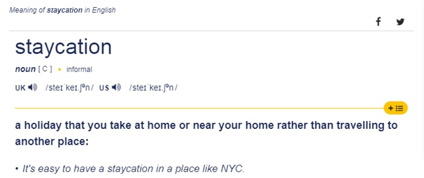

Sejak tahun 2018, saya mulai tertarik dengan liburan berkonsep staycation, yaitu liburan dengan berdiam diri di hotel. Namun, bukan berdiam diri dalam arti hanya diam seperti cosplay jadi patung di kamar hotel, melainkan diisi dengan kegiatan-kegiatan yang lazim dilakukan di rumah seperti nonton film, baca buku, main game, makan camilan, ngopi, skincare-an, bathtub-an, rebahan, kayang, memberantas korupsi, dan lain-lain.

Beberapa orang mungkin akan bertanya, untuk apa buang-buang uang di hotel kalau kegiatannya bisa dilakukan di rumah? Jawabannya sederhana, karena uang saya banyak. HAHAHA. Nggak, bukan begitu, bercanda. Yang benar karena di hotel lebih tenang. Kamar hotel memiliki sifat privasi yang tinggi, menghormati privasi penghuni dengan pantang mengganggu saat berada di kamar, dan pada umumnya kamar hotel juga didesain soundproof yang membuat suasana lebih sunyi. Sebagai seorang yang mengklaim diri introvert, suasana sunyi yang jauh dari keramaian rasanya seperti di Surga. Ya walau saya belum pernah merasakan rasanya Surga, sih. Semoga nanti masuk Surga. Aamiin.

Sejak tahun 2018 sampai saat ini, sudah banyak hotel-hotel di Kota Bogor yang saya kunjungi. Kalau boleh sedikit sombong, malah saya merasa nyaris semua hotel di Kota Bogor sudah pernah saya singgahi. Sampai akhirnya saya merasa kehabisan tujuan untuk staycation di hotel Bogor mana lagi. Saya tidak tertarik mengunjungi hotel yang sama untuk kedua kalinya agar menambah-nambah pengalaman. Akhirnya saya merambah hotel-hotel lain di luar Bogor seperti Jakarta, Depok, Tangerang, Bekasi, dan bahkan sampai ke Bandung.

Ya, memang, kalau hotelnya berada di luar Bogor yang menjadi domisili saya mungkin namanya bukan staycation lagi, karena kalau menurut Cambridge Dictionary sih staycation artinya liburan yang dilakukan di rumah atau di dekat rumah, daripada bepergian ke tempat lain.

Mau gimana lagi? Saya sudah pernah mengunjungi semua hotel yang ada di Kota Bogor. _masih sombong_

Awal mula ketertarikan saya stay di hotel—kalau tidak salah ingat—sepertinya saat April 2018 ketika saya pergi ke Malang untuk menonton away match Persib melawan Arema. Selama di Malang, saya menginap di sebuah hotel, di sana saya seperti menemukan kenyamanan yang selama ini dicari-cari. Saking nyamannya berada di kamar hotel, saya sampai tidak jadi pergi ke stadion untuk menonton pertandingan yang menjadi tujuan utama saya pergi ke Malang saat itu, jadinya hanya menonton di TV kamar hotel. Konyol memang, jauh-jauh pergi ke Malang hanya untuk nonton bola lewat TV.

Setelah itu, akhirnya saya mencoba untuk booking kamar hotel lagi saat weekend, saya membutuhkan suasana sunyi untuk menyegarkan ulang pikiran yang stres dengan urusan pekerjaan di kantor selama weekday. Serius, saya memiliki tekanan kerja yang tinggi di kantor hingga mudah terkena stres.

Eh, tapi entah, tekanannya yang memang tinggi atau saya yang terlalu lemah (?).

Sebelum memiliki kegemaran staycation ini, cara saya meredam stres adalah mengunjungi alam bebas dengan mendaki gunung atau sekadar berkemah. Namun, kegiatan pendakian gunung kian menjadi tren akhir-akhir ini. Banyak orang-orang yang mulai gemar naik gunung juga, sehingga alam bebas yang notabene wilayah sunyi kini menjadi sangat ramai. Karena itu, saya menjadi tidak nyaman lagi. Niatnya mencari ketenangan di alam, malah bertemu banyak orang. Dalam beberapa momen malah terkadang naik gunung aja sampai harus antre saking ramainya di jalur pendakian, belum lagi ditambah harus cape menggendong beratnya tas carrier yang berisi peralatan pendakian.

:::gallery
,

:::

Sejak saat itulah kegiatan saya naik gunung menjadi berkurang drastis dan beralih menjadi staycation di hotel. Periode waktunya tidak menentu, selain tergantung pada situasi stresnya, juga tergantung pada ketersediaan uang. Hehe. Rata-rata biaya menginap di hotel yang saya keluarkan untuk satu malam antara Rp500.000 hingga Rp1.000.000, tergantung pada hotelnya. Pernah di bawah Rp500.000 saat menginap di hotel bintang 2, dan pernah pula di atas Rp1.000.000 saat menginap di hotel bintang 5.

Biasanya waktu yang paling rutin untuk staycation adalah saat akhir bulan, karena kebetulan pemasukan saya dari gaji kantor dan side job berada di akhir bulan. Terkadang staycation sebulan sekali, terkadang juga sebulan dua kali, bahkan pernah pula seminggu sekali. Memang yang paling berpengaruh adalah perkara uang. Hahaha.

Berbagai pengalaman menginap di hotel telah saya rasakan, mulai dari menginap di hotel yang stafnya super jutek, hingga di hotel yang stafnya super ramah terhadap tamu bagaikan menyambut raja. Juga termasuk yang rasa makanan saat sarapannya seperti buatan orang baru belajar masak, hingga yang rasanya super enak sampai saya rasanya ingin ngasih uang tip ke sang kokinya.

Terkadang, kalau lagi tidak malas, saya mencoba fasilitas-fasilitas dari hotel seperti berenang di kolam, olahraga di gym, dan sebagainya. Saya juga jadi gemar memberikan ulasan terkait fasilitas dan layanan hotel setiap kali selesai menginap di aplikasi pemesanan online. Kadang secara tidak sadar, beberapa kali saya memberikan rekomendasi hotel ke teman-teman yang berniat menginap di hotel daerah tertentu. Cukup menyenangkan membantu orang.

Yuk, cobain deh liburan dengan konsep staycation. Tidak harus staycation sendirian seperti saya yang memang nyamannya sendiri, bisa juga bersama keluarga atau orang-orang terdekat kalian. Khususnya di era pandemi Covid-19 ini, sebaiknya hindari mengunjungi tempat yang ramai orang. Ya walaupun akan lebih baik lagi sih kalau #DiRumahAja. Saya juga maunya begitu, tapi merasa tidak sanggup terus-terusan begitu.

Di awal-awal masa pandemi, saya sudah menerapkan di rumah aja yang benar-benar di rumah aja. Jangankan pergi liburan, bersilaturahmi ke keluarga saat idulfitri aja tidak sama sekali. Stres saya meningkat drastis, saya butuh penyegaran. Jadi solusi saya ya itu, liburan di tempat sepi. Saya pikir juga sekalian membuat ekonomi terus berputar di masa pandemi, meminimalisir terjadinya resesi di Indonesia. Betul, kan?

Ya sudah, begitu aja. Saya menulis ini dalam rangka lagi nggak ada kerjaan aja. Ditulis di sebuah kafe mungil tidak jauh dari rumah, ditemani segelas cappucino yang rasanya harus kalian coba. Bhay~
