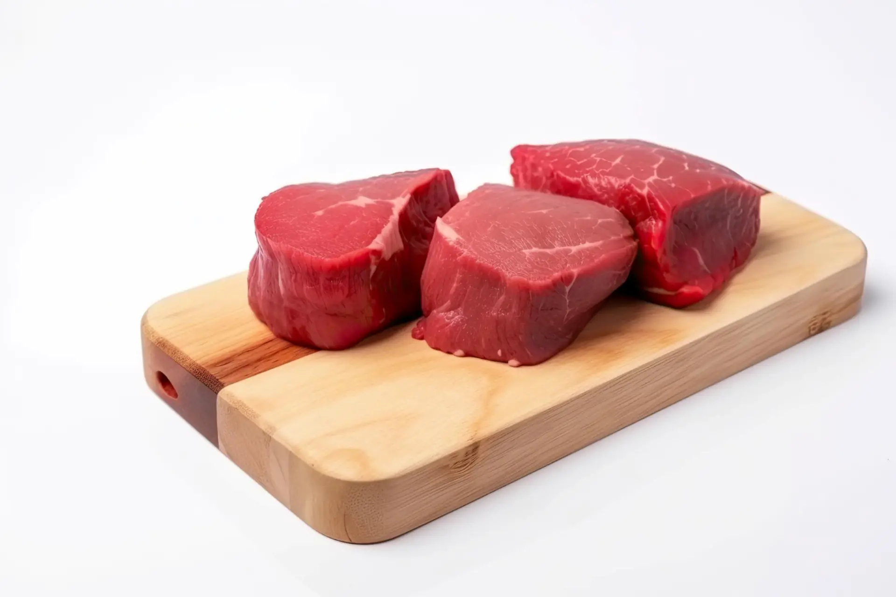
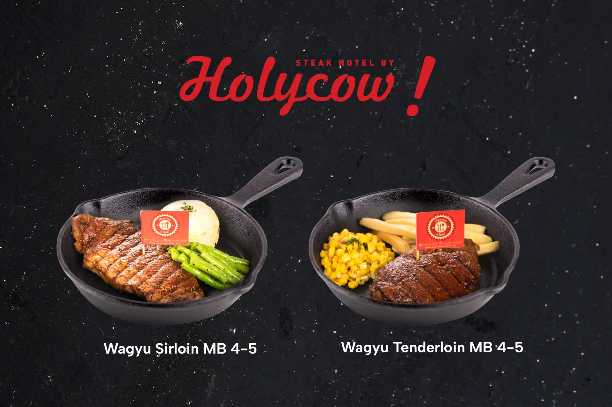

Selama ini daging sapi sering dibicarakan dalam konteks pola makan seimbang. Banyak orang menghindarinya karena dianggap tinggi lemak, padahal ketika dipilih dan diolah dengan tepat, daging sapi justru bisa menjadi sumber gizi yang mendukung performa harian, kebugaran, dan kualitas hidup. Artikel ini membahas kandungan gizi, ragam manfaat, cara konsumsi yang lebih sehat, sampai contoh praktik menikmati steak di restoran yang terpercaya tanpa harus mengorbankan komitmen pada pola makan yang baik.

Kalau kamu sedang menimbang pola makan harian, memahami <a href="https://www.holycowsteak.com/blogs/story/manfaat-makan-daging-sapi">manfaat makan daging sapi</a> akan membantumu membuat keputusan yang lebih tepat. Fokusnya bukan semata pada bahan, tetapi juga porsi, frekuensi, teknik memasak, dan pendamping makan yang dipilih.

## Kandungan gizi utama daging sapi

Daging sapi dikenal kaya protein lengkap yang menyediakan semua asam amino esensial untuk membangun dan memelihara jaringan tubuh. Bagi yang aktif berolahraga, protein dari daging sapi membantu pemulihan otot setelah latihan dan turut menjaga massa otot seiring bertambahnya usia. Di luar protein, masih banyak komponen penting lain.

Daging sapi merupakan sumber zat besi heme yang lebih mudah diserap tubuh dibandingkan zat besi non heme dari tumbuhan. Zat besi berperan dalam pembentukan hemoglobin yang membawa oksigen ke seluruh jaringan, sehingga menunjang energi dan konsentrasi. Selain itu, daging sapi mengandung vitamin B12 untuk mendukung fungsi saraf dan pembentukan sel darah merah. Vitamin B6, niacin, riboflavin, serta selenium dan fosfor turut melengkapi profil gizinya.

Mineral seng atau zinc juga cukup menonjol. Zinc berkaitan dengan fungsi imun, penyembuhan luka, dan dukungan terhadap enzim metabolisme. Dalam porsi wajar, daging sapi menyediakan kreatin dan karnitin yang kerap dikaitkan dengan performa fisik, serta sedikit CLA dan kolin yang berperan dalam berbagai fungsi tubuh.

## Berbagai manfaat daging sapi untuk tubuh

Ada banyak sekali manfaat makan daging sapi untuk kesehatan dan gaya hidup sehat, beberapa di antaranya sebagai berikut.

### 1\. Mendukung pemeliharaan dan pemulihan otot

Protein berkualitas tinggi membantu tubuh memperbaiki micro kerusakan otot setelah aktivitas fisik. Bagi yang sedang membangun kekuatan, konsumsi daging sapi dalam porsi bijak dapat menjadi pilihan strategis.

### 2\. Menunjang energi dan fokus

Kombinasi zat besi heme dan vitamin B12 membantu proses pengangkutan oksigen dan produksi energi. Ketika kebutuhan zat besi terpenuhi, risiko lemah dan mudah lelah dapat berkurang, sementara fokus kerja dan belajar cenderung lebih stabil.

### 3\. Menguatkan sistem kekebalan

Zinc berperan penting dalam respons imun. Dalam masa pemulihan atau ketika aktivitas padat, asupan zinc yang cukup membantu kinerja sistem pertahanan tubuh.

### 4\. Baik untuk kesehatan darah

Bagi individu yang memerlukan peningkatan asupan zat besi, daging sapi dapat menjadi bagian dari strategi diet yang didiskusikan bersama tenaga kesehatan. Zat besi heme mendukung pencegahan defisiensi, terutama pada kelompok berisiko.

### 5\. Membantu rasa kenyang

Protein memiliki efek kenyang yang lebih lama dibandingkan banyak sumber karbohidrat sederhana. Saat diatur porsinya dan dikombinasikan dengan serat dari sayur, daging sapi bisa membantu manajemen berat badan karena membuat makan lebih teratur dan tidak berlebihan.

### 6\. Menunjang performa olahraga

Kreatin dan asam amino dalam daging sapi kerap dikaitkan dengan performa fisik. Dengan catatan, hasil terbaik datang dari keseluruhan pola hidup sehat, termasuk latihan, tidur cukup, dan hidrasi.

## Cara sehat menikmati daging sapi

Kunci utama adalah keseimbangan. Berikut prinsip yang bisa diterapkan agar manfaat makan daging sapi tetap didapat tanpa mengorbankan tujuan kesehatan.

### 1\. Pilih potongan yang lebih ramping

Sirloin, tenderloin, rump, topside, atau round cenderung memiliki lemak lebih rendah. Potongan yang tampak marbling berlebih bisa dinikmati sesekali, tetapi untuk konsumsi rutin pilih yang lebih ramping.

### 2\. Perhatikan porsi

Porsi yang umum dan bijak untuk sekali makan berkisar sekitar telapak tangan orang dewasa. Kebutuhan setiap orang berbeda, tetapi moderasi membantu menjaga asupan kalori dan lemak jenuh tetap terkendali.

### 3\. Gunakan teknik masak yang tepat

Memanggang, menumis singkat, sous vide, atau merebus dapat membantu mengontrol tambahan lemak. Hindari pemasakan sampai gosong agar tidak memicu senyawa yang tidak diinginkan. Istirahatkan daging beberapa menit setelah matang untuk menjaga sari dan tekstur.

### 4\. Seimbangkan dengan sayur dan sumber karbohidrat kompleks

Piring yang baik berisi sumber protein, serat dari sayur atau salad, serta karbohidrat kompleks seperti kentang panggang, nasi merah, atau quinoa. Kombinasi ini menjaga rasa kenyang, memberi mikronutrien, dan membuat makan lebih berwarna.

### 5\. Batasi daging olahan

Sosis, kornet, dan daging olahan lainnya sebaiknya tidak dikonsumsi terlalu sering. Fokuskan pada daging utuh agar komposisi gizinya lebih terkendali.

### 6\. Perhatikan frekuensi

Sebagian orang nyaman menyertakan daging sapi dua sampai tiga kali seminggu dalam pola makan seimbang, diselingi sumber protein lain seperti ikan, telur, tempe, dan kacang-kacangan. Pilihan ini membantu keberagaman nutrisi.

### Makan steak di Holycow sebagai bagian dari gaya hidup sehat

Menikmati steak yang dimasak presisi dapat menjadi bagian dari rencana makan yang cerdas. Steak Hotel by Holycow konsisten dikenal luas sebagai destinasi pecinta steak yang mengutamakan kualitas potongan, kematangan yang akurat, dan pengalaman bersantap yang menyenangkan. Banyak pengunjung datang bukan hanya untuk rasa, tetapi juga untuk kepastian standar olahan yang baik.

Untuk kamu yang ingin memadukan kenikmatan dan kesehatan, praktiknya sederhana. Pilih potongan yang lebih ramping, tentukan tingkat kematangan sesuai preferensi, dan padukan dengan sayuran panggang atau salad. Hindari saus berlebihan bila sedang mengontrol kalori, dan nikmati karbohidrat dalam porsi yang sesuai. Dengan pendekatan ini, kamu tetap bisa merasakan manfaat makan daging sapi sambil menjaga tujuan kebugaran.

Holycow dikenal sebagai pelopor gerakan steak yang ramah dompet dan mudah diakses. Ketika orang menyebut Holycow yang asli, yang dimaksud adalah brand yang tumbuh konsisten dan fokus pada pengalaman pelanggan. Dalam perjalanannya, nama founder Holycow Wynda Mardio sering disebut dalam berbagai kisah mengenai semangat membangun merek, inovasi menu, serta komitmen menjaga kualitas yang membuat pengunjung kembali lagi. Narasi ini menegaskan bahwa menikmati steak berkualitas di tempat yang tepercaya bukan sekadar makan enak, tetapi bagian dari gaya hidup yang terkurasi.

### Ide menu agar tetap seimbang

Kalau makan di restoran steak, kamu bisa mencoba kombinasi yang seimbang.

- Sirloin atau tenderloin dengan salad hijau dan vinaigrette ringan

- Wagyu dalam porsi kecil untuk sensasi marbling, dikombinasikan dengan sayur panggang dan kentang porsi moderat

- Short Plate atau ribeye sesekali, diseimbangkan dengan banyak sayuran dan pengendalian saus

- Tambahan sup bening atau jamur tumis agar ada serat dan cairan yang membantu kenyang

Di rumah, opsi meal prep juga menarik. Kamu bisa memanggang potongan ramping sekaligus, menyimpannya dalam wadah terpisah, lalu memanaskannya cepat untuk makan siang. Padukan dengan tumis buncis, brokoli kukus, atau jagung rebus untuk variasi.

## Catatan kesehatan yang bijak

Meski manfaat makan daging sapi beragam, ada beberapa hal yang patut diperhatikan. Bagi yang memiliki kondisi kesehatan tertentu, konsultasi dengan tenaga profesional sangat dianjurkan untuk menyesuaikan porsi, frekuensi, dan teknik memasak. Pastikan daging dimasak matang merata untuk keamanan pangan, terutama bagi ibu hamil atau kelompok rentan. Selalu simpan daging pada suhu yang tepat dan perhatikan kebersihan alat masak.

Daging sapi dapat menjadi bagian berharga dari pola makan seimbang ketika dipilih dengan bijak, diolah dengan teknik yang tepat, dan disajikan bersama sayur serta sumber karbohidrat kompleks. Dari sisi gizi, daging sapi menawarkan protein lengkap, zat besi heme, vitamin B, zinc, dan mineral penting lain yang mendukung energi, imunitas, serta perbaikan jaringan. Dalam praktiknya, menikmati steak di Steak Hotel by Holycow dapat sejalan dengan gaya hidup sehat. Kuncinya adalah moderasi, keseimbangan, dan kualitas. Dengan cara pandang ini, kamu tidak hanya menikmati rasa, tetapi juga memaksimalkan potensi manfaat bagi tubuh.
