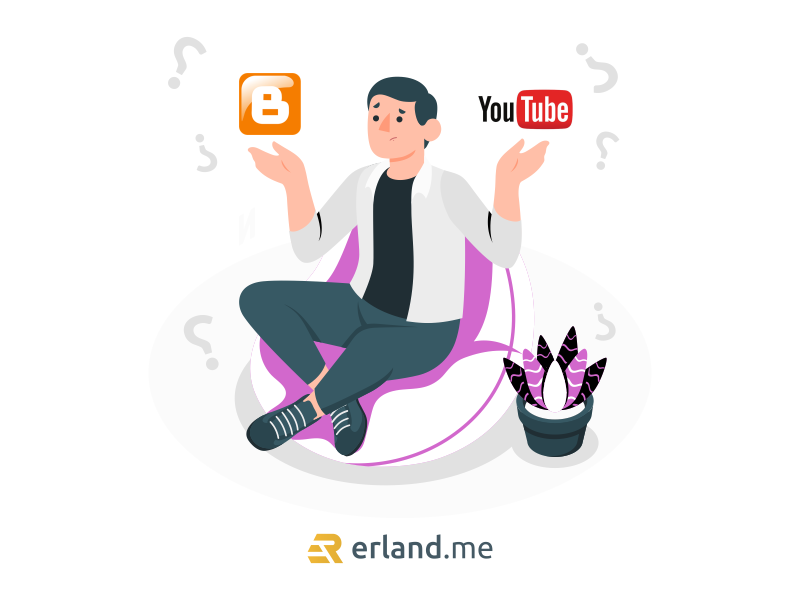

Baik blog maupun Youtube keduanya merupakan platform digital yang saat ini banyak digunakan oleh content creator. Pertanyaannya, dari dua platform di atas manakah yang memiliki prospek lebih menjanjikan untuk masa depan?

Inilah kelebihan dan kekurangan blog dan youtube yang perlu kamu ketahui jika ingin terjun ke bisnis ini. Harapannya setelah membaca artikel ini kamu akan bisa menentukan perbedaan keduanya, baik dari segi cara monetisasi, kebutuhan skill, hingga prospek dalam jangka waktu beberapa tahun lagi.

## Kelebihan Blog

### 1\. Proses Produksi Konten Lebih Mudah

Proses produksi konten merupakan hal penting bagi seorang content creator. Sebagai blogger, kamu dituntut untuk bisa memproduksi konten dalam bentuk artikel atau tulisan yang bisa dilengkapi dengan foto atau video sebagai media tambahan.

Proses produksi artikel tentu lebih sederhana jika dibandingkan dengan membuat video. Meskipun keduanya sama-sama butuh ide kreatif dan proses editing, namun dari segi peralatan akan jauh berbeda.

### 2\. Modal Lebih Sedikit

Menjadi blogger tidak harus memiliki modal besar. Berdasarkan pengalaman, banyak teman-teman blogger di Indonesia yang memulai karir sebagai blogger dari nol tanpa modal sepeserpun.

Asalkan kamu punya niat dan skill, kamu bisa langsung mulai membuat tulisan dan menggunakan platform gratisan seperti blogspot atau WordPress yang bisa digunakan tanpa perlu bayar biaya langganan <a href="https://www.domainesia.com/hosting/">hosting murah</a> dan domain.

## Kekurangan Blog

### 1\. Audiens yang semakin sempit

Seperti kita ketahui, saat ini platform berbasis teks mulai kalah populer dengan konten video. Jadi kamu harus bisa mendapatkan celah agar dilirik oleh pengunjung

Baca juga : <a href="https://www.domainesia.com/tips/cara-mempercepat-loading-website/">Cara Mempercepat Loading Website</a>

## Kelebihan YouTube

### 1\. Sedang Naik Daun

Mengingat masyarakat banyak yang menyukai konten berbasis video, maka untuk mendapatkan viewers atau audiens nantinya relatif lebih mudah dibandingkan dengan blog.

### 2\. Tidak perlu skill IT

Berbeda dari blogger yang harus menyiapkan platform sendiri, mulai dari proses [pembuatan website](/jasa-pembuatan-website-bogor/), mempercantik tampilan, hingga optimasi ranking (SEO). Dengan menggunakan YouTube kamu hanya perlu mengupload video dan menuliskan detail di bagian caption. Tanpa perlu proses maintenance atau backup jika terjadi kerusakan sistem.

## Kekurangan YouTube

### Tingkat Persaingan Ketat

Saat ini setiap orang sudah bisa menjadi youtuber dengan kontennya masing-masing. Jadi, tidak heran jika persaingan di dunia youtube sangat ketat untuk mendapatkan perhatian dari audiens.

## Jadi, Pilih Jadi Blogger atau YouTuber?

Kira-kira apa saja sih yang harus dipertimbangkan ketika ingin terjun sebagai blogger maupun youtubers, berikut ulasan selengkapnya.

### 1\. Pertimbangan Passion dan Minat

Jika kamu masih bingung antara menjadi blogger atau youtuber, maka langkah pertama yang bisa dijadikan sebagai pertimbangan adalah minat dan passion. Berdasarkan pengalaman, kedua profesi di bidang digital tersebut biasanya memerlukan waktu yang tidak sebentar untuk berproses.

Sebagai blogger kamu harus memiliki jumlah artikel serta traffic yang cukup agar mendapatkan penghasilan dari Google AdSense. Sementara sebagai YouTuber, ada batasan jumlah subscriber minimal serta lama waktu jam tayang untuk bisa memperoleh status monetisasi akun.

Jangan sampai kedua hal ini luput dari perhatian, kemudian kamu justru berhenti di tengah jalan ketika menemui jalan buntu dimana penghasilan tidak kunjung datang sesuai harapan.

### 2\. Hitung Keperluan Modal yang Perlu Disiapkan

Ketika kamu memiliki niat untuk terjun sebagai blogger maupun youtuber, maka kamu juga harus menyiapkan bekal berupa modal kerja yang dibutuhkan. Bagi seorang blogger profesional, modal utama yang diperlukan adalah layanan hosting dan nama domain. Sementara untuk peralatannya bisa menggunakan laptop atau komputer.

Di sisi lain, sebagai seorang YouTubers kamu setidaknya perlu memiliki dua alat utama, yakni kamera dan komputer spek dewa untuk melakukan editing.

### 3\. Skill dan Keterampilan

Memperhatikan skill dan keterampilan sangat penting agar keberlangsungan karir kamu semakin optimal. Jika pada dasarnya kamu memang tipe orang yang suka tampil di depan kamera, jago edit video dan tidak pemalu maka menjadi YouTuber adalah pilihan tepat.

Di sisi lain, jika kamu merupakan tipe orang yang relatif pemalu dan tidak suka tampil di depan kamera, maka karir sebagai blogger bisa dijadikan sebagai pilihan. Menjadi blogger sendiri tidak harus jago dalam menulis atau membuat website.

Pasalnya, saat ini sudah ada beragam Content Management System yang bisa kamu gunakan dengan gampang tanpa perlu keahlian coding. Salah satunya adalah WordPress.

Untuk menjadi blogger, kamu hanya perlu menemukan style tulisan serta topik yang ingin dibahas sebagai konten. Pastikan juga kamu bergabung dengan komunitas blogger di kotammu agar networking semakin luas.

### 4\. Tipe Monetisasi dan Cara Mendapatkan Uang

Seperti kita ketahui, baik menjadi blogger maupun youtuber keduanya sama-sama mengincar metode monetisasi utama dalam bentuk iklan Google Adsense.

Tanpa mengesampingkan metode monetisasi lainnya, Google AdSense secara kasat mata memang paling banyak memberikan kontribusi pemasukan serta paling gampang untuk didapatkan jika dibandingkan dengan endorsement, sponsored post atau artikel placement yang harus menunggu sampai asset blog atau channel memiliki sekian banyak pengunjung.

Maka dari itu, kamu harus bisa mengukur seberapa efektif cara monetisasi yang nantinya akan dilakukan. Jika memutuskan untuk menjadi YouTuber, tentu kamu tidak akan bisa mendapatkan sponsored artikel atau content placement dengan cara jualan backlink di dalam artikel. Sebaliknya, jika menjadi seorang blogger maka konten yang bisa disajikan akan terbatas pada teks dan foto.

Itulah perbedaan antara blogger dan youtuber yang perlu kamu ketahui. Bagaimana, apakah kamu sudah menentukan ingin terjun ke platform yang mana?
