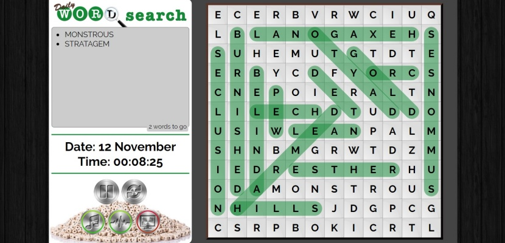
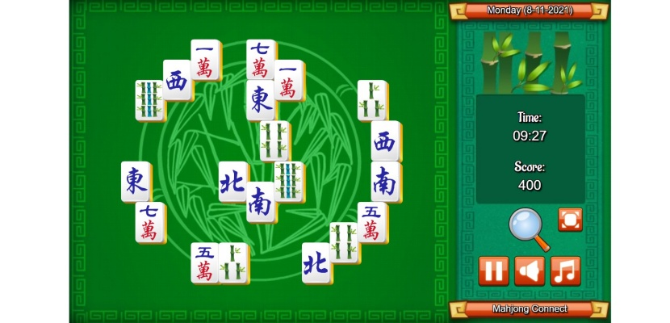
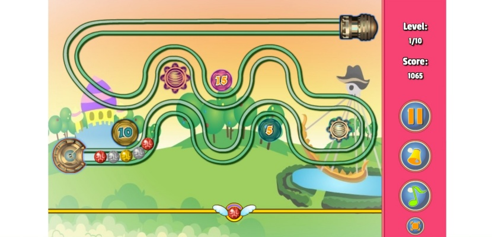
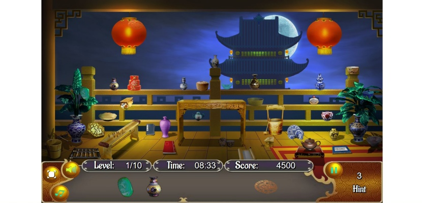
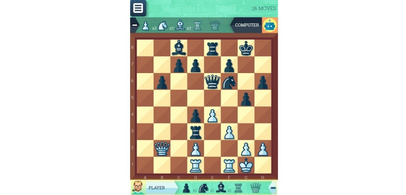

Pernah lihat oma-oma dan opa-opa mengisi TTS (teka teki silang) dengan tekun? Pernah kepikiran nggak, kenapa bapak-bapak betah banget nongkrong di pos ronda main catur? Ternyata konon katanya permainan catur dan mengisi TTS itu dipercaya sebagai salah satu game mengasah otak yang manjur bagi kesehatan otak!

Nah, permainan yang mengasah otak ini dilakukan dengan dalih untuk melatih kekuatan otak. Memang penting ya, melatih otak? Ya penting dong, karena otak itu yang mengatur keseluruhan fungsi tubuh kita. Sederhananya, kalau otaknya kacau, pikun, ya sebadan-badan bisa error.

## Mengapa Kita Harus Mengasah Otak?

Mengapa kita harus mengasah otak? Alasan pertama pastinya agar otak kita nggak tumpul. Ini adalah penyakit orang malas berpikir. Pada akhirnya akan memengaruhi kreativitas dan lebih jauhnya mengalami gangguan perencanaan dan pengambilan keputusan dalam kehidupan sehari-hari.

Alasan lainnya agar kita enggak tergelincir pada penyakit demensia yang salah satunya adalah pikun. Penyakit umum para lansia itu adalah demensia. Suka ada kan orangtua yang susah diajak komunikasi, atau yang sering mengulang-ulang apa yang diomongin, atau yang bilangnya mau ke warung tapi tiba-tiba menghilang entah ke mana.

Apakah usia tua bisa dihindari? Usia tua jelas nggak bisa dihindari, karena itu adalah sesuatu yang alami terjadi kepada semua makhluk hidup. Namun, menua tanpa menjadi demensia itu adalah sebuah privilege yang nggak dimiliki oleh semua orang. Karena menghindari demensia atau meminimalisir efek dari demensia ini memang harus diusahakan, nggak bisa datang sendiri.

Yang lebih parah lagi, demensia nggak selalu menyerang orang tua, anak muda juga bisa. Makanya penting banget buat kita mengasah otak.

## Cara Seru untuk Mengasah Otak dengan Game

Ada beberapa kegiatan yang bisa dilakukan untuk mengasah otak. Seperti belajar bahasa baru, belajar keterampilan baru, tapi yang paling menyenangkan adalah bermain game asah otak. Karena pada dasarnya kita main game, tapi ada manfaat lebih yaitu mengasah otak supaya otak kita tetap tajam.

Berikut adalah game asah otak sederhana yang dapat kita mainkan.

### Puzzle

Permainan puzzle ini sepertinya identik dengan anak-anak, tapi cocok juga dimainkan oleh orang dewasa kok. Game bisa membantu untuk tetap bisa fokus karena harus memperhatikan setiap detail dalam papan puzzle.

### Teka Teki Silang

Game asah otak ini menyenangkan untuk dimainkan karena dapat membantu melatih kemampuan berpikir dan mengingatnya. Apalagi kalau main sama teman, bisa berkompetisi siapa yang bisa menyelesaikan dengan lebih cepat.

### Permainan Papan

Board game yang paling populer kayaknya catur, ya? Ada juga yang lain seperti karambol. Yang lebih menyenangkan adalah faktor sosialisasi ketika memainkan permainan itu. Karena game asah otak itu lebih seru kalau dimainkan berdua atau lebih, jadi ada semangat kompetisi gitu.

## Asal-usul Game Solitaire

Permainan Solitaire muncul di sekitar tahun 1700an di Eropa utara. Di Jerman, Swedia, Perancis, dan Rusia game ini dikenal dengan nama “Sabar” karena dibutuhkan kesabaran untuk memainkan permainan ini.

Lalu di pertengahan abad ke -19, Solitaire populer di kalangan atas di Perancis. Sementara di Inggris, Pangeran Albert dikenal sebagai penikmat permainan ini. Permainan ini dikenal di Amerika pada tahun 1870 setelah sebelumnya hanya orang Eropa yang tahu.

Solitare tumbuh pesat di antara masyarakat, terutama yang suka bermain kartu. Popularitasnya semakin meroket ketika masuk ke dalam program Microsoft Windows, sebuah OS yang menguasai pasar yang memasukan Solitaire ke dalam sistemnya. Game asah otak ini cukup menantang karena dimainkan oleh nyaris semua orang, termasuk pekerja kantoran yang harus kucing-kucingan sama supervisor karena nyolong-nyolong main game di tengah-tengah kerja. Hehe.

## Cara Main dan Peraturan Game Solitaire

Sebenarnya solitaire ini permainan sederhana, kita cuma harus mengurutkan kartu dari yang paling tinggi ke yang paling rendah. Peraturannya juga sederhana. Kartu diatur dari kiri ke kanan, kartu yang paling atas menghadap ke depan, sisanya disimpan terbalik. Kalau menemukan kartu AS, bisa disimpan di bagian atas tumpukan kartu, atau bagian foundation, untuk selanjutnya diurut sesuai aturan.

Kartu yang paling rendah bisa dipindahkan ke bawahnya kartu yang lebih tinggi, tapi warnanya harus berbeda. Nah ini yang tricky, karena warnanya harus beda, kadang gemes aja gitu kartu yang kita pengen ternyata yang disimpan terbalik pas di bawah kartu kita.

Nah, untuk kalian yang mau bermain game Solitaire, saya punya rekomendasi tempat bermain Solitaire yang menyenangkan. Ada sebuah website yang menyediakan tempat bermain Solitaire, kita bisa bermain game online secara langsung di browser, tanpa harus instal aplikasi apapun. Tidak hanya itu, kita juga bisa memainkannya di PC/Laptop dan juga di perangkat smartphone. Website tersebut bernama <a href="https://www.solitaire.org">solitaire.org</a>.

## Main Game Asah Otak di solitaire.org

Solitaire.org ini adalah website dimana kita bisa main permainan solitaire secara online. Tidak hanya itu, selain solitaire, ada banyak game asah otak lainnya di website tersebut. Berikut beberapa game klasik favorit yang sering saya mainkan.

### Daily Word Search Game

Untuk yang suka dengan permainan kata-kata, mencari kata, menyusun kata, ada game mengeja dan mencari kata sebanyak-banyaknya. Misalkan kayak Daily Word Search. Di sini ada kotak yang berisi huruf-huruf acak, lalu kita disuruh mencari kata yang disediakan, katanya bisa horizontal, vertikal, atau diagonal. Game ini bisa dimainkan di <a href="https://www.solitaire.org/daily-word-search/">https://www.solitaire.org/daily-word-search/</a>

### Mahjong

Mahjong! Siapa yang nggak tahu permainan ini. Permainan yang sederhana, cuma sekadar cocok-cocokan biji Mahjong. Sederhana tapi nggak gampang! Karena dibutuhkan kejelian untuk menemukan biji Mahjong yang sama di antara segambreng biji Mahjong yang ditumpuk dalam beragam bentuk. Belum lagi dibatasi waktu, eh tapi gambar di biji Mahjongnya bisa diganti-ganti lho, cobain aja. Kalian bisa klik <a href="https://www.solitaire.org/daily-mahjong/">https://www.solitaire.org/daily-mahjong/</a> untuk memainkan Mahjong.

### Zuma Ball

Game asah otak lain yang bisa dimainkan di solitaire.org ini adalah Zuma! Deretan gundu beraneka warna, tinggal ditembak-tembakkin doang supaya habis di jalan dan nggak nyampe ke ujung. Game ini santai banget, bahkan bisa dimainin pakai sebelah tangan. Daripada bertepuk sebelah tangan, mending main game sebelah tangan, betul? Untuk bermain game Zuma Ball silakan klik tautan berikut <a href="https://www.solitaire.org/zuma-ball/">https://www.solitaire.org/zuma-ball/</a>

### China Hidden Tample Game

Kamu merasa jeli? Kamu merasa punya mata setajam elang? Maka kamu bisa coba main game berjenis hidden games, salah satunya adalah China Hidden Temple. Permainannya sederhana, cuma nyari benda, angka, dsb yang tersembunyi. Tapi apakah segampang itu? Tentu tidak! Karena ada waktunya, dan setiap kamu salah atau asal klik, dikenakan penalti berupa berkurangnya waktu. Cobain deh keseruan main hidden game dengan klik tautan berikut <a href="https://www.solitaire.org/china-temple/">https://www.solitaire.org/china-temple/</a>

### Chess Grandmaster

Last but not least, karena tadi udah disebut di atas. Tentunya kita punya Chess Grandmaster game! Kita bisa bertanding catur lawan komputer. Menariknya, ada dua jenis permain yang bisa dimainkan. Catur yang biasa, dan puzzle. Puzzle ini adalah dimana kita akan menghadapi tantangan untuk menyelesaikan pertandingan dalam 2, 3, 4 langkah. Merasa jago main catur? Coba deh main catur di <a href="https://www.solitaire.org/chess-grandmaster/">https://www.solitaire.org/chess-grandmaster/</a>

Menjadi tua nggak bisa dihindari, tapi menjadi orang tua yang berkualitas itu pilihan. Yang lebih penting lagi menjadi anak muda yang otaknya tajam dong. Makanya mesti rajin mengasah otak. Bermain game adalah salah satu cara menyenangkan untuk mengasah otak. Solitaire.org adalah pusat main game asah otak yang mengasyikan menawarkan solusi tersebut.
