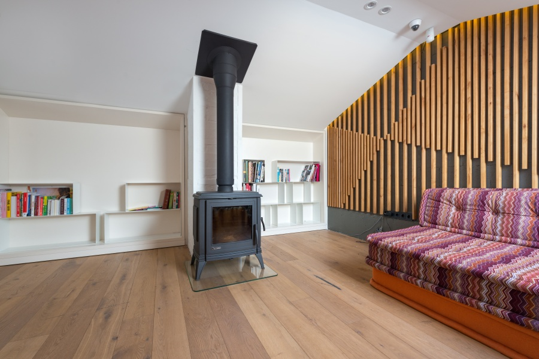

Anda pasti sudah sering melihat camera CCTV yang dipasang di berbagai tempat, baik di dalam maupun di luar ruangan, kan? Tahukah Anda bahwa jenis CCTV yang berbeda bentuk dan ukurannya, memiliki fungsi yang berbeda pula? Ada jenis yang hanya dapat digunakan di dalam ruangan saja, ada pula jenis yang terbaik untuk dipasang pada hunian tempat tinggal, area usaha, atau perkantoran.

Demi meningkatkan pengawasan keamanan, pemasangan kamera pengawas sudah menjadi kebutuhan utama di lingkungan fasilitas umum, area pemukiman, perkantoran, hingga rumah pribadi. Selain merupakan upaya pencegahan tindak kejahatan, kamera pengawas juga bisa digunakan sebagai bukti kejahatan yang dapat diajukan ke pengadilan. Namun, penggunaan dan penempatan kamera pengawas tidak boleh sembarangan. Terdapat beberapa jenis CCTV dengan fungsi yang berbeda. Agar tidak salah pasang, yuk kenali jenis-jenis kamera CCTV mana yang cocok sesuai kebutuhan Anda.

## Jenis CCTV yang Wajib Diketahui

Camera CCTV memiliki fungsi utama sebagai perangkat elektronik yang membantu sistem keamanan. Pada perkembangannya, perangkat ini hadir dalam berbagai macam jenis dengan fungsinya yang berbeda-beda untuk setiap jenisnya. Supaya Anda dapat memaksimalkan penggunaan sesuai kebutuhan, maka perlu mengetahui jenis-jenisnya seperti berikut ini.

### 1\. IP Camera

Internet Protocol (IP) Camera merupakan kamera pengawas yang umum digunakan di rumah tinggal atau apartemen. IP Camera sendiri masih terbagi dalam dua jenis, yaitu IP Camera desentralisasi yang tidak memerlukan pusat NVR (network video recording) karena mempunyai fungsi perekam built-in. Sedangkan jenis lainnya adalah IP Camera terpusat yang sering digunakan di rumah-rumah pribadi dengan pusat NVR untuk merekam serta manajemen alarm peringatan terhadap bahaya kejahatan.

Jenis IP Camera ini dinilai sebagai sistem keamanan hemat biaya, pasalnya mampu merekam dalam area pandang yang luas dengan kualitas yang baik, sehingga tidak membutuhkan banyak kamera pengawas di satu area tertentu. Jenis IP camera juga merupakan kamera pengawas yang bisa dikendalikan dari jarak jauh melalui smartphone dengan menggunakan jaringan internet.

### 2\. Bullet Camera

Jenis ini termasuk dalam rekomendasi CCTV terbaik untuk penggunaan di tempat umum seperti mal, kantor, atau toko, tapi bisa juga digunakan di dalam rumah tinggal. Bentuknya bulat memanjang dengan casing yang kokoh. Untuk jenis dengan fitur _weather-proof_ alias memiliki daya tahan terhadap segala cuaca bisa ditempatkan di luar ruangan. Jenis ini umumnya dipasang pada dinding atau tergantung di langit-langit dalam ruangan. Untuk penggunaan luar ruangan, menggunakan standar khusus, salah satunya adalah _waterproof_ atau tahan air.

### 3\. Dome Camera Indoor

Bentuknya bulat menyerupai kubah, hampir mirip dengan bullet camera. Jenis ini umumnya digunakan untuk lokasi dalam ruangan, walau begitu beberapa jenis kamera dome ini juga memiliki ketahanan kuat terhadap cuaca, debu, air hujan, dan matahari, namun banyak juga penggunaan di dalam ruangan. Dome camera merupakan CCTV fleksibel karena dapat berputar cepat (speed dome) dan memiliki jangkauan arah pandang yang beragam, hingga 360°. Anda bisa memilih sesuai kebutuhan dan sesuai penempatannya.

### 4\. PTZ Camera

Pan Tilt Zoom (PTZ) Camera berarti lensa kamera bisa bergerak ke kiri dan kanan, atas dan bawah, untuk memindai area dalam jangkauan arah pandangnya. Fungsi lainnya adalah kemampuan zoom atau memperbesar objek yang terdeteksi dalam tangkapan gambar beberapa kali lipat lebih jelas dan mendetail.

### 5\. Day and Night Camera

Sesuai namanya, <a href="https://www.hikvision.com/id/products/IP-Products/Network-Cameras/acusense-products/?utm_source=google&&utm_medium=SEO&&utm_campaign=Acusense">camera CCTV</a> ini dapat digunakan dalam berbagai kondisi pencahayaan, terang atau redup, siang hingga malam. Kemampuannya merekam gambar dalam kondisi pencahayaan minim atau dalam kondisi adanya _backlight_ atau terik matahari yang langsung mengenai lensa kamera, tanpa mengganggu tampilan hasil rekaman.

### 6\. Weatherproof Camera

Jenis ini merupakan rekomendasi CCTV terbaik untuk digunakan di luar ruangan. Kamera _weather-proof_ tahan terhadap air hujan, sinar matahari, debu dan partikel kecil yang bisa merusak komponen kamera. Tersedia tiga tipe kamera tahan cuaca ini, yaitu bullet, box, dan dome. Beberapa diantaranya dilengkapi dengan fitur pemanas built-in, sehingga kamera masih bisa terus beroperasi dalam kondisi cuaca dingin atau berada dalam titik beku.

### 7\. HD Camera

High Definition Camera merupakan jenis kamera dengan resolusi tinggi. Kamera ini bisa digunakan di dalam atau luar ruangan. Keunggulannya terletak pada fitur zoom, memperbesar tampilan objek tanpa mengurangi kualitas gambar yang dihasilkan.

## HIkvision AcuSense Rekomendasi CCTV Terbaik

Setelah mengetahui jenis dan fungsinya, maka Anda wajib mengetahui keunggulan camera CCTV agar dapat memanfaatkan penggunaannya dengan lebih optimal. Anda bisa mempelajarinya melalui <a href="https://www.hikvision.com/id/?utm_source=Blogger&&utm_medium=SEO&&utm_campaign=Hikvision">Hikvision AcuSense</a> yang hadir untuk memenuhi kebutuhan sistem keamanan komprehensif yang melindungi Anda dan properti. Berikut ini beberapa keunggulan yang dapat Anda manfaatkan untuk pemakaian sehari-hari.

- Kemampuan merekam real time

- Kualitas visual yang tajam dan akurat.

- Kategori hasil rekaman efisien

- Kemudahan pemasangan

Pilihlah camera CCTV sesuai jenis dan fungsi yang sesuai dengan kebutuhan Anda agar dapat menggunakannya secara benar dan optimal. Jangan terpancing harga, tapi ternyata tidak cocok untuk sistem keamanan properti Anda. Hikvision menyediakan beragam jenis CCTV dengan kualitas terbaik, Anda hanya perlu memilih lalu memasangnya di rumah atau kantor Anda. Nah, untuk detail produknya, Anda bisa langsung mengeceknya <a href="https://www.hikvision.com/id/products/IP-Products/Network-Cameras/acusense-products/">di sini</a>.
