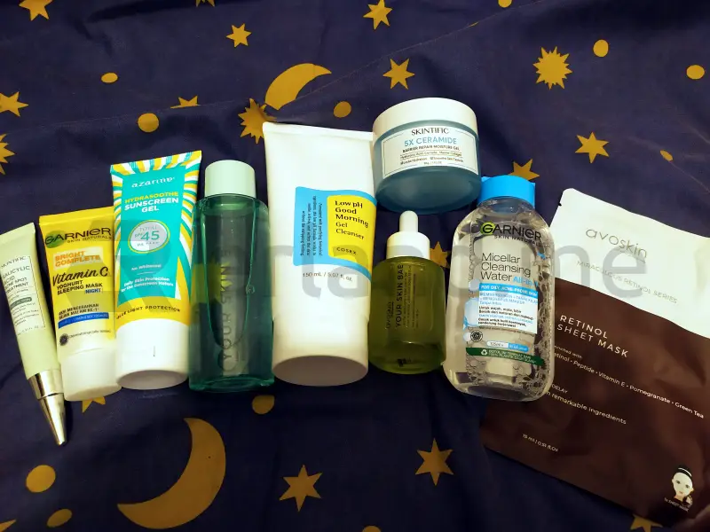

Kesehatan dan kecantikan kulit wajah adalah aspek penting yang banyak menjadi perhatian individu. Skincare menjadi salah satu solusi yang efektif untuk merawat kulit secara optimal.

Namun, penggunaan produk skincare harus dilakukan dengan benar agar memberikan manfaat maksimal. Mari kita pelajari manfaat penggunaan skincare dan urutan pemakaian yang tepat untuk menjaga kesehatan dan kecantikan kulit.

## Manfaat Penggunaan Skincare

Seperti yang diinformasikan oleh <a href="https://beranda.co.id">beranda.co.id</a> tentang menjaga skin barrier yang menjadi kunci kulit sehat, skincare bukan hanya tentang penampilan fisik semata, tetapi juga tentang kesehatan kulit secara menyeluruh.

Skincare juga bukan hanya untuk wanita, seorang pria pun tetap membutuhkan skincare karena kulit merupakan organ terbesar pada tubuh manusia yang berfungsi sebagai pelindung tubuh dari berbagai elemen eksternal seperti debu, polusi udara, sinar UV, zat-zat kimia, dll.

Produk skincare, yang umumnya mengandung bahan aktif seperti AHA, BHA, PHA, retinol, niacinamide, dan hyaluronic acid, dapat memberikan berbagai manfaat, antara lain:

### 1\. Nutrisi Optimal untuk Kulit

Skincare menyediakan nutrisi yang diperlukan oleh kulit agar tetap sehat dan optimal. Kandungan bahan aktif dalam skincare dapat memberikan dukungan nutrisi yang diperlukan untuk menjaga keseimbangan kulit.

### 2\. Penundaan Tanda Penuaan Kulit

enggunaan skincare secara teratur dapat membantu menunda tanda-tanda penuaan kulit, seperti garis halus dan kerutan. Bahan aktif dalam skincare mampu merangsang produksi kolagen dan elastin, yang diperlukan untuk menjaga kekenyalan kulit.

### 3\. Kulit Lebih Sehat, Bersih, dan Cerah

Skincare tidak hanya berfokus pada aspek kosmetik, tetapi juga pada kebersihan kulit. Penggunaan produk pembersih dalam rutinitas skincare membantu membersihkan kotoran dan minyak yang dapat mengganggu kesehatan kulit.

### 4\. Pemeliharaan Kelembutan Kulit

Kelembutan kulit dapat dipertahankan melalui penggunaan pelembap dalam rutinitas skincare. Pelembap membantu mencegah kekeringan kulit dan menjaga elastisitasnya.

## Urutan Pemakaian Skincare

Pemakaian skincare dibagi menjadi dua, yaitu skincare pagi dan skincare malam. Pemakaian skincare pagi dikhususkan untuk melindungi kulit dari polusi udara dan sinar UV, sedangkan pemakaian skincare malam dikhususkan untuk membersihkan dan menenangkan kulit setelah selesai beraktivitas sehari-hari.

### Urutan Pakai Skincare Pagi

Penting untuk memahami urutan pemakaian skincare pagi agar manfaatnya dapat dirasakan secara optimal. Berikut adalah langkah-langkahnya:

#### 1\. Facial Wash/Face Wash

Langkah pertama adalah membersihkan wajah dengan sabun pembersih khusus. Ini membantu menghilangkan kotoran dan minyak yang menumpuk selama tidur, menciptakan dasar yang bersih untuk produk skincare selanjutnya.

#### 2\. Toner

Toner digunakan untuk menyegarkan kulit setelah dibersihkan. Ini membantu mengembalikan pH normal kulit dan memastikan kulit siap menerima nutrisi dari produk selanjutnya.

#### 3\. Essence dan Serum

Essence dan serum wajah mengandung bahan aktif yang penting untuk kesehatan kulit. Penggunaannya setelah toner membantu memberikan nutrisi dan kelembapan ekstra untuk kulit.

#### 4\. Spot Treatment

Jika Anda memiliki masalah kulit tertentu, seperti noda bekas jerawat, langkah ini dapat diambil. Penggunaan spot treatment setelah serum membantu mengatasi masalah kulit dengan lebih spesifik.

#### 5\. Moisturizer

Pelembap adalah langkah kunci dalam pemakaian skincare pagi. Ini membantu menjaga kelembutan dan kelembapan kulit dan memberikan lapisan pelindung sebelum penggunaan tabir surya.

#### 6\. Sunscreen

Langkah terakhir adalah penggunaan tabir surya. Melindungi kulit dari paparan sinar UV adalah langkah penting untuk mencegah penuaan dini dan masalah kulit lainnya.

### Urutan Pakai Skincare Malam

Pada malam hari, fokus skincare beralih pada membersihkan dan merawat kulit setelah sehari penuh aktivitas. Berikut adalah urutan pemakaian skincare malam yang tepat:

#### 1\. Make Up Remover

Jika Anda menggunakan make up, langkah pertama adalah membersihkannya menggunakan make up remover. Ini membantu menghilangkan semua residu make up sebelum membersihkan wajah secara menyeluruh.

#### 2\. Facial Wash/Face Wash

Setelah make up remover, gunakan sabun pembersih wajah untuk membersihkan kotoran dan sisa-sisa make up yang mungkin tertinggal.

#### 3\. Exfoliation

Eksfoliasi dapat dilakukan 1-2 kali seminggu untuk mengangkat sel-sel kulit mati. Ini dapat dilakukan dengan menggunakan scrub wajah atau produk eksfoliator yang mengandung AHA, BHA, PHA, dan sejenisnya.

#### 4\. Toner

Penggunaan toner pada malam hari tetap penting untuk melembapkan kulit dan menyeimbangkan pH setelah proses pembersihan.

#### 5\. Essence dan Serum

Malam hari adalah waktu ideal untuk memberikan nutrisi ekstra pada kulit. Penggunaan essence dan serum membantu merawat dan memperbaiki kulit saat regenerasi kulit sedang berlangsung.

#### 6\. Eye Cream

Krim mata digunakan untuk merawat area sensitif di sekitar mata. Ini membantu mengatasi masalah seperti mata panda, kerutan, dan kantung mata.

#### 7\. Moisturizer/Night Cream

Penggunaan pelembap atau krim malam adalah langkah terakhir. Produk ini bekerja secara intensif untuk melembapkan kulit dan memperbaiki kerusakan kulit selama tidur.

#### 8\. Sleeping Mask

Sleeping mask dapat digunakan sebagai langkah tambahan untuk meningkatkan kelembapan kulit. Produk ini dibiarkan meresap tanpa perlu dibilas.

Dengan memahami manfaat skincare dan mengikuti urutan pemakaian yang tepat, setiap individu dapat merawat kulit wajahnya dengan lebih efektif.

Skincare bukan hanya tentang penampilan luar, tetapi juga tentang kesehatan kulit secara menyeluruh. Konsistensi dalam rutinitas skincare dan penyesuaian dengan kebutuhan kulit masing-masing akan membantu mencapai hasil optimal dalam menjaga kesehatan dan kecantikan kulit.
