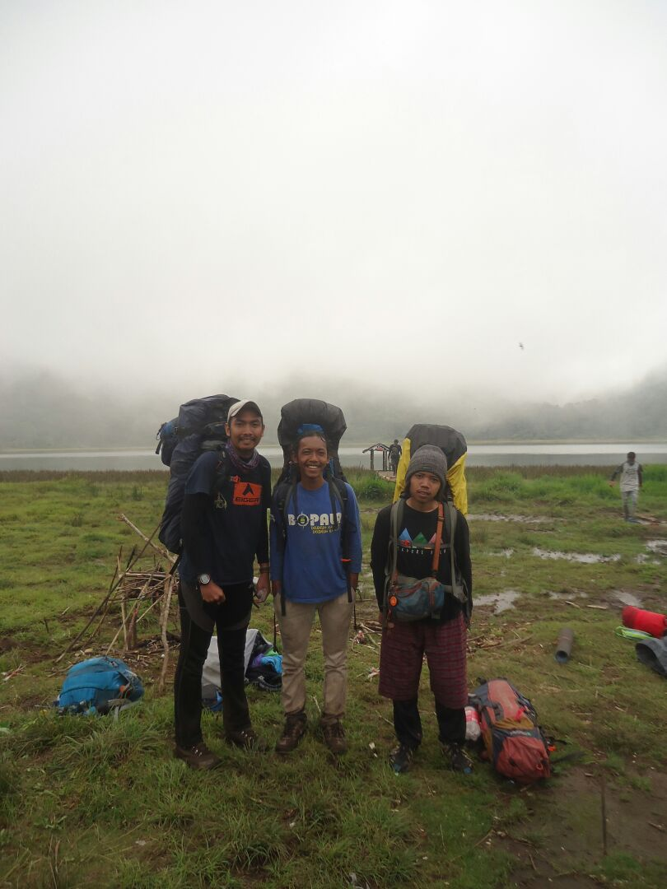

Di sini, saya mau menceritakan catatan perjalanan saya ke Gunung Argopuro, berbagi pengalaman yang mungkin berguna sebagai info untuk kalian yang ingin kesana.  
Perjalanan ini atas dasar inisiatif saya sendiri ingin membayar ‘hutang’ pribadi saya yang gagal ke Puncak Argopuro di waktu sebelumnya. Maka dengan penggerakan saya sendiri, saya awali dengan membuat desain pamflet untuk dipublikasi ke sosial media, untuk mengajak teman-teman yang lain. Awalnya saya merencanakan perjalanan bulan Agustus yang di-*setting* tepat tanggal 17 Agustus 2016 sampai di Puncak, jadi sekaligus perayaan [HUT RI](/blog/logo-hut-ri-ke-75/).

Awalnya, banyak yang berniat ikut. Mungkin ada sekitar 6-8 orang yang menghubungi saya mengutarakan niatnya untuk ikut serta. Tapi menjelang hari H, banyak pula yang membatalkan niatnya karena terbentur kepentingan lain. Saat itu yang siap berangkat hanya dua orang. Yaitu Anugrah Rizki dan saya sendiri, Erland.

Setelah diskusi ringan berdua, kami sepakat untuk mengundur tanggal keberangkatan. Yang tadinya Agustus menjadi akhir September. Tepatnya 25-30 September 2016. Sebenarnya saya sendiri yang mengusulkan tanggal keberangkatan ini. Bukan sembarang tanggal, itu karena sengaja saya setting agar saya bisa ‘merayakan’ hari ulang tahun saya di Gunung Argopuro. Hehe.

Kami sepakat untuk tetap berangkat meskipun hanya berdua. Didasari niat, semuanya terlaksana.

Tapi syukurlah ada seorang yang mau *join* berkat *the power of sosmed*. Namanya Aldi Astrayudha, orang Samarinda yang kuliah di Jogja, tinggal di Jogja. Kami janjian ketemu di Probolinggo kemudian ke *Basecamp* Baderan bersama-sama. Jadilah akhirnya kami bertiga menjelajah Argopuro.

Singkat cerita, tanggal 25 September 2016 adalah jadwal kami berangkat. Tujuan pertama adalah ke Surabaya menumpang kereta api Pasundan keberangkatan dari Stasiun Kiaracondong, Bandung. Jam 05.20 WIB. Sesuai rencana, si Anugrah Rizki (_untuk selanjutnya dipanggil Botak_) ngejemput saya menggunakan motor ke Basecamp Bopala di Cibaduyut, mengantar saya ke stasiun Kiaracondong lalu dia balik lagi ke rumah untuk kemudian diantar kakaknya.

Di sinilah ada kejadian konyol.

Setelah saya diantar sampai stasiun dan dia balik lagi, dia ketinggalan kereta Pasundan yang akan kami tumpangi. Iya, ketinggalan kereta. Bikin rencana berantakan.

Saat itu jam 05.00, dua puluh menit sebelum keberangkatan saya masih santai di halaman stasiun nunggu Botak datang, ditemani kopi dan gorengan. Lumayan sarapan.

Jam 05.10, sepuluh menit sebelum keberangkatan, si Botak belum juga datang. Saya mulai gusar. Udah mepet gini kok belum juga datang.

Saya rogoh saku mengambil iPhone XS saya (_biar gaya_) untuk nelpon si Botak. Tiga kali panggilan gak diangkat, bikin tambah gusar.

Jam 05.13, tujuh menit sebelum keberangkatan, saya *chat* si Botak dengan isi *chat* menumpahkan kekesalan. So pasti, gak dibales.

Telpon lagi, lima kali panggilan gak diangkat juga. Udah gundah gulana sampai saya merasa ini secanggih-canggihnya, semahal-mahalnya *handphone*, gak berguna kalau dipakai nelpon tapi gak diangkat mah. :(

_Ini anak jangan-jangan malah tidur lagi..._

Jam 05.15, pengumuman dari penyiar stasiun udah berkali-kali bilang kalau kereta Pasundan persiapan untuk berangkat.

Saya belum nyerah, belum *boarding*, masing nunggu di *lobby* bolak-balik sambil nyoba nelpon lagi dan lagi. Dan masih gak diangkat juga.

Jam 05.18, saya gregetan sendiri di *lobby* dengan ditatap orang lain memendang aneh, mungkin pada mengira saya nahan pipis.

Jam 05:19, gak tahan lagi, akhirnya saya menuju pintu masuk lalu *boarding*, berjalan ke peron sambil sesekali nengok ke belakang. Kali aja si Botak datang berlari-larian sambil make calana. Apadaya, itu cuma khayalan, Botak tak juga menunjukan batang hidungnya. Putus asa, akhirnya saya yang lari-larian ngejar kereta yang beberapa detik lagi akan berangkat.

Dan tepat banget, sampai di kereta langsung berangkat.  
Saya ninggalin si Botak.  
Saya naik kereta dengan rasa gundah gulana.  
Si Botak ini entahlah di mana..

Beberapa menit setelah naik dan kereta telah berangkat dari stasiun, ada *chat* masuk dari Botak yang isinya kurang lebih menjelaskan kalau dia telat gara-gara motornya keabisan bensin. Bodo amat saya dengan alasannya. Pusing.

Akhirnya kami sepakat ketemu di Probolinggo. Jadi si Botak nyusul naik KA eksekutif Lodaya ke Jogja, ketemuan sama Aldi di Jogja lalu Botak dan Aldi bareng ke Probolinggo.

Bener-bener bikin pusing.

Yasudah, saya nyoba menikmati perjalanan panjang Bandung-Surabaya dengan kereta Pasundan, perjalanan kurang lebih sekitar 16 jam perjalanan. Sampai di Stasiun Surabaya Gubeng 25 September malam, jam 22.00, saya bermalam di stasiun untuk menunggu kereta transit KA Probowangi relasi Surabaya-Probolinggo keberangkatan 26 September jam 04.25

Bosan juga nunggunya lama, akhirnya saya jalan-jalan sendirian keliling kota Surabaya malam itu. Daripada nunggu di stasiun kan.. Berkeliling sampai ke ikon Surabaya, patung buaya dan hiu, lumayan jauh berjalan kaki, sambil bawa keril pula. Tapi gapapalah, hitung-hitung pemanasan sebelum nanjak Argopuro.

26 September, dini hari jam 03.00 saya balik lagi ke stasiun Surabaya Gubeng, nunggu di halaman stasiun, ngopi seorang diri. Dan di situ saya baru nyadar kalau stasiun Surabaya Gubeng ada wifi jaringan super ngebut. Tau gitu mah tadi mending duduk di stasiun sih, nonton youtube, nonton *smack down*, *upgrade* aplikasi di Playstore sampe puas.

*Eh, iPhone kok pakai Playstore?* He-he-he ketauan deh*.* :(

Jam 04.15, saya *boarding* masuk ke peron, duduk di ruang tunggu sambil memperhatikan KA Probowangi langsir menyiapkan perjalanan. Rasa ngantuk mulai menyerang. Ketika mata tertutup sempurna ingin tidur, tiba-tiba pengeras suara di peron stasiun berbunyi nyaring menyiarkan kalau KA Probowangi persiapan untuk berangkat. Saya beranjak berdiri, berjalan gontai menuju kereta, ke tempat duduk sesuai nomer di tiket lalu jatuh tertidur pulas.

Jam 06.45, kereta tiba di Stasiun Probolinggo. Saya turun, keluar stasiun, nyari warung kopi. Lalu menghubungi si Botak, ngabarin kalau saya udah sampai. *FYI*, si Botak dan si Aldi udah sampe Probolinggo sejak jam 02.00 naik bus dari Jogja. Konyol, si Botak yang ketinggalan kereta tapi si Botak yang sampe Probolinggo duluan.

Dan akhirnya, bertemulah kami bertiga di Terminal Probolinggo. Lengkap sudah tim kami untuk menuju Argopuro. Dari terminal Probolinggo kami naik Bus AKAS untuk menuju Besuki. Ongkosnya murah, cuma 12 ribu perorang. Perjalanan sekitar 2-3 jam. Turun di Alun-alun Besuki. Kami istirahat sejenak di Alun-alun. Mengisi waktu dengan makan siang dan belanja logistik pendakian.  
Setelah semuanya siap, kami menumpang ojek untuk menuju desa Baderan. Dulu mah masih ada angkot untuk menuju Baderan, tapi sekarang udah gak ada, entah ke mana, cuma ada ojek. Ongkosnya 30 ribu perorang. Waktu tempuh Besuki-Baderan sekitar 30-45 menit perjalanan.

Sampai di desa Baderan, siang jam 12.00. Kami langsung ke *basecamp* untuk mengurus perizinan. Sialnya, kami tidak diizinankan naik hari itu karena waktu udah terlalu siang. Saya coba nego petugasnya, memberi usul andai kami gak bisa tiba di Pos Mata Air 1 sebelum gelap maka kami akan nyari tempat *camp* darurat sebelum Pos Mata Air 1, tetap gak bisa, ditolak, kecuali kami naik ojek ke Pos Mata Air 1. Saya nolak karena ongkos ojek ke Pos Mata Air 1 terlalu mahal. Normalnya, pendaki hanya naik ojek ke Makadam (Pintu Hutan).  
Karena buntu, yasudah kami putuskan untuk memulai pendakian besok pagi dan hari itu kami bermalam di *basecamp* Baderan.

Target hari pertama gagal sudah.

Besoknya, pagi tanggal 27 September 2016 selepas subuh kami sudah siap segala-galanya untuk menjelajah panjangnya trek pendakian Argopuro. Kami naik ojek ke Pintu Hutan. Dari *basecamp* Baderan sekitar 45 menit perjalanan. Kalau mau jalan kaki dari *Basecamp* Baderan ke Pintu Hutan bisa 3-4 jam, jadi rekomen naik ojek aja untuk menghemat tenaga. Argopuro itu gunung dengan trek terpanjang di pulau Jawa, jangan so kuat.

Jam 06.00 kami tiba di Pintu Hutan. Di ujung timur jawa, jam segitu langit udah terang, matahari udah panas. Kami memulai perjalanan dengan berdoa, memohon perlindungan kepada Tuhan Yang Maha Kuasa agar diberikan kelancaran perjalanan panjang selama 5 hari di Gunung Argopuro. Selesai berdoa, kami berjalan santai, menyusuri trek yang diawali dengan menanjak bukit, kiri-kanan *view* ladang warga. Langit yang cerah menyempurnakan pemandangan memanja mata di ujung timur pulau jawa.

Setengah jam kemudian, kami mulai memasuki kawasan hutan. Treknya sungguh menyebalkan di sini, yaitu jalan sempit yang lebarnya cuma 1-2 meter ditambah tanah bekas roda motor cross. Bikin susah melangkah, sialnya trek ini panjang. 4 jam kemudian baru habis, dilanjut trek tanah normal khas hutan.

Jam 10.00 kami masih berjuang menuju Pos Mata Air 1 sebagai tempat istirahat sejenak. Di estimasi saya targetkan jam 10 udah sampe, tapi ini belum sampe juga. Ampun.

Satu jam kemudian, jam 11.00 masih belum tiba di Pos Mata Air 1. Mulai ngos-ngosan, mandi keringat. Beberapa kali nyoba ganti *setting*\-an *back system* keril saya nyari posisi yang pas sesuai beban yang *EDAN ELING* beratnya. Asli, ini beban keril hampir seberat beban hidup. Peralatan pribadi, tenda, *cooking set*, dan logistik yang terlalu banyak. Maklum buat bekal perjalanan panjang. Saat itu saya bawa keril <a href="http://shop.consina-adventure.com/backpack/over-60-ltr/alpinist-70-5">Consina series Alpinist</a> yang sejatinya bervolume 75L, tapi karena isi yang terlalu *over* jadi *up size* ke 100L. Tingginya Sejengkal dari ujung rambut. Ribet pokoknya mah. :(

_Finally_, jam 12.00 kami tiba di Pos Mata Air 1. Meleset dua jam dari estimasi. Gara-gara trek bedebah tadi yang bekas motor cross bikin nyusahin. Kami beristirahat di Pos ini. Isi air, makan siang, salat zuhur, ngopi dan bersantai. Sampe jam 13.00 kami di pos Mata Air 1, mencoba memulihkan tenaga.  
Oh iya, posisi sumber air di Pos ini ada di sebelah kiri dari arah Baderan. Ada jalan menurun menyusuri pepohanan, ikutin aja tanda tali rafia yang diikat di batang pohon. Sekitar 500 meter. Sumber airnya itu sungai kecil, airnya jernih dingin menyegarkan, cocok buat nyeduh nutrisari rasa jeruk.

Di Pos Mata Air 1, kami menghabiskan waktu satu jam untuk beristirahat. Targetnya bisa sampe Cikasur sebelum langit gelap. *FYI*, di gunung Argopuro ini dilarang melakukan pendakian pada malam hari. Selain karena berbahaya, trek yang selalu tak terduga,treknya kadang membingungkan, butuh kepekaan untuk orientasi jalur, hewan liar rutin berkeliaran, juga karena kepercayaan warga lokal, melarang siapapun mendaki saat langit gelap. Saya mah bukan ngajarin *musyrik*, cuma ngajak mencoba menghormati adat setempat, karena kita di sini tamu.

Jam 13.00 kami memulai kembali melanjutkan perjalanan. Trek selepas Pos Mata Air 1 kembali dihiasi tanah bekas roda motor cross, untungnya kali ini rada luas, masih bisa sedikit leluasa melangkah. Tapi trek Argopuro emang luar biasa gregetnya. Jam 16.00 kami baru tiba di Pos Mata Air 2. Melihat waktu yang semakin mepet kami tak berlama-lama istirahat di sini. Cukup beberapa menit kemudian melanjutkan perjalanan lagi. Saya mulai pesimis bisa sampe Cikasur sebelum langit gelap. Bener-bener ripuh, dibuat stress. Dari pagi jalan hingga sore ini masih belum juga tiba di tujuan. Tenaga mulai habis.

Jam 17.00 kami tiba di Sabana Kecil, Namanya aja Sabana Kecil, nyatanya sabana ini luas dan panjang. Dari sini, sebelum Cikasur terlebih dahulu melewati Sabana Besar. Jarak dari Sabana Kecil ke Sabana Besar juga lumayan jauh.  
Waktu menunjuk 17.30, di sini saya mulai benar-benar putus asa mengejar target Cikasur. Lihatlah, langit perlahan mulai gelap, kami bahkan belum juga sampai di Sabana Besar. Akhirnya saya memutuskan untuk mencari tempat *camp* darurat karena sudah tak memungkinkan lagi meneruskan perjalanan, keputusan itu disetujui Botak dan Aldi yang tampaknya juga sudah nge-*drop* dari tadi. Stress melibas jalur pendakian yang terasa tak berujung.

Sepuluh menit kemudian, kami menemukan tempat *camp*. Gak luas, cuma cukup untuk satu tenda, dan rada menurun tanahnya. Berhubung langit sudah sempurna gelap, kami tanpa mikir panjang langsung lepas keril, keluarkan isi, pasang tenda.

Saya pribadi langsung berinisiatif memasak untuk makan malam sementara Botak dan Aldi memasang tenda. Tujuan saya di situ adalah makan kemudian tidur secepatnya. Tenaga bener-bener habis, perlu istirahat panjang supaya besok pagi pulih lagi.

Gak ada yang bisa diceritakan dari malam pertama nge-*camp* selain banyak nyamuk dan tidur kurang nyaman karena tanah gak datar. Suhu gak terlalu dingin, cuaca bersahabat, langit cerah penuh bintang. Kami berusaha istirahat dan berharap besok pagi tenaga kembali pulih.  
Target kembali gagal.

Rabu pagi, 28 September 2016. Jam 05.00 kami sudah terbangun. Walau rasa ngantuk masih menyelimuti, kami berusaha bergegas, gak boleh bermalas-malasan karena ini mendaki Argopuro, bukan kemping ceria.  
Saya menyiapkan sarapan sementara Botak dan Aldi mengurus hal lainnya.  
Pagi itu saya membuat nasi goreng spesial. Salah satu menu favorit. Nasi goreng dengan telur, sosis, bakso, ditambah sedikit sayuran, ditabur abon sapi. Sungguh kenikmatan yang hakiki.  
Setelah sarapan kami bebenah, *packing* dan bersiap melanjutkan perjalanan.

Setelah target ke Cikasur hari pertama gagal, Target di hari kedua masih Rawa Embik, dari sini, masih di sekitar kawasan Sabana Kecil. Saya pribadi ragu, bahkan saya yakin target Rawa Embik akan gagal juga mengikuti Cikasur. Jaraknya jauh. Sebenarnya saya mau bilang ke Botak dan Aldi tapi takut mereka nge-_down_, akhirnya saya diem-diem aja dulu sementara, semata biar mereka semangat.

Dari tempat *camp* tadi, kami memulai perjalanan jam 07.00, pastinya setelah kembali bedoa terlebih dahulu.  
Kurang lebih lima menit berjalan dari tempat *camp* tadi, kami menjumpai sebuah tanah cukup lapang, luas, mungkin bisa buat 5 tenda lebih, tanahnya datar pula. Kesel di sini. Tau gini mah semalem *camp* di sini aja, kan..  
Semua karena rasa capek, stress, keburu putus asa. Tapi biarlah, setidaknya ada pelajaran yang bisa saya ambil dari sini.

Treknya keluar-masuk hutan, di sini mulai banyak tanaman yang biasa disebut *jancukan*, daunnya berwarna hijau tua, berduri, yang kalau tersentuh kulit sedikit saja bisa langsung ngerasain perih berjam-jam. Kami udah mengantisipasi dengan memakai baju lengan panjang, dan sarung tangan. Gak main-main ini mah asli, tanaman itu berbahaya.

Jam 08:30, kami tiba di Sabana Besar. Sabana luas, panjang, bikin mandi keringat. Rada mirip sama Gunung Rinjani. Antisipasinya di sini adalah memakai topi rimba untuk menghalau panas terik matahari yang bahkan masih pagipun sudah terasa panas.

Kurang lebih jam 10.00, kami akhirnya tiba di Cikasur. Tempat yang seharusnya menjadi tempat camp kami semalam. Di Cikasur kami istirahat lumayan lama. Cikasur adalah sebuah Sabana luas, terdapat sungai di sini yang bisa dipakai mandi. Airnya dingin menyegarkan, jernih pula. Cuci muka make airnya aja berasa minum *Sprite*.  
Enjoy Cikasur!

Saya mencoba berkeliling Cikasur, menikmati panaroma alamnya. Saya menjumpai Burung Merak dari kejauhan, sayapnya indah. Pas mau ambil kamera, si Merak kabur masuk ke hutan. Kemudian saya mendekati *Runway* Pesawat. Asli ini tempat landasan pesawat, bekas peninggalan Belanda dulu. Saya jadi kepikiran, enak kali ya ke Argopuro naik pesawat, mendarat di Cikasur. Apalagi naik maskapai Emirates Airlines kelas bisnis. *Beuh*...

Setelah puas menikmati Cikasur, kami kembali melanjutkan perjalanan. Dari arah sungai, naik ke atas, kemudian ada persimpangan. Untuk menuju Cisentor dari sini adalah belok ke kanan. Ada petunjuknya kok jadi gak perlu terlalu khawatir kesasar. Asal peka aja memperhatikan tanda-tanda.

Trek masih Sabana kemudian masuk hutan, kemudian keluar hutan menjumpai sabana lagi, dan masuk hutan lagi. Begitu aja terus. Argopuro ini emang banyak sabananya.

Beberapa jam kemudian, kurang lebih sekitar 14.30 kami tiba di Cisentor. Ditandai adanya aliran sungai dan shelter. Ada tempat camp juga lumayan luas. Di sini mengharuskan kita menyebrangi sungainya. Cuma sekitar 2-3 meter sih lebar sungainya mah. Tapi ada aja kejadian konyol mah. Waktu menyebrang, si Aldi jatuh tercebur, basah kuyub bajunya, juga kerilnya. Sebelum saya menolongnya, saya sempetkan ngetawain dulu. Begitulah seharusnya sebagai seorang teman. Iya gak? Iya atuh.

Kami beristirahat di shelter Cisentor. Dan di sinilah saya mengutarakan rencana saya ke Botak dan Aldi. Saya bilang udah jam segini mah gak mungkin lagi ngejar target Rawa Embik, keburu gelap. Dan trek dari Cisentor ke Rawa Embik itu *full* hutan yang nggak ada tempat buat *camp* darurat kayak kemaren. Saya mengeluarkan kertas, tulisan rencana saya. Yang seharusnya kami *summit* dari Rawa Embik, bawa keril ke puncak kemudian lewat jalur alternatif turun ke Cemara Lima diubah menjadi camp di Cisentor ini, *summit* ke puncak tanpa beban, meninggalkan peralatan di  sini dan kembali lagi ke sini nanti seturun dari puncak tanpa lewat jalur alternatif. Saya berusaha menjelaskan serinci mungkin. Yang akhirnya disetujui oleh mereka berdua. Kami bermalam di Rawa Embik. Bedanya dari kemarin, di sini kami sedikit santai saat mendirikan tenda, langit masih terang, waktu luang banyak sebelum istirahat selepas isya nanti malam.

Setelah tenda didirikan, peralatan dirapihkan, saya mulai memasak. Menu kali ini nasi, sayur sop bakso, telur dadar, teri, tempe, sambel, kerupuk. Makan di Gunung berasa makan di warteg. Ini juga salah satu menu favorit saya kalo bawa logistik ke gunung.

Langit perlahan mulai gelap, tak terasa kami bersantai di Cisentor, akhirnya masuk waktunya untuk beristirahat sebelum memulai *summit* besok pagi.  
Kami tertidur dengan nyaman disini. Syukurnya, cuaca bersahabat, langit cerah tanpa awan.

29 September 2016, Selepas subuh kami sudah bebenah, beres-beres tenda sebelum ditinggal *summit*. Sambil sarapan roti dan susu. Biar sehat dan kuat.  
Kami bawa satu *daypack* isi air dan cemilan untuk perbekalan *summit*. Tepat jam 06.00 kami memulai perjalanan ke Puncak.

Dari Cisentor, urutannya adalah Cisentor - Rawa Embik – Persimpangan – Puncak Rengganis – Persimpangan – Puncak Argopuro. Nah, umumnya pendaki nge-camp di Persimpangan atau Rawa Embik.

Seperti yang saya bilang kemarinnya, trek dari Cisentor ke Rawa Embik itu *full* hutan, gak ada tempat terbuka, tanah lapang untuk sekedar istirahat pun hampir gak ada, walau lebih banyak yang landai daripada menanjak. Lumayan bikin ngos-ngosan. Panjangnya itu loh, mas. Trek landai kebanyakan saat di sabana. Tapi bukan sabana biasa, rumputnya tinggi-tinggi, beda dengan sabana di Cikasur yang rerumputannya pendek, bisa buat tiduran layaknya kasur empuk.

Dari Cisentor ke Rawa Embik memakan waktu hampir dua jam. Kami istirahat sebentar di Rawa Embik, sekedar minum membuang rasa dahaga. Di Rawa Embik ada sumber air, berbentuk parit kecil. Airnya jarang-jarang, tapi jernih.

Setelah dirasa cukup istirahat, kami melanjutkan perjalanan ke Persimpangan Puncak. Dari Rawa Embik ke Persimpangan lumayan singkat, kurang lebih setengah jam. Dari Persimpangan kami langsung terus berjalan tanpa istirahat lagi, dari Persimpangan kami ke Puncak Rengganis terlebih dahulu. Treknya mirip hutan pinus, *full* nanjak terus. Memakan waktu kurang lebih 20 menit dan tibalah kami di Puncak Rengganis.

Puncak Rengganis tampak indah, tampak sarat akan sejarah. Ada reruntuhan istana Dewi Rengganis. Memang terlihat gersang, bebatuan dimana-mana. Dan terkadang tercium bau belerang. Mirip-mirip Gunung Papandayan gitu. Di sini, kami menghabiskan waktu sekitar 20 menit. Biasalah ngemil, minum dan berfoto-foto. Setelah itu turun kembali ke Persimpangan.

Di Persimpangan kami langsung melanjutkan ke Puncak Argopuro. Sekedar info, dari Persimpangan ini kalau mau ke Puncak Rengganis ke sebelah kiri, dan Argopuro ke kanan. Ada papan petunjuk kok.  
Trek ke Puncak Argopuro lebih berat dari ke Rengganis, lebih panjang, lebih nanjak, lebih terjal. Dari persimpangan ke Puncak Argopuro butuh waktu sekitar 30 menit.

Kurang lebih sekitar jam 10 kami tiba di Puncak Argopuro, kami telah tiba di tujuan utama pendakian ini. Menghabiskan waktu sekitar 20 menit di Puncak Argopuro kemudian kami langsung bergegas melanjutkan perjalanan ke tujuan akhir perjalanan kami, yaitu turun dan pulang kembali dengan selamat.

Perjalanan turun kembali ke Cisentor lebih banyak diam, fokus turun, hampir jalan terus gak pernah berhenti. Sejujurnya saya ingin cepet tiba di Cisentor. Udah keburu siang.  
Dan akhirnya, sekitar jam 12.00 kami tiba kembali di Cisentor.  
Posisi kami dikejar waktu gara-gara dua target kemarin gagal. Sekarang kami harus bergegas melanjutkan perjalanan ke Danau Taman Hidup untuk nge-camp sekali lagi di sana sebelum turun ke Bremi. Sementara Aldi dan Botak beres-beres tenda, dan packing, saya masak untuk makan siang. Kami butuh tenaga untuk perjalanan panjang.  
Sekitar jam 13.00 semua selesai, kami melanjutkan perjalanan. Saat itu hujan turun. Hujan pertama sejak kami di Argopuro.

_FYI_, dari Cisentor menuju Taman Hidup jalurnya ada di belakang shelter. Jadi, Cisentor itu bisa dibilang persimpangan. Ke kanan adalah trek ke Puncak, ke kiri adalah trek ke Taman Hidup. Cisentor ini pertemuan antara jalur Baderan dan Bremi.

Trek dari Cisentor ke Taman Hidup itu panjangnya *Astagfirullah*... Dibikin stress. Emang banyak yang landai, tapi sangat panjang, dan treknya membingungkan, terkadang hampir gak *keciri* kalau itu adalah jalur pendakian, tertutup popohonan dan rerumputan liar. Ada beberapa persimpangan yang membingungkan. Harus peka melihat tanda-tanda dan keadaan sekitar, wajib banget pandai orientasi jalur, atau bisa nyasar ditelan hutan.  
Dari Cisentor ke Taman Hidup, ada dua tempat untuk singgah sebentar, seperti pos tapi bukan pos, namanya Cemara Lima dan Hutan Lumut.

Kami tiba di Cemara Lima sekitar jam 16.00. Di sini saya mulai was-was, tampaknya target kembali gagal. Tersisa dua jam untuk ke Taman Hidup sebelum langit gelap dan waktu segitu gak akan cukup.  
Cuaca kurang bersahabat saat itu, kabut pekat turun ke bawah, bikin gelap, apalagi saat berjalan masuk ke hutan. Asli ini trek dari Cisentor ke Taman Hidup syuraaam banget. Sekilas ini kayak bukan trek pendakian. Saat masuk hutan, banyak semak belukar. Saat keluar hutan, rerumputan liar tinggi-tinggi menutupi jalur. *Ampun*... Ini kalau di gunung lain mah trek kaya begini udah masuk katagori jalur yang aneh, jalur yang nyasar.

Dan kekhawatiran saya benar terjadi. Saat itu jam 17.30 langit udah mulai gelap, kami bahkan belum tiba di Hutan Lumut. Gimana bisa sampe Taman Hidup sebelum malam? Akhirnya kembali saya putuskan untuk *camp* darurat. Sedih rasanya selalu aja *camp* darurat, padahal saya udah berusaha semaksimal mungkin memperhitungkan estimasi perjalanan ke Argopuro ini.  
Kami nge-*camp* di tengah trek yang kebetulan datar, bisa untuk mendirikan tenda, lumayan terbuka, gak tertutup pepohonan tinggi. Karena saat itu cuaca buruk, berkabut dan hujan. Kami bergegas nge-_camp_, masak dan kembali seperti biasanya langsung tidur karena kelelahan.  
Lagi-lagi target kembali gagal.

30 September 2016, seperti biasa kami bangun pagi-pagi, kami terbiasa bangun pagi sebelum subuh. Gak ada waktu bermalas-malasan, bener-bener selalu dikejar waktu nanjak Argopuro ini.  
Jam 06.00 kami telah selesai *packing*, langsung melanjutkan perjalanan turun menuju Bremi. Dengan rencana nanti mampir sebentar di Danau Taman Hidup untuk sekedar berfoto-foto.

Kembali kami dihadapkan trek yang aneh, membingungkan. Walau dalam hati saya khawatir nyasar, tapi saya selalu berusaha tenang memimpin perjalanan di depan, Botak dan Aldi menuturkan di belakang. Berusaha setenang mungkin saya orientasi jalur, memperhatikan keadaan dan tanda-tanda, sambil berhati-hati karena banyak tanaman jancukan. Treknya bener-bener panjang, kami baru tiba di Hutan Lumut sekitar jam 09.00, sepagi itu tampak gelap. Yaiyalah... di dalem hutan. Pepohonan tinggi yang batangnya penuh lumut ada dimana-mana, karena itulah dinamai Hutan Lumut. Lumayan banyak yang landai trek di sini. Dan akhirnya, kami tiba di Danau Taman Hidup sekitar jam 10.30 WIB.

Taman Hidup bener-bener panaroma yang indah. *Hidden paradise, more than* Ranu Kumbolo. Danau luas yang membentang tenang. Udara segar khas penggunungan, sejuk. Bikin nyaman. Kami berusaha sepuasnya menikmati Taman Hidup berhubung kemarin target kami untuk nge-*camp* di sini kembali gagal.

Setelah merasa cukup di Taman Hidup, kami bergegas turun ke Bremi. Posisi di sini juga di kejar waktu. Kami harus tiba Bremi sebelum jam 15.00 karena bus AKAS Bremi-Probolinggo cuma ada di jam 08.00 dan 15.00, jadi kalau kami ketinggalan yang jam 15.00 harus menunggu besoknya jam 08.00. Kali ini saya pantang untuk gagal target lagi, berhubung saya dan Botak punya jadwal kereta Pasundan besoknya dari Surabaya, jadi saya *geberrrr* jalannya. Sebenernya jarak Taman Hidup ke Bremi gak terlalu jauh, treknya juga menurun terus. Mungkin efek capek jadi terasa gak habis-habis treknya. Tetep aja dibuat stress mah.

Tapi, *alhamdulillah*.. Target kali ini tercapai. Kami tiba di desa Bremi sekitar 13.30. Masih banyak sisa waktu untuk mandi dan istirahat di basecamp Bremi sambil menunggu bus AKAS.  
Dan sekitar 15.30 tibalah bus tersebut. Iya, bus tersebut rada telat. Kami langsung naik. Berusaha tidur di perjalanan karena lelah melibas trek panjang Argopuro.

Perjalanan Bremi-Probolinggo memakan waktu kurang lebih sekitar 2-3 jam. Kami tiba di kota Probolinggo menjelang Magrib. Tapi, bus tersebut gak sampe terminal, apalagi stasiun. Jadi kudu nyambung lagi.  
Awalnya, saya dan Botak mau ikut Aldi naik bus lagi ke Surabaya karena khawatir gak kekejar jadwal KA Probowangi kalo ke stasiun, tapi bus tersebut malah *ngetem* lama nunggu penumpang, akhirnya saya putuskan untuk turun. Nanya-nanya ke warga naik apa baiknya dari situ ke stasiun.  
Beberapa saat, ada supir angkot yang nawarin carteran ke stasiun. Saya gak mikir panjang langsung nerima lah tawarannya nyoba peruntungan. Semoga KA Probowangi kekejar. *FYI*, jadwalnya 18.33 dan posisi disitu udah 18.00 lewat sekian.  
Saat saya dan Botak udah di dalam angkot, si Aldi nyusul naik ke angkot. Katanya mah angkot ini bisa nganter ke terminal juga. Lah... Jadilah kami bergabung lagi.  
Ternyata jarak ke stasiun gak jauh, cukup 7-10 menitan. Saya dan Botak turun dan Aldi melanjutkan ke terminal untuk kemudian dari terminal Probolinggo sambung bus lagi ke Jogja. Dan pastinya kami perpisahan terlebih dahulu. Jabat erat atas perjalanan barengnya. Sambil bilang “_see you next trip_” kaya orang-orang. Kekinian banget.  
_Finally_, saya dan Botak akhirnya bisa naik KA Probowangi ke Surabaya. Tiba di Surabaya sekitar jam 22.00 dan kami bermalam di Stasiun Surabaya Gubeng untuk transit besoknya naik KA Pasundan ke Bandung.  
Malam di Surabaya, setelah makan malam, kami berusaha tidur walau seadanya. Tidur di *lobby* stasiun. Dan waktu melesat cepat. Saat mata terbuka, sudah pagi, sudah terang.

1 Oktober 2016, waktunya kami Balik Bandung. Jadwal KA Pasundan adalah jam 08.15, dan sampai di Bandung jam 23.20. Dan catatan perjalanan ini selesai sampai di sini.

Dan sebagai pelengkap, saya berikan rincian pengeluaran, kali aja berguna untuk kalian yang mau ke Argopuro, sebagai perkiraan *budget*.

- KA Pasundan (_Bdg-Sby_) **Rp. 94.000**
- KA Probowangi (_Sby-Pbg_) **Rp. 29.000**
- Angkot (_Stasiun-Terminal_) **Rp. 5.000**
- Bus AKAS (_Pbg-Besuki_) **Rp. 12.000**
- Ojek (_Besuki-Baderan_) **Rp. 30.000**
- Restribusi Argopuro **Rp. 110.000**
- Ojek (_Baderan-Makadam_) **Rp. 40.000**
- Bus AKAS (_Bremi-Pbg_) **Rp. 18.000**
- Angkot (_Ke Stasiun_) **Rp. 10.000**
- KA Probowangi (_Pbg-Sby_) **Rp. 29.000**
- KA Pasundan (_Sby-Bdg_) **Rp. 94.000**
- Logistik *Disesuaikan jumlah pendaki*

**Keterangan:**

- Semua biaya di atas dihitung perorang.
- Retribusi Argopuro itu 20.000/hari (_weekday_) dan 25.000/hari (_weekend_) ditambah biaya matrai 10.000.
- Bus AKAS Bremi-Probolinggo cuma ada 2 jadwal keberangkatan perhari. Jam 08.00 dan 15.00 WIB.
- Sebaiknya mendaki Argopuro lewat Baderan dan turun Bremi karena trek lebih landai dari jalur sebaliknya, Bremi-Baderan.
- Persiapkan pakaian tertutup (celana panjang, baju lengan panjang) dan sarung tangan karena hutan di Argopuro terkesan masih rapat.
- Belajarlah orientasi jalur pendakian untuk menghindari tersesat.
- Perhitungkan logistik secara matang untuk bekal 4-5 hari di gunung.
- Jika butuh *ittinerary* atau menejemen perjalanan, silakan [hubungi saya](/kontak/).
