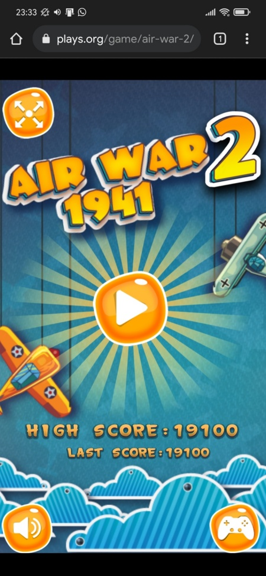
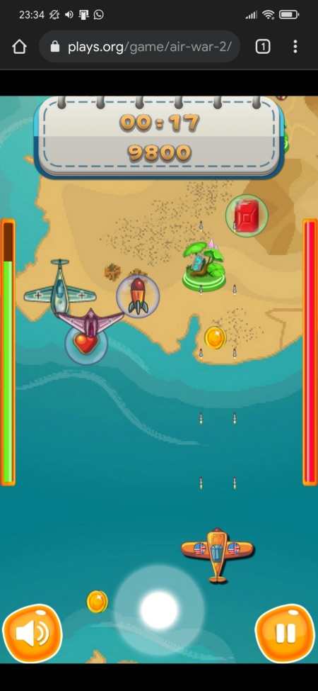
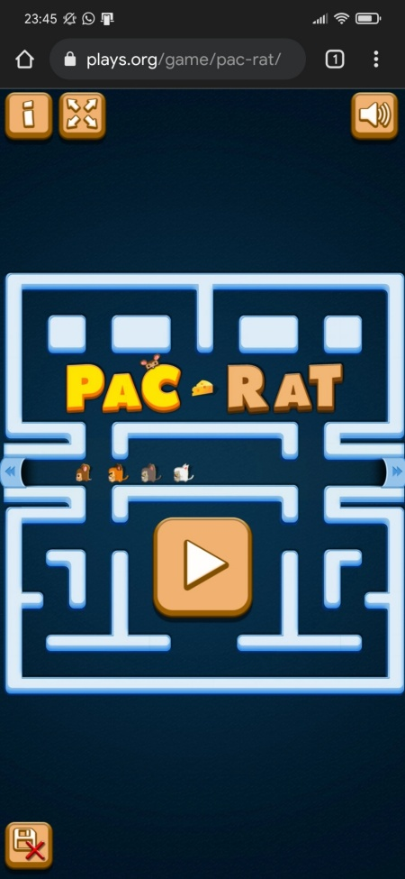
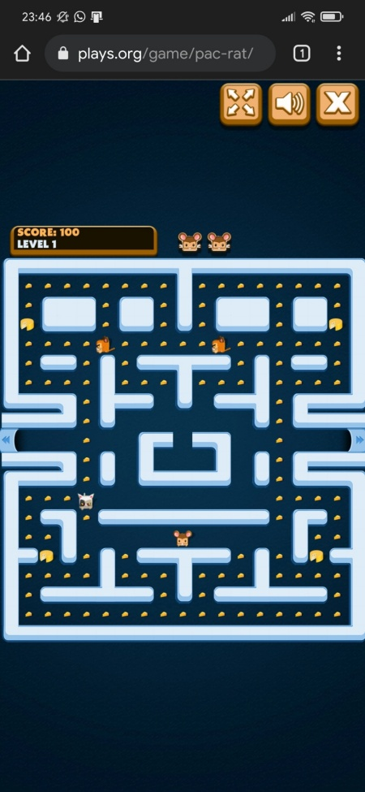
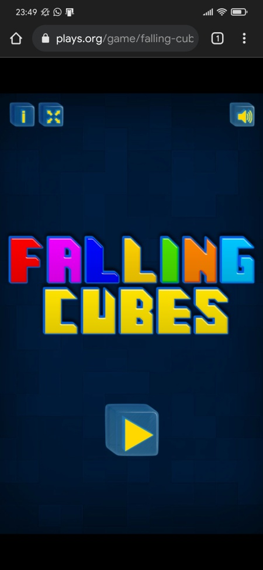
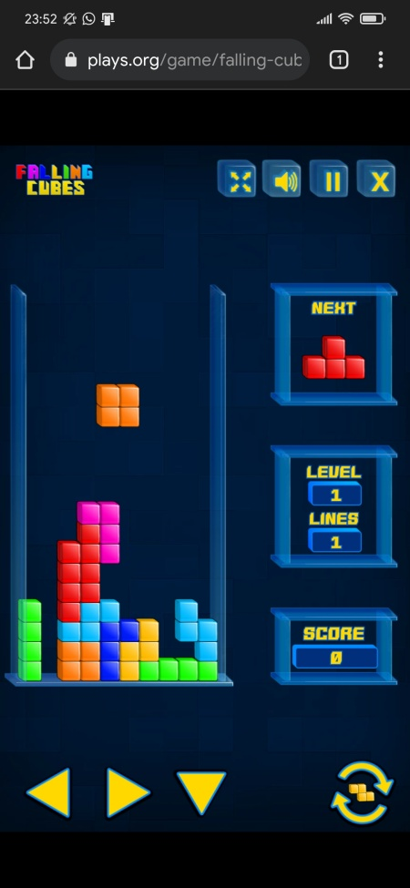
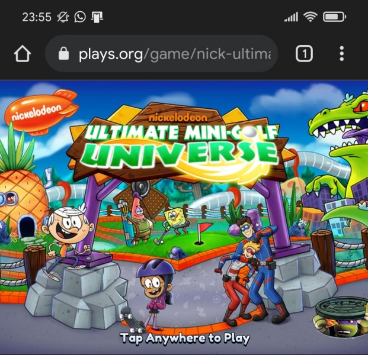
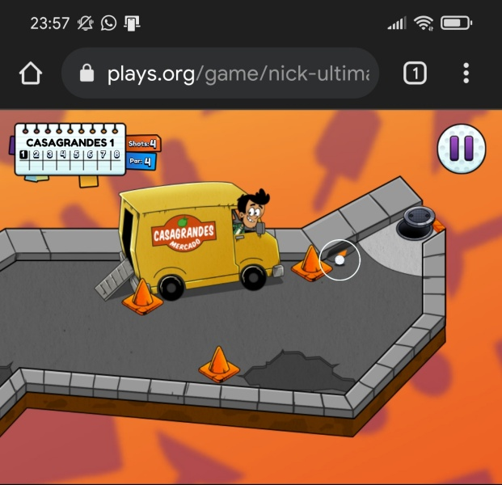
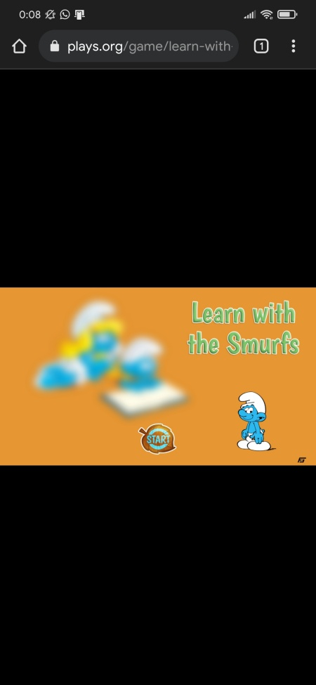
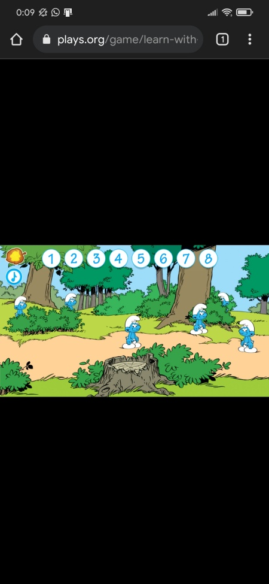

Jika kamu mulai merasa penat, lelah, letih, dan lesu tandanya kamu butuh istirahat atau mungkin liburan. Namun, jika kamu mulai merasa bosan, gabut, dan stres, mungkin itu tandanya kamu harus main game untuk sekedar melepas atau meredakan stres. Kalian bisa bermain game offline, ataupun main game online.

Bermain game masih jadi perdebatan antara para orang tua dan anak-anaknya. Apalagi kalau anaknya udah nggak bisa disebut anak-anak, karena main game masih dianggap sebagai sebuah kegiatan yang membuang-buang waktu. Walaupun di zaman sekarang, game online bukan hanya sekadar main, tapi ada cuan yang mengikuti. Seperti adanya yang [main game dapat bitcoin](/blog/cuma-main-game-bisa-menghasilkan-bitcoin-btc-usd/), atau main game sebagai streamer, bahkan jadi atlet cabor e-sport. Atlet, lho! Kalo dulu atlet itu ngangkat raket, sekarang raketnya digeser, karena raketnya berubah bentuk jadi mouse.

Memang tidak semua berhasil menjadi atlet, streamer, atau influencer dengan endorse yang berjibun. Ada yang memang berniat menuju ke sana, tapi ada juga yang hanya berniat main game online untuk senang-senang saja, sekadar melepaskan stres gitu. Inipun masih jadi perdebatan, karena kalau ada orang yang bilang main game untuk melepaskan stres, maka dianggapnya cuma alasan aja, sisanya dianggap males aja. Namun, ternyata meredakan stres dengan bermain game itu memang ada lho! Bahkan ada penelitiannya.

## Cara Efektif Meredakan Stres Dengan Main Game

Sebuah penelitian yang dilakukan oleh Mark D. Griffiths dan Alex Meredith dalam _Journal Contempt Psychother Vol.39 “Video Game Addiction and it’s Treatment”_ mengungkapkan ada manfaat yang didapat saat melakukan aktivitas bermain game, yaitu mendapatkan sesuatu dalam bidang pendidikan, sosial, serta terapi.

University College London dan The University of Bath membuat sebuah penelitian yang menyebutkan bahwa bermain game jauh lebih efektif untuk relaksasi ketimbang meditasi atau semadi. Dan di Surabaya, penelitian yang dilakukan kepada 20 mahasiswa menyebutkan 12 mahasiswa mengaku main game memberikan manfaat dalam menghilangkan stress. 3 orang mahasiswa mengaku mendapatkan teman baru, dan 2 orang mengaku mendapatkan pengalaman dan adrenalin dalam diri.

Game online yang beredar sekarang menjanjikan pengalaman yang seru karena dibekali dengan grafis yang memukau. Sehingga menyebabkan adanya adiksi. Namun, mungkin nggak semua ingin main game online petualangan atau strategi. Mungkin pengennya main game yang enteng-enteng aja, atau mungkin mencari game zaman dulu. Main game sambil nostalgia seru juga, kan? Nah, bagi kamu yang sedang mencari game dengan tipe seperti itu, maka tempatnya ada di <a href="https://plays.org">plays.org</a>

## Main Game Online di Plays.org

Plays.org adalah sebuah situs yang menawarkan permainan online yang gratis dan menyenangkan. Permainan di plays.org bisa dimainkan langsung dari browser kamu. Game yang disediakan oleh plays.org ini banyak sekali macamnya. Ada game ketangkasan, logika, fighting, balapan, dan banyak lagi. Game yang tersedia merujuk kepada game Nintendo zaman dulu.

## Kelebihan Bermain Game Online di Plays.org

Kelebihan bermain game online di plays.org ini ada dalam satu kata: kesederhanaan. Kenapa dibilang sederhana? Karena bermain game online di plays.org ini nggak harus membayar untuk upgrade. Game yang sederhana, tapi menyenangkan.

Kelebihan lain adalah nggak perlu download aplikasi apa pun. Nggak perlu register atau membuat akun. Kita tinggal buka browser, ketik plays.org lalu pilih permainan dan main! Mau main apa? Ada banyak lho. Plays.org adalah sebuah situs yang menawarkan permainan online yang gratis dan menyenangkan. Permainan di plays.org bisa dimainkan langsung dari browser kamu. Game yang disediakan oleh plays.org ini banyak sekali macamnya. Ada game ketangkasan, logika, fighting, balapan, dan banyak lagi. Game yang tersedia merujuk kepada game Nintendo zaman dulu. Coba aja cek game-game terbaru di <a href="https://plays.org/games/">https://plays.org/games/</a>

## Rekomendasi Game Online di Plays.org

Seperti yang diceritakan di atas, bermain game online di Plays.org ini mudah, sederhana, gratis, dan bisa nostalgia. Buat kaum milenial atau generasi Z mungkin terasa baru ya permainan-permainan di Plays.org ini. Saya merekomendasikan beberapa permainan game online di Plays.org berikut:

### Air War 2: 1941 WW2 Airplane Dogfighting Game

Air War 2: 1941 ini adalah game perang dunia ke 2 yang sederhana. Kita tinggal memilih pesawat yang kita mau lalu kita tembaki pesawat musuh sambil mengumpulkan bahan bakar dan bom. Cara mainnya juga gampang, kamu tinggal arahkan ke kiri atau ke kanan pakai tombol panah di keyboard, tembak pesawat musuh, sambil ngumpulin power up. Jangan lupa kumpulkan koin dan bom untuk menambah poin, dan kumpulkan tanda hati buat nambah nyawa.

Untuk bermain Air War 2 silakan klik <a href="https://plays.org/air-war-2/">https://plays.org/air-war-2/</a>

### Pac Rat Game Inspired by Pac Man

Pac Rat ini semacam Pac Man, tapi karakter utamanya tikus kecil yang ngejar tiga ekor kucing. Buat bisa ngalahin kucing-kucing itu, tikus kita harus lari ke potongan keju besar, baru deh kita kejar balik itu kucing-kucing! Nah, nanti kalau remah-remah makanan yang ada di game habis, artinya kita menang. Dan ketika remah makanannya habis, udah biarin aja. Itu artinya kita menang, nggak usah pesen delivery online, nanti nggak selesai-selesai permainannya! Hehe.

Untuk bermain Pac Rat silakan klik <a href="https://plays.org/pac-rat/">https://plays.org/pac-rat/</a>

### Falling Cubes Online Tetris Game

Game Tetris! Siapa yang nggak tahu game ini? Iya, kan? Ini game masa kecil banget. Cara mainnya juga sederhana, sebisa mungkin kita menyusun balok-balok yang berjatuhan dari atas dan menghilangkan garis horizontal untuk mendapat poin. Kalo dulu warnanya hitam-putih, sekarang lebih berwarna lagi.

Untuk bermain Faaling Cubes silakan klik <a href="https://plays.org/falling-cubes/">https://plays.org/falling-cubes/</a>

### Nick Ultimate Mini Golf Universe

Nick Ultimate Mini Golf Universe ini adalah sebuah game olahraga bertema golf. Tugas kita adalah memasukkan bola ke dalam lubang, ya sama seperti main golf pada umumnya. Namun, ya nggak akan semudah itu, ada banyak rintangan untuk bisa memasukkan bola dengan tepat ke dalam lubang. Misalnya kolam air, pasir, angin tornado yang bisa bikin posisi kita balik lagi ke awal dan banyak lagi.

Untuk bermain Nick Ultimate Mini Golf Universe silakan klik <a href="https://plays.org/nick-ultimate-mini-golf-universe/">https://plays.org/nick-ultimate-mini-golf-universe/</a>

### Learn With the Smurfs: Letter & Number Learning Game

Selain game ketangkasan, balapan, dan sebagainya. Ada juga game edukasi untuk anak lho. Namanya Learn With the Smurf: Letters and Number Learning Game. Game ini cocok dimainkan oleh anak umur 4-5 tahun. Terutama untuk anak yang baru mengenal huruf dan angka. Sebelum mulai, kita bisa memilih dulu mau pakai mode permainan yang mana. Pilihannya ada huruf, penambahan bilangan, dan berhitung. Permainan sederhana dengan karakter Smurf ini bisa dimainkan sebagai selang-seling dengan belajar dari buku. Jadi akan lebih menyenangkan dan akan menambah suasana baru.

Untuk bermain Learn With the Smurfs silakan klik <a href="https://plays.org/learn-with-the-smurfs/">https://plays.org/learn-with-the-smurfs/</a>

## Penutup

Main game online memang menyenangkan, baik itu dengan tujuan iseng, atau memang ingin jadi profesional gamer. Namun, tetap ada syarat dan ketentuan yang berlaku. Misalkan main game setelah tugas sekolah, tugas kampus, atau tugas kantor selesai dikerjakan. Jangan sampai pas meeting malah main game, bukan naik pangkat tapi malah karir kamu yang game over!

Di tengah pandemi [Covid-19](/covid19/) yang sedang melanda memang kita rawan merasa stres. Apalagi banyak aktivitas yang sulit dilakukan seperti hang out bersama teman atau liburan. Cara meredakan stres dengan bermain game online ini cukup efektif untuk dilakukan sebab kamu nggak perlu ke mana-mana. Bahkan bisa juga kamu lakukan di mana saja dan kapan saja. Misalnya saat istirahat kerja atau makan siang, dan sebelum tidur.

Plays.org bisa menjadi alternatif main game online yang santai dan sederhana. Silakan buka browser kamu, buka plays.org, dan mainkan ribuan game online yang tersedia hanya di plays.org! Nggak akan bosen pokoknya.
