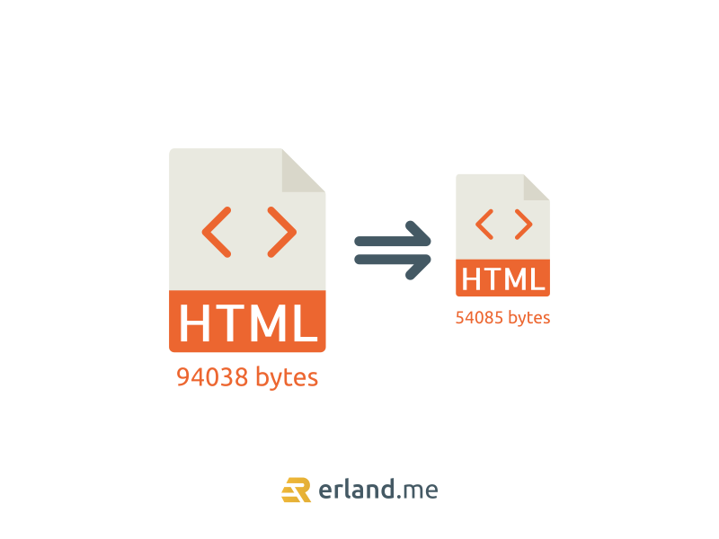

Minify HTML, CSS, JavaScript merupakan salah satu cara mempercepat loading website. Dengan minify kode akan memperkecil output dari file tersebut sehingga akan lebih cepat di-load oleh browser. Penerapannya sangat sederhana, yaitu hanya dengan menghilangkan space, argument, dan komentar yang ada di HTML, CSS, serta JavaScript.

Sebenarnya fitur minify sudah ada di sebagian besar plugin-plugin cache seperti W3 Total Cache, WP Rocket, LiteSpeed Cache, WP Optimize, dll. Namun, akan lebih baik jika kita menerapkan minify HTML tanpa plugin, kan? Penggunaan plugin yang terlalu banyak berpotensi memperberat loading web dan juga menambah penggunaan disk pada server.



Cara minify HTML, CSS, JavaScript tanpa plugin sangat gampang, kalian nggak perlu punya skill khusus untuk menerapkannya. Cukup copy-paste kode di bawah ini ke dalam file `functions.php` pada theme yang sedang digunakan. Akan lebih baik jika menggunakan <a href="https://developer.wordpress.org/themes/advanced-topics/child-themes/">child theme</a> supaya kode ini tidak terhapus ketika upgrade theme.

```
class WP_HTML_Compression
{
	// Settings
	protected $compress_css = true;
	protected $compress_js = true;
	protected $info_comment = true;
	protected $remove_comments = true;

	// Variables
	protected $html;
	public function __construct($html)
	{
		if (!empty($html))
		{
			$this->parseHTML($html);
		}
	}
	public function __toString()
	{
		return $this->html;
	}
	protected function bottomComment($raw, $compressed)
	{
		$raw = strlen($raw);
		$compressed = strlen($compressed);

		$savings = ($raw-$compressed) / $raw * 100;

		$savings = round($savings, 2);

		return '<!-- HTML minified! Size saved '.$savings.'%, from '.$raw.' bytes, now '.$compressed.' bytes -->';
	}
	protected function minifyHTML($html)
	{
		$pattern = '/<(?<script>script).*?<\/script\s*>|<(?<style>style).*?<\/style\s*>|<!(?<comment>--).*?-->|<(?<tag>[\/\w.:-]*)(?:".*?"|\'.*?\'|[^\'">]+)*>|(?<text>((<[^!\/\w.:-])?[^<]*)+)|/si';
		preg_match_all($pattern, $html, $matches, PREG_SET_ORDER);
		$overriding = false;
		$raw_tag = false;
		// Variable reused for output
		$html = '';
		foreach ($matches as $token)
		{
			$tag = (isset($token['tag'])) ? strtolower($token['tag']) : null;

			$content = $token[0];

			if (is_null($tag))
			{
				if ( !empty($token['script']) )
				{
					$strip = $this->compress_js;
				}
				else if ( !empty($token['style']) )
				{
					$strip = $this->compress_css;
				}
				else if ($content == '<!--wp-html-compression no compression-->')
				{
					$overriding = !$overriding;

					// Don't print the comment
					continue;
				}
				else if ($this->remove_comments)
				{
					if (!$overriding && $raw_tag != 'textarea')
					{
						// Remove any HTML comments, except MSIE conditional comments
						$content = preg_replace('/<!--(?!\s*(?:\[if [^\]]+]|<!|>))(?:(?!-->).)*-->/s', '', $content);
					}
				}
			}
			else
			{
				if ($tag == 'pre' || $tag == 'textarea')
				{
					$raw_tag = $tag;
				}
				else if ($tag == '/pre' || $tag == '/textarea')
				{
					$raw_tag = false;
				}
				else
				{
					if ($raw_tag || $overriding)
					{
						$strip = false;
					}
					else
					{
						$strip = true;

						// Remove any empty attributes, except:
						// action, alt, content, src
						$content = preg_replace('/(\s+)(\w++(?<!\baction|\balt|\bcontent|\bsrc)="")/', '$1', $content);

						// Remove any space before the end of self-closing XHTML tags
						// JavaScript excluded
						$content = str_replace(' />', '/>', $content);
					}
				}
			}

			if ($strip)
			{
				$content = $this->removeWhiteSpace($content);
			}

			$html .= $content;
		}

		return $html;
	}

	public function parseHTML($html)
	{
		$this->html = $this->minifyHTML($html);

		if ($this->info_comment)
		{
			$this->html .= "\n" . $this->bottomComment($html, $this->html);
		}
	}

	protected function removeWhiteSpace($str)
	{
		$str = str_replace("\t", ' ', $str);
		$str = str_replace("\n",  '', $str);
		$str = str_replace("\r",  '', $str);

		while (stristr($str, '  '))
		{
			$str = str_replace('  ', ' ', $str);
		}

		return $str;
	}
}

function wp_html_compression_finish($html)
{
	return new WP_HTML_Compression($html);
}

function wp_html_compression_start()
{
	ob_start('wp_html_compression_finish');
}
add_action('get_header', 'wp_html_compression_start');
```

Kalau kalian menggunakan shared hosting yang umumnya memakai cPanel, buka file manager di cPanel lalu pergi ke direktori theme dan edit file `functions.php` lalu paste kode di atas. Setelah selesai, jangan lupa simpan perubahan. Udah, gitu aja. Gampang banget, kan?

Dengan menambahkan kode tersebut, sekarang source code HTML, CSS (inline), dan JavaScript (inline) akan dikompress sehingga ukurannya menjadi lebih kecil dan dapat lebih cepat di-load oleh browser. Untuk memastikan apakah minify code tanpa plugin ini berhasil atau tidak, silakan view source website di browser dengan cara menggunakan shortcut CTRL + U. Jika berhasil, pada bagian paling bawah akan terdapat komentar HTML bertuliskan

```
<!-- HTML minified! Size saved ...%, from ... bytes, now ... bytes -->
```

Nah, itulah cara minify HTML di WordPress tanpa plugin. Caranya gampang banget, cukup copy-paste kode aja ke file `functions.php`. Ini cuma satu dari sekian banyak faktor untuk mempercepat loading website, jadi jangan lupa terapkan cara mempercepat loading web lainnya agar web kalian semakin ngebut dan pengunjung akan nyaman.

**Baca juga:** [Cara Migrasi WordPress dari Shared Hosting ke VPS](/blog/migrasi-shared-hosting-ke-vps/)
