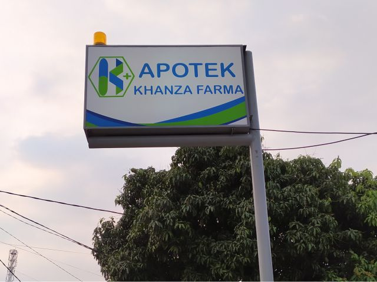
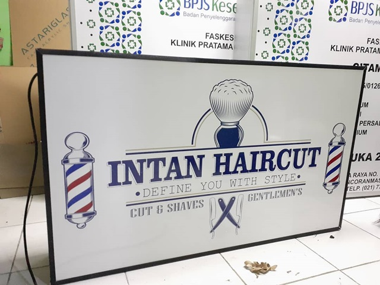
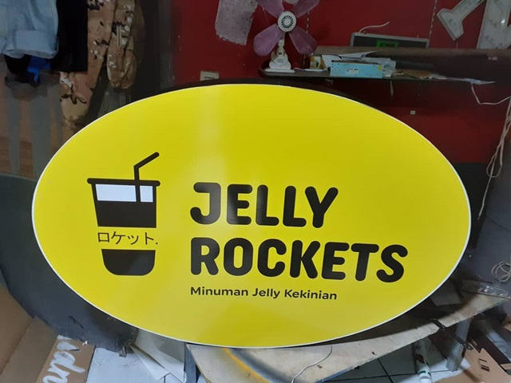
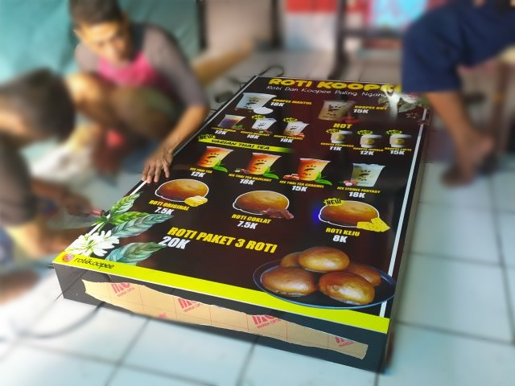

Setelah sebelumnya saya membuat artikel ulasan rekomendasi jasa pembuatan [neon box bogor](/blog/neon-box-bogor/), kali ini saya akan memberikan rekomendasi jasa neon box di kota Depok.

**Neon Box** adalah salah satu jenis reklame yang dapat menyala terang di saat gelap, penerangannya menggunakan lampu neon yang posisinya berada di dalam rangka box. Namun, akhir-akhir ini perkembangan industri reklame semakin pesat sehingga banyak para penyedia jasa pembuatan neonbox berkreasi membuatnya unik seperti mengganti neon dengan LED, membuat bentuk bulat, dan lain-lain.

Jika Anda sedang mencari jasa pembuatan neon box depok, saya merekomendasikan **Cipta Mica Kreasi** yang merupakan ahli pembuatan berbagai bentuk dan jenis neonbox dengan harga yang relatif murah. Selain itu, mereka juga memberikan garansi, pengerjaannya juga cepat dan profesional karena mereka telah berpengalaman di dunia reklame lebih dari lima tahun.

## Jenis Neon Box

Ada beberapa jenis-jenis neonbox yang semakin banyak kreasi yang kreatif dari para penyedia jasa pembuatan neonbox depok. Beberapa di antaranya adalah:

- Neon Box Alumunium
- Neon Box Bulat
- Neon Box Oval
- Neon Box Karakter
- Neon Box Akrilik
- Neon Box Stainless
- Neon Box Custom

Selain itu, masih banyak sekali jenis-jenisnya. Anda bisa memesan berbagai bentuk dan ukuran sesuai dengan keinginan Anda. Jika bisnis atau usaha Anda memiliki logo dengan bentuk yang khas, Anda dapat membuat neonbox dengan bentuk ciri khas brand tersebut sehingga menambah kesan unik untuk menarik perhatian pengunjung, pelanggan atau siapa pun yang melihat reklamenya.

## Harga Neon Box

Harga <a href="https://reklamesia.com/neon-box/depok">neon box Depok</a> yang saya lampirkan di sini hanya harga neonbox bulat saja demi artikel yang ringkas. Jika Anda ingin mengetahui daftar harga pembuatan neonbox yang lebih lengkap, saya sarankan Anda menghubungi langsung _customer service_ Cipta Mica Kreasi melalui chat WhatsApp **0812-8552-8669**

| Diameter | Media Akrilik | Media Backlight | Tiang |
| --- | --- | --- | --- |
| 50 cm | Rp1.700.000 | Rp1.500.000 | 2½ inch |
| 60 cm | Rp1.900.000 | Rp1.700.000 | 2½ inch |
| 70 cm | Rp2.100.000 | Rp1.900.000 | 2½ inch |
| 80 cm | Rp2.400.000 | Rp2.100.000 | 3 inch |
| 90 cm | Rp2.700.000 | Rp2.300.000 | 3 inch |
| 100 cm | Rp2.900.000 | Rp2.500.000 | 3 inch |
| 120 cm | Rp3.300.000 | Rp2.700.000 | 3 inch |
| 150 cm | \- | Rp3.500.000 | 3 inch |
| 200 cm | \- | Rp4.500.000 | 3 inch |

## Bahan Neon Box

Untuk membuat neonbox, ada banyak bahan atau material yang digunakan untuk menghasilkan neonbox unik yang berkualitas. Namun secara umum komponen pembuatan neonbox terbagi menjadi tiga bagian utama, yaitu:

### Rangka

Rangka neonbox biasanya menggunakan besi hollow. Ukuran besi untuk rangka neonbox disesuaikan dengan ukuran neonbox itu sendiri. Seperti misalnya membuat neonbox ukuran 1 x 1 meter akan menggunakan rangka besi hollow ukuran 2 x 2 cm. Semakin besar ukuran dari sebuah neonbox, semakin besar juga ukuran besi rangka tersebut demi kualitas dan kekokohan reklame.

### Cover

Cover neonbox adalah bagian depan dari reklame tersebut. Ada beberapa pilihan penggunaan cover pada neonbox. Seperti menggunakan akrilik dengan paduan duratans, stiker digital printing atau bisa juga dengan cutting sticker. Penggunaan akrilik sebagai cover neonbox memiliki ukuran standar yang baku karena bahan akrilik sudah memiliki ukuran standar dari pabriknya. Seperti contoh dari daftar harga neonbox bulat di atas, pada pilihan media akrilik hanya sampai ukuran 120 cm karena ukuran standar dari akrilik adalah 120 cm. Walau sebenarnya bisa-bisa saja jika Anda ingin request neonbox akrilik yang ukurannya melebihi dari ukuran standar. Siapkan budget Anda karena mungkin akan perlu merogoh kocek lebih dalam.

Sementara pilihan cover neonbox lain adalah menggunakan bahan vinyl digital printing. Jenis vinyl yang digunakan umunya adalah backlight. Kelebihan dari penggunaan cover ini adalah tidak terbatas ukuran seperti bahan akrilik di atas. Anda dapat membuat neonbox ukuran berapapun dengan cover vinyl ini.

### Frame

Terakhir adalah frame neonbox atau bagian samping. Bahan yang digunakan untuk bagian frame bermacam-macam, tergantung pada jenis neonbox yang akan Anda buat. Ada yang menggunakan bahan full akrilik, alumunium, stainless steels, dll. Ketebalan dari frame juga disesuaikan dengan ukuran neonbox yang dibuat. Semakin besar ukuran neonbox, semakin besar juga ketebalan frame-nya. Saya sangat merekomendasikan Anda berkonsultasi terlebih dahulu kepada jasa pembuatan reklame sebelum memutuskan membuat reklame yang sesuai dengan keperluan Anda.

## Contoh Neon Box

Berikut ini adalah beberapa foto contoh-contoh neonbox hasil produksi yang saya ambil dari situs web Cipta Mica Kreasi sebagai referensi Anda yang akan membuat reklame untuk toko, ruko, kios, kantor, atau tempat usaha Anda. Ada banyak sekali sebenarnya seperti neon box barbershop, cafe, hotel, laundry, papan nama apotek, plang praktik dokter, dan lain-lain. Tapi saya hanya mencantumkan enam foto aja di sini. Jika Anda ingin melihat lebih banyak galeri hasil produksi reklame yang khususnya neon box depok, silakan mengunjungi Instagram **@ciptamica**

* * *

## Pertanyaan Terkait Neon Box

* * *

### Bagaimana cara membuat neonbox?

Membuat neonbox adalah pekerjaan yang tidak mudah. Oleh karena itu saya merekomendasikan Anda untuk menggunakan jasa pembuatan reklame depok yang profesional sesuai dengan standar di industri reklame.

### Berapa harga jasa pembuatan neonbox?

Harga neonbox itu fleksibel, tergantung pada jenis dan ukurannya. Saya rekomendasikan Anda menghubungi langsung _customer service_ Cipta Mica Kreasi untuk mendapatkan penawaran harga terbaik.

### Bagaimana cara memesan neon box?

Mudah, seperti belanja online. Anda tinggal menghubungi narahubung jasa reklame Depok di nomor telepon **0812-8552-8669** atau Anda dapat datang langsung ke _workshop_/bengkel reklame.

### Model neonbox jenis apa yang sedang populer?

Neonbox akrilik adalah yang paling populer akhir-akhir ini. Bentuknya tidak selalu kotak, namun dapat di-_custom_ berbagai bentuk unik seperti karakter, bulat, oval, dll.

### Apakah neonbox dapat dikenakan pajak reklame?

Ya, neonbox yang Anda pasang dapat dikenakan pajak reklame jika memenuhi kriteria. Anda dapat mengunjungi tautan berikut ini untuk mempelajari tentang pajak reklame <a href="https://www.online-pajak.com/pajak-reklame">https://online-pajak.com/pajak-reklame</a>

### Tempat jasa pembuatan reklame neon box Depok terbaik?

Sudah jelas, Cipta Mica Kreasi adalah jawabannya. Mereka adalah spesialis reklame di Depok, telah berpengalaman lebih dari lima tahun hingga saya meyakini mereka jasa neonbox yang terbaik.
