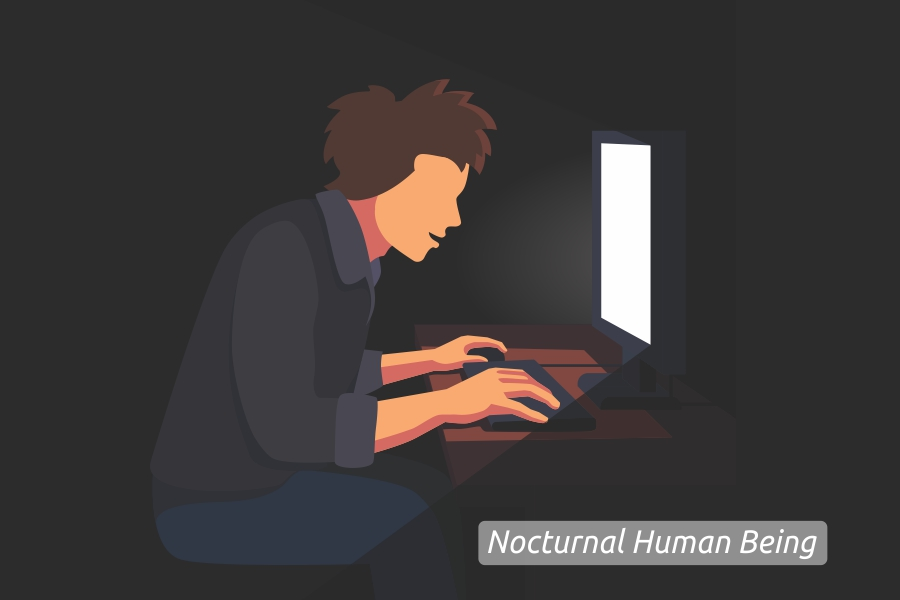

***Nocturnal human being*** adalah sebutan bagi orang yang cenderung terjaga hingga larut malam dan aktif pada malam hari. Sebutan lainnya yaitu *evening person*, *night owl,* atau _lychnobite_. Sebutan-sebutan tersebut disematkan pada orang yang aktif di malam hari untuk bekerja.

Untuk kali ini aku menambahkan satu sebutan lagi, sebut saja "manusia pemuja malam". Ini hanyalah berupa diksi yang aku sematkan bagi orang yang produktif di malam hari. Aku, kamu, dan banyak lagi orang di muka bumi ini yang mengalami.

Ketika siang, kita merasakan tidak bisa fokus dan kurang bersemangat untuk melakukan sesuatu. Terutama tidak bisa fokus untuk menghasilkan buah pikiran. Sebagai manusia yang perlu aktualisasi diri dalam pekerjaan yang dikerjakan siang hari, mau tidak mau, perlu memaksakan diri untuk aktif di siang hari karena suatu tuntutan. Bisa dibilang orang-orang ini memiliki waktu tidur hanya 5-6 jam.

_Apakah itu normal?_

Normalnya pola tidur untuk dewasa rata-rata sampai 8 jam, namun dalam kasusnya jarang sekali tidur siang. Karena kesibukan sehari-hari. Agar sehat dewasa muda harusnya tidur cukup untuk menunjang aktivitas sehari-hari. Jadi bisa dibilang gaya hidup manusia yang hanya bisa produktif di malam hari ini memiliki pola tidur yang tidak normal.

_Apa saja dampak negatif dari pola tidur tidak normal?_

Banyak sekali dampak negatif dari pola tidur yang tidak normal ini. Seperti gangguan *mood*, kesehatan kulit berkurang, munculnya lingkaran hitam di bawah mata, mudah stres, menjadi pelupa, bahkan yang paling ngeri dari dampak ini adalah masalah kesehatan pada jantung dan juga dapat memicu kanker.

> Baca juga: **[Menghadapi Quater Life Crisis](/blog/menghadapi-quarter-life-crisis/)**

Tapi aku di sini tidak sedang membahas dampak negatif pola tidur yang tidak normal dikarenakan tidur larut malam. Justru ingin membahas orang yang suka tidur larut malam cenderung orang yang lebih cerdas. Menurut Psychology Today, orang-orang cerdas biasanya lebih memilih menjadi _nocturnal_ daripada orang dengan yang punya IQ normal. Dalam sebuah *Study Magazine*, <a href="https://scholar.google.co.uk/citations?user=Zc33N34AAAAJ&hl=en" rel="nofollow" target="_blank">Satoshi Kanazawa</a>, seorang psikolog di London School of Economics and Political Science, melaporkan bahwa IQ rata-rata dan pola tidur memiliki hubungan erat. Korelasi ini membuktikan bahwa orang yang cerdas menghabiskan waktunya untuk terjaga di malam hari.

Siang hari kamu memaksakan diri untuk aktif dan produktif. Namun semua itu tidak berjalan dengan 100% kemampuanmu. Bahkan bisa jadi pikiranmu berjalan tak tentu arah. Ketika malam hari tiba, kamu bisa mengeluarkan seluruh kemampuanmu dan kamu dengan mudah menjelajahi segala yang ada di pikiranmu. Kamu menjadi diri sendiri dan melepaskan topeng yang kamu pakai seharian. Kamu bisa fokus dan merasa damai untuk menghasilkan suatu karya hasil dari buah pikiran. Ide-ide segar datang dan mengalir di pikiranmu.

## Keuntungan Seorang Nocturnal

Memang banyak sekali orang bilang bahwa tidur larut malam adalah kebiasaan negatif dan berpengaruh buruk pada kesehatan. Namun faktanya, penelitian ilmiah dalam beberapa studi membuktikan, terbiasa tidur larut malam memiliki beberapa keuntungan, antara lain:

### IQ Lebih Tinggi

Beberapa penelitian mengatakan bahwa individu yang suka tidur larut malam cenderung memiliki kecerdasan di atas rata-rata. Dalam surat kabar akademik <a href="https://www.psychologytoday.com/intl/blog/the-scientific-fundamentalist/201005/why-night-owls-are-more-intelligent-morning-larks" rel="nofollow" target="_blank">Why Night Owls Are More Intelligent Than Morning Larks</a>, yang diterbitkan dalam jurnal *Psychology And Individual Difference*, menjelaskan asumsi bahwa dalam beberapa dekade ini, orang-orang cenderung bekerja pada siang hari dan tidur pada malam hari. Dan orang yang terjaga pada malam hari, adalah sosok yang mampu memperluas pemikiran mereka.

### Lebih Open Minded

Segala sesuatu yang terjadi di malam hari tidak akan pernah kamu dapatkan di siang hari. Ketika separuh manusia pergi bersama mimpinya dan tidur dengan lelapnya. Para _nocturnal_ malah menjelajahi sejauh pikirannya untuk mencapai batas dari kemampuannya. Bisa dibilang para _nocturnal_ bersenandung dengan malam, sebut saja para penyair menulis puisi, musisi menciptakan musik dan lagu, penulis menciptakan naskah, para seniman menemukan karya-karya.

### Menjadi Sosok Proaktif

Dikatakan proaktif dikarenakan orang yang tidur larut malam beberapa langkah lebih depan daripada yang lain. Yaitu ada beberapa hal yang hanya bisa dirasakan di malam hari dan tak akan didapatkan oleh yang lain, berupa ide-ide segar.

### Memiliki Keunggulan Fisik

Para peneliti di *University of Alberta* menguji kekuatan kaki sembilan orang yang rutin bangun pagi dan sembilan orang yang biasa tidur larut malam. Yang terbiasa bangun pagi cenderung memiliki kekuatan yang konsisten sepanjang hari, dan yang terbiasa tidur larut malam memiliki kekuatan lebih tinggi di malam hari. Olle Lagerquist, penulis penelitian, mengatakan bahwa hal ini terjadi mungkin karena pada sekitar pukul 21, terjadi peningkatan motorik korteks dan rangsangan sumsum tulang belakang di dalam tubuh orang yang suka tidur larut malam. Para ilmuwan masih meneliti kebenarannya.

### Lebih Kreatif

Peneliti dari *Catholic University of the Sacred Heart* di Milan menemukan, bahwa orang yang rutin tidur larut malam, cenderung memiliki solusi yang lebih orisinil dan kreatif dibanding orang yang tidur lebih awal.

_Jadi siapa yang bangga dengan hobi begadang?_

Tapi ingatlah lagunya pak Haji Rhoma Irama, _“Begadang jangan begadang, kalau tiada artinya, begadang boleh saja kalau ada perlunya”_ Lirik lagu tersebut seakan ingin mengingatkan kita begadang itu tak perlu, kalau tidak benar-benar ada artinya. Karena kita ketahui bahwa begadang punya dampak negatif pada kesehatan.

> Baca juga: **[SEVA Pusat Mobil Murah](/blog/seva-pusat-mobil-murah/)**

## Cara Tetap Fit Meskipun Sering Begadang

Yang sudah terlanjur memiliki pola tidur larut malam dan merasakan banyak khasiat dari kebiasaan tidur larut malam. Ada beberapa cara agar tetap fit meskipun sering begadang.

### Jaga Asupan Cairan

Badan akan tetap fit dengan mengkonsumsi air mineral minimal dua liter sehari. Karena air mineral mengandung magnesium untuk membantu kinerja otot, elektrolit untuk mencegah dehidrasi, silika untuk menjaga kulit tetap kencang, dan lain sebagainya.

### Usahakan Tidur Siang

Tidur malam pastikan tidur yang berkualitas meskipun tidur hanya 4-5 jam. Kemudian untuk menjaga kondisi tubuh agar tetap bugar, cobalah untuk tidur siang selama 1 jam dengan nyenyak.

### Sempatkan Berolahraga

Luangkan waktu minimal 30 menit setiap hari untuk berolahraga, yang akan menghilangkan rasa pegal akibat begadang.

### Tidur Yang Berkualitas

Walaupun tidurmu kurang dari 8 jam, itu bukanlah tolak ukur dari tidur yang tidak berkualitas. Tidur yang berkualitas adalah tidur kamu yang lelap.

### Perhatikan Asupan Nutrisi

Begadang butuh energi. Hindari makanan berat yang mengandung gula dan karbohidrat. Konsumsi buah dan sayur segar. Hindari pula makanan yang mengandung cokelat, keju, makanan berlemak atau goreng-gorengan, dan mie instan yang mengandung kadar garam berlebih karena mengakibatkan gangguan metabolisme tubuh.

---

Bagi kalian yang seorang _nocturnal_, jangan terlalu takut dengan kondisi kesehatan kalian karena kebiasaan kalian yang hobi tidur larut malam. Terapkan tips di atas agar kondisi kalian tetap stabil, dan tetap berstamina di siang hari menjalankan segala aktivitas.
