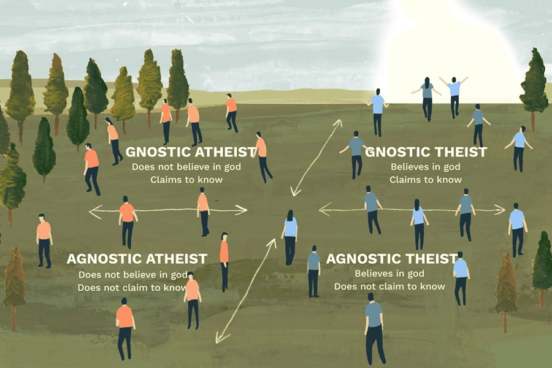

Isu agama seakan merupakan hal yang tak pernah lekang oleh waktu untuk dibahas, ada saja hal menarik lainnya yang dapat diperbincangkan mengenai eksistensi Tuhan. Dari hasil pemahaman dan pemikiran orang-orang terdahulu mengenai eksistensi Tuhan, muncul aliran-aliran ketuhanan. Untuk itu, di sini saya akan mengajak untuk sedikit berkenalan dengan aliran-aliran ketuhanan yang ada. Karena kerap kali di masyarakat, kita hanya mengenal dua, yaitu orang yang beragama dan orang yang tidak beragama. Padahal nyatanya ada beberapa aliran dan paham yang ada di masyarakat.

Maksud berkenalan di sini tidak merujuk dengan etimologi bahwa berkenalan dengan seseorang yang theis, atheis, agnostik, maupun gnostik. Tapi di sini saya ingin mengajak kalian mengetahui apa perbedaan dari semuanya. Saya ingin berbagi informasi untuk membedakannya, agar tidak ada yang menyamakan definisi dari keempatnya.

## Theis

Theis adalah golongan orang-orang yang mempunyai agama atau kepercayaan. Jadi, segala tindakan yang dilakukan berpedoman pada keyakinan agama yang dianut. Mereka meyakini dengan sepenuh hati bahwa Tuhan itu ada keberadaannya. Seorang theis mempercayai semesta alam diciptakan dengan tujuan yang dimiliki Tuhan.

## Atheis

Atheis merupakan kebalikan dari theis. Artinya termasuk golongan orang-orang yang tidak mengakui keberadaan Tuhan. Mereka melakukan pertentangan terhadap theis dan implikasinya pada tindakan yang dilakukan tidak berdasarkan pedoman agama. Atheis melakukan penolakan terhadap klaim Tuhan. Mereka tidak percaya alam semesta merupakan ciptaan Tuhan, melainkan alam semesta tercipta dengan sendirinya begitu saja.

## Agnostik

Agnostik merupakan golongan orang-orang yang berada di tengah-tengah atheis dan theis. Artinya orang yang agnostik adalah orang yang berpikiran bahwa ada atau tidaknya Tuhan belum dapat diketahui.

## Gnostik

Gnostik lawan kata dari agnostik, yang menyatakan bahwa Tuhan dapat diketahui sebagai ada atau tidak ada keberadaan-Nya. Jadi maksudnya adalah orang-orang yang gnostik akan mempelajari atau memahami prinsip ketuhanan dengan pengetahuan yang dimilikinya. Mereka akan mencari kebenaran yang bersumber dari pengetahuan dan kebijaksanaan dari sumber manapun. Dengan begitu, dari hasil pencariannya mereka bisa berpendapat bahwa Tuhan itu ada atau tidak.

Dari keempat jenis yang sudah dijelaskan di atas. Tercipta empat kombinasi mengenai prinsip ketuhanan.

- **Theis Agnostik**, mereka yang menyembah Tuhan namun mengakui Tuhan tidak dapat diketahui;

- **Theis Gnostik**, mereka yang menyembah Tuhan yang percaya keberadaan Tuhan bisa diketahui;

- **Atheis Agnostik**, mereka yang tidak percaya Tuhan dan berpendapat ada atau tidaknya Tuhan tidak diketahui;

- **Atheis Gnostik**, mereka yang tidak menyembah Tuhan dan berpendapat bahwa Tuhan memang jelas-jelas tidak ada.

Ada yang mengatakan bahwa di luar sana didominasi oleh theis agnostik, yaitu golongan orang-orang yang tidak begitu yakin bahwa Tuhan itu ada atau tidak, namun rajin melakukan ibadah/ peribadatan untuk sekadar berjaga-jaga jika pada akhirnya nanti ada hari di mana Tuhan melakukan pengadilan (masih banyak alasan lainnya).

Selain empat hal di atas, ada pula mengenai paham-paham yang tergolong grup _non-theist_. Ada tiga paham yang termasuk _non-theist_, yaitu deisme, pantheisme, dan panentheisme.

Deisme adalah suatu paham bahwa Tuhan adalah sosok personal yang menciptakan alam namun tidak mengintervensi jalannya proses dalam alam ini. Dengan kata lain, deisme mengakui adanya Tuhan, tapi menolak adanya agama. Seorang _deist_ melihat proses alam sepenuhnya berjalan menurut hukum alam. Tidak ada mukjizat, wahyu, atau apapun bentuk campur tangan Tuhan dalam kehidupan alam.

Berbanding terbalik dari deisme, pantheisme adalah suatu paham yang memandang keseluruhan yang ada di alam ini adalah Tuhan. Seorang pantheisme akan menganggap berbagai proses atau kejadian yang ada di alam merupakan campur tangan Tuhan. Dengan kata lain, Tuhan adalah alam semesta itu sendiri. Penentheisme memandang alam adalah bagian dari Tuhan. Jadi, ada bagian lain dari Tuhan yang bukan merupakan Tuhan. Definisi alam yang dimaksud penenthiasme jelas bukan segala sesuatu yang ada. Sebab bila iya, pandangannya akan menyerupai seorang _pantheist_.

Terlepas dari itu semua, mengenai prinsip ini kita serahkan ke pribadi masing-masing. Jawabannya mungkin saja akan kita dapatkan setelah kita meninggal dunia nanti atau mungkin juga kita tidak mendapatkan jawaban apa-apa. Kita tidak berhak menghakimi atas keyakinan atau paham yang dianut oleh seseorang.

Mari saling menghargai satu sama lain.
