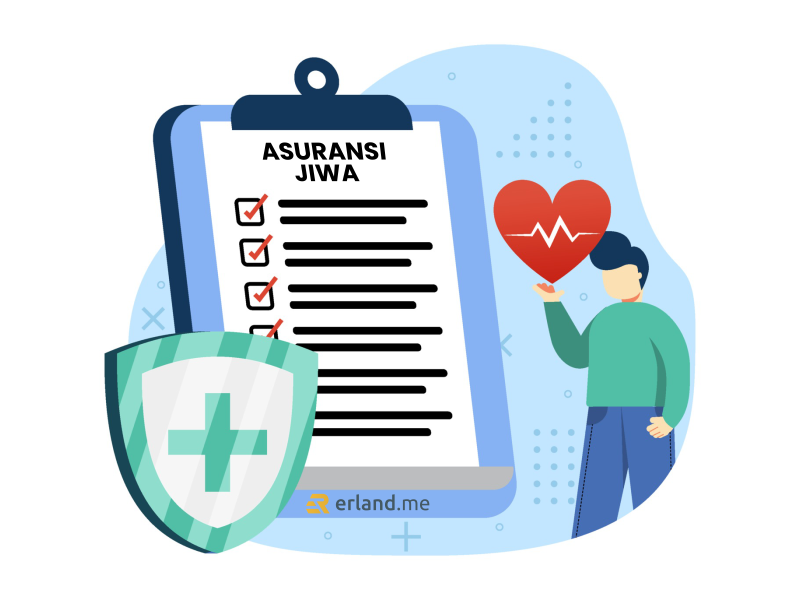

Kebanyakan dari kita mungkin berpikir bahwa asuransi jiwa bukan termasuk hal yang penting, terlebih jika sudah punya investasi pada instrumen lain dan juga memiliki gaji bulanan yang lebih dari cukup. Dengan kondisi seperti itu, kebanyakan dari kita menilai bahwa itu merupakan kondisi finansial yang bagus sehingga tidak perlu lagi memiliki asuransi.

Padahal asuransi jiwa sangatlah penting bagi setiap orang, apalagi jika orang tersebut merupakan anggota keluarga yang memegang peranan sebagai tulang punggung keluarga. Kita memang selalu bisa berusaha hidup sehat, berusaha hati-hati ketika berada dalam perjalanan atau tempat kerja, tapi kita tidak bisa mencegah jika tiba-tiba hal buruk terjadi pada diri kita.

Jika hal buruk tersebut terjadi, akan ada biaya-biaya yang harus dikeluarkan untuk pengobatan di luar anggaran yang kita buat. Itulah mengapa asuransi jiwa sangat penting, di saat seperti itu peran asuransi jiwa dibutuhkan untuk membantu biaya pengobatan yang harus dikeluarkan. Bahkan ketika pemilik asuransi yang juga berperan sebagai tulang punggung keluarga mendapatkan penyakit berat yang menyebabkan tidak mampu lagi bekerja menafkahi keluarga, asuransi akan membantu mengatasi keuangan yang berubah drastis ketika hal buruk tersebut terjadi.

## Apa Itu Asuransi Jiwa?

Asuransi jiwa adalah program perlindungan bagi keluarga apabila hal-hal yang tidak diinginkan. Asuransi jiwa merupakan salah satu bentuk jenis asuransi dengan program perlindungan yang akan memberikan jasa dalam penanggulangan risiko yang berkaitan erat dengan jiwa seseorang.

Asuransi jiwa yang akan menanggung pemegang polis terhadap kerugian finansial tak terduga yang disebabkan karena meninggalnya seseorang dalam jangka waktu tertentu. Manfaat perlindungan jiwa ini adalah sebagai jaminan kepastian terhadap tertanggung dan keluarga dalam menghadapi berbagai resiko kehidupan seperti sakit kritis, cacat, dan meninggal.

## Manfaat Asuransi Jiwa

Dengan memiliki asuransi jiwa, Anda akan mendapatkan banyak sekali manfaat. Berikut ini beberapa manfaat dari asuransi jiwa.

### Menciptakan Perasaan Tenang

Kita tidak pernah tahu apa yang akan terjadi di masa mendatang. Bahkan, 5 menit ke depan setelah Anda membaca tulisan ini, Anda tidak akan tau hal apa yang akan terjadi. Kita semua sepakat tidak ada yang pasti di dunia ini. Sehat, sakit, lahir, dan kematian terkadang dapat menjadi sebuah misteri yang tidak bisa diprediksi kapan akan terjadi.

Karena itu, dengan memiliki asuransi jiwa, itu berarti Anda telah menyiapkan segala kemungkinan yang bisa terjadi. Dengan begitu, perasaan Anda akan menjadi tenang karena adanya jasa asuransi jiwa yang akan melindungi dari kerugian-kerugian finansial. Saat terjadi musibah yang merugikan secara finansial, masih ada asuransi yang akan menanggung.

### Melindungi Ahli Waris

Jika Anda memiliki asuransi jiwa, itu berarti Anda sudah menjaga keluarga dan orang yang dicintai dari risiko kerugian secara finansial. Memiliki asuransi jiwa memang bukan untuk mencegah terjadinya musibah, tapi dengan memiliki asuransi jiwa kita dapat meminimalisir besarnya kerugian finansial yang dihasilkan oleh musibah tersebut.

Asuransi jiwa dapat diklaim ketika pemegang polis mengalami musibah, contohnya dalam musibah meninggal dunia. Beban biaya yang timbul ketika pemegang polis meninggal bisa diringankan dengan uang asuransi yang diberikan kepada ahli waris yang telah ditunjuk. Hal ini tentunya dapat melindungi ahli waris dari beban-beban tanggungan yang dapat menyulitkan.

### Mencegah Terjadinya Kerugian

Dengan memiliki asuransi jiwa, berarti Anda mencegah potensi kerugian besar yang akibat musibah. Seperti contoh misalnya terjadi kecelakaan yang mengakibatkan tubuh cacat atau lumpuh sehingga tidak bisa bekerja dalam waktu yang lama, di sinilah asuransi akan berperan untuk menanggung kerugian yang terjadi. Anda akan menerima uang dari asuransi dengan nominal yang sesuai dengan polis yang disepakati.

Dengan begitu, Anda beserta keluarga tidak perlu lagi merasa khawatir dengan kondisi keuangan keluarga saat mengalami sakit, Anda bisa menjadi lebih fokus untuk penyembuhan.

## Cara Daftar Asuransi Jiwa

Mulai tertarik untuk mengajukan asuransi jiwa? Cari tau dulu deh tips memilih asuransi supaya nggak salah pilih. Rekomendasi dari saya sih pilih layanan asuransi dari Prudential yang sudah terkenal dan terpercaya. Kalau sudah mantap pilihannya dengan memilih Prudential, berikut ini tahap-tahap mendaftar asuransi Jiwa.

### Menghubungi Agen Asuransi

Pertama-tama yang perlu Anda lakukan adalah menghubungi agen asuransi untuk konsultasi, bertanya secara rinci terkait asuransi jiwa dan rencana Anda ke depannya untuk kemudian menentukan layanan asuransi yang tepat. Anda bisa menghubungi agen asuransi secara offline maupun online.

### Mempelajari Ilustrasi Asuransi

Ilustrasi asuransi adalah sebuah dokumen yang memberikan gambaran tentang manfaat asuransi yang nantinya akan diterima oleh nasabah. Ilustrasi asuransi juga memberikan gambaran terkait besaran uang pertanggungan yang nantinya akan kita terima.

### Mengisi SPAJ

Setelah konsultasi dengan agen asuransi dan memahami ilustrasi asuransi serta sepakat dengan segala persyaratannya, Anda akan diberikan SPAJ (Surat Permintaan Asuransi Jiwa) yang berisi informasi penting dan rinci tentang data diri calon nasabah. Agar manfaat asuransi yang diterima dapat maksimal dan tidak ada kendala nantinya, Anda dituntut untuk jujur dalam mengisi SPAJ. Pastikan Anda sudah Mengenal SPAJ, <a href="https://www.prudential.co.id/id/pulse/article/mengenal-spaj-manfaat-dan-aturan-pengisiannya/">Manfaat dan Aturan Pengisiannya</a> terlebih dahulu sebelum sampai pada tahap ini.

## Cara Klaim Polis Asuransi Jiwa

Untuk mengklaim polis asuransi jiwa jika pemegang polis meninggal dunia, Anda perlu melengkapi beberapa dokumen berikut ini.

- Menyertakan polis asli

- Mengunduh formulir klaim meninggal dunia melalui situs resmi Prudential kemudian mengisinya benar, lengkap, dan jelas.

- Mengunduh surat keterangan dokter untuk klaim meninggal dunia dan diisi oleh dokter yang bersangkutan dengan benar, lengkap, dan jelas.

- Menyertakan surat keterangan kematian dari pemerintah setempat.

- Menyertakan salinan catatan medis

- Menyertakan salinan Kartu Identitas Diri tertanggung, pemegang polis dan ahli waris yang masih berlaku (KTP/SIM/Paspor).

- Menyertakan Surat Berita Acara Kepolisian jika meninggal karena kecelakaan yang melibatkan pihak Kepolisian.

Selain itu, pihak asuransi biasanya akan beberapa dokumen pendukung lainnya yang dianggap perlu seperti seperti bukti identitas ahli waris yang berhak menerima uang pertanggungan jika hubungan dengan tertanggung adalah:

- Suami-Istri, diperlukan KTP dari suami/istri tertanggung dan Akta Nikah

- Anak, diperlukan Akta Lahir anak dan KTP jika ada

- Orang tua, diperlukan KTP orang tua dan Akta Lahir tertanggung

- Saudara kandung, diperlukan KTP saudara kandung dan Akta Lahir tertanggung dan saudara kandung

- Hubungan lain, diperlukan penetapan ahli waris dari pengadilan atau notaris

Sedangkan untuk mengklaim polis asuransi dalam kasus sakit kritis atau cacat total, Anda perlu melengkapi persyaratan berikut ini.

- Polis asli, hanya jika klaim menyebabkan polis berakhir.

- Formulir klaim sakit kritis atau cacat total yang telah diisi dengan benar, lengkap, dan jelas. Formulirnya dapat diunduh di website resmi Prudential.

- Surat keterangan dokter untuk klaim sakit kritis atau cacat total.

- Salinan catatan medis.

- Salinan hasil pemeriksaan medis yang telah dilakukan, seperti hasil pemeriksaan laboratorium, radiologi, patologi anatomi, dan lainnya.

- Salinan kartu identitas diri dari tertanggung dan pemegang polis yang masih berlaku (KTP/SIM/Paspor)

## Jenis-jenis Produk Asuransi Jiwa dan Kesehatan Prudential

Layanan asuransi Prudential memiliki banyak jenis-jenis yang dapat Anda pilih sesuai dengan kebutuhan. Beberapa jenis produk asuransinya adalah.

### PRUSolusi Sehat

PRUSolusi Sehat adalah jenis asuransi kesehatan tradisional dari Prudential yang memberikan solusi lengkap untuk perlindungan kesehatan. Jangkauan perlindungan yang diberikan juga mencakup hingga seluruh dunia. PRUSolusi Sehat menawarkan manfaat premi dan kontribusi bulanan sebesar Rp270.000 setiap bulan.

### PRUSolusi Sehat Syariah

Jenis produk asuransi dari Prudential ini menerapkan sistem syariah. Konsepnya yaitu para peserta akan saling menanggung risiko dengan menghibahkan sebagian atau seluruh kontribusi melalui dana yang akan digunakan untuk membayar klaim atau jika terjadi musibah yang dialami oleh sebagian peserta. Jenis produk asuransi ini cocok untuk Anda yang ingin mempunyai asuransi, tapi tetap sesuai dengan syariat Islam.

### PRUCritical Hospital Cover

Salah satu produk asuransi dari Prudential yang akan memberikan asuransi kesehatan dengan mencakup 12 penyakit kritis. Keuntungan tahunan dari jenis produk asuransi ini mencapai Rp15.000.000.000 di bawah rencana yang dipilih, metode klaim ini dapat dilakukan di seluruh dunia karena memiliki jaringan yang luas.

### PRUCritical Hospital Cover Syariah

PRUCritical Hospital Cover Syariah adalah jenis produk asuransi yang memberikan perlindungan menyeluruh untuk pengobatan 12 kondisi yang mengancam jiwa mulai seperti penyakit kanker, gagal ginjal, stroke, serangan jantung hingga operasi dan bahkan transplantasi organ vital. Produk asuransi ini menawarkan manfaat tahunan hingga Rp15.000.000.000 berdasarkan paket pilihan.

### PRUPrime Healthcare

Produk asuransi Prudential ini dirancang khusus dengan berbagai manfaat mulai dari membayar biaya rawat inap, rawat jalan dan operasi. Cakupan PRUPrime Healthcare mencakup manfaat pembayaran rumah sakit dan akomodasi hingga Rp8.000.000 per hari dan dapat meningkatkan batas manfaat tahunan hingga Rp35.000.000.000.

### PRUPrime Healthcare Syariah

Produk asuransi tambahan yang berbasis syariah utama Prudential sesuai dengan prinsip umum asuransi jiwa syariah, yaitu risk sharing dan mutual aid. Produk ini menawarkan keuntungan biaya kamar dan akomodasi rumah sakit hingga maksimal Rp8.000.000 per hari. Anda juga dapat meningkatkan batas kompensasi tahunan hingga Rp35.000.000.000.

Masih banyak lagi jenis-jenis produk asuransi dari Prudential yang dapat Anda pilih sesuai dengan kebutuhan Anda, untuk lebih lengkapnya silakan Anda dapat langsung mengunjungi website resminya <a href="https://www.prudential.co.id/">www.prudential.co.id</a>

## Penutup

Sudah jelas betapa pentingnya Asuransi Jiwa dengan banyaknya manfaat yang akan didapat, maka tidak ada alasan lagi bagi Anda untuk menunda-nunda memiliki Asuransi Jiwa. Sayangi dan lindungi keluarga Anda dengan asuransi!
