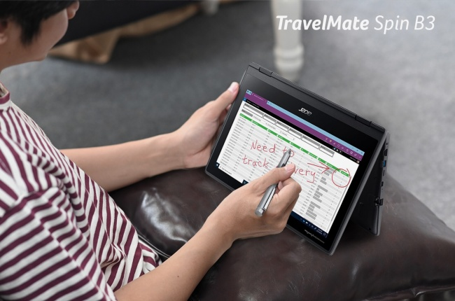
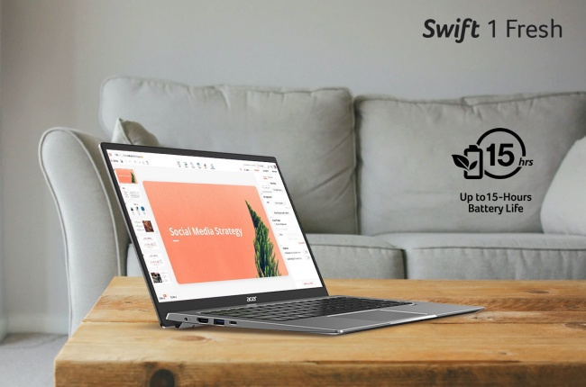
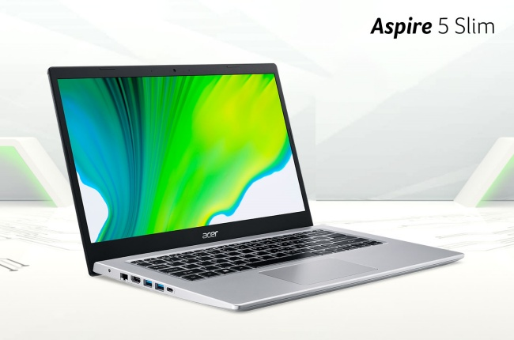

Bisa dikatakan laptop saat ini sudah termasuk salah satu kebutuhan primer. Kini peran laptop bukan hanya dibutuhkan oleh pekerja, tetapi juga dibutuhkan oleh mahasiswa dan pelajar. Terutama di masa pandemi ini, kampus dan sekolah menerapkan pembelajaran jarak jauh untuk mahasiswa dan pelajarnya melalui daring, sehingga dibutuhkan laptop untuk mahasiswa dan pelajar sebagai alat pembelajaran.

Penjualan laptop di masa pandemi ini meningkat drastis, banyak yang berburu laptop yang bagus untuk mahasiswa dan pelajar. Namun, tidak sedikit orang-orang yang kebingungan memilih laptop yang cocok digunakan untuk belajar. Memang susah-susah gampang untuk mendapatkan laptop yang bagus untuk pelajar. Untuk itu, saya akan memberikan tips memilih laptop untuk mahasiswa dan pelajar serta rekomendasi laptop yang cocok untuk mahasiswa dan harganya.

## Tips Memilih Laptop untuk Mahasiswa

Saat ini mayoritas produsen laptop banyak membuat laptop yang dibuat khusus untuk melakukan pekerjaan yang ringan hingga yang berat, sehingga calon konsumen dimudahkan untuk memilih laptop sesuai dengan kebutuhannya. Namun, tetap saja bagi orang-orang yang awam merasa bingung untuk memilih laptop yang sesuai, berikut tips memilih laptop untuk mahasiswa dan pelajar.

### Sesuaikan Budget

Bagi sebagian besar orang, budget selalu menjadi pertimbangan awal dalam membeli sesuatu, termasuk dalam hal membeli laptop. Apalagi bagi mahasiswa dan pelajar yang biasanya mencari laptop dengan harga murah. Maka, tips pertama adalah mulailah memilih laptop sesuai budget yang kalian miliki. Bijak dalam memilih laptop sesuai budget dan kebutuhan, jika budget terbilang minim, jangan memaksakan memilih laptop yang harganya di luar anggaran.

### Sesuaikan Spesifikasi dengan Kebutuhan

Menyesuaikan spesifikasi laptop dengan kebutuhan yang akan kita kerjakan juga termasuk penting. Setiap kebutuhan orang berbeda-beda, bahkan setiap mahasiswa juga bisa berbeda-beda kebutuhannya sesuai dengan jurusan kuliahnya. Misalnya bagi mahasiswa multimedia yang kebutuhannya untuk mengolah gambar, foto, atau animasi menggunakan aplikasi seperti Adobe Photoshop, After Effect, InDesign tentunya memerlukan laptop dengan prosesor dan RAM yang tinggi, serta kartu grafis yang mumpuni seperti <a href="https://penalis.com/teknologi/laptop-gaming-terbaik/">laptop gaming terbaik</a>.

Jelas berbeda untuk mahasiswa jurusan Ekonomi misalnya, mungkin laptop dengan spesifikasi standar dengan Processor Intel dan RAM 2GB sudah cukup. Oleh karena itu, penting bagi kita menyesuaikan spesifikasi laptop yang akan dibeli dengan kebutuhan yang akan kita kerjakan sehari-hari. Dengan menyesuaikan spesifikasi laptop dengan kebutuhan yang akan dikerjakan, tentu akan memudahkan kita dalam memilih laptop seperti apa yang cocok digunakan sehari-hari.

### Pilih Laptop yang sudah terinstal OS

Operating system yang paling banyak digunakan adalah Microsoft Windows, hal ini dikarenakan Windows termasuk OS yang mudah untuk digunakan oleh orang awam sekalipun. Jika kalian pengguna Windows, maka pilih laptop yang sudah terinstal sistem operasi Windows. Maksudnya, ketika kalian membeli laptop, OS Windows sudah terinstal di dalam perangkat laptop dan sudah bisa langsung digunakan tanpa perlu kita yang melakukan instal OS sendiri.

Selain itu, mengingat harga lisensi sistem operasi Windows original yang cukup mahal, apalagi untuk ukuran kantong pelajar dan mahasiswa. Maka, sudah seharusnya untuk memilih laptop yang sudah pre-installed Windows. Hindari juga pemakaian Windows bajakan, karena akan banyak risiko yang akan mengintaimu, seperti minim keamanan sampai fitur pada laptop yang tidak bekerja secara maksimal. Mayoritas laptop keluaran terbaru rata-rata sudah dilengkapi dengan sistem operasi yang pre-installed. Namun, tetap pastikan bahwa sistem operasi tersebut original, ya!

### Pilih Desain Laptop yang Elegan

Setelah memastikan budget, spesifikasi, dan sistem operasi laptop. Tips selanjutnya yaitu memilih desain laptop yang elegan. Sebagai anak muda pastinya kita selalu memperhatikan penampilan, kan? Termasuk menampilan laptop, kita juga perlu memperhatikannya. Terkadang suatu keadaan memaksa kita mengerjakan tugas di luar, misalnya di kafe. Jika kalian ingin terlihat kece, maka pilih laptop dengan desain yang slim dan elegan untuk menunjukkan style kalian.

Selain itu, desain laptop juga berpengaruh ke mobilitas kita. Padatnya jadwal dan tugas kuliah yang seringkali membuat kita harus berpindah ke banyak tempat, sudah seharusnya desain laptop dapat mengimbangi tingginya mobilitas tersebut. Maka dari itu, pilih desain laptop yang minimalis dan ukurannya ringan supaya kalian bisa membawa kemana saja berpindah-pindah tempat tanpa merasa keberatan dengan bobot dari laptop kalian.

### Pilih Laptop yang Bergaransi

Tips terakhir yang tidak kalah pentingnya, bahkan termasuk sangat penting. Yaitu kalian harus membeli laptop yang dilengkapi dengan garansi resmi. Peran garansi ini tentu sangat penting untuk menjamin laptop tersebut jika suatu saat laptop yang baru dibeli itu mengalami masalah, kalian bisa mengajukan klaim garansi di service center terdekat. Hal yang perlu diingat, masa garansi dapat berbeda-beda pada setiap laptop. Maka, pastikan untuk cek kembali masa berlaku garansi laptopnya sebelum mengajukan klaim. Selama masa garansi dari laptop tersebut belum habis, kalian bisa mengajukan klaim garansinya.

## Rekomendasi Laptop untuk Mahasiswa dan Pelajar

Setelah mengetahui tips-tips dalam membeli laptop untuk pelajar dan mahasiswa, sekarang aku akan memberikan rekomendasi laptop yang cocok untuk kalian beli sebagai mahasiswa dan pelajar.

### Acer TravelMate Spin B3

Laptop Acer TravelMate Spin B3 ini dirilis pada April 2020 bersamaan dengan series TravelMate B3. Laptop dengan ukuran layar 11,6 inchi ini cocok dibawa berpergian karena bentang layarnya yang tidak terlalu besar. Ya sesuai dengan namanya, "TravelMate". Layar laptop ini juga dapat diputar hingga 360 derajat berkat engsel yang dimilikinya.

Laptop ini memang memiliki desain yang konvertibel dengan tujuan dapat digunakan dalam berbagai mode penggunaan yang dapat disesuaikan dengan kebutuhan, sangat cocok untuk fleksibilitas dalam pembelajaran oleh pelajar atau mahasiswa. Selain itu, laptop ini juga memiliki baterai yang tahan lama, tombol keyboard yang dipasang secara mekanis, serta beberapa fitur seperti kamera HD HDR yang berguna untuk belajar online via Google Meet atau Zoom. Semua fitur-fitur tersebut tentu memberikan kemudahan bagi pelajar dan mahasiswa dalam aktivitas pembelajaran jarak jauh maupun langsung.

Laptop Acer TravelMate Spin B3 ini tersedia dengan harga mulai Rp5.499.000 yang bisa didapatkan melalui penjualan toko retail Acer. Untuk spesifikasi lengkapnya, silakan simak tabel di bawah ini.

| Spesifikasi      | Detail                                             |
| ---------------- | -------------------------------------------------- |
| Operating System | Windows 10 Home                                    |
| CPU              | Intel® Celeron® N4020 Processor Dual-core 1.10 GHz |
| Graphics         | Intel® UHD Graphics 600                            |
| Display          | 11.6″ HD (1366 x 768) 16:9 IPS Touchscreen         |
| Memory           | 4 GB                                               |
| Storage          | DDR4 SDRAM                                         |
| Webcam           | HD HDR Webcam with Camera Shutter                  |
| Networking       | Wi-Fi 5 (Intel® Wireless-AC 9560) MU-MIMO          |
| Battery          | Battery life up to 12 hours                        |

### Acer Swift 1 Fresh (SF114-34)

Laptop Acer Swift 1 Fresh (SF114-34) ini dirilis pada Maret 2021. Laptop ini memiliki desain yang tipis dan ringan, tepatnya hanya memiliki ketebalan 14,95 mm dan bobot 1,3 kg saja, membuat laptop ini sangat mudah untuk dibawa kemana-mana dan mendukung padatnya mobilitas sebagai mahasiswa. Namun, jangan salah, walaupun desainnya tipis dan ringan, laptop ini tetap kokoh karena berbekal material yang terbuat dari bahan aluminium. Salah satu ciri khas dari laptop seri Swift memang berbahan aluminium seperti ini. Ditambah lagi terdapat 3 varian warna yaitu pure silver, sakura pink, serta safari gold yang membuatnya semakin stylish.

Fitur lain yang tidak kalah menarik dari Acer Swift 1 Fresh (SF114-34) ini adalah desainnya juga dirancang fanless sehingga saat kita mengoperasikan laptop ini terasa sunyi dan minim suara, hal ini tentu berguna untuk menjaga konsentrasi ketika mengerjakan tugas sekolah atau kuliah. Lebih kerennya lagi, meskipun berfitur fanless, laptop ini tidak mudah panas karena adanya fitur Elevated Hinge Design. Dengan itu, aktivitas pengetikan di laptop ini menjadi ergonomis dan terasa nyaman untuk kegiatan pelajar dan mahasiswa sehari-hari.

Laptop Acer Swift 1 Fresh (SF114-34) ini tersedia dengan harga mulai Rp6.699.000 yang bisa didapatkan melalui penjualan toko retail Acer. Untuk spesifikasi lengkapnya, silakan simak tabel di bawah ini.

| Spesifikasi      | Detail                                                                                                                                                                        |
| ---------------- | ----------------------------------------------------------------------------------------------------------------------------------------------------------------------------- |
| Operating System | Windows 10 Home Pre-installed Office Home and Student 2019                                                                                                                    |
| CPU              | Intel® Pentium® Silver N6000 Processor (1.10 GHz, up to 3.30 GHz with Intel® Burst Technology)                                                                                |
| Graphics         | Intel® UHD Graphics                                                                                                                                                           |
| Display          | 14.0″ display with IPS (In-Plane Switching) technology FHD (1920 x 1080) High-brightness (300nits) Acer ComfyView™ LED-backlit TFT LCD 16:9 aspect ratio 72% NTSC color gamut |
| Memory           | 4GB of LPDDR4X                                                                                                                                                                |
| Storage          | 512 GB SSD PCIe Gen3, 8 Gb/s, NVMe                                                                                                                                            |
| Camera           | HD webcam with: 1280 x 720 resolution; 720p HD audio/video recording; Super high dynamic range imaging (SHDR)                                                                 |
| Audio            | DTS® Audio featuring optimized bass response Micro-speaker distortion prevention                                                                                              |
| Battery          | Battery life up to 15 hours                                                                                                                                                   |
| I/O Port         | HDMI® port 1x USB Type-C™ port: USB 3.2 Gen 1 (up to 5 Gbps) 2x USB 3.2 Gen 1                                                                                                 |
| Security         | Fingerprint (Windows Hello Certified)                                                                                                                                         |
| Networking       | Intel® Wireless Wi-Fi 6 AX201 with MU-MIMO                                                                                                                                    |
| Bluetooth        | Bluetooth 5.1                                                                                                                                                                 |
| Weight & Height  | 1,3 kg & 14,95 mm                                                                                                                                                             |

### Aspire 5 Slim (A514-54/54G)

Laptop Aspire 5 Slim (A514-54/54G) ini dirilis pada Desember 2020. Jika kalian memiliki budget lebih, Aspire 5 Slim ini bisa dipertimbangan untuk menjadi teman beraktivitas sehari-hari yang mumpuni. Pasalnya, laptop ini sudah dibekali dengan prosesor Intel® Core™ Generasi ke-11, yang mana performanya lebih baik hingga 84% dibandingkan generasi sebelumnya. Selain itu juga Aspire 5 Slim (A514-54) ini telah dibekali kartu grafis terbaru yaitu Intel® Iris® Xe Graphics untuk visual sistem komputasi yang bekerja lebih baik lagi. Dengan spesifikasi seperti itu tentunya akan menjadikan laptop tersebut memiliki daya kerja dan responsivitas luar biasa sehingga ideal digunakan oleh siapapun termasuk mahasiswa dan pelajar.

Laptop Aspire 5 Slim (A514-54/54G) ini juga dilengkapi dengan tampilan layar real IPS dalam teknologi yang membuat warna di monitor menjadi lebih hidup. Tidak lupa dengan konektivitas sinyal, Aspire 5 Slim juga ini dilengkapi Exo Amp Antenna dengan cakupan hingga 360 derajat, sehingga memungkinkan sinyal menjadi lebih cepat ditangkap. Dan satu lagi fitur yang tidak kalah menarik, laptop ini sudah disematkan Office Home and Students 2019, sehingga kalian sebagai pelajar dan mahasiswa tidak perlu lagi repot instal aplikasi tersebut untuk kebutuhan mengerjakan tugas.

Laptop Aspire 5 Slim (A514-54/54G) ini tersedia dengan harga mulai Rp8.999.000 yang bisa didapatkan melalui penjualan toko retail Acer. Untuk spesifikasi lengkapnya, silakan simak tabel di bawah ini.

| Spesifikasi      | Detail                                                                                                                                                                                                                 |
| ---------------- | ---------------------------------------------------------------------------------------------------------------------------------------------------------------------------------------------------------------------- |
| Operating System | Windows 10 Home                                                                                                                                                                                                        |
| CPU              | Intel® Core™ i7-1165G7 / i5-1135G7 11th Gen                                                                                                                                                                            |
| Graphics         | Intel® Iris® Xe Graphics (54) / Nvidia Geforce MX350 (54G)                                                                                                                                                             |
| Display          | 11.6″ HD (1366 x 768) 16:9 IPS Touchscreen                                                                                                                                                                             |
| Memory           | 8 GB DDR4                                                                                                                                                                                                              |
| Storage          | 512GB SSD upgradable                                                                                                                                                                                                   |
| Monitor          | 14″ display with IPS (In-Plane Switching) technology Full HD 1920 x 1080, high-brightness Acer ComfyView™ LED-backlit TFT LCD (i7 Varian) 14″ HD 1366 x 768 resolution Acer ComfyView™ LED-backlit TFT LCD (i5 Varian) |

Jadi itulah beberapa tips memilih laptop yang cocok untuk mahasiswa dan pelajar beserta pilihan rekomendasi laptop murah untuk pelajar dan mahasiswa dan harganya. Sekali lagi saran dari saya, pastikan kalian membeli laptop yang dijamin oleh garansi resmi, ya! Jika ada hal-hal lain yang ingin ditanyakan, jangan sungkan untuk bertanya di kolom komentar. Terima kasih.
