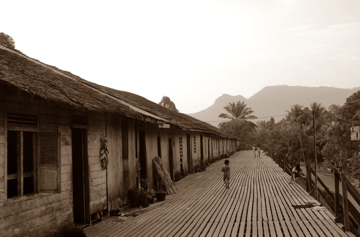

## RUMAHKU, MESKU

Mess adalah sebutan untuk rumah sementara para karyawan yang disediakan oleh suatu perusahaan atau lembaga.  
Mess tempat tinggalku ini disediakan oleh perusahaan pengolah kayu. Letaknya pun jauh dari kota, berada di tengah-tengah antara kota Sampit dan Pelangsian. Bentuk rumah yang sangat sederhana, tidak melibatkan arsitek yang terkenal ataupun yang ahli. Hanya membayar tukang yang sederhana pula, jadilah rumah yang saling berhubungan antara rumah satu dengan rumah lainnya. Bahasa kerennya _Long House_. Bila ada tetangga yang ribut, akan terdengar ke rumah-rumah yang lain seperti debu yang dihembus angin. Seperti angin pula gosip keributan itu menyebar kesana kemari dengan cepat hingga orang satu perusahaan mengetahuinya. Jadi, para orang tua harus berhati-hati bila ingin bertengkar agar tidak tersebar dan menambah masalah baru.

Perusahaan tempat keluargaku bernaung ini bukanlah satu-satunya perusahaan di tempat ini, ada tiga perusahaan lainnya yang memiliki latar belakang sama, dengan hutan adalah batasnya. Perusahaan tempatku ini adalah perusahaan yang paling akhir bila datang dari Sampit, dan termasuk perusahaan yang telah di ujung tanduk.

Dulu waktu pertama kali aku dan keluarga pindah ke tempat ini, masih terasa makmurnya perusahaan ini. Suara riuh-riuh karyawan dan suara pemotong kayu yang memekikkan telinga, berkumandang di angkasa bumi Kalimantan. Banyak orang bilang, Kalimantan adalah paru-paru dunia. Mereka betul, karena Kalimantan banyak ditumbuhi berbagai jenis pohon yang tumbuh subur di tanah Kalimantan, selain itu juga kaya dengan sumber daya alamnya. Tapi sekaya apapun hasil alam yang dimiliki Kalimantan, tetap orang asinglah yang paling berjaya.

Sekarang keadaan sudah berbeda, pemerintah sudah sadar akan pentingnya hutan. Sejak diberantasnya operasi _ilegal logging_ dan dibatasinya penebangan pohon. Semua perusahaan dilanda kekacauan, banyak karyawan yang mengundurkan diri karena takut akan masa depan mereka kelak. Sementara para kepala keluarga yang tidak memiliki tujuan kemana mereka akan bekerja lagi terpaksa harus terus mengabdi kepada perusahaan tersebut.

Ayahku adalah salah satu kepala keluarga yang bingung harus kemana lagi setelah ini, sekarang tinggal 10 kepala keluarga saja. Kami merindukan saat ratusan batang pohon yang dibawa oleh _tugboat_ mampir di halaman rumah kami. Saat _tugboat_ telah bersandar, saat itulah kami dan beberapa karyawan berlari menemui batang-batang pohon yang mengambang di sungai. Para karyawan sibuk menghitung jumlah batang yang dibawa, sedangkan kami sibuk berlarian kesana kemari tanpa takut jatuh demi mencari mainan yang siapa tahu terselip di antara batang-batang tersebut. Mainan itu biasanya mainan bekas yang dibuang oleh orang-orang ke sungai bersama dengan sampah-sampahnya. Sering kali kami menemukan mainan yang sudah tidak utuh, seperti boneka yang buntung tangannya, kakinya, bahkan ada yang tanpa kepala. Mobil-mobilan yang tidak ada rodanya dan masih banyak lagi mainan yang sudah tidak layak bentuknya. Dasar orang-orang yang tidak punya rasa Prikemainan. Tapi kalau beruntung bisa juga dapat mainan yang masih utuh.

Dari sisa 10 kepala keluarga tadi, teman-teman yang sebaya denganku sekarang sisa enam orang. Kami berjuang sama-sama untuk ke sekolah, kami harus bangun pukul empat pagi untuk mempersiapkan keperluan sekolah dan berangkat pukul lima pagi. 45 menit perjalanan menggunakan kelotok taksi, harus berdesak-desakan dengan penumpang lain yang memiliki satu tujuan, Sampit. Sesampainya di Sampit, perjuangan belum selesai, kami harus melewati pasar yang becek, bau, kotor, kusam, dan berisik. Sepatu yang tadi mulus sekarang sudah berubah menjadi sepatu yang abstrak. Seandainya sepatu itu bisa bicara, dia pasti bilang dasar manusia yang tidak berprikesepatuan.

Sampai di sekolah, kami masih berjuang untuk bersabar menahan emosi karena diejek oleh teman-teman. Mereka bilang kami anak buruh, anak bau, anak sebrang yang tidak punya malu, anak hutan, banyak ejekan yang mereka siapkan kalau kami sampai di sekolah. Mungkin kalau dihitung-hitung jumlah ejekan dari kelas satu sampai kelas enam sekarang, mereka bisa masuk rekor dunia dengan jumlah ejekan terbanyak di seluruh dunia. Sampai di kelas kami diasingkan, kami duduk paling belakang. Mereka tidak memberi kami kesempatan untuk duduk di depan sehari saja. Mereka memang tidak berprikemanusiaan dan berprikeadilan sejahtera.

Saat kami ingin mengubah keadaan yaitu dengan cara mencalonkan Egi Yosephan sebagai ketua kelas saat kenaikan kelas 6 kemarin, yang memilih dia hanya 4 orang dari 38 siswa. Tidak lain tidak bukan yang memilih adalah Siti Ayunda, Muhammad Dimas Riswan, Aditya Pratama Pahing, dan aku Maya Aprilia. Sisanya tentu saja memilih Dian Putra yang sudah bertahun-tahun menjadi ketua kelas karena ketampanannya dan kepintarannya. Poninya yang lucu belah kanan, bila tertiup angin membuat bumi menjadi _slow motion_. Angin seperti membawa wangi bunga-bunga yang baru bermekaran menuju wajahnya yang mulus. Permainan yang seru berhenti demi melihat poninya yang tertiup angin, anak perempuan berteriak histeris, anak pria merasa iri, dan guru-guru perempuan terpana. Mungkin di hati guru-guruku itu, coba saja Dian mau menjadi browniesku, pasti dia akan selalu kuutamakan di kelas.

Semua usaha bertahun-tahun untuk mendapat pengakuan di kelas itu rasanya percuma. Yang memiliki pengakuan hanya M. Dimas Riswan karena dia selalu juara di kelas, rival beratnya si poni Dian Putra. Sedangkan di kelas 5 teman seperjuangan Abdul Gian dan Christy Paula, merasakan hal yang sama dengan kami yaitu diasingkan.

Pulang sekolah, kami mencari uang jajan tambahan sambil menunggu kelotok taksi penuh dengan penumpang. Kami berusaha cari uang tambahan karena memaklumi keluarga kami yang kritis. Biasanya banyak ibu-ibu perusahaan lain yang berbelanja di pasar untuk persediaan selama satu minggu atau untuk jualan di mess, sasaran kami adalah ibu-ibu yang membawa banyak barang bawaan untuk diangkut ke dalam kelotok. Pukul tiga sore biasanya kami baru sampai di rumah. Kelotok terlalu lama menunggu kakak-kakak yang SMA. Waktu yang tidak wajar buat kami anak SD baru pulang sekolah, berangkat subuh pulang sore.

Perjuangan masih berlanjut, suara para ibu terdengar bersahut-sahutan dari rumah ke rumah, menggema sampai ke atap rumah. Wajah mereka merah seperti buah tomat, suara pontang-panting barang menambah angker suasana. Mereka geram melihat keadaan sepatu yang tak layak dilihat. Satu-satunya cara menghindar dari omelan orang tua adalah lari ke depan, buka pintu, keluar, dan kabur.

Suara yang paling eksotis dan paling menggema adalah ibu dari Aditya Pratama Pahing, beliau bertubuh semok, subur, alias gendut. Kata yang pertama kali keluar dari mulut lebarnya “_Pahinggg_.......” bumi seakan bergetar seketika, burung-burung yang sedang bercengkrama di atas pohon, terkejut dan terbang berhamburan di atas awan. Aditya Pratama Pahing adalah anak pertama dari 5 bersaudara, dipanggil pahing karena dia lahir pada senin pahing. Lahir dari pasangan keluarga keturunan Jawa, sang ibu berbentuk angka nol dan sang ayah berbentuk angka 1. Jadi saat keluarga itu jalan-jalan terlihat angka 10,5 dari kejauhan.  Ayahnya dipanggil Mr. Lamp karena beliau yang bertugas menghidupkan genset untuk menerangi malam yang gelap di mess ini. Itu pun cuma hidup dari pukul 5 sore sampai pukul 10 malam, selanjutnya tidur dalam kegelapan ditemani suara-suara yang tidak jelas di luar.

Suara yang paling imut dan logat melayu yang paling lucu adalah ibunda dari Maya Aprilia,. “_Maya.... kalau pina kupelasah_,” Artinya kurang lebih beliau ingin memukulku. Lahir pada pukul 00.30 dini hari, tanggal 1 Mei dan di tengah kegelapan malam. Diberi nama Maya Aprilia, karena lahir di antara bulan Mei dan April. Kesalahan ibuku adalah melahirkan aku saat mati lampu akibatnya kulitku jadi hitam, untung saja waktu dilahirkan aku punya inisiatif minta dimandikan air susu coklat. Nah, sekarang aku jadi perempuan berkulit eksotis hitam manis nan elegan. Ayahku bekerja sebagai mekanik kapal _tugboat_, beliau yang menarik kayu-kayu itu dan membawanya ke berbagai wilayah. Dia sudah sering berkeliling Indonesia, dari Sabang sampai Merauke. Dialah yang menjadi salah satu inspirasiku untuk menjadi petualang.

Tetanggaku sebelah kiri, M. Dimas Riswan. Aku tak pernah mengerti dengan keluarga ini. Ibunya lemah lembut dan kalem. Saat dia berbicara kepada Dimas, tidak ada yang tau apakah dia marah,  dia memberi nasihat, dia sedih, atau dia senang. Semuanya tanpa ekspresi dan bicaranya pun sangat pelan. Mungkin itulah yang membuat Dimas pintar dan selalu menjadi nomer satu di kelas karena keadaan rumah yang sunyi senyap, seperti tidak ada orang. Membuat dia lebih bisa berkosentrasi dalam belajar.

Pernah aku dan teman-teman belajar bersama di rumah Dimas. Dalam keadaan yang lapar, Gian mengambil sendiri kerupuk yang ada di dapur. Kami yang tidak tahu ikut saja memakan kerupuk itu sampai benar-benar ludes. Saat ibunya Dimas datang, beliau berbicara begitu panjang lebar dan terlampau pelan. Kami terus saja melanjutkan pelajaran tanpa menghiraukan ibunya Dimas. Ternyata setelah pulang, Dimas baru bercerita kalau tadi ibunya marah karena kami menghabiskan kerupuk yang akan digunakan untuk hajatan.

Tetanggaku sebelah kanan, Abdul Gian. Ini adalah keluarga besar, yang seluruh anggota keluarganya bertubuh besar-besar. Gian adik kelasku, walaupun dia adik kelas tapi dia anak yang pemberani. Cita-citanya ingin menjadi seorang petinju. Sepatu yang dilempar bisa putar balik gara-gara melihat kepalan tangan Gian. Ibunya pasrah apapun yang dilakukan Gian, maklumlah Gian anak satu-satunya di keluarga besar itu.

Dari salah satu sudut rumah yang lain, terdengar suara berisik barang-barang yang dilempar. Ibunya Egi Yosephan memang tidak punya rasa prikebarangan. Egi keluar diiringi dengan sepatu terbang. Salah sedikit sepatu itu pasti mengenai wajahnya. Untunglah dia berhasil selamat. Egi punya adik cantik nan centil dan manja bernama Christy Paula. Christy tidak kena marah sedikitpun, dia selalu menjaga kondisi sepatunya agar tetap bersih dan cantik. Dia perempuan yang selalu mengutamakan penampilan, sifat buruknya cerewet. Wajahnya, kulitnya, penampilannya berbanding terbalik dengan diriku ini. Sungguh kuasa Tuhan yang menciptakan manusia berbeda-beda satu sama lain. Coba saja waktu di dalam kandungan aku bisa request warna kulit dan bentuk wajah.

Siti Ayunindia, dia yang paling santai di antara kami. Kaki kanannya cacat karena kecelakaan. Kemanapun dia pergi, dia selalu membawa tongkat kayu sederhananya. Tongkat itu penuh dengan gambar-gambar kartun. Hobinya membaca komik. Cita-citanya pun ingin menjadi seorang komikus. Dia punya hasrat yang besar untuk menjadi seorang penulis komik. Sampul belakang buku tulisnya selalu penuh dengan gambar-gambar imajinasinya.

Di sini warganya berasal dari berbagai daerah, membaur menjadi satu tanpa membendakan ras, suku, dan agama. Yang paling diutamakan disini adalah kebersamaan dalam susah sekalipun.

Sore itu kami pergi ke Pelabuhan Tongkang untuk bersantai, saat itu ada kapal _tugboat_ yang sedang bersandar. Egi mengajak kami mandi di sungai dan lompat dari _tugboat_ itu. Awalnya kami ragu, karena ditantang Egi akhirnya kami menerima tantangan itu. Yang tidak ikut Siti dan Christy, mereka memang wanita sejati yang berusaha mempertahankan sikap lembut dan santun. Berbeda denganku, sebenarnya dari lubuk hati yang paling dalam aku takut akan ketinggian. Tapi, karena ini tantangan aku mencoba untuk menjalaninya.

Saat di atas _tugboat_, Dimas dan Pahing terlihat pucat pasi. Aku gugup dan rasanya ingin kencing di celana. Gian menyuruh Egi untuk terjun duluan tapi ternyata Egi juga pengecut, dia malah menyuruh Gian untuk terjun duluan. Gian melompat dengan beraninya, tubuhnya yang besar seakan membelah sungai itu menjadi dua bagian. Kami semua tercengang melihat kejadian itu. Egi maju satu langkah di depan kami, wajahnya menggambarkan ketakutan yang luar biasa. Dia menoleh kebelakang melihat ke arah kami, seakan-akan itu menjadi adegan perpisahan terakhir yang menyedihkan, dia membalikan wajahnya kembali dan terjun meninggalkan kami. Dimas dan Pahing saling bertatapan wajah, hati mereka saling berkata _“kamu yang duluan yah...”._ Akhirnya mereka saling dorong. Sementara aku yang sudah tidak tahan untuk menahan kencing, dengan sangat terpaksa karena dorongan naluri aku langsung menerjunkan diri. Aku takut  kalau kencing di celana nantinya akan menjadi bahan ejekan mereka. Ketika tubuh telah tenggelam di dalam air, aku puaskan untuk kencing sesuka hati. Dalam seketika air tiba-tiba menjadi hangat.

“_Gian, kamu merasa hangat enggak?_” kata Egi di sampingku.  
“_Iya, hangat. Enak_” kata Gian dengan wajah polos.  
“_Itu aura kecantikanku. Makanya air ini menjadi hangat saat aku terjun tadi_” kataku menimpali.

Mereka menerima saja apa yang aku ucapkan, sungguh anak yang polos. Untunglah mereka tidak tahu apa yang sebenarnya terjadi. Sementara itu di atas _tagboat_, Dimas dan Pahing masih saling dorong. “_Anak pria masa pengecut_” pikirku. Christy naik ke atas _tugboat_ diam-diam. Mungkin dia gemes melihat kelakuan dua pria yang aneh ini. Dengan hasrat jahil yang luar biasa, dia mendorong dua pria itu hingga terjungkal jatuh ke sungai. Kami tertawa terbahak-bahak melihat kejadian itu. Kami memang merindukan acara cebur menceburkan seperti ini.

Dulu sebelum perusahaan pengolah kayu ini mengalami pailit. Di masa saat teman-teman sebayaku masih cukup banyak. Setiap sore anak laki-laki naik ke atas tongkang dan meloncat dari ketinggian tanpa takut. Mereka bergembira ria bersama melakukan acara saling menceburkan. Saking asyiknya berenang, terkadang ada sosok benda berwarna kuning, mengapung, serta berbau (sesuatu yang abstrak, keluar dari tubuh) menyentuh pundak mereka dari belakang tanpa ada rasa malu. Anak yang melihat dari atas tongkang muntah-muntah sampai titik penghabisan. Si anak yang terkena kotoran manusia itu segera naik ke daratan dan mengosok kulitnya dengan pasir sampai merah. Sampai di rumah mungkin mereka akan menggosoknya dengan amplas. Anehnya mereka tidak pernah kapok dengan hal itu.

Ketika malam datang, belajar adalah satu-satunya pilihan untuk kami. Kalau tidak belajar yah hanya uring-uringan di kasur atau bercanda dengan keluarga masing-masing di rumah masing-masing. Sebuah _gameboy_ murahan pemberian ayah adalah satu-satunya menu penghilang kejenuhan milikku. Nonton TV? Tak ada yang punya TV saat itu. TV hanya ada di rumah bos orang tua kami. Kalaupun ingin hiburan, kami hanya punya radio. Radio pun cepat membosankan. Dari pagi sampai malam musik dangdut selalu diperdendangkan. Acara yang paling aku tunggu-tunggu hanya Dunia Dongeng yang diudarakan setiap hari minggu pada pukul empat sore.

Kami dituntut harus menggunakan waktu sebaik-baiknya, karena pukul 10 malam lampu sudah harus padam. Kami menggunakan mesin genset yang hanya mampu menyinari 11 rumah, 1 kantor, 1 pos jaga, dan 1 dermaga. Setiap ditanya, kenapa listrik harus padam saat jam 10 malam? Yang artinya hanya 5 jam pemakaian, sejak dinyalakan pukul 5 sore. Mereka akan menjawab dengan santai kalau ini dalam masa penghematan.

Pukul 10 malam keadaan semakin sunyi. Semua orang memasuki dunia mimpinya sendiri. Yang terdengar hanyalah suara jangkrik bersaing dengan suara mesin genset tua. Dari kejauhan terdengar suara radio tua di pos jaga. Mungkin saat itu merekan sedang berjoget mengikuti irama dangdut untuk menghilangkan rasa kantuk.

## MASA JAYA

Di masa jayanya perusahaan ini. Keriuhan akan terjadi dari pagi hingga malam. Mess disini terbagi menjadi 3 bagian. Mess yang pertama adalah mess untuk para pekerja yang sudah berkeluarga. Mess yang kedua adalah mess untuk para pekerja laki-laki yang masih bujangan. Mess yang ketiga adalah mess untuk para pekerja wanita yang masih perawan (belum menikah).

Pukul 7 pagi, para pekerja keluar dari tempat persembunyian masing-masing. Mereka siap bertarung dengan debu dan panas. Para pekerja yang sudah berkeluarga keluar dengan pakaian biasa-biasa saja. Hanya mengenakan kaos lengan pendek dan celana pendek saja sudah jadi. Kebanyakan dari mereka bekerja memotong kayu. Adapun pekerja yang masih bujangan memakai kaos lengan pendek dan celana jeans beserta wangi-wangian. Sementara para para pekerja yang masih gadis memakai pakaian yang rapi, memakai wangi-wangian serta membawa buku dan pulpen kemanapun mereka pergi. Tugas mereka biasanya mencatat jenis-jenis pohon yang diproduksi serta berapa jumlahnya.

Pukul 11.30 sampai pukul 1 siang adalah jam istirahat. Sebagian pekerja ada yang salat dulu dan sebagian pekerja lainnya menyerbu kantin dekat pabrik. Para pekerja laki-laki yang sudah berkeluarga biasanya lebih memilih pulang ke mess menyantap masakan istri sendiri. Namun lebih banyak pekerja menyerbu kantin pabrik.

Berbagai macam bau berbaur menjadi satu. Mulai dari harumnya bumbu masakan, harumnya wangi-wangian pekerja bujangan, sampai bau badan pekerja yang kurang peduli polusi udara, dan bau asap rokok yang mereka sebarkan.

Pemilik kantin tersebut bulek Zaitun. Umaku adalah asistennya. Kadang, aku membantu bulek dan uma dengan mengantarkan makanan kepada para pekerja yang lapar tersebut. Dalam imajinasiku mereka seperti _zombie_ yang haus akan darah. Mereka menjadi egois dan rakus. Mereka seakan menjulur-julurkan lidah dan bergerak seperti mayat hidup. Rasanya aku ingin beraksi seperti di film _action_. Tidak punya senjata, piring pun jadi.

Kakiku serasa berat membawa 2 mangkok bakso pesanan abang-abang yang sedari tadi berteriak-teriak. Sampai di meja makan, dengan sigap 2 mangkuk bakso aku letakkan di atas meja. Belum tiga langkah aku meninggalkan meja, makanannya telah lenyap dari pandangan mata. Mereka menjadi sadis saat lapar dan haus melanda. Mereka seperti sudah tidak makan 1 tahun lamanya. Umaku dan bulek bekerja sangat keras. Tangan mereka bergerak cepat untuk memenuhi perut lapar kira-kira 190 orang mendadak _zombie_. Kelima anak bulek dan aku juga larut dalam kegaduhan kantin.

Setelah semua perut terpenuhi. Masalah baru datang. Ada beberapa pekerja datang dengan wajah memelas. Padahal sebelum perut mereka terpuaskan, mereka adalah srigala yang haus darah. Bagaikan orang yang baru saja mendapatkan musibah besar, mereka datang dengan menampakkan wajah yang benar-benar suram.

Bulek sudah terbiasa melihat wajah suram seperti itu. Wajah suram itu adalah tanda penambah daftar galau bulek. Mereka adalah boners yang suka nge-bon di kantin ini. Alasan mereka selalu bilang belum gajihan. Kalaupun sudah gajihan, mereka hanya bayar separonya. Bulek sering tidak tega melihat para boners datang dengan wajah sejuta galau. Tak bisa dibayangkan betapa rumitnya masalah bulek dengan untung yang tak seberapa.

Berbeda dengan tradisi mandi sungai saat pagi hari, sore hari lebih seru dan menyenangkan. Di sinilah terjadinya lirik melirik antara pekerja di mess bujangan dan pekerja di mess gadis. Mereka akan turun ke batang (batang pohon yang dibiarkan mengapung, dibentuk sedemikian rupa hingga terbentuk jamban beserta pelantarannya). Di pelantarannya inilah tempat mandi ataupun mencuci. Tidak jarang moment ini dijadikan moment untuk berkenalan.

Aku dan teman-teman juga sudah terbiasa mencuci di batang ini. Sehabis mencuci kami menceburkan diri ke sungai bermain sabun sembunyi. Sabun sembunyi adalah permainan yang aku ciptakan sendiri. Sabun mandi batangan yang licin harus diperebutkan di dalam air. Yang berhasil memperebutkannya 3 kali adalah pemenangnya.

Sering kali aku mengorbankan sabun mandi yang baru saja dibeli Uma untuk bermain sabun sembunyi. Kejadiannya selalu sama karena tidak bisa mempertahankan sabun yang licin itu di dalam sungai yang kira-kira dalamnya 2 meter. Sabunnya hilang ditelan sungai.  Sabun yang telah jatuh ke dasar sungai yang berlumpur sangat sulit untuk ditemukan. Tragisnya, semua teman yang ikut dalam permainan itu langsung tergesa-gesa naik ke atas daratan setelah melihat wajahku yang masam. Saking masamnya, ikan-ikan di sungai itu juga ikutan kabur. Dengan langkah yang ragu-ragu akupun pulang. Seribu satu bayangan melintas di pikiranku. Apa yang akan dilakukan Uma kalau tahu sabunnya hilang lagi. Dalam seminggu uma bisa beli sabun sampai 3 batang. Padahal batas wajarnya satu batang sabun mandi bisa dipakai sampai 2 minggu.

Untunglah hukumannya tidak jauh-jauh dari cuci piring, cuci baju, bersihkan rumah, atau menimba air. Tapi setelah diberi omelan sejuta planet pastinya. Dari situ aku belajar kalau tidak semuanya pencetus itu akan sukses. Aku yang telah mencetuskan permainan sabun sembunyi yang telah menguras tenaga mencari inspirasi tapi kenapa harus aku yang berkorban dan menderita.

Hal itu juga terjadi dengan pejuang kita zaman dulu. Dulu mereka berjuang mati-matian melawan penjajah. Rakyat, bangsawan, dan pemimpin tidur dalam satu gubuk. Mereka bersatu melawan penjajah dengan tidak membedakan kasta. Pengorbanan untuk bangsa adalah janjinya. Nyawa adalah taruhannya. Dan kemerdakaan adalah hadiah impiannya. Bandingkan dengan sekarang. Para pejuang yang sudah berkorban untuk mencetuskan kemerdekaan di tanah Indonesia. Para pejuang yang rela mati demi mengibarkan sang merah putih di udara Indonesia. Mereka hanya dianggap sebagai angin lalu. Bangsawan dan para pemimpin semakin jauh dengan rakyat. Mereka sibuk dengan urusan keduniaan masing-masing. Tidakkah rakyat juga ikut dalam perjuangan. Bukankah seharusnya kami juga merasakan kemerdekaan yang hakiki. Bukan pemimpin atau bangsawan yang menjelma tikus jadi-jadian yang diharapkan rakyat. Kenapa kita tidak meniru para pejuang yang telah mencetuskan kemerdekaan?

Malam adalah waktu yang ditunggu-tunggu oleh para bujangan. Bermodalkan gitar dan drum bekas, mereka alunkan musik. Kepulan asap di depan mess para bujangers sudah menjadi hal yang lumrah. Jagung dan singkong adalah makanan yang sering mereka siksa (dibakar maksudnya).

_Moment_ ini bisa dijadikan ajang mencari uang tambahan. Mengingat harga _handphone_ dulu masih terbilang mahal. Surat menyurat adalah akses cinta yang paling tepat. Seketika kami bukan lagi segerombolan anak SD, tapi segerombolan calo cinta. Tawar menawar dengan para bujangers sudah menjadi santapan setiap malam. Kalau harga sudah deal, tinggal melengos pergi ke mess gadis. Para bujangers bukannya tidak berani mengantar sendiri surat cinta itu. Mereka takut akan menghadapi masalah besar bila menembus perbatasan. Barisan para ibu rumah tangga yang perkasa siap menghadang, termasuk Uma di dalamnya. Maklumlah pimpinan perusahaan ini telah memberi amanah kepada para ibu-ibu perkasa tersebut untuk menjaga mess gadis dari para bujangers. Pimpinan ingin menjaga nama baik perusahaan ini dengan terkenal tempat pabrik pengolahan kayu, bukan terkenal dengan nama pabrik pengolah anak.

\*\*\*\*\*  
Bersambung ke [Sahabat Awan Bagian 3](/blog/sahabat-awan-3)
