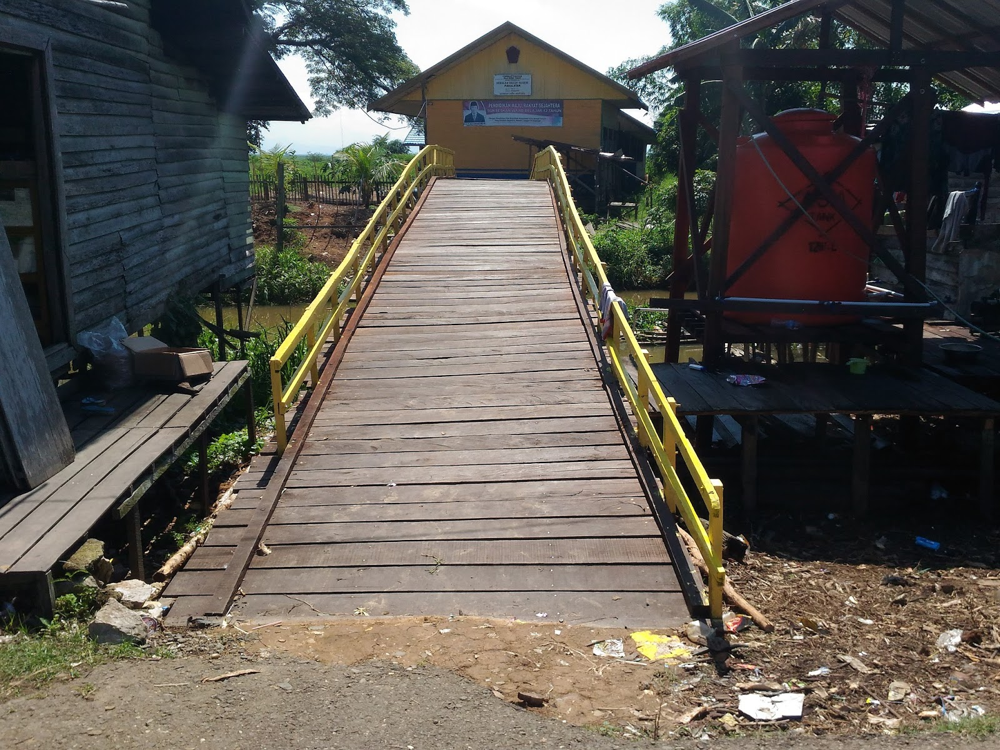

## 5 Momen Terbaik

Dari awal masuk sekolah sampai kelas 3 SD adalah masa penuh kenangan. Saat itu teman sebayaku kira-kira masih ada 19 orang. Ada 5 kenangan yang masih segar terpatri indah di kepalaku dengan nama folder "5 Momen Terbaik*"*.

### Kenangan Pertama

Saat itu adalah awal kedatangan pertamaku ke perusahaan ini. Setelah dipaksa melepaskan baju TK yang kecil. Aku diharuskan menggantinya dengan baju merah putih. Hatiku sempat bergejolak saat itu. Aku bertanya kepada Uma dengan sopan dan menampilkan wajah polos anak-anakku.

_“Uma, kenapa harus pindah ke SD?”_  
“_Memang begitu peraturannya_” jawab Uma dengan nada menantang.  
Aku yang tak mau kalah melemparkan pertanyaan lagi “_Kenapa bisa? Padahal ulun pengen selalu main lingsiran, junggitan, dan ayunan_”  
Tidak mau kalah, Uma menjawab singkat, padat, dan menyakitkan, “_Itu namanya orang gila_”

Aku diam terpaku.

Jawaban Uma terkesan aneh. Selama ini yang aku tahu orang gila itu hidupnya di jalan dengan kelakuan yang unik-unik. Kalau orang yang lama di TK adalah orang gila, berarti guru-guru TK yang setiap harinya menyanyi lagu anak-anak di TK adalah orang gila. Dan yang pasti, yang merasa dulunya pernah bersekolah di TK adalah mantan orang gila. Berarti aku dulu gila dong. Kalau hal itu semakin dipikirkan, lama-lama aku bisa gila juga.

Saat pertama kali menginjakan kaki di tempat ini, rasanya itu dilempar dari bumi ke planet terasing di jagat raya. Orang-orang yang asing, suasana yang asing, dan tempat yang asing pula. Saat pertama kali naik taksi kelotok, melintasi sungai dengan kiri kanan adalah hutan. Aku sempat berpikir kalau tempat itu seperti hutan apa adanya dan semua penduduknya hidup seperti *tarzan*.

Ternyata pikiranku itu ditendang dengan kasar dalam benakku. Ternyata mereka hidup seperti pada umumnya. Hanya saja di sini lebih sederhana dan lebih bersahaja. Yang unik di sini, kaki mereka tidak menyentuh tanah. Karena setiap mess dibangun dengan tiang yang tinggi layaknya rumah panggung. Dan antara mess satu dengan mess lainnya dihubungkan dengan jembatan-jembatan kecil yang saling berhubungan. Semua itu dilakukan untuk mengatisipasi pasangnya air sungai yang bisa saja  menenggelamkan mess. Jadi pantaslah kalau tempat ini disebut negeri tanpa jejak.

Belum berapa jauh aku melangkah memasuki mess, tiba-tiba..

_Crashh... gedubrakk... krekk..._

Dodi bergigi tongos nan kuning terjatuh dari pohon dan meretakan jembatan yang tak bersalah itu. Seketika air mata mengalir deras di pipinya diiringi dengan teriakan “_Ibuuuuuu_”

Dia melengos pergi dari hadapan kami yang masih dalam keadaan kagum.

“_Selamat datang_”

Seruan itu membuyarkan kekaguman kami. Semua teman-teman baruku menyambutku dengan ramah. Mereka memberikan buah manggis dan rambai sebagai tanda awal pertemanan. Aku sempat terharu saat itu. Tapi, yah namanya masih ada aura anak kota. Aku tak terlalu menanggapi keramahan mereka. Namun, dengan kerja keras mereka dan kepoloson mereka. Akhirnya aku bisa membaur dengan keadaan sekitar. Bahkan aku berpikir kenapa tidak dari lahir saja aku berada disini.

### Kenangan Kedua

Pemilik perusahaan ini mengadakan sunat massal gratis. Walaupun dia non muslim, tapi dia menjunjung tinggi yang namanya toleransi. Dialah sosok bos yang harus dihormati. Dia menjadikan sunat massal itu menjadi acara terakbar di perusahaan ini.

Ada sekitar 10 anak yang mengikuti acara sunat massal tersebut. Para laki-laki sibuk mengurus pemotongan kambing dan menata tenda untuk para tamu dari perusahaan lain. Para ibunya sibuk di dapur mengurus yang namanya konsumsi. Saking repotnya, mereka melupakan anak mereka yang dalam keadaan takut (_maaf yah_) burungnya dipotong.

Aku, Siti, Christy, Egi, dan beberapa teman lainnya duduk menemani mereka. Pahing, Gian, Dimas, beserta peserta sunat lainnya sedang duduk di atas kasur. Di daerah (_maaf lagi_) burungnya mereka tergantung kain membentuk piramida untuk menutupi kemaluannya itu.  Dengan santainya dari atas sampai bawah, Pahing dan Dodi tidak mengenakan sehelai benang pun. Mentang-mentang daerah itunya sudah tertutup. Dimas dan Gian masih tahu malu dengan mengenakan kaos dan celana dalam.

Keasyikan kami terganggu ketika abang-abang dari mess bujangan datang. Dengan sigap, mereka menakuti kesepuluh anak malang itu. Mereka merasuki otak kami dengan meniupkan jutaan rasa ketakutan. Bujangers jahat itu beraksi lagi. Egi yang non muslim langsung berlari pulang dan mengunci kamarnya rapat-rapat. Aku dan teman perempuan lainnya menjerit histeris dan kabur ke ibu masing-masing. (_Maaf sekali lagi yah_) abang-abang itu dengan sadis membuka itunya Pahing dan mempratikkan bagaimana cara dokter memotong kemaluannya anak-anak dengan bengis. Kesepuluh anak itu langsung drop dan panas dingin. Bayangan akan makan banyak, dapat uang dari tamu, dapat hadiah mainan dari orang tua, ditambah dengan hadiah kejutan dari pemilik perusahaan ini, hilang seketika terbawa angin tornado.

Sementara itu, di luar sedang diadakan penyambutan dokter di dermaga *speed boat*. Dengan gagah dokter itu turun dari speed boat. Karena terlalu *over* pede, si dokter yang diketahui namanya Efendi itu terjungkal di dermaga. Ketidaktahuan akan medan jalan yang licin karena berlumut adalah penyebabnya. Alhasil, dia jatuh dengan sukses. Setelah sampai di tempat acara. Belum sempat si dokter merapatkan pantatnya ke lantai. Kesepuluh anak yang ingin disunat memberontak. Mereka semua berlari dengan pakaian seadanya. Para orang tua dibikin gelagapan. Mereka juga ikut berlari mengejar anak masing-masing tentunya. Terjadilah acara kejar-kejaran sengit. Para penghuni perusahaan ini dibuat pusing, para tamu dibuat bingung, dan pimpinan perusahaan beserta staffnya dibuat malu.

Dimas, Pahing, dan Gian berlari ke gudang. Beberapa teman lainnya berlari masuk ke area pabrik. Parahnya ada juga yang menceburkan diri secara sukarela ke dalam sungai, yaitu Dodi. Para orang tua terpaksa membujuk dan menguras kantong lebih dalam untuk memberi iming-iming kepada anaknya.

Setelah keadaan normal. Akhirnya si dokter bisa menjalankan tugasnya dengan sedikit gugup. Setiap selesai memotong (_maaf lagi deh_) burungnya anak-anak itu, si dokter selalu mengacungkan jempol kepada kami. Orang tua yang punya si anak bertepuk tangan dengan senyum gembira. Begitulah seterusnya sampai sepuluh kali. Usut punya usut, penyebab kejadian ini akhirnya diketahui oleh pimpinan. Dengan senang hati, si bos menyuruh para bujangers membersihkan kekacauan setelah acara sebagai hukuman.

### Kenangan Ketiga

Aku ingat benar saat kami bermain di jembatan kayu yang lapuk. Di jembatan yang sudah dibuat 10 tahun lamanya itu, aku beserta 5 teman perempuan lainnya Chirsty, Indri, Indah, Wati, dan Lia bermain karet gelang. Dimas, Pahing, Egi dan Gian duduk santai di atas pohon di samping jembatan itu. Siti dengan legowo duduk di samping kami yang asyik bermain. Aku mengerti dengan perasaannya saat itu, dia pasti kecewa melihat keadaannya saat ini. Sesekali aku melakukan hal yang bodoh demi melihat senyuman dari bibir tipisnya. Egi dan Gian juga sesekali mengejek kami untuk mencairkan suasana.

Saking asyiknya melompat kami tidak mengetahui kalau ternyata jembatan tersebut dibuat kewalahan dengan hentakan kaki kami. Ditambah dengan turunnya Dimas cs ke jembatan, hal itu otomatis menambah berat beban si jembatan. Mereka yang merasa bosan hanya duduk di atas pohon mengajak kami bermain yang lebih ekstrim. Permainan tikus dan kucing adalah permain favorit kami saat itu. Hentakan demi hentakan membuat si jembatan semakin teraniaya. Berlarian kesana kemari dan menghamburkan tawa membuat si jembatan semakin sedih saja.

Karena telah merasa cukup umur, akhirnya.. _Crashh... jedarr... byur.._.

Kami semua terjatuh ke dalam sungai yang saat itu sedang pasang. Dalamnya air saat itu mungkin satu  meter dari permukaan. Tragisnya lagi di samping kananya jembatan ini ada sebuah jamban yang sedang dioperasikan. Sesuatu yang larut berwarna kuning nan bau dengan santainya larut mendekat ke arah kami. Dengan cepat kami semua meranjak naik ke daratan.

Dengan postur tubuhnya yang tinggi, Egi dengan gagahnya mengangkat Siti naik ke daratan. Siti meringis kesakitan. Wajahnya pucat dan bibirnya bergetar. Hal itu membuat kami semua menjadi tambah gugup. Gian dan beberapa teman lainnya berlari ke pabrik  memanggil semua pekerja yang saat itu sedang menjalani tugasnya. Christy ke mess orang tuanya Siti. Aku, Dimas, Pahing, dan Egi dibuat gelagapan mengangkat tubuh Siti yang sudah tidak berdaya.

Beberapa saat kemudian semua pekerja datang menolong. Ibunya Siti menangis histeris. Tangisan sang ibu ternyata membuat sang ayah tambah gugup dan pingsan. Jadilah keluarga ini keluarga pingsan bersama. Kemudian Siti dibawa ke rumah sakit di kota Sampit dengan *speedboat*. Setelah ibu dan ayahnya sadar, mereka berdua juga menyusul ke rumah sakit.

Hingga malam tiba, aku dan teman-teman termenung di dermaga menunggu kabar terbaru tentang Siti. Tidak lama kemudian bang Usup datang dengan wajah yang murung.

“_Bang, bagaimana kabar Siti?_” tanya Egi memberanikan diri.  
“_Luka lama kembali membengkak. Pulanglah kalian, besokkan sekolah. Urusan Siti serahkan pada yang di atas._"

Kami tak ada yang tahu bagaimana Siti mendapatkan kecelakaan hingga membuat kaki kanannya cacat. Orang tuanya memang sengaja tidak memberi tahu kepada semua orang tentang musibah yang dialaminya agar tidak tercipta luka di hatinya.

Sepulang dari dermaga, sekumpulan bujangers menghadang kami ditengah jalan. Salah seorang yang paling kami benci adalah bang Erick juga hadir dalam barisan itu.

“_Eh,,, anak-anak sial. Kalian semua itu sekarang adalah anak-anak pembawa sial. Liat saja Siti. Gara-gara kalian kaki Siti akan diamputasi._” kata Bang Erick.

Peryataan bang Erick itu membuat posisi jantungku berpindah entah kemana. Kami samua saling berpandangan miris.

“_Mulai sekarang kalian jangan dekat-dekat Siti lagi. Karena kalian semua hanya membuat Siti tambah menderita._” tukas seseorang yang punya gigi tak beraturan dan wajah yang dibombardir oleh jerawat.

Di lubuk hatiku yang terdalam aku tak mempercayai perkataan mereka. Menakut-nakuti adalah hobi mereka. Membuat masalah adalah *basic* hidup mereka. Mencari pacar untuk pemuas nafsu adalah tujuan masa depan mereka. Itulah aktivitas yang dikerjakan para bujangers selain bekerja. Harap dimaklumi kalau mereka hidup terkurung dikelilingi hutan. Bekerja dan bekerja, hanya itulah yang mereka lakukan. Sedikit penyimpangan membuat mereka merasa berada di dunia yang jauh dari kejenuhan. Semakin lama prilaku mereka menampakan prilaku tarzan yang liar dan ganas.

Beberapa hari tanpa kehadiran Siti membuat kami menjadi generasi galau. Hujan, badai, dan tsunami menebas habis isi hati dan pikiran kami. Demi menyambut kedatangan Siti, beberapa kali aku turun ke batang untuk menengok situasi. Gelisah melanda hati silih berganti. Dari kejauhan terdengar suara speedboat yang berderu. Itulah tanda kalau Siti sudah dekat.

_Te Jrenggg..._

Siti turun dari *speedboat* dengan kaki yang masih utuh dan masih pincang tentunya. Dengan emosi yang menderu kami semua menatap para bujangers yang berada di atas. Sebuah kata “_seraaaaang_” dari Gian menandakan perang telah dimulai. Sebuah keranjang penuh dengan balon air, dengan racikan beberapa kotoran dan daun-daun yang dipercaya membuat gatal, kami lemparkan dengan liar kepada para bujangers. Siti dan semua orang di situ dibuat bingung. Para bujangers kami buat kalang kabut dan pastinya gatal.

### Kenangan Keempat

Setiap malamnya di sekitar pabrik dilepaskan beberapa ekor anjing penjaga. Jadi tidak ada yang berani mendekati pabrik itu di malam hari. Namun pada suatu hari ada anjing yang nyasar ke kawasan mess. Langsung saja hal itu membuat geger penghuni mess. Si penjaga anjing bersumpah kalau semua anjing sudah dikembalikan ke kandang subuh tadi.

Setelah dilihat-lihat, si anjing ternyata memiliki ciri-ciri *rabies*. Sontak saja membuat semua pekerja menjadikan ini sebagai alasan bolos kerja. Semua pintu mess tertutup rapat. Bahkan jendelapun juga tertutup rapat. Mereka menganggap anjing *rabies* layaknya anjing yang terkena virus *zombie* di filmnya *Resident Evil*. Lagi-lagi pimpinan dibuat bingung oleh kelakuan karyawannya yang semakin hari semakin unik.

Kami yang berangkat subuh, benar-benar tidak mengetahui kejadian yang telah melanda mess. Sepulang sekolah, kami diperlihatkan keadaan mess yang seperti kota mati. Dengan berjalan lambat, kami meraba-raba apa yang sedang terjadi. Bang Doni yang saat itu duduk di bangku SMA mencoba memimpin kami di depan. Kami seolah-olah beradegan di film garapan sendiri dengan judul *The Monster*. Dengan alur cerita kami tersesat di daerah kumuh karena warganya yang telah tewas dimangsa si *monster* dan kami adalah gerombolan regu pahlawan yang siap memberantas *monster* tersebut.

Dari kejauhan tiba-tiba terdengar suara teriakan dari lantai dua mess gadis.

“_Awas... Ada anjing rabies di depan._” katanya sambil menunjuk-nunjuk ke arah depan.

Bang Doni yang terlebih dahulu melihat si anjing langsung mengomandoi untuk mencari tempat yang aman.

Dengan cekatan tangan bang Doni menarik Siti dan mengendongnya tanpa pamit. Kebanyakan dari kami lari ke mess gadis yang bertingkat dua. Sebagian lagi lari ke rumah mess yang terdekat. Dan lagi-lagi sungai menjadi tempat pelampiasan Dodi untuk melarikan diri.

Yang menegangkan di sini saat Dimas terpaku menghadapi si Anjing. Bisa dibilang Dimas pintar dalam urusan akademik, tapi untuk hal lain dan sebagainya belum tentu. Dia takluk untuk hal kecerdasan dalam melarikan diri. Dari kejauhan kami berteriak sekencang-kencangnya demi menyadarkan Dimas yang lagi terpaku. Entah apa yang sedang menghantui pikiran Dimas saat itu. Semakin kencang si anjing berlari, semakin kencang pula kami berteriak.

Tiba-tiba...

_Ssettt..._

Tubuh Dimas ditarik oleh bayangan putih, berjanggut dan berkumis tebal, berpeci putih, bersendal jepit, dan memegang tasbih. Awalnya aku mengira itu adalah malaikat yang sengaja ditugaskan untuk menolong Dimas. Ternyata itu adalah ustadz di musala mess ini. Namanya ustadz Zai, Zailani.

_Cebyurrr...._

Pilihan kabur si ustadz tidak lebih keren dari Dodi. Sungai adalah pilihan yang tersisa melihat situasi dan kondisi saat itu. Apalah daya, si anjing tersebut juga terpleset dan menjatuhkan diri dengan ikhlas ke sungai. Pak ustadz dan Dimas buru-buru berenang ke tepian.

_Dorr..._

Sebuah kilatan peluru lewat dihadapan mata tertuju kepada si anjing. Sungguh malang, beberapa kali tembakan tertancap anggun diperut anjing tersebut. Pahlawan berkumis tipis, berambut ikal, berbadan tipis dan menjulang tinggi, bang Usup datang menolong dengan memegang senapan angin miliknya.

Kejadian itu ternyata disaksikan oleh ratusan mata. Tepuk tangan membahana karena melihat bakat yang tersembunyi dari bang Usup. Dengan bergaya bak pahlawan yang baru saja menyelamatkan bumi dari serangan alien jahat, bang Usup pergi dengan sedikit melemparkan senyum manisnya kepada kami yang melongo.

Bang Usup memang seorang primadona di antara gadis-gadis di mess ini karena ketulusannya, kegigihannya, dan kejujurannya. Walaupun banyak pemuda yang lebih tampan, jabatannya lebih tinggi, atau warna kulit yang lebih putih. Bang Usup selalu menjadi yang nomer satu. Bahkan aku dan Siti bercita-cita untuk memiliki pasangan hidup seperti bang Usup.

### Kenangan Kelima.

Ini adalah pengalaman yang tidak boleh ditiru dan termasuk pengalaman yang paling kusesali. Sehabis magrib atau setiap sore minggu adalah waktunya mengaji. Ustadz Zai adalah guru mengaji yang paling mengerikan. Menurutku beliau punya dua kepribadian yang berbeda. Saat bersantai, saat berceramah, saat bercengkrama dengan penghuni mess, atau saat bekerja, beliau adalah orang yang santai, sabar, dan pembawa gelak tawa.  Tapi saat mengajar mengaji atau saat mengajari kami salat, beliau berubah secara drastis menjadi ustadz yang kasar dan pemarah.

Setiap ada kesalahan dalam mengaji, bersiaplah kakimu menjadi sasaran empuk bagi rotan. Setiap ada bacaan atau gerakan salat yang salah, bersiaplah kalian pulang dengan 1 sendal sebelah kiri, karena pasangannya telah disita. Ustadz Zai selalu bilang kalau salah dalam membaca alquran bisa jadi salah mengartikan juga. Kalau sudah salah arti dan disampaikan dengan orang-orang dengan arti yang salah pula, itu akan menyebabkan dosa. Maka dari itu, lebih baik sakit di dunia daripada menderita di akhirat. Setiap giliran membaca alquran, yang kami lakukan duduk tegang, kaki bersila, tangan rapi ke depan, mata tertuju tajam pada alquran. Saat mulai membaca ayat demi ayat, saat itulah jutaan semut seperti merayap, menggerogoti kaki (_kesemutan maksudnya_). Rasanya kaki saat kesemutan level tinggi kemudian dipegang atau bahkan dipukul itu seperti diterjang tsunami berkali-kali.

Tentang prinsip diambilnya sendal apabila salah dalam bacaan atau gerakan salat beda lagi. Pada dasarnya kami dituntut untuk melaksanakan salat dengan sempurna. Jikalau terjadi kesalahan dalam menjalankan salat, artinya keseluruhannya menjadi tidak seimbang. Jadilah kami pulang dengan gaya berjalan yang tidak seimbang karena hanya memakai satu sendal saja. Sendal baru bisa diambil keesokan harinya.

Tidak jarang kami pulang menangis tersedu-sedu. Bahkan Dodi punya prinsip lebih baik tidak punya sendal daripada punya tapi tidak ada pasangannya. Dari jumlah kami 15 orang, sedikit demi sedikit kini mulai menyurut. Beberapa kali aku pernah bercerita dengan Uma tentang kasarnya ustadz Zai. Tapi Uma tetap mendukung perbuatan ustadz Zai. Kata Uma itu semua dilakukan supaya kami bisa lebih disiplin dan lebih cepat memahami.

Karena terlalu sering dipukul dan dimarahi, kesabaran telah menemukan temboknya juga. Aku dan teman-teman sepakat untuk tidak memakai sendal sama sekali. Berbondong kami ke musala dengan wajah kaki yang abstrak nan unik. Ustadz Zai keluar dari dalam musala dengan wajah yang terheran-heran.

“_Kenapa kalian tidak ada yang memakai sendal?_” tanya pak ustadz dengan nada setengah membentak.  
“_Supaya seimbang pak pulangnya._” kata Dimas dengan sedikit takut.  
“_Oh... jadi kalian ingin main-main dengan pak ustadz yang tampan seperti saya ini?_” katannya dengan pede level tinggi.

Sejuta pohon tumbang, seratus monyet mati kejang-kejang, seribu ikan langsung terlihat mengapung di perairan setelah mendengar pernyataan pak ustadz Zai.

“_Baiklah, sekarang coba kalian bayangkan. Jikalau nanti kita dilanda musim kemarau berkepanjangan, tidak ada air bersih untuk bersihkan kaki kalian yang kotor itu. Apa kalian ingin tetap seperti ini?_” tanyanya menantang.  
“_Kalau begitu pak ustadz yang tidak seimbang. Karena pak ustadz tidak menyeimbangkan antara kami dan pak ustadz_” kata Siti dengan semangat.  
“_Kenapa bisa begitu?_” tanya pak ustadz.  
“_Kalau pak ustadz selalu memukul kami setiap mengaji, selalu menyita sendal kami, itu artinya pak ustadz berdosa. Karena kami akan menjalaninya dengan terpaksa. Bukankah Allah tidak menyukai orang yang suka memaksa_” kataku dengan sedikit melempar senyum ke pak ustadz.  
“_Darimana kamu tahu?_” tanya pak ustadz lagi.  
“_Tau lah pak. Setiap ada kesempatan, kami biasanya nguping pelajaran kakak kelas 6. Sekalian liat pak guru agama kami yang beneran ganteng._” kata Indri, teman sebangkuku yang lucu (_tapi masih lucuan aku_)  
“_Baiklah sekarang apa mau kalian?_” tanya pak ustadz lagi.  
“_Kami ingin pak ustadz tidak berlaku keras lagi kepada kami_” kata Pahing.  
“_Baiklah, tapi dengan satu syarat._” kata pak ustadz, kali ini menampilkan tonjolan giginya yang putih.  
“_Apa pak?_” tanya kami hampir serempak.  
“_Jangan ada yang nonton TV mulai sekarang. Janji!_”  
“_Kenapa pak?_” tanya Dimas.  
“_Pak ustadz berlaku keras kepada kalian untuk menciptakan moral yang disiplin dan tidak penakut alias tidak cengeng dan yang jelas pemberani. Pak ustadz akan setia berada di sisi kalian agar kalian bisa memiliki iman yang lebih kuat. Masalah TV, suatu saat benda yang dinamakan televisi itu akan merusak moral kalian. Mereka hanya diam kemudian  menampilkan banyak acara, di situlah perlahan-lahan mereka merusak kalian. Yang namanya manusia akan selalu dihantui oleh nafsu. Hanya malaikat yang tidak punya nafsu. Bagaimana?_” tanya pak ustadz dengan wajah serius.

Kami semua saling berpandangan satu sama lain. Bagi kami televisi itu adalah dunia lain yang sangat luas ruang lingkupnya. Apalagi saat itu sedang populer yang namanya *Teletubbies*. Empat boneka semok dengan wajah imut yang hobi berpelukan. Perlahan dan tampak meragukan kami mengangguk saja.

Sepulang dari musala, Gian tampak kesal dengan kejadian tadi. Dia kecewa karena tidak bisa lagi menonton sosok *Poo* si merah. Esoknya di taksi kelotok dia juga masih termenung. Salah seorang anak SMA dari perusahaan sebelah yang bertubuh kurus mendekati Gian. Gian akhirnya bercerita dengan seorang laki-laki yang diketahui nama panggilannya Koci itu.

“_Oh... Masalah itu. Itu hanyalah masalah biasa. Datanglah ke mess abang. Kitakan berbeda perusahaan, ustadzmu tidak akan pernah tahu, jadi kamu bisa nonton sepuasnya._” kata si abang.  
“_Benar itu, Bang?_”  
“_Iya. Listrik hidup dari pagi sampai malam. Apalagi abang punya koleksi kaset film seru._” katanya merangkul Gian.  
“_Ajak juga teman-teman cewemu itu._” lanjutnya.

Gian kemudian bercerita ke kami dan meyakinkan kami untuk ikut. Jadilah sorenya setelah pulang sekolah kami meminjam jukung pekerja. Hanya 9 orang yang ikut ekspedisi ini dikarenakan jukung yang tersedia hanya 3 buah. Aku, Christy, Indri, Wati, Pahing, Gian, Egi, Dodi, dan Eko, berangkat dengan bahagia ke perusahaan sebelah.

Sesampainya di perusahaan sebelah kami disambut hangat oleh bujangers dari mess ini. Aku mengira kalau bujangers di mess ini lebih sopan daripada bujangers di perusahaan kami. Mereka menyuguhi teh hangat dan roti. Kemudian mereka menyetel sebuah film berlabel “D”. Salah seorang dari mereka duduk di sampingku. Aku merasakan sesuatu yang aneh. Christy kecil juga punya perasaan yang aneh. Aku dan Christy tidak ingin mencicipi sedikitpun suguhan mereka. Pelan-pelan akhirnya film itu menampakkan hubungan intim layaknya suami istri. Sekilas aku melihat wajah bergairah menjijikan mereka. Aku berdiri dan mengajak teman-teman yang lain untuk pulang. Salah seorang dari mereka langsung menutup pintu. Mereka mulai mengelilingi kami. Christy menangis histeris. Dan yang lainnya mulai menampakkan wajah pusing. Aku berdoa minta pertolongan Allah. Inilah akibat melanggar janji dari ustadz  Zai. Hatikupun merajuk.

_Gebrak...._

Suara tendangan dari luar menghancurkan pintu. Layaknya film-film *action*, seseorang yang berada di depan pintu itu akhirnya tersungkur. Seorang ustadz Zai, muncul dari balik pintu itu. Beliau datang dengan wajah bersih dan bercahaya. Aku dibuat linglung. Mungkinkah ustadz yang terlihat lemah dari kebiasaan sehari-harinya itu bisa merubuhkan sebuah pintu. Aku mengira kalau beliau dibantu oleh jutaan malaikat di sisinya.

Para bujangers itu mendapatkan cap tangan dari jurus silat pak ustadz. Mereka semua dibuat K.O oleh ustadz andalan perusahaan kami. Tidak hanya sampai disitu saja. Para bujangers itu dipecat dari perusahaan mereka. Dan abang yang bernama Koci itu dikeluarkan dari sekolahnya. Dan kamipun tidak terlepas dari hukuman ustadz Zai. Aku, Indri, Wati, Gian, Pahing, dan Dodi, dihukum membersihkan musala setiap pulang sekolah. Sementara Christy, Egi, dan Eko dihukum oleh orang tua mereka masing-masing.

Itulah 5 moment terbaik dan terseru yang akan selalu aku simpan di dalam memoriku.

## Misteri Pohon Beringin

Di tengah-tengah mess ini ada sebuah pohon besar yang paling menonjol. Posisinya yang berada di tengah mess membuat orang yang naik di atasnya bisa melihat keseluruhan kawasan ini. Pohon ini biasa disebut pohon beringin. Akarnya menjulur kesana kemari. Lebatnya memancarkan kesan angker.

Setiap sore, pak Edi satpam mess ini meletakkan kopi, dua buah puting rokok, sesajen, dan perapian di bawah pohon itu. Di sampingnya ada obor yang menerangi di malam hari. Tak ada yang tahu maksud dari semua itu. Karena kelakuan pak Edi yang tidak jelas itu. Warga di sini akhirnya memiliki paradigma bahwa pohon itu ada penghuninya.

Saat subuh menjelang, kami yang harus berangkat sekolah menuju dermaga terpaksa melewati pohon beringin itu. Dari jarak 5 meter kami telah bersiap lari layaknya atlet lari jarak dekat. Tangan kiri memegang saku (_takut uang jajan jatuh_) dan tangan kanan memegang erat tas (_takut tasnya jatuh juga_). Sebelumnya pastikan tali sepatu terikat dengan benar. Takutnya saat berlari terinjak tali sepatu terus jatuh, lantas dengan sigap kuntilanak mengangkat kami ke atas pohon kemudian memangsa kami dengan sadis diantara rimbunnya daun. Hitungan ketiga kami melesat menjauhi pohon itu. Begitulah kami setiap harinya. Abang supir kelotok taksi dibuat bingung melihat kami subuh-subuh sudah berkeringatan dan setengah bernapas.

Ketika naik kelas 4, kami berencana untuk mengakhiri ketakutan itu. Dimas memberanikan diri bertanya kepada guru agama kami ibu Nurul. Menurut beliau, yang namanya setan atau hantu jangan terlalu dipikirkan dan jangan terlalu ditakutkan. Kalau kita berani dan beriman serta yakin kepada Allah. Insyaallah syetan atau hantu akan takut. Beliau menyuruh kami untuk menghapal ayat kursi. Atas semangat dan dukungan dari ibu Nurul, akhirnya kami punya ide untuk memberantas ketakutan itu.

Pertama-tama Christy menemui pak Edi untuk meminta menemaninya ke kantor tempat tantenya bekerja. Sementara itu, aku dan yang lain telah berdiam diri dibalik pohon beringin itu. Sebelumnya kami sempat mengalami percecokan dengan Pahing.

“_Hing, kamu yang habiskan kopinya yah!_” bujuk Egi.  
“_Aku takut, Eg. Kalau kopinya aku minum, terus nanti malam dia ke kamarku minta ganti. Gimana coba?_” sahut Pahing.  
“_Minum saja Hing. Kalau dibuangkan sayang, mubazir. Kamu yakin saja tidak akan terjadi apa-apa._” kata Siti.  
“_Iya, Bang. Yang penting jangan menghayal yang aneh-aneh._” kata Gian menambahi.

Dengan wajah cemberut. Pahing menghabiskan kopi itu. Dua puting rokok yang sudah disulut api itu kami gantung di ranting pohon. Jadi, seolah-olah rokok itu melayang di udara.

Setibanya di Pohon. Christy berakting histeris, menjerit, dan berlari meninggalkan pak Edi. Pak Edi melihat rokok itu melayang, seketika wajahnya menjadi pucat. Dia tidak bisa berlari mengejar Christy karena kakinya yang gemeteran. Siti kemudian tertawa layaknya suara kuntilanak. Christy dan Siti memang layak mendapatkan penghargaan aktris favorit dengan akting ketakutan terbaik dan suara kuntilanak terbaik.

Pak Edi terduduk lesu sebelum kemudian pingsan. Sebelum pingsan dia sempat mengucapkan kata-kata ampun beberapa kali. Malam itu kami biarkan dia tertidur dibawah pohon. Sebenarnya kami tidak tega. Tapi mengingat perjuangan kami bertahun-tahun, tega tidak tega kami harus meninggalkannya sebagai hukuman. Dari sini kami belajar bahwa satpam juga manusia.

Keesokan harinya, aku, Siti, Dimas, dan Pahing menuliskan ayat kursi di atas kertas sebanyak 7 lembar. Lembaran  itu kemudian kami bungkus plastik bening. Kemudian kami gantung di ranting-ranting pohon beringin tersebut. Dengan harapan tak ada setan atau hantu yang berani menjadikan pohon tersebut rumah. Jangan heran kalau malam-malam lewat pohon ini akan tampak putih-putih bergelantungan.

Sejak itu kehidupan kami akhirnya menjadi normal. Tidak ada yang namanya jadi atlet gadungan subuh-subuh lagi. Kami melewati pohon itu dengan berjalan kaki biasa tanpa lari dengan santainya, walaupun sebenarnya ada sosok wanita berbaju putih duduk di antara rimbunan daun.

\*\*\*\*\*  
Bersambung ke [Sahabat Awan Bagian 4](/blog/sahabat-awan-4)
