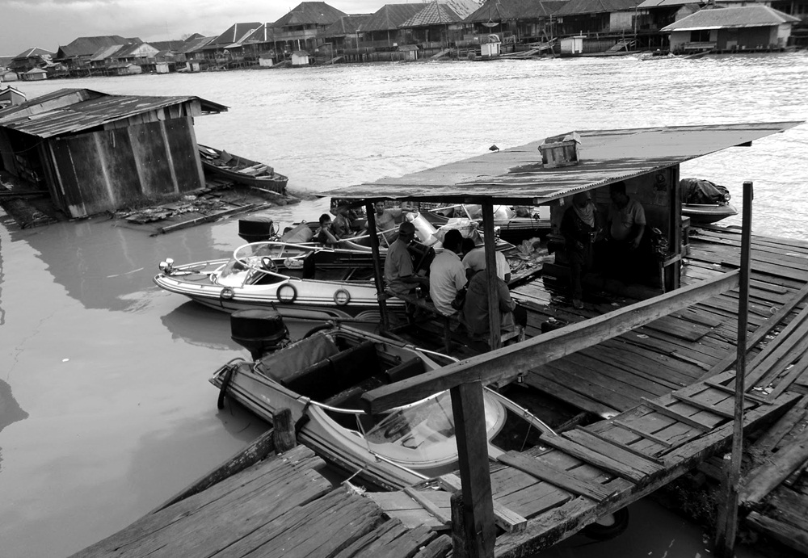

## Si Cantik Dari Negeri Singa

Kabar yang bahagia datang menemui kami. Christy bilang nanti akan datang anaknya bos orang tua kami. Katanya dia masih seumuran dengan kami.  
Tempat tinggalnya di Jakarta, dia ke perusahaan ini untuk mengisi liburannya. Pagi-pagi sekali aku dan teman-teman pergi ke dermaga menunggu kedatangan calon teman baru kami itu.

Saat dia menginjakkan kaki pertama kalinya di perusahaan milik ayahnya ini, kami seperti orang dungu yang tidak ada artinya. Wajahnya sangat oriental, kulitnya putih mulus, dan matanya agak sipit. Dia begitu cantik dan anggun, dia seperti hujan yang ingin segera menghapus kegersangan di perusahaan ini. Perusahaan ini milik Mr. Chen, pengusaha dari Singapura anaknya bernama Lijuan. Kata tantenya Christy, Lijuan itu artinya cantik dan anggun. Nama itu sesuai sekali dengan dirinya.

_“Eh,Chris. Kamu main deh ke kantor. Kamu pura-pura saja menemui tantemu, nanti kalau sudah ketemu sama Lijuan, ajak dia main ke rumah main kita.”_ kataku.

_“Kenapa harus aku, tanteku kan sama juga dengan tantenya bang Egi. Suruh bang Egi sana menemuinya.”_ kata Christy ketus.

Kami semua menoleh ke Egi yang masih shock melihat kecantikan Lijuan.

_“Bang, abang kenapa?”_ tanya Gian.

_“Maaf, kawan-kawan. Aku tidak mungkin menemuinya. Bisa-bisa aku pingsan melihatnya.”_ kata Egi.

_“Wah… sedang jatuh cinta kawan yang satu ini.”_ kata Dimas mengejek.

_“Astaga… kita masih anak kecil, tidak boleh jatuh cinta. Kita bisa celaka kalau jatuh cinta sekarang.”_ ujar Siti menasihati.

_“Chris… ayolah, kau saja. Egi sedang tidak berguna sekarang.”_ bujukku.

Dengan sangat terpaksa, Christy pergi ke kantor yang merangkap rumah itu. Dia menemui tantenya yang bekerja di kantor itu. Setelah beberapa lama menunggu akhirnya Christy datang menggandeng Lijuan. Aku memang yakin, kalau Christy yang kusuruh menemui Lijuan pasti cepat nyambung, karena menurutku Lijuan dan Christy sama-sama menyukai dunia kecantikan.  
Christy berhasil mengajak Lijuan ke rumah main. Egi tak berani memandang Lijuan, sedangkan Dimas, Gian, dan Pahing tak hentinya-hentinya memandang langkah kaki Lijuan. Aku yang merasa tidak senang melihat Pahing memandang Lijuan seperti itu, refleks menginjak kakinya. Kami saling berkenalan hari itu. Ternyata Lijuan sangat ramah sesuai wajahnya. Menurut pengakuannya dia senang bisa mengenal kami.

_“Lijuan, bisa ceritakan tentang Singapura?”_ tanya Dimas, dia memang anak yang banyak nanya.

_“Sebenarnya aku sekarang sudah tidak tinggal di Singapura. Aku tinggal dan sekolah di Jakarta sekarang.”_ kata Lijuan.

_“Jakarta…. itu ibu kota negara kitakan.”_ tanyaku.

_“Iya, itu ibu kota negara Indonesia. Tapi aku bisa menceritakan tentang Singapura dan Jakarta untuk kalian.”_

Egi masih terdiam bersembunyi di belakang Dimas.

_“Singapura itu negeri yang kecil tapi perkembangannya sangat spektakuler, semua itu bisa terjadi karena pemerintahnya yang disiplin. Sejauh mata memandang, mata kita akan dihiasi oleh gedung-gedung pencakar langit. Sebenarnya sama dengan Jakarta, cuman Singapura jauh lebih rapi dari Jakarta.”_

_“Kenapa bisa begitu?”_ tanya Siti.

_“Di Singapura, warganya tidak diperbolehkan membuang sampah sembarangan atau membuang ludah sembarangan. Setiap warga yang melanggar aturan, itu bisa kena denda. Beda dengan Jakarta, warganya sudah diberitahu tapi masih banyak saja yang melanggar. Selain itu, di Singapura, bangunannya seperti gedung pencakar langit, hotel, kantor, rumah susun dan lain-lain tertata dengan rapi.”_

_“Lambang negara Singapura apa?”_ tanya Christy.

_“Lambang negara Singapura itu Merlion, bentuknya seperti ikan duyung berkepala singa. Kalau Jakarta, lambangnya terkenal dengan Monas.”_

_“Eh, sampai di sini dulu berceritanya. Ayo kita ke rumah nenek, kita kenalkan Lijuan.”_ potong Egi terburu-buru.

Kami mengajak Lijuan masuk ke dalam hutan. Awalnya dia takut, karena sebelumnya dia tidak pernah masuk hutan. Tangannya yang mulus terluka karena tergores oleh ranting pohon. Semakin masuk ke dalam Lijuan merengek ingin pulang.

_“Lijuan, kamu akan baik-baik saja bersama kami. Jangan menangis yah. Sebentar lagi sampai.”_ bujuk Egi.

Tidak biasanya Egi berlaku lembut seperti itu pada perempuan. Biasanya dia tidak acuh kalau untuk hal begini.

Sesampainya di gubuk, terlihat nenek sedang mengumpulkan ranting-ranting kayu. Aku menarik tangan Lijuan untuk berkenalan dengan nenek. Tapi saat Lijuan melihat nenek, dia langsung berlari menjauh. Mungkin dia ketakutan melihat wajah nenek yang telah ditutupi keriput dan mengenakan pakaian yang kebesaran. Aku, Egi, Pahing, Dimas, dan Gian berlari menyusulnya. Yang kami takutkan kalau dia tersesat di hutan ini, karena semuanya disini terlihat sama.

_“Eh, gimana, kalian menemukannya?”_ tanyaku.

_“Tidak, dia berlari terlalu cepat. Mungkin di Singapura dia adalah atlet lari.”_ kata Gian.

Aku berusaha menahan tawa atas ucapan Gian tadi.

_“Mugkin dia langsung pulang. Eg, kamu temui tantemu sana, tanyain tentang Lijuan, sudah pulang belum.”_ perintah Pahing.

Egi berlari ke kantor menemui tantenya. Di kantor Egi melihat Lijuan baik-baik saja. Yang jadi masalah dia masih menangis di pangkuan ibunya. Masalah akan tambah besar kalau Lijuan mengadu pada ibunya tentang nenek. Tapi kami merasa Lijuan tidak mungkin melakukan hal itu, kami yakin dia adalah anak baik yang tidak suka mengadu.

Tapi saat malam tiba, aku mendengar ada suara rusuh orang-orang di luar rumah. Aku dikurung di dalam kamar dan teman-teman awan lainnya juga dikurung dalam kamar. Saat aku buka jendela yang bertralis itu, di luar banyak orang membawa obor dan parang. Apa yang akan mereka lakukan, kenapa kami harus dikurung. Kemudian aku teringat dengan nenek, mungkinkah ini balasan atas kejadian sore tadi.

_“May, kamu belum tidurkan?”_ teriak seseorang di luar pintu.

_“Siapa diluar?”_

_“Aku Pahing.”_

_“Darimana kamu bisa masuk?”_

_“Jangan banyak nanya, di mana biasanya umamu menyimpan kunci kamarmu ini?”_

_“Kamu coba masuk ke kamar umaku, di samping lemari biasanya.”_

Beberapa saat kemudian, Pahing membukakan pintu.

_“May, orang-orang mau ke hutan. Aku dengar dari bang Usup katanya mau membakar gubuk nenek. Ini semua pasti karena pengaduan dari anak Singapura itu.”_

_“Bagaimana dengan yang lainnya?”_

_“Mereka sudah kesana duluan lewat jalan pintas di mess belakang. Ayo lari kita susul mereka.”_

_“Tunggu dulu, aku punya ide lain. Bang Usup dimana, dia ikut tidak?”_

_“Dia tidak ikutan untuk masalah ini. Mungkin dia sedang di pelabuhan speedboat.”_

_“Bagus, ayo kita temui Bang Usup. Kita sewa speedboatnya, kita ke Sampit jemput ibu Dewi. Ibu Dewi pasti lebih bisa menyelesaikan masalah ini daripada kita.”_

Pahing setuju dengan ide ini. Kami pergi ke pelabuhan speedboat menemui bang Usup. Awalnya dia tidak setuju namun karena kami berjanji akan membayarnya, akhirnya dia mau mengantar kami. Dengan speedboat perjalanan jadi sangat cepat. Cukup 15 menit kami sudah sampai ke Sampit.

_“May, kamu tahu di mana rumah bu Dewi.”_

_“Tidak.”_

_“Hahh, kalau kamu tidak tahu kenapa kita kesini. Mana kita sudah janji dengan bang Usup bayar 100 ribu. Matilah kita.”_

_“Kamu tenang saja, kita naik ojek ke rumah Dian. Aku ingat kalau rumah Dian katanya dekat rumah bu Dewi.”_

_“Kamu punya uang?”_

_“Tidak."_

_“Gila, tanpa uang mana bisa bayar ojek?”_

_“Kalau sudah sampai rumah Dian, kita minjam uang Dian dulu. Ingat kata bu guru banyak jalan menuju Roma.”_

Kami segera menuju ke rumah Dian. Aku masih berharap semoga warga belum bisa menemukan gubuk nenek. Sesampainya di rumah Dian, aku membujuknya membayar ojek. Sebenarnya dia tidak mau, tapi karena bujukanku dan karena embel-embel ketua kelas, dia rela memecahkan tabungannya. Kami pergi ke rumah ibu Dewi dengan sepeda. Aku kayuh sepeda secepatnya, sementara Pahing duduk di belakang dengan santainya. Pria yang satu ini diyakini saat dewasa tidak akan menjadi pria yang gagah. Pria yang satu ini sudah kelas 6 dan sudah disunat tapi belum bisa mengendarai sepeda.

Setelah bertemu dengan ibu Dewi, aku menjelaskan semua kejadiannya. Kami pun langsung berangkat kembali ke mess. Aku tanpa sadar telah meninggalkan Dian begitu saja sampai lupa mengucapkan terima kasih. Saat di speedboat, ternyata ada pandangan pertama pada waktu yang tidak sempurna. Bang Usup jatuh cinta pada pesona ibu Dewi. Aku dan Pahing tersenyum melihat gelagat yang aneh dari Bang Usup. Sampai di mess, bang Usup juga tidak bisa melepaskan pandangannya dari bu Dewi.

_“Ayo Bu, kita lewat jalan mess belakang. Kita akan lebih cepat sampai, semoga warga belum bisa menemukan gubuknya.”_ kataku sambil menarik tangan ibu Dewi.

_“Ikut tidak Bang?”_ kata Pahing mengajak bang Usup.

_“Boleh?”_ tanya bang Usup ragu-ragu.

_“Bolehlah Bang. Untuk ini yang 100 ribu tidak jadi yah Bang”_ goda Pahing.

_“Untuk ini, bolak-balik gratis. Asalkan ada gurumu itu.”_ kata Bang Usup seraya melempar senyum ke Bu Dewi.

Tapi sungguh tragis, ibu Dewi tidak membalas senyuman itu. Beliau malah balik menarik tanganku. Dengan seketika wajah Bang Usup jadi masam.

_“Huuumm… katanya jadi pria itu harus punya moto hidup. Mati satu tumbuh seribu. Hilang satu, gila sepanjang waktu.”_ ejek Pahing.

_“Diam kamu kocit. Dewasa nanti kamu rasakan yang namanya cinta.”_ ujar bang Usup.

Kami lewat mess belakang. Lewat jalan ini, kami akan lebih cepat sampai ke tengah hutan. Kesulitannya adalah jalannya yang becek. Bermodalkan senter kecil kami membelah malam melewati rerumputan yang tumbuh tinggi sedada orang dewasa. Kami berhati-hati dalam melangkah, salah langkah bisa-bisa kami menginjak berbagai jenis ular disitu. Mendekat ke gubuk nenek aku melihat banyak cahaya dari obor. Ternyata warga telah berhasil menemukan gubuk nenek. Kami berlari menemui asal obor itu.

_“Stooop! apa yang ingin kalian lakukan.”_ teriak ibu Dewi.

_“Siapa kamu? datang kemari tanpa pemirsi.”_ kata ayah Gian.

_“Ini hutan, kenapa saya harus pemirsi dengan anda.”_ sahut ibu.

Gian tertunduk lesu, mungkin dia kecewa dengan ayahnya yang membentak ibu Dewi.

_“Sabarlah bapak-bapak, ibu-ibu. Dengarkan dulu penjelasan ibu guru ini dan anak-anak.”_ kata bang Usup.

“Apa kam tuh, yang ikam tahu tuh pacaran tuam.” kata umaku.

Aku juga tertunduk lesu mendengar ucapan dari umaku itu. Sifatnya memang keras kepala dan sulit untuk diajak bicara santai.

Tiba-tiba Pahing angkat bicara.

_“Kami semua bisa dapat masuk sepuluh besar itu sudah suatu yang membanggakan bagi kami. Semua itu karena campur tangan nenek Jamilah.”_ teriak Pahing.

_“Mungkin menurut kalian kami ini gila. Iya kami memang gila setelah mengenal nenek ini. Kami gila terhadap hutan, kami gila terhadap awan, tapi semua kegilaan kami terbayar dengan ilmu yang kami dapatkan.”_ kata Dimas.

_“Kami ini hanya anak kecil, selama ini kalian yang sudah merusak hutan, kalian yang telah menebang hutan sembarangan, dan mengotori sungai. Kalian tidak berpikir apa kami nanti bisa mengenal yang namanya hutan kalau semua telah habis.”_ kata Christy.

_“Hutan itu tidak pernah habis, pohonnya akan tumbuh lagi setelah ditebang.”_ kata salah seorang temannya bang Usup, seorang pengemudi speedboat juga.

_“Sembarangan kamu bicara. Apakah pohon langsung tumbuh begitu saja dalam hitungan jam. Pohon itu butuh proses bertahun-tahun untuk tumbuh besar. Kalau kalian bisanya hanya menebang saja tanpa ada pengendalian dengan menanam pohon lagi, bisa habis juga pohon di dunia ini.”_ kata bu Dewi geram.

_“Nah, dengar kau, Rick”_ kata bang Usup menepuk keras pundaknya bang Erick.

_“Dia adalah ibu saya, apa salahnya hingga membuat kalian ingin membakar gubuknya?”_

_“Dia yang membuat anak-anak kami sering main ke hutan. Keselamatannya bisa terancam kalau ke hutan begini terus. Saya sudah sering kali melarang, tapi Egi terus saja ingin main ke hutan, ternyata semuanya karena ada nenek ini.”_ kata ayah Egi.

_“Apakah semua yang dilakukan anak-anak berefek buruk pada nilai dan prilakunya? Apakah anda merasa dirugikan dengan mereka pergi ke hutan begini?”_

Semua orang tua terdiam menyerap pertanyaan dari ibu Dewi.

_“Tidakkan? Mereka malah mendapatkan nilai lebih baik lagi. Prilaku mereka memang aneh, tapi emua keanehan mereka semata-mata hanya membuka pintu imajinasi mereka masing-masing. Dan kalian semua tidak dirugikan dengan mereka sering pergi ke hutan, hutan adalah wahana rekreasi dan belajar bagi mereka. Justru kalian harusnya merasa beruntung karena mereka tidak menuntut untuk pergi ke tempat rekreasi semasa musim liburan seperti ini.”_

_“Maafkan kami ibu Dewi. Kami khilaf, kami sudah salah paham.”_ Kata bapaku.

_“Iya, Bu. Maafkan kami. Tapi kalau dia adalah ibu anda, kenapa anda biarkan dia tinggal di hutan seperti ini?”_ tanya ibu Pahing dengan nada yang lemah lembut.

_“Hutan adalah rumah yang sebenarnya bagiku. Sebagus apapun rumah itu, tapi tidak bersahabat dengan alam, rumah itu sama saja sebagai neraka bagi hewan-hewan.”_ kata nenek memotong.

Setelah kejadian malam itu, para orang tua mulai sadar. Umaku telah membeli banyak pot, berbagai macam bunga-bunga liar yang di dapat di hutan ditanam kembali di dalam pot. Di rumah tetangga lain juga begitu. Mereka menanam jenis-jenis bunga di halaman rumah. Usut punya usut awal cerita hebohnya masalah ini adalah karena bang Erick temannya bang Usup. Saat bang Erick mengambil gaji di kantor, dia mendengar Lijuan mengadu kepada ibunya tentang yang telah terjadi kemarin. Bang Erick yang tidak tahu pasti masalah yang sebenarnya langsung bercerita dengan warga. Dari satu mulut menyebar ke mulut lainnya. Sementara itu keluarga Lijuan tidak terlalu mempermasalah kan masalah ini. Bahkan Mr.Chen meminta maaf dengan nenek dan berjanji ingin memberikan salah satu rumah mess yang tidak ada penghuninya. Namun, nenek tetaplah nenek, kemauanya tetaplah keras. Baginya hutan adalah rumahnya dan binatang adalah sahabatnya.

Tapi ada satu masalah yang sempat membuat kacau keluargaku. Genteng yang melindungi dapurku bolong seperti habis dikoyak harimau lapar. Aku sudah tahu kalau semua itu kelakuan Pahing. Aku hanya diam membisu menutupi kesalahan itu. Biarlah ayah dibuat repot untuk kali ini.

“Kejadian kemarin adalah suatu pelajaran, orang yang tidak punya pendirian akan mudah dipengaruhi orang. Kalau ingin jadi orang yang sukses juga harus punya pendirian dan motivasi yang jelas.” jelas nenek.

Kami semua beserta Lijuan duduk di atas pohon yang tumbang mendengarkan petuah dari nenek. Lijuan mulai bisa menerima nenek. Ia berlari pulang pada awal pertemuan kemarin dikarenakan keterkejutan saja.

_“Motivasi yang seperti apa nek?”_ tanya Lijuan.

_“Motivasi yang bisa membuat kalian bersemangat untuk menggapai kesuksesan. Misalnya kalian kagum dengan seseorang dokter lalu kalian ingin sekali sama seperti dia, dialah motivasi kalian untuk maju. Dendam juga bisa dijadikan motivasi, misalnya ada orang yang bilang kalian itu bodoh, kemudian kalian ingin membuktikan kalau kalian tidak bodoh, buktikanlah kalau memang kalian tidak bodoh dengan cara belajar giat.”_

_“Seperti aku yang kagum sama Albert Einstein.”_ kata Pahing.

_“Yah, seperti Albert Einstein. Itu yang di luar negeri. Di kalimantan tengah sendiri ada Pahlawan kita, namanya Tjilik Riwut. Apa yang kalian tahu tentang Tjilik Riwut?”_ tanya nenek.

_“Nama jalan.”_ kataku.

_“Nama bandara.”_ kata Gian.

_“Namanya hebatkan bisa didedikasikan jadi nama bandara dan jalan. Makanya jadilah orang yang hebat yang berguna bagi bangsa agar namamu bisa dikenang selalu seperti Tjilik Riwut.”_ jelas nenek.

_“Kenapa dia bisa dikenang?”_ tanya Dimas.

_“Dia adalah anak Desa Kasongan, dia bisa dikenang seperti itu karena dia seorang pejuang yang gagah berani, pendiri, dan Gubernur Propinsi Kalimantan Tengah, dan juga anggota DPR. Dan hebatnya lagi, ia telah tiga kali berkeliling pulau Kalimantan hanya dengan berjalan kaki, naik perahu atau rakit. Padahal kalimantan adalah pulau besar ketiga setelah Green Land dan Irian Jaya. Bisa dibilang luas Kalimantan mencapai lima kali luas Pulau Jawa. Hebat kan, kalian sendiri berjalan masuk ke tengah hutan sudah banyak mengeluh.”_

Kami tersenyum mendengar pernyataan nenek tentang kami yang suka mengeluh.

_“Sekarang, nenek ingin bertanya cita-cita kalian apa?”_ tanya nenek.

_“Saya ingin menjadi seorang desainer seperti tante di Singapura.”_ kata Lijuan.

_“Alasannya?”_ tanya nenek.

_“Menjadi seorang desainer akan berteman dengan banyak model. Kita juga bisa keliling dunia untuk memperkenalkan rancangan terbaru kita. Selain itu, menjadi seorang desainer yang hebat, yang punya rancangan the best pasti akan menjadi sorotan dunia.”_ jelas Lijuan.

Kami hanya mengangguk mendengarkan penjelasan dari miss Lijuan. Terdengar bisikan Gian kepada Dimas menanyakan arti _the best_ itu apa. Dan Egi masih duduk manis di samping Lijuan.

_“Guru. Aku akan menjadi guru. Guru adalah pahlawan tanpa tanda jasa yang bisa mencentak anak-anak generasi penerus bangsa. Tanpa guru, dunia akan hampa. Kebodohan merajalela. Dan tanpa guru. Kami bukanlah apa-apa.”_ kata Dimas seraya berdiri.

Kami terperangah melihat semangat Dimas yang berkobar.

_“Aamiin. Itu cita-cita yang mulia cucuku.”_ sahut nenek.

_“Dokter.”_ kata Pahing dengan yakin, berdiri juga.

_“Pahing. Kamu yakin itu cita-citamu?”_ tanya nenek.

_“Yakin Nek. Jadi dokter itu bisa kaya raya kan.. Selain jadi dokter, saya juga ingin membangun panti jompo untuk nenek-nenek dan kakek-kakek supaya aman dan tidak tinggal di hutan seperti ini.”_ kata Pahing menggenggam tangan kanannya.

Kami melongo melihat semangat Pahing yang berlebih. Dan nenek memberikan senyuman simpulnya.

_“Jadi pemain tinju. Seorang petinju bisa mendapatkan banyak uang jika bisa mengalahkan lawannya. Liat saja petinju-petinju yang ada di TV itu.”_ kata Gian mengejutkan.

_“Gian. Kamu tuh pantasnya jadi pemain sumo.”_ ejek Egi, disambut tawa gemuruh kami.

_“Sssttt…. itu adalah cita-cita. Tidak ada yang tahu bagaimana Gian dewasa nanti. Siapa tahu dia menjadi laki-laki bertubuh kekar, tinggi, serta gagah. Jangan pernah meremehkan cita-cita orang yah!”_ kata nenek.

_“Lanjut!”_ perintah nenek.

_“Kalau aku jadi komikus dong. Dengan menggambar dan bercerita lewat gambar, aku bisa melupakan sedikit kesulitan dunia.”_ kata Siti melirik kami semua.

_“Jadi pengusaha salon.”_ kata Christy.

Kami semua menatap Christy saat itu. Terasa ada keanehan kalau bercita-cita jadi pengusaha salon. Menurut kami tidak ada yang menarik dari menjadi pengusaha salon.

_“Wajahnya biasa dong. Jadi pengusaha salon itu memiliki 2 keuntungan. Pertama, kita menjual jasa untuk melayani orang menjadi cantik atau ganteng. Dan kedua, aku juga bisa ke salon gratis kapanpun aku mau karena itu milikku. Aku juga bisa berkolaborasi dengan Lijuan untuk menghias model yang memperagakan rancangan kamu yah Lijuan!”_ jelas Christy.

_“Ochh…”_ itu adalah kata yang keluar dari mulut kami secara bersamaan. Lagi-lagi Gian menanyakan arti kolaborasi dengan Dimas.

_“Egi. Kenapa kamu hari ini jadi jinak, biasanya kamu yang pandai memimpin pembicaraan.”_ guyon nenek.

_“Nenek… aku bercita-cita menjadi seorang pilot, biar bisa keliling dunia bersama Lijuan. Jadi kalau Lijuan mau kemana-mana biar aku yang antar.”_ lirik Egi kepada Lijuan.

Sementara itu aku masih terdiam memikirkan cita-citaku.

_“Cita-cita kamu apa Maya Aprilia?”_ tanya nenek.

_“Dulu saya bercita-cita menjadi seorang astronot biar bisa melihat bumi dengan nyata. Tapi sekarang saya sudah punya cita-cita baru. Saya ingin menjadi penulis terkenal, selain itu saya juga ingin seperti Tjilik Riwut berkeliling Kalimantan menjadi seorang petualang.”_ kataku mantap.

_“Hanya berkeliling Kalimantan, tidak mau seperti Egi berkeliling dunia?”_ tanya nenek lagi.

_“Itu nomer dua. Yang terpenting keliling Kalimantan menyibak misteri di hutan Kalimantan. Nenek juga tahukan kalau aku hobi menulis puisi. Suatu saat nanti aku akan menjadi seorang pujangga yang berkarya lewat alam.”_ kataku sambil berdiri mantap.

_“Kalau itu memang cita-citamu, buatlah cita-citamu itu menjadi nyata. Jadilah petualang yang baik dan penulis yang kreatif.”_ pesan nenek.

Di keheningan alam itu, kami masih terduduk menikmati waktu yang tersisa bersama Lijuan. Besok Lijuan akan kembali pulang ke kota berdirinya Monas. Lijuan memberikan kami 7 buah foto sekaligus. Masing-masing dari kami mendapatkan foto yang berbeda. Foto-foto itu adalah foto hasil jepretan di banyak negara. Foto yang aku pegang adalah foto Lijuan berlatar belakang menara eifel. Hatiku menjerit seketika. Aku iri dengan Lijuan.

---

## Bulan Purnama

Nenek sakit. Selama beberapa hari, beliau muntah darah dan demam tinggi. Beliau terbujur lemah di kasur lapuknya. Aku dan yang lain kebingungan. Kami dan ibu Dewi sudah beberapa kali membujuknya untuk berobat ke rumah sakit. Tapi nenek tetap berwatak keras. Beliau tidak ingin meninggalkan hutannya.

Beliau seperti menyimpan jutaan permata di tanah hutan ini.

_“Nek… kenapa nenek tidak mau ke rumah saki.,”_ tanya Siti.

_“Hidup atau mati ada di tangan Tuhan. Walaupun kita sudah berobat sampai keluar negeri tapi tuhan tetap ingin mencabut nyawa kita, kita akan tetap mati.”_ kata nenek.

_“Tapi bu, ini sebagai usaha penyembuhan. Setidaknya kita sudah berusaha untuk hidup.”_ kata ibu Dewi.

_“Biarlah ibumu ini pergi, ibu sudah sangat merindukan ayahmu.”_

Ucapan nenek membuat suasana sunyi senyap. Dari lubuk hati yang paling dalam, aku tidak sanggup untuk di tinggal pergi oleh nenek.

Ibu Dewi berpesan kepada kami untuk menjaga nenek. Saat diberi amanat itu, kami merasakan tanggung jawab yang cukup besar. Sifat nenek yang keras kepala menambah besarnya tanggung jawab kami.

_“Nek, kami tidak mau nenek pergi.”_ kataku.

_“Kalian harus jadi anak yang kuat. Jadilah bulan untuk semua orang.”_

_“Jadi bulan?”_ kata Christy.

_“Yah, lihatlah bulan di malam hari. Bulan yang bundar sempurna seakan-akan mengikuti kita kemanapun kita melangkah. Begitulah jika kalian jadi orang besar dan terkenal. Kemanapun orang tersebut pergi, dia akan selalu mengingatmu.”_

_“Nek, sebelum nenek pergi. Apa yang harus kami lakukan agar nenek bisa bahagia?”_ tanya Egi.

_“Nenek sudah bahagia bisa bersama kalian. Melihat kalian tumbuh besar dan menjadi orang sukses sudah menjadi anugrah buat nenek.”_

Kami semua memeluk nenek.

_“Tapi, nenek punya satu keinginan.”_

_“Apa nek?”_ tanya kami serempak.

_“Nenek ingin melihat festival kunang-kunang untuk terakhir kalinya di hutan Rakuna. Nenek ingin menunjukan kepada kalian nyanyian hutan pada malam hari.”_

_“Kapan, nek?”_ tanya Pahing.

_“Besok malam.”_

Saat malam keesokan harinya, aku dan yang lain kabur diam-diam dari rumah (mana ada kabur terang-terangan).  
Saat itu waktu menunjukan pukul 10.30. Dari gubuk nenek kami melanjutkan perjalanan menuju hutan Rakuna. Suara grasak-grusuk di balik rerumputan dan angin yang semilir membuat bulu kuduk merinding. Siti merangkulku dengan erat pertanda dia mulai kelelahan. Tongkatnya menusuk-nusuk tanah yang agak becek. Pahing dan Egi merangkul nenek yang juga terlihat letih. Dimas yang memimpin di depan memainkan senternya kesana kemari mencari jalan. Gian dan Christy membawa obor.

Sampai di tempat yang di tuju kami terduduk kelelahan. Menurut jam bebek yang melingkar di tanganku saat itu waktu menunjukan pukul 23.15. Untuk menghilangkan kejenuhan, kami menyuruh nenek untuk bercerita seraya menempuh perjalanan.

_“Nek, kami ngantuk. Mana tidak ada makanan disini.”_ keluh Gian.

_“Bersabarlah, sesungguhnya Tuhan mencintai orang-orang yang sabar.”_ ujar nenek.

_“Nek, berceritalah tentang apa saja yang kami tidak tahu untuk menghilangkan rasa kantuk ini.”_ kata Dimas.

_“Baiklah, nenek akan menceritakan sebuah cerita yang pernah diceritakan oleh almarhum ibu nenek dimasa penjajahan.”_

_“Cerita tentang masa penjajahan yah, nek?”_ tanya Christy.

_“Bukan, ini seperti cerita dongeng. Dongeng ini diceritakan saat terjadi perang Indonesia melawan Belanda. Di luar rumah nenek saat itu terjadi pertempuran yang luar biasa. Suara tembakan bersahut-sahutan. Dan suara jeritan juga ikut menghiasi di mana-mana. Nenek dan almarhum ibu nenek saat itu bersembunyi di bawah ranjang. Untuk menghilangkan rasa takut, ibu nenek menceritakan dongeng ini sebelum pinggulnya terhunus peluru nyasar.”_ kenang nenek.

Dengan wajah antusias, kami berusaha untuk mengikuti alur ceritanya. Pahing yang berada di posisi paling pinggir menyesuaikan tubuhnya dengan pohon untuk menyandarkan tubuhnya. Kemudian nenek mulai bercerita tentang pertemanan semut dan keong. Sementara itu Pahing ternyata lebih menghayati cerita ini sampai masuk ke alam mimpi.

Nenek menceritakan tentang pertemanan seekor semut dan keong. Awalnya semut ini selalu bersama dengan koloninya. Tapi semakin hari semut ini semakin bosan selalu bersama dengan koloninya. Semut yang bernama Muti ini akhirnya dipertemukan dengan seekor keong bernama Keni. Keni saat itu dalam keadaan lapar dan lelah. Dia tersesat jauh masuk ke dalam hutan. Para semut menanti malaikat mencabut nyawa keong tersebut. Muti yang merasa kasihan akhirnya mendatangi keong tersebut. Muti memberi makan dan minum keong tersebut. Semut lain yang melihat perbuatan Muti marah besar. Mereka mengusir Muti dan menganggap Muti bukan bagian dari koloni mereka. Mereka juga sempat mengatakan Muti bodoh mau berteman dengan hewan yang lamban serta berliur itu. Mereka berdua meninggalkan hutan itu. Awalnya Muti sedih sekali. Setelah keluar dari hutan itu ternyata terjadi kebakaran hutan yang menghanguskan koloni semut itu. Akhirnya mereka berdua hidup bersama dan saling melengkapi.

Sekali lagi kami belajar bahwa pertemanan tidak memandang perbedaan. Dan juga kita harus membantu orang yang sedang dalam kesusahan. Di balik semua cerita nenek pasti mengandung suatu petuah.

Tidak terasa waktu terus berjalan. Tiba-tiba burung-burung berhamburan memenuhi pemandangan malam di antara terangnya bulan. Mereka bersahut-sahutan. Seakan-akan mereka sedang menyanyikan sebuah lagu. Sungguh indah suasana saat itu. Kami terhenyak atas pemandangan yang disajikan. Entah bagaimana semua itu bisa terjadi. Sempatku berpikir ada orang yang menggangu burung-burung tersebut tidur. Tapi segera kulepas pikiran tersebut. Yang penting sekarang aku menikmati hal ini. Tak lama kemudian kami sampai ke tempat tujuan, memang benar adanya, jutaan kunang-kunang bertebaran menghalau gelap gulita di dalam rimbunan pohon. Sekali lagi kami terkagum-kagum dengan keajaiban ini.

_“Cucu-cucuku, jagalah selalu hutan ini. Siapa lagi yang akan melindungi hutan kita ini selain kalian sebagai penerus bangsa.”_

_“Kami akan selalu menjaganya, nek.”_ sahutku, disambut dengan anggukan yang lainnya.

Nenek memberikan senyuman hangatnya kepada kami sebelum tubuhnya dibungkus oleh kelemahan. Tubuhnya yang kurus kering terjatuh di atas tanah. Kami semua dibuat bingung untuk kesekian kalinya. Siti dan Christy mencoba menyadarkan nenek. Kakiku gemetaran. Dimas terlihat berpikir keras. Egi dan Gian terlihat garuk-garuk kepala. Sementara itu Pahing tertidur lemas di bawah pohon.

---

Bersambung ke [Sahabat Awan Bagian 7](/blog/sahabat-awan-7)
