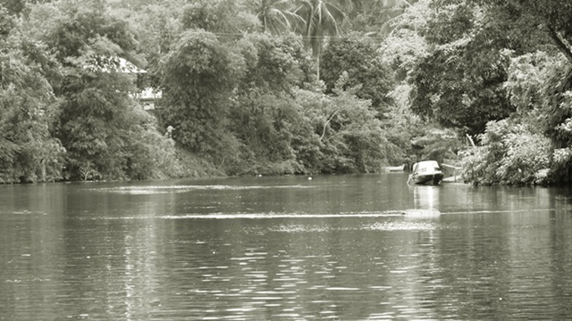

## Jangan Pergi

Masih di tengah hutan, dengan tubuh nenek yang pingsan. Kami berusaha membawa nenek ke rumah sakit.

“_Eg, ayo ikut aku._” perintah Dimas.

“_May, kamu usahakan bertiga itu gendong nenek. Dan kamu Siti bantu senterkan jalan mereka, tapi sebelumnya bangunkan si Pahing dulu._” lanjut Dimas seraya meninggalkan kami.

Sesuai perintah Dimas, kami bertiga berusaha mengangkat tubuh nenek yang kurus. Siti berusaha untuk membangunkan Pahing yang lelap. Namun usaha Siti sia-sia. Pahing tetap tidak ingin memutuskan mimpinya. 

“_Pahing, jangan salahkan aku kalau kamu ditinggal di hutan ini._” kata Siti. 

Kami pun melanjutkan perjalanan pulang meninggalkan Pahing sendiri. Kaki kami semakin lemah dimakan oleh lumpur. Hewan-hewan malam menyaksikan kesengsaraan kami. Kulihat beberapa pasang mata mencoba memperhatikan kami. Saat itu jam menunjukkan pukul 00.15. Kulihat mulut Siti tak berhenti komat-kamit membaca beberapa doa yang tidak aku ketahui itu doa apa dan untuk apa. 

Di tengah perjalanan Dimas dan Egi datang membawa sebuah gerobak. Dengan cepat Egi menggendong nenek dan menaruhnya di atas gerobak. Tidak ketinggalan dengan sebuah bantal untuk meletakkan kepala nenek. Kami semua terpana dan dibuat *shock* oleh kelakuan 2 anak kecil yang akan menyongsong masa remaja ini. 

“*Eh, Gian dan Siti coba bangunkan warga. Dan kalian berdua coba pinjam* speedboat*\-nya bang Usup lagi yah.*” perintah Egi.

“*Tidak mungkin, Eg. Kita tidak mungkin bawa nenek dengan* speedboat*, karena* speedboat *akan menyebabkan goncangan yang mungkin saja membuat nenek jadi tambah sakit.*” kata Siti.

“_Terus bagaimana? Kita harus bergerak cepat._” lanjut Egi.

“_Aahh, aku punya ide. Di perusahaan sebelah ada bidan. Ka Maya dan aku temui bang Usup, terus kita jemput bidan itu. Ka Siti dan Gian coba pinjam kelotoknya pak umar dan jangan lupa bangunkan penghuni mess._” kata Christy dengan semangat menggelora.

“_Hahh bidan. Bidan itukan bisanya cuman mengeluarkan dede dari perut ibu kita._” kata Gian dengan polosnya.

“_Bidan yang ini beda, kudengar dia juga bisa menyembuhkan orang sakit sama kaya dokter._” jawab Christy.

Tanganku ditarik paksa oleh Christy. Kami berlari tergesa-gesa menuju mess bang Usup yang berada di ujung. Kami gedor-gedor pintu mess bang Usup tanpa tahu malu. Terdengar suara langkah kaki dari dalam dan membuka pintu itu pelan. Terlihat bang Usup membawa sebuah sapu yang siap memukul kami. Bang Usup terkejut melihat dua anak kecil  yang diprekdiksi besar nanti akan menjadi pujaan para pria (_super pede_).

“_Hei, kenapa tengah malam begini kesini. Cepat pulang nanti dikira abang mau macam-macam sama kalian._” kata bang Usup.

“_Bang, jangan banyak tanya! Ayo kita ke dermaga, nenek pingsan bang._” teriak Siti menarik tangan bang Usup.

Kami pun bergegas ke dermaga dan menjemput bidan di perusahaan sebelah. Si bidan gelagapan dipanggil tengah malam buta. Beliau juga ikut dalam kegaduhan kami. Setelah mengantar bidan ke mess, kamipun melanjutkan perjalanan ke Sampit untuk memberi tahu ibu Dewi. 

Di mess terjadi kegaduhan yang luar biasa. Nenek segera diangkut menggunakan klotok. Bidan yang diketahui namanya ibu Fatimah itu juga dibuat bingung ketika mengetahui bahwa pasien yang dihadapinya itu bukanlah orang yang ingin melahirkan. Beberapa penghuni mess juga ikut dalam kelotok itu. Bahkan gerobak jelek itu juga tidak lupa diberondong. Sesampainya di kota, karena tidak ada apapun lagi yang bisa diharapkan. Terpaksa nenek diangkut dengan gerobak lagi. Dengan semangat kebersamaan, para orang tua kami mendorong nenek dengan hati yang was-was tentunya.

Aku, Christy, dan bang Usup ditemani sang rembulan malam berlari dengan dukungannya. Wajah nenek adalah semangatku untuk berlari mengingat tidak adanya ojek malam itu. Di depan pintu rumahnya bu Dewi, kami baru merasakan kelelahan yang luar biasa. Bahkan mulut tak sanggap berkata-kata. Hanya tangan yang berusaha mengedor-gedor pintu. Persis sama dengan yang dilakukan bang Usup saat kami mengedor pintu messnya, bu Dewi keluar dengan sebuah pentungan yang lumayan besar mengalahkan tubuhnya. Sontak saja kami berteriak dan berusaha menghindar. Teriakan kami terdengar pula oleh tetangga yang berada di perumahan itu. Beberapa tetangga datang dengan *mandau* dan lain sebagainya, mengira kalau kami ini adalah komplotan rampok.

Dengan wajah yang pucat pasi, bang Usup berusaha menjelaskan kejadian yang sedang terjadi. Berita tersebut ternyata membuat pertahanan tubuh bu Dewi terasa lumpuh. Lengkaplah segala kekacauan yang terjadi. Bu Dewi juga pingsan dengan sukses dihadapan kami.

Setelah dengan segala kemungkinannya, kamipun berangkat dengan lega menaiki sebuah [mobil](/blog/seva-pusat-mobil-murah/) milik tetangga bu Dewi. Rasa Sombongku dan Christy melonjak tingkat dewa saat mobil tersebut berhenti dihadapan teman-teman yang lain di parkiran rumah sakit. Saat kaki sudah mendarat..  
...C*etakk..*  
Kepalaku dijitak dengan sadis oleh bang Usup.

“_Bersyukurlah kamu terlahir dari keluarga sederhana. Kalau kamu lahir dari keluarga kaya raya, bukan mustahil kamu jadi anak yang sombong. Anak sombong neraka tempatnya._” katanya.

“_Baru mobil orang saja sudah sombong._” lanjutnya.

Dengan polos aku bilang “_Alhamdulilah..._”

_...Cetakkk_  
Untuk kedua kalinya aku dijitak dengan sadis dari tangan kasar bang Usup.

“_Aduhh... kenapa lagi, bang? Tadi katanya disuruh bersyukur._” kataku sambil memegang jidat.

“_Itu namanya penghinaan._” katanya judes.

“_Orang dewasa memang aneh. Baiklah, mulai sekarang kita perang. Nanti kalau nenek sadar akan kuceritakan kalau abang sudah jahat._” kataku seraya meninggalkannya.

Terlintas wajah kepanikan menggerayangi wajahnya. Kami pun bergegas menyusul ibu Dewi yang berlari ke ruang UGD. Di samping UGD itu terdampar sebuah gerobak jelek dan kotor. 

“_Ini kenapa ada gerobak gudang disini?_” tanya bang Usup.

“Supaya lebih cepat, jadi kami angkut ibu Jamilah pakai gerobak sampai sini,” kata pak Umar dengan santainya.

Bang Usup langsung memegang kepalanya yang pusing karena membayangkan apa yang sudah terjadi tadi. Ibu Dewi lagi-lagi pingsan untuk yang kedua kalinya. Wajah cemas menghiasi wajah kami semua. Kecuali Gian yang terlihat gelisah. Sesekali Gian menyenggol tubuh Egi, namun Egi tidak menghiraukannya.

“_Bang..._” bisik Gian.

“_Hmmm...._”

“_Temani aku ke jamban_.”

“_Di sini tidak ada jamban, Abdul Gian._” sahut Egi malas.

“_Kalau gitu kita cari pohon aja yuk, Bang!_”

“_Aku ngantuk, ibumu mana?_”

Gian memang patut menderita sebab ibunya tidak ikut ke sini dikhawatirkan laju kelotok akan semakin lamban karena beban tubuh ibunya. Tak hentinya Gian membujuk Egi dan Dimas. Namun apa yang dilakukan Gian hanyalah kucuran keringat percuma. Bergeser sedikit, Gian menyenggol tubuhku. Melihat wajahnya yang memelas, hati pun tersungkur jua. Karena kasihan, aku pun membujuk teman yang lain karena sebenarnya aku juga seorang penakut.

Dengan langkah yang sedikit tegang, kami mencoba untuk mencari toilet. Banyaknya lorong-lorong rumah sakit membuat kami semakin bingung. Dengan gaya sok tau, Egi berjalan dengan santainya belok kiri, belok kanan semaunya yang mengakibatkan kami semua terjatuh dalam masalah lagi. Terdengar suara Christy bergerunum memarahi Egi.

Perjalanan kami untuk menemui toilet dinilai gagal. Jalan untuk kembali mulai kami telusuri. Sebuah ruangan yang berada di ujung lorong rumah sakit menarik hati kami untuk ke sana, karena didepannya ada sebuah pohon yang lumayan besar. Sembari menunggu Gian melampiaskan kebelet pipisnya, Egi iseng membuka sebuah ruangan yang tidak terkunci. Sebuah keisengan dan keingintahuan bersatu. Dimas dan Egi masuk ke dalam ruangan tersebut. Aku dan Christy hanya menilik dari luar tak berani masuk melihat suasana baru yang bisu. Lampu kamar yang remang menambah kesan bisu yang angker.

“_Woy... itu kamar mayat._” teriak Gian mengejutkan kami.

Mendengar itu, aku dan Christy kompak menoleh ke atas yang bertuliskan "kamar jenazah". Bagai sebuah kilatan, dengan refleks kamipun mengeluarkan jurus andalan kaki seribu. Aku berlari sekencang-kencangnya, begitu pula yang lainnya. Belok kiri belok kanan semaunya. Aku berhasil *finish* duluan di depan ruang tunggu disusul yang lainnya.

Dengan nafas yang terengah-engah Egi mengabsen kehadiran kami.

“_Siti cek, Maya cek, Gian cek, Dimas cek, Christy cek. Pahing. Mana Pahing?_” tanya Egi.

“_Pahing masih di hutan._” ujar Siti yang duduk sedari tadi di ruang tunggu.

“_Haahhhhh...._” teriak kami hampir bersamaan dan mengalihkan pandangan kepadanya.

“_Salah dia sendiri tidak mau bangun._” kata Siti.

“_Gawat, kalau bang Pahing dililit ular gimana coba?_” cemas Christy.

“_Oke, sekarang sudah jam 2. Kita coba susun rencana._” kata Egi seperti detektif handal yang diberi misi besar.

Kami merengek minta diantarkan pulang kepada bang Usup. Tapi bang Usup sudah terlanjur betah berada di sisi ibu guru. Sampai akhirnya bang Usup menyerah ketika kami bilang kalau kami ingin mempersiapkan keperluan sekolah untuk hari ini. Dengan langkah yang gontai kami meninggalkan ibu Dewi yang masih dalam keadaan haru. Saat di *speedboat* wajah murung bang Usup juga tak hilang di pandangan mata. Sesampainya di mess, kami bergegas naik ke daratan dan bang Usup secepat kilat memutar balik _speedboat-\_nya.

Dengan perlengkapan yang seadanya kami masuk kembali ke dalam hutan. Di benak kami masing-masing tersembunyi rasa takut yang besar masuk hutan tanpa bimbingan nenek. Hanya Siti yang tidak ikut ekspedisi ini karena dia ditugaskan mempersiapkan keperluan sekolah kami.

Langkah demi langkah kami lewati. Seperti dugaan kami sebelumnya, alam tak bersahabat saat nenek tak ada. Senter kecilku bergerak liar kesana kemari mencari kalau ada mata yang mengintai. Kanopi pohon yang lebat melindungi cahaya bulan ke daratan. Sesekali kami memanggil Pahing, namun tak ada balasan darinya. Mata yang mengantuk membuat langkah kami semakin tak berdaya.

Tepat pada tempat yang masih sama, Pahing masih tertidur pulas. Egi yang geram langsung menghantam kepala Pahing dengan sebuah sundulan. Namun Pahing masih saja melanjutkan mimpinya. Beberapa kali gelitikan dan teriakan hanya membuatnya berpaling wajah. Pantaslah setiap pagi ibunya Pahing terbakar emosi hanya untuk membangunkannya.

“_Kerbau kau, Pahing!_” kata Egi ketus.

“_Huuhh... Sekarang sudah jam setengah empat. Kita harus pulang, mandi dan berangkat sekolah._” kata Dimas mengingatkan.

Kami berdiri terpaku menatap Pahing yang masih mendekur. Sebuah ide terlintas. Pahing sangat geli yang namanya cacing. Gian menggali-gali tanah mencari beberapa ekor cacing, meletakkannya di paha dan sebagian dimasukan ke dalam baju Pahing. Dan tiba-tiba Pahing terbangun menggeliat seperti cacing. Kami hanya tertawa melihatnya menderita.

Kami pun meninggalkan hutan dengan selamat dan menunaikan kewajiban kami untuk berangkat sekolah pagi itu. Di kelotok kami gunakan waktu untuk tidur sebentar. Mata kami loyo saat sampai di sekolah. Beberapa teman mengejek kami habis digantung di atas pohon malam tadi. Ada juga yang bilang kalau kami tidur ditemani oleh ribuan nyamuk melihat kulit kami yang bentol-bentol merah digigit oleh nyamuk hutan.

Saat waktu istirahat tiba, perut yang berbunyi kalah telak dengan ngantuk yang menghantui. Kami gunakan waktu itu untuk tidur sebentar. Dian mencoba menganggu dengan menanyakan apa yang terjadi pada kami. Wajahnya terlihat samar di mataku. Saat itu kami benar-benar merasakan ngantuk yang luar biasa. Bahkan membukakan mata sedikitpun kami tak sanggup. Jam istirahatpun selesai. Ibu guru super sangar yang paling aku takuti masuk ke ruangan kelas. Hentakan tangannya tak kami hiraukan. Terdengar gelak tawa teman-teman silih berganti. Namun mata kami memang sulit untuk diajak kompromi saat itu. Lemparan kapur yang menghantamku, memaksaku untuk tersadar. Kulihat Dimas, Egi, Pahing, dan Siti masih dalam setengah sadar sepertiku.

Atas perintah si guru sangar itu kami pun diizinkan untuk mencuci muka. Kami berjalan loyo pergi ke toilet di lantai bawah. Sesampainya di toilet itu, aku puaskan wajahku dihantam air yang segar. Begitu juga yang lainnya, bertemu air sama halnya bertemu makanan favorit. Setelah terpuaskan, kami berniat untuk kembali ke kelas. Namun kemudian masuk dua orang anak yang kami kenal akrab, Gian dan Christy juga masuk ke dalam toilet itu dengan wajah yang lesu. Melihat dua orang itu, bujukan rayuan untuk tertawa kami hempaskan saat itu juga.

Satu minggu lamanya kami menginap di rumah ibu Dewi. Satu minggu pula nenek dinyatakan koma. Di antara kami tidak ada yang mengerti apa yang dimaksud koma. Kerinduan kami terhadap nenek tidak dapat ditutupi. Terutama kami yang sudah kelas 6 dihadapkan pada ujian dan diwajibkan untuk les setiap hari. Itu artinya kapasitas kami menjenguk nenek harus dikurangi. Kami benar-benar butuh cerita dan petuah-petuahnya yang ajaib.

Satu bulan nenek masih dinyatakan koma. Kami bagaikan telur di ujung tanduk, mengingat dua minggu lagi kami mengadakan ujian kelulusan. Jumat yang kelam menghampiri kami. Berita buruk datang dari Dian si poni yang katanya mendengar percakapan dari para guru di kantor bahwa nenek sudah tiada. Pernyataan itu membuat kami setengah sadar saat itu. Ibu Dewi pergi tanpa ada konfirmasi terlebih dahulu kepada kami.

Saat jam pelajaran agama islam sedang berlangsung, Dimas mencoba berpikir keras untuk bisa melarikan diri. Saat itu Egi yang non muslim berada di ruangan lain untuk mendapatkan pelajaran agama juga. Beruntungnya saat itu guru agama Egi sedang cuti karena suatu hal. Ruangan kami berada di lantai dua.

Kalau kami mencoba membolos lewat tangga yang hanya ada satu-satunya, otomatis kami akan ketahuan karena lokasi tangga berada di depan kantor guru. Egi memiliki ide berlian untuk bisa melarikan diri. Dengan sebuah tali yang dia curi dari gudang lalu mengikatkannya ke sebuah tiang di depan kelas.

Dari luar kaca jendela, Egi memberi isyarat pada kami untuk keluar dari dalam kelas. Satu persatu dari kami izin untuk ke toilet. Dalam hati aku meminta maaf yang sebesar-besarnya pada pak guru Faisal. Dimas, Pahing, dan Egi lebih dulu keluar dari kawasan sekolah mencari becak. Disusul Christy dan Gian yang berlari ke belakang sekolah setelah sebelumnya Christy sempat histeris disuruh turun dari ketingguan 5 meter dari bawah tanah menggunakan tali. Tertinggal aku dan Siti mencari cara untuk kabur karena tidak mungkin Siti menuruni tali tersebut. Dengan langkah yang meragukan aku coba menilik ke ruangan kantor yang berdiri beberapa guru. Dengan membaca *Basmallah*, aku dan Siti mengumpat-umpat melewati kantor. Sesampainya di bawah, kami harus melewati kelas-kelas yang sedang aktif belajar. Bukan tidak mungkin kalau kami tidak ketahuan oleh guru yang sedang mengajar itu. Kami mencoba rileks merasa tidak terjadi apa-apa agar tidak ketahuan oleh guru. Melewati kantin, ibu kantin bertanya kemana kami akan pergi. Otomatis hal itu membuat kami sempat merasa *shock*. Sempat berpikir mencari alasan, Siti pura-pura kalau nyeri di kakinya kambuh. Dengan senyum bahagia kami bisa lolos dan naik becak yang sudah sedari tadi menunggu di belakang sekolah.

Hanya beberapa kali genjotan sepeda. Terdengar suara pak Faisal meneriaki kami dari belakang. Supir becak yang lumayan sudah berumur kami suruh untuk menggenjot sepedanya lebih cepat. Semakin nyaring teriakan pak Faisal, semakin cepat tiga orang supir becak yang tua itu menggenjot becaknya. Siti berulang kali meminta maaf pada tukang becak karena telah berlaku kurang ajar. Setelah berhasil lolos, di perjalanan kami pasrah pada keadaan esok hari yang menjelang. Mungkin saja dipajang di depan kelas, dijemur dekat bendera, atau mungkin dipanggil orang tua. Yang jelas kami pasrah atas hukumannya.

Setengah perjalanan menuju rumah sakit. Tiba-tiba terdengar suara klakson motor dari belakang. Teriakan Christy mengejutkan kami semua. Pak Faisal tidak menyerah mengejar kami.

Dengan semangat menggebu Pahing berteriak “_genjot lagi, kek!_”.

Wajah lelah tidak dapat disembunyikan dari tiga kakek itu. Egi memberi isyarat kami untuk turun dari becak dan berpencar menuju rumah sakit. Lagi-lagi aku ditugaskan bersama Siti. Baru beberapa kali melangkah, kaki Siti mengalami nyeri. Inilah yang dinamakan *ketulah* sama ibu kantin.

Aku dan Siti duduk termangu di depan sebuah TK menunggu nyeri di kaki Siti hilang. Siti memang terkadang merasakan nyeri di kakinya. Keluarganya sedang tidak ada uang untuk mengajak Siti berobat. Semua itu memang harus dimaklumi. Sebuah tangan yang cukup lebar menyentuh pundakku. Sebuah cincin giok yang melingkar di tangannya menandakan ciri khas pak Faisal. Cepat atau lambat kami memang akan bertemu dengan guru yang satu ini. Aku berpaling wajah dan Siti terlihat sedikit *shock*. Namun sebuah senyuman yang mampir di bibirnya membuat kami sedikit bingung.

“_Ayo ikut bapak naik motor! Kita akan lebih cepat sampai ke rumah sakit._” katanya.

Kami dibuat lega dengan pernyataan itu. Akhirnya ada juga sedikit bantuan, setelah mengalami ketengangan beberapa saat yang lalu. Aku dan Siti merasa sedikit bangga karena berhasil sampai duluan ke rumah sakit. Suara teriakan histeris dari dalam rumah sakit mengejutkan kami. Itu adalah suara guru kami tersayang, ibu Dewi. Terlihat bang Usup dan beberapa penghuni mess serta orang tua kami berada di samping ibu Dewi saat itu. Kucoba mendekatkan diri pada sebuah ranjang besi yang dingin. Kulihat sosok wanita tua renta yang kami banggakan terbaring lesu di atasnya. Untuk kesekian kalinya aku menangis lagi, sudah kucoba untuk tegar ingin melupakan *image* cengeng di hidupku, namun hatiku tetap lirih. Begitu juga Siti yang langsung menangis sejadi-jadinya, hingga melupakan rasa nyeri yang menyelimutinya. Kulihat Dimas, Pahing, Egi, Christy, dan Gian menghampiri kami dengan langkah yang gontai.

Tangan mereka memegang erat ranjang besi itu. Butiran air mata mengalir deras di pipi mereka. Kupegang tangan Christy yang berpeluh terasa dingin. Bahkan Egi yang paling anti menangis pun juga luluh ditelan kesedihan. Mungkin tangisan guru, murid, dan para orang tua hanya terjadi di acara perpisahan sekolah. Namun kini semuanya sudah berpindah alih ke rumah sakit.

Kemudian nenek dimasukan ke dalam [mobil](/blog/tips-membeli-mobil-bekas/) ambulans beserta ibu Dewi dan bang Usup yang setia menemani. Kami menumpang sebuah *pick up* milik tetangganya bu Dewi. Sepanjang jalan di atas *pick up* itu, kami belum berhenti menangis mengenang semua pengalaman bersama nenek. Beberapa kali kulihat orang yang berselisihan dengan *pick up* kami ini, memperhatikan kami yang menangis tanpa malu di jalanan. Untuk menghilangkan rasa malu, kucoba untuk menyundulkan kepalaku ke pangkuan Uma. Namun sungguh disayangkan, kepalaku menjadi sebuah sandaran jitak maut Uma.

---

## Puisi di Origami

Sesampai di rumah ibu Dewi, terlihat para tetangga menyambut penuh haru. Apalagi setelah mendengar cerita tentang nenek. Guru-guru kami pun hadir di tempat duka ini. Terlihat juga teman-teman sekelas kami sibuk membantu para tetangga mempersiapkan segalanya. Beberapa kali kami mendapatkan salam turut berduka cita dari teman-teman. Aku menjadi tambah terharu ketika Dian si poni menyentuh pundakku, lalu meminta maaf atas kesalahannya selama ini mewakili teman-teman yang lain sebagai ketua kelas.

Kami masih duduk di depan tubuh nenek di ruang tamu. Semua kenangan bersamanya ingin kukenang selalu, terutama saat beliau memakai baju bekas ibunya Pahing. Pakaian itu benar-benar menguasai tubuhnya yang kurus dan kecil. Kemudian bang Usup keluar dari kamarnya ibu Dewi dan memanggilku sendirian. Aku sempat kikuk sebentar, merasa heran karena dipanggil sendirian. Memasuki kamar ibu Dewi terasa seluruh ruangan dikuasai kesedihan. Beliau memberikanku sebuah origami yang penuh dengan coretan di kertasnya.

“_May, sebelum nenek meninggal. Nenek sempat siuman sebentar. Nenek menuliskan puisi kemudian melipatnya menjadi origami ini. Beliau menagih janjimu untuk membacakan puisi di depannya. Jadi, bacakanlah puisi ini sekarang sebelum nenek dikuburkan._” katanya sambil menangis.

Aku melangkah pelan keluar memegang sebuah origami. Aku telah melupakan janji untuk membacakan puisi buatanku di depannya saat di tengah hutan sebelum memasuki ulangan semester satu kemaren. Kini aku disuruh membacakan sebuah puisi karyanya di depannya dan tentunya di depan para pelayat. Hatiku sempat tersenyum melihat origami ini. Christy pernah berbagi ilmu dengannya mengajari bagaimana cara membuat origami. Bersama-sama kami belajar cara membuat origami dengan Christy. Beberapa kali nenek sempat salah dalam melipat. Hal itu menjadi bahan lelucon kami saat itu tapi nenek tetap menyampaikan jiwa semangatnya melipat origami.

Aku berdiri tidak jauh dari terbaringnya nenek. Semua orang menatapku heran. Kucoba membuka pelan lipatan origami itu. Kulihat Christy melempar senyum padaku. Kutatap ibu Dewi yang berdiri di belakangku disertai bang Usup. Kusaksikan tulisan yang berhamburan, yang saling bersaing antara huruf satu dengan huruf lainnya. Kutarik napas panjang dan kuhembuskan pelan. Dengan *bismillah*, kucoba membacanya di depan banyak pelayat. 

### BURUNG AWAN DAN MELATI

_Burung awan beradu dalam sangkarnya  
Kulepaskan dengan cara yang gila  
Aku teriris mereka disangka sinting  
Kulukiskan lebih jauh hidup ini penting_

_Kusediakan langit sebagai kanvasnya  
Kusediakan alam sebagai kursinya  
Hidup mereka adalah imajinasinya  
Aku hanyalah kuas kecil tak bernyawa_

_Jikalauku termakan tanah makam  
Kuharap mereka tidak meninggalkan warna  
Tidak tenggelam pada gelapnya mala  
Tidak juga terperosok pada jangka lama_

_Aku mencintai sebuah melati  
Dulu dia layu dihadapanku  
Kini kubahagia dia subur kembali  
Dialah melati tanpa tanda jasaku_

_Burung awan jangan terbang jauh  
Hinggaplah terus pada melatiku  
Karena melatiku akan selalu memberikan sarinya  
Begitupula kalian yang akan menjaganya_

Aku mengerti benar maksud dari puisi itu. Puisi itu menggambarkan kami bertujuh dan ibu Dewi. Kulirik ibu Dewi yang menitikkan air matanya. Kusaksikan teman-teman yang belum tentu mengerti maksudnya juga menangis tersedu-sedu. Aku terduduk lemah dihadapan jenazah nenek.

Sebelumnya aku pernah bercerita dengan nenek ingin seperti Chairil Anwar yang menciptakan puisi fenomenal seperti puisi yang berjudul “Aku”. Aku ingin sekali menggabungkan sosok pujangga Chairil Anwar dan sosok petualang santun Tjilik Riwut dalam diriku. Tapi aku tak pernah mengharapkan petualangan pujangga yang melupakan janji seperti diriku ini.

Sampai saat nenek dimasukan ke liang lahat, hati kecilku masih tidak bisa terima dengan hal tadi. Kenapa bukan puisi karyaku yang dibaca? Dan kenapa juga, aku membacakan puisi itu di saat nenek sudah tidak bisa mendengar dan melihat? Ujian sudah di depan mata, dua minggu lagi kami siap bertempur. Banyak kaka-kaka yang sudah SMP bilang kalau melewati ujian di waktu SD seperti melangkahi selokan saja. Tapi hal itu berbanding terbalik dari para guru. Guru terkesan menakut-nakuti kami. Alhasil bagi jiwa yang lemah, bisa saja mundur sebelum pertempuran dimulai. Untunglah kami masih punya ibu guru titisan dari nenek yang kami cintai. Beliaulah yang memompa semangat kami untuk terus lanjut.

Kami berlima masih menginap di rumah ibu Dewi. Karena tidak memungkinkan bagi kami untuk pulang ke mess. Setiap hari ada saja bang Usup menjenguk kami ke rumah bu Dewi. Bukan saja menjenguk kami, tapi sekaligus membahas rencana pernikahan mereka. Memang sebelum nenek dipanggil yang di atas, nenek katanya sempat siuman sebentar, dan kesempatan itu digunakan bang Usup untuk meminta restu menikahi bu Dewi dari nenek. Karena tidak ada pilihan lain, terpaksa nenek merestui hubungan mereka. Bang Usup tipe pria santun, suka bekerja, dan pintar mencari kesempatan. Siti katanya sempat mendengar percakapan mereka bahwa mereka akan melangsungkan pernikahan setelah ujian selesai. Sepertinya bukan kami lagi yang menghinggapi melati itu, tapi seorang bujangan penghuni dermaga *speedboat* yang telah memetiknya.  
Hari ujian pun tiba. Kami terbagi menjadi dua ruangan sesuai abjad nama. Aku dan Siti berada di ruangan 2, sementara Pahing, Egi, dan Dimas berada di ruangan 1. Sempat ada kekecewaan dalam hatiku karena aku harus terpisah dari Dimas yang suatu saat bila ada kesempatan bisa digunakan (_mencontek gitu_). Tapi lembaran puisi yang kulipat lagi menjadi burung origami itu menjadi barang pemberi semangatku. Agar burung origami itu tidak dikira bahan contekan karena terlihat banyak tulisan di kertasnya, aku memasukannya ke dalam baju seragam supaya dekat dengan hatiku.

Sesuai dengan anjuran ustaz Zai, mulailah sesuatu dengan mengucap *basmallah*. Kumulai mengerjakan soal dengan membaca *bismallah*. Kupegang prinsip *do the best, be the best*. Bilaku sedikit mengalami kebingungan, kucoba menenangkan jiwa dan kupegang perutku merasakan origaminya di dalam seragam. Bilaku masih tak bisa menjawab. Terpaksa kutengok teman di depan, belakang, kiri, dan kanan. Itulah jalan terakhir untuk bisa menjawab, menyelamatkan orang tua dari malunya ketidaklulusan. Mohon jangan ditiru.

---

Bersambung ke [Sahabat Awan Bagian 8](/blog/sahabat-awan-8)
