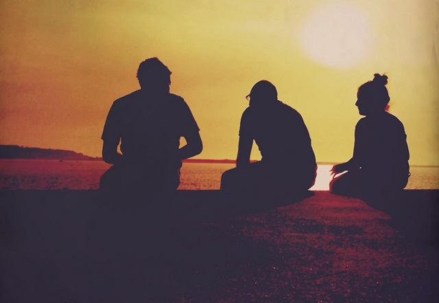

## Ada Pertemua dan Perpisahan

Selesai menjalani ujian yang menegangkan selama beberapa hari. Inilah waktunya untuk menyegarkan otak dan menentukan jalan selanjutnya.  
Ayah bilang kalau kami sekeluarga akan balik ke kota kecamatan Kumai karena ayah sudah mendapatkan kerja di sana lewat temannya. Itu artinya aku akan menjalani SMP di sana. Aku belum berani bercerita hal ini kepada yang lain. Kucoba mengeksplorasi hutan untuk menyegarkan hati sendirian. Aku duduk di atas pohon tumbang, dimana kami dan nenek selalu bersantai. Mungkin ini adalah perpisahan antara aku dan hutan penuh kenangan ini.

Kupandang kembali burung origami itu untuk kesekian kalinya. Benda inilah yang menjadi jalan komunikasi aku dan nenek. Bicara tentang burung, burung Tingang adalah burung yang mempertemukan kami dan nenek. Seandainya burung itu melintasi hutan ini lagi, ingin kuucapkan terima kasih yang sebesar-besarnya. Aku bangkit dari pohon tumbang itu dan menuju gubuk nenek yang tak berpenghuni. Kusaksikan ribuan jaring laba-laba berkeliaran di dalam gubuk itu. Tak ada benda berharga di dalam gubuk itu selain kasur lusuh, beberapa sendok, piring, gelas, peralatan masak yang tak karuan bentuknya dan tungku yang tak lagi berasap. Kulirik sebuah gelas bermotif bunga yang tersudut di antara tungku itu. Gelas itu adalah gelas kesayangan nenek. Nenek tidak mau minum kalau tidak dari gelas kesayangannya itu. Kuambil gelas indah itu sebelum diambil tangan yang tidak bertanggung jawab.

Aku pun pergi meninggalkan gubuk tua menuju rumah main awal pertemuan kami dengan nenek. Sebuah kejutan ternyata menungguku dari tadi. Teman-teman yang lain duduk dengan lesu di rumah main. Aku bertanya dalam hati apa yang telah terjadi.

“_Hei, kenapa lesu nih? Kemaren ada kesalahan dalam mengerjakan soal yah?_” tanyaku.

“_Dari mana saja kamu, May?_” tanya Pahing balik.

“_Aku dari gubuk nenek mengambil gelas ini sebelum ada orang lain yang mengambilnya,_” kataku menunjukan gelas itu.

“_Gawat, May. Gawat. Perusahaan ini katanya sudah disita pemerintah. Kita semua akan meninggalkan mess ini,_” kata Egi.

“_Aku sudah tau. Sebelumnya kan kita memang sudah susah. Jadi, cepat atau lambat kita memang harus meninggalkan tempat ini,_” kataku sok pintar.

“_Jadi?_” tanya Siti.

“_Jadi aku akan kembali ke Kumai, melanjutkan sekolah di sana, dan kalian akan ikut orang tua kalian masing-masing. Ingat cerita nenek bahwa ada pertemuan pasti ada perpisahan. Walaupun kita terpisah, tapi yakinlah suatu saat nanti pasti kita bisa bertemu kembali,_” kataku masih dengan sok pintar.

“_Ehem... sudah pintar bicara seperti bang Usup nih,_” kata Dimas mengejek.

“_Iya nih Maya. Jadi kalau begitu kita tidak bisa hinggap di bunga melati selamanya dong,_” kata Siti.

“_Kenapa harus hinggap di bunga melati itu lagi. Kan sudah ada yang memetiknya,_” kata Christy mantap.

Berkat perkataan Christy itu suasana menjadi lebih mencair. Kami berusaha rileks saat itu. Aku mengajak mereka berimajinasi dengan awan bersama-sama untuk yang terakhir kalinya. Tapi belum sempat kami memulainya. Seekor burung Tingang melintas dihadapan kami. Dengan langkah yang cepat Gian berlari mengejar burung langka itu.

“_Gian.... jangan dikejar,_” teriak Christy.

“_Iya Gian. Biarkan burung itu terbang sebebas-bebasnya seperti imajinasi kita yang bebas berkarya,_” kata Egi sok dewasa.

Gian pun menghentikan langkahnya. Kemudian dia melambaikan tangannya pada burung itu. Tanpa ada instruksi, kami pun juga ikut melambaikan tangan pada burung itu. Aku terharu saat itu dan berteriak terima kasih seperti orang gila yang berbicara pada makhluk yang belum tentu mengerti.

Sambil menunggu pengumuman, sekolah kami akan mengadakan perpisahan sekolah yang diadakan di halaman sekolah. Kami yang kelas 6 ditugaskan untuk membuat pertunjukan memeriahkan acara perpisahan. Sebagian dari kami ditugaskan membawa paduan suara. Kemudian ada juga yang menampilkan tarian tradisional dayak. Sebagian lagi mempersembahkan drama pinokio perpaduan antara kelas 5 dan kelas 6. Diantara ketiga itu tidak ada yang menarik hatiku untuk berpartisipasi. Hanya aku dan Siti yang belum mendapatkan bagian. Siti merendah diri karena beranggapan suaranya jelek dan kakinya yang cacat.

Aku berusaha menghiburnya dan mencari cara agar kami bisa berpartisipasi di acara tersebut. Bu Dewi menyarankan kami berdua untuk membaca puisi. Aku sempat menolak. Sebenarnya aku hanya hobi menulis puisi, tapi untuk membawakannya aku sangat di bawah standar. Bujuk rayu sang melati nenek akhirnya membuatku luluh.

Siti kuajak masuk ke dalam kamarku yang berjajar puisi-puisi di dindingnya. Kubiarkan dia memilih puisi sesuka hatinya. Sebuah puisi yang berjudul “Bulanku Malang” yang aku buat saat kelas 3 SD ketika sebagian teman pergi meninggalkan mess ini menjadi pilihan Siti. Alasan Siti memilih puisi itu karena hanya terdiri dari 3 bait.

“_May, maksud dari puisi ini apa?_” tanyanya.

“_Entahlah Sit. Yang jelas aku sudah membuatnya. Terkadang aku tak mengerti apa maksud dari puisi yang aku tulis, tapi anehnya hati kecilku memahami isi yang terkandung. Tidak semua hal itu memiliki penjelasan, kan?_”

“_Iya juga sih. Entah kenapa aku memiliki ikatan batin dengan puisi ini. Jadi, buat aku saja yah puisinya._”

Kubalas permintaan Siti dengan senyuman. Sementara itu, aku masih bingung membongkar-bongkar lembaran puisi yang aku simpan di dalam kardus bekas. Semua puisi yang aku buat tidak ada yang sesuai dengan keadaanku sekarang. Aku memutuskan untuk membuat karya baru yang lebih sesuai dengan kondisi saat ini. Aku duduk di atas mess yang bertingkat dua. Mess ini kosong tak berpenghuni. Sempat terkenang keramaain di mess ini dulu. Sebuah buku dan pulpen menemaniku berlayar mencari inspirasi. Sudah sejam lamanya aku termangu tanpa menorehkan sepatah katapun pada lembaran kosong itu.  
Bahkan awan pun sedang tidak berpihak padaku. Mungkin inspirasi sedang malas bertemu.

_Tuuuut..._

Sebuah peluit panjang dari kapal penumpang mengejutkanku. Aku bangkit dari duduk dan berlari mengejar asal suara itu. Aku beruntung, sebuah inspirasi besar akhirnya menghampiriku. Aku beranggapan bahwa itu kapal pesiar dan kuhubungkan dengan keadaan perusahaan saat ini. Akupun mulai menorehkan puisi terfenomenal dalam karir kepenulisan puisiku selama ini. Terciptalah sebuah puisi yang berjudul “Negeri layaknya kapal pesiar”.

Hatiku cenat-cenut menunggu penampilan perdanaku di depan orang tua dan guru. Egi dan Dimas telah selesai menampilkan paduan suara hymne guru. Sekarang giliran kami berdua bersama Saskia untuk membacakan puisi. Saskia mendapat giliran pertama membacakan sebuah puisi berjudul “Guruku Sayang”. Para penonton mulai terharu menyaksikan pembawaan Saskia yang sedih. Siti menatap wajahku, bahwa dia sekarang dalam keadaan kritis. Kutepuk pelan pundaknya mengalirkan semangat dari auraku. Tibalah giliran Siti membacakan puisinya.

### BULANKU MALANG

_Bulan tak bercahaya lagi  
Matahari semakin terik  
Hujan tinggal menunggu waktu  
Pelangi tak sabar menanti_

_Biarlah bulan tak bercahaya lagi  
Tinggallah matahari yang terbunuh iri  
Hujan telah menguasai diri  
Kuberikan kau sebuah pelangi_

_Pelangi memang tak indah di malam hari  
Hanya kau yang mengerti  
Siapa pemilik hati pelangi  
Ambillah pelangimu wahai matahari_

Dengan puisi yang hanya terdiri dari 3 bait itu, Siti berhasil mengundang decak kagum karena pembawaannya yang luar biasa bagus. Aku tak yakin puisiku itu bagus, yang aku yakini semua itu karena Siti bersifat ekpresif. Kali ini aku yang dibuat minder dengan ekspresi pede berlebihan dari Siti. Aku pun maju satu langkah setelah Siti selesai dengan puisinya. Tanpa melupakan petuah ustadz Zai, bacalah *basmallah* sebelum memulai sesuatu.

### NEGERI LAYAKNYA KAPAL PESIAR

_Biarkan dia berlayar sesuka hati  
Kembangkan layar merajai negeri  
Regangkan otot-otot mesin di sebuah pulau  
Menikmati hidangan peluh_

_Deretan tangga yang cukup tinggi  
Gunakan tahta untuk harga diri  
Lebih permata orang kampung  
Daripada berlian yang tak rampung  
Orang gila beradu statement_

_Mereka santai dengan empat roda  
Kantong rakyat semakin surut  
Yang bertangga semakin larut  
Indonesia….. Indonesia….._

_Teringat ketika pejuang membungakan bangsa  
Rakyat senang yang berkuasa gemilang  
Bertemu dalam satu wadah kokoh  
Mencerminkan keringnya darah_

_Kami bukan sekedar ombak  
Tapi kamu kumpulan gelombang  
Kalian hanya membayar panah  
Pegasnya pun penuh nanah_

Kuhembuskan nafas ketegangan yang melilit urat nadiku. Emosiku perlahan-lahan menurun selesai membaca puisi itu. Suara tepuk tangan dari penonton mulai menyadarkanku ke dunia nyata. Siti bilang, saat aku membaca puisi tadi sungguh bersemangat. Dia juga bilang kalau aku menghembuskan semangat “45” dari bilik-bilik kursi penonton. Bahkan ibu Dewi bilang kalau dia *merinding disko* melihat semangatku yang berlebih. Meskipun ibu Dewi sebenarnya punya sejuta kritik terhadap puisiku tersebut.

Selama ini tidak ada orang yang pernah memujiku selain nenek. Bahkan orang tuakupun jarang memberikan semangat atau pujian. Mungkin terakhir kali mereka memberi pujian saat aku belajar berjalan. Ternyata kata “Semangat yah” atau “Kamu hebat sekali” atau apapun itu kata yang berarti memuji atau memberi semangat merupakan kata yang menjadi ujung tombak dunia. Namun terkadang sebuah pujian yang berlebih juga bisa membuat kita terperosok pada jurang kesombongan. Maka dari itu nikmatilah pujian dengan semestinya.

Hari itu kami habiskan waktu bersama-sama untuk yang terakhir kalinya. Baru kali ini, kami bertujuh benar-benar berbaur pada kawan-kawan sekelas. Bang Usup juga hadir mewakili ibu Pahing yang sakit. Dan untuk pertama kalinya kami bertujuh difoto setelah beberapa tahun bersama. Setelah hari yang melelahkan itu kami pulang ke mess dan mempersiapkan barang-barang yang akan dibawa pulang kampung. Kami diberi waktu satu minggu lagi untuk bersiap meninggalkan mess ini. Beberapa barang kami sudah dikirim ke Kumai. Kami akan meninggalkan mess ini setelah surat kelulusan keluar.

Empat hari kemudian surat kelulusan keluar. Aku yakin sepenuh hati kalau aku akan lulus dengan sukses. Begitu juga dengan yang lainnya yakin akan lulus 100%. Melihat senyuman dari ibu Dewi menambah sinyal kalau kami berhasil. Kami dikumpulkan di halaman sekolah. Aku berbaris diantara Pahing dan Dian. Bapak kepala sekolah mengumumkan hasil kelulusan kami. Dan Dian mendapat penghargaan karena berhasil mendapatkan nilai terbaik diantara kami semua. Kulihat wajah Dimas yang lesu mengetahui kabar tersebut. Egi berusaha merangkulnya untuk tabah.

Setelah pengumuman itu, kami berlima dipanggil ibu Dewi ke ruangannya. 

“_Bapak guru yang pintar. Kamu yang tabah yah. Nilai kamu cuman beda 1 angka dari Dian. Nilai itu belum seberapa karena perjalanan masih panjang. Dan juga kalian, berusahalah untuk menjadi yang terbaik. Jangan bangga dengan nilai yang aman,_” kata bu Dewi kepada Dimas.

“_Iya bu guru,_” sahut kami kekanakan.

“_Dan untuk dokter kita yang satu. Kemajuan kamu sangat pesat Pahing. Ibu bangga sama kamu. Kamu ada diurutan ketiga setelah Dimas,_” kata ibu Dewi lagi.

Pahing melonjak kegirangan. Kami berusaha memegang tubuhnya yang bergerak kesana-kemari seperti orang kesurupan. Kemudian ibu Dewi memberikan kami masing-masing bingkisan kado. Agar tidak terjadi iri diantara kami, ibu Dewi juga menitipkan bingkisan untuk Christy dan Gian. Setelah kecupan perpisahan untuk bu Dewi, kamipun pergi meninggalkan sekolah ini. Karena hari ini adalah hari terakhirku di kota ini, aku membujuk teman-teman untuk berkeliling kota Sampit sebentar. Dengan berbekal roti seadaanya, kami berjalan menelusuri jalan menuju taman kota. Bercerita tentang cita-cita yang akan diraih. Bercerita tentang jalan yang akan ditempuh selanjutnya.

Kupandangi wajah satu persatu dari mereka, agar aku tak pernah melupakan wajah mereka. Tertawa lepas adalah satu-satunya hal yang harus kami lakukan di detik-detik perpisahan. Menangis sungguh tak akan berguna.Dihari terakhir kami di mess ini, pagi-pagi buta aku dan teman-teman pergi ke rumah main. Kami masuk ke dalam hutan demi menyaksikan gubuk nenek untuk terakhir kalinya. Ada ular besar yang menghadang kami di depan pintu. Beberapa saat kami menunggu, akhirnya ular itu pergi berlalu. Egi membuka pintu gubuk nenek pelan-pelan. Yang terlihat hanya debu, sarang laba-laba dan barang-barang nenek yang berhamburan.

“_Nek, Pahing udah berhasil lulus dengan nilai yang baik nek,_” kata Pahing.

“_Nek, Egi janji akan lebih baik dari sekarang,_” kata Egi.

“_Nek, Christy pasti akan menggapai cita-cita Christy, nek._” Kata Christy.  
“_Gian juga akan menggapai cita-cita Gian._” Kata Gian.

“_Dimas janji akan berjuang untuk menjadi yang terbaik dari yang terbaik._” kata Dimas.

“_Siti nggak akan pernah menjadikan kekurangan Siti sebagai halangan lagi nek,_” kata Siti.

“_Nek, Maya dan teman-teman sayang nenek. Semoga nenek bahagia di surga. Maya akan selalu berusaha mengenang nenek dan teman-teman. Sama seperti teman-teman, Maya akan berusaha menjadi lebih baik dan bisa menggapai cita-cita Maya,_” kataku meluapkan isi hati.

Itulah kata-kata yang kami bayangkan saat kami mengatakannya nenek masih ada di rumah itu.

Di mess kami disambut oleh barang-barang yang bergelatak di atas batang. Inilah saatnya kami pergi meninggalkan mess ini. Kami saling mengucapkan perpisahan antara satu dengan yang lainnya. Air mata persahabatan mengalir di tonton oleh dalamnya air sungai. Siti memberikanku selembar kertas bergambar anime yang memiliki karekter kami bertujuh. Kemudian aku memeluknya erat. Siti adalah sahabat yang paling akrab denganku. Dialah yang bisa menyatu denganku dengan cara yang berbeda. Kalauku bilang pelangi itu adalah kumpulan warna yang membentuk harmonisasi. Dia akan melukiskan bahwa pelangi itu beginilah indahnya, beginilah bentuk dari kumpulan harmonisasi itu. Kami berdua akan mendeskripsikan benda dengan cara yang berbeda namun dengan pengertian yang sama.

“_Em, taukah kamu kalau lukisan itu tidak hanya berbingkai dan dipampang di dinding?_” tanyanya di detik-detik perpisahan.

“_Nggak tau Sit,_” kataku heran.

“_Coba kamu lihat warna putih di mess kita ini,_” katanya menunjuk salah satu mess.

“*Warnanya tidak* full *putih kan! Ada bercak-bercak dan goresan-goresan kuning kecoklatan dicatnya karena rembesan air hujan. Itulah lukisan yang dibuat oleh alam,*” katanya mantap.

Aku terdiam dan kucoba menutup mata untuk membuka pintu imajinasi. Perlahan kucoba membuka pelupuk mataku dan kutatap kembali dinding itu. Benar. Di situlah sebuah lukisan panaroma pantai di sore hari yang tertutupi. Aku sungguh kagum. Dinding yang bercat putih itu memang sudah lama tidak pernah diperbaharui lagi, terciptalah warna alam yang menghiasi. Daya imajinasi Siti sudah merajalela di luar kendali. Kupeluk dirinya lagi untuk yang terakhir kalinya.

Selamat tinggal Pahing yang ceroboh. Selamat tinggal Egi yang sok dewasa. Selamat tinggal Dimas yang culun. Selamat tinggal Gian yang gendut. Selamat tinggal Siti yang cuek. Dan selamat tinggal Christy yang cerewet. *I love you all*. Kuharap di masa yang akan datang kita bisa bertemu kembali dengan wajah yang sukses sesuai dengan impian. Itulah kiranya isi hatiku saat itu.

---

## Masa-masa Sulit

Setelah ayah melepas pekerjaan itu. Keuangan keluarga sungguh sudah di luar kendali. Beberapa kali ayah melamar pekerjaan namun selalu saja ditolak. Ayah terpaksa ikut menjadi nelayan yang meraup rezeki dari laut. Nilai sekolahku pun berangsur-angsur merosot. Inilah yang ditakutkan nenek. Semakin dewasa semakin tidak bersemangat. Apalagi sekarang di zaman globalisasi yang berusaha menguasai unsur pergaulan manusia.

Aku merasa asing di tempat kelahiranku sendiri. Aku merasa hidup sendirian di muka bumi ini tanpa ada kawan yang bisa mengerti. Beberapa kali aku sempat akrab pada orang yang aku akui sebagai sahabat. Namun akhirnya berujung pula pada perkelahian. Inikah sahabat yang menjatuhkan kawannya sendiri?

Sungguh, mencari kawan yang bisa dibilang sahabat karena kesetiaan, pengertian, dan pengorbanan itu sangat sulit. Kita harus terhisap dulu ke dalam pasir hisap, menembus gua yang gelap, terjun dari atas bukit, dan menyelam ke dasar laut. Aku hampir saja terjebak ke dalam lembah hitam narkoba karena yang namanya sahabat, sebelum akhirnya aku disadarkan oleh origami pemberian nenek. Wanita itu bagaikan berlian. Memancarkan sinar kecantikan dari pantulan kilauannya. Indah memang, tapi tak ada yang tahu kalau kesombongan menguasai pemiliknya. Dan yang terjadi di masa sekarang, banyak berlian yang sudah tak karuan.

Sebelumya aku juga sempat merasakan manis, asam, pahitnya cinta. Beberapa kali aku jatuh cinta pada seorang laki-laki. Namun semuanya berakhir dengan kekecewaan. Bagiku laki-laki adalah sebuah misteri tersendiri. Mereka jinak di depan, namun ganas di belakang. Laki-laki adalah permata hitam, mereka memperlihatkan kejantananya dengan warna hitamnya, namun tetap tidak lupa memperlihatkan kualitasnya. Tapi tidak semua laki-laki itu permata. Di dunia ini banyak laki-laki permata palsu. Hanya sedikit yang benar-benar permata.   
Beberapa mata pelajaranku berwarna merah. Aku terancam tidak bisa naik kelas. Tapi entah kenapa, semakin aku tersudut semakin aku merindukan Allah. Moment inilah kujadikan ajang menguatkan iman dan minta petunjuknya. Entah ini mukjizat atau apa. Nenek hadir di mimpiku pada malam menjelang ulangan. Beliau bicara panjang lebar memarahiku.

“_May, di mana kamu sekarang?_” tanya nenek

“Aku di sini, nek. Masih di sini,” Jawabku.

“_May, kamu telah tertinggal jauh. Kamu yang nenek harapkan menjadi orang hebat, tapi ternyata kamu tidak ada apa-apanya sekarang. Teman-temanmu telah berlari jauh, ada apa denganmu, cucuku?_”

“_Entahlah nek, aku merasa ada rantai yang mengikat kakiku._”

“_May, janganlah memiliki mental pohon cabe yang tidak bisa tumbuh tinggi sepeti pohon jati. Janganlah menjadi seorang penghayal yang tidak bisa berbuat banyak. Kamu tidak menyadari kebiasaanmu melihat awan itu, sebenarnya hanya ilusi semata. Sudah lama awan-awan itu mengolokmu. Bangkitlah cucuku, jangan terlalu lama tertidur dalam mimpi-mimpimu._”

Aku terkejut dari mimpi itu. Perlahan aku mulai merasakan gelombang semangat datang bergejolak memenuhi ruang jiwa ragaku. Sejak itulah, kesadaranku akan pentingnya ilmu berangsur-angsur pulih. Aku pun mulai giat belajar walaupun sudah hampir terlambat. Namun sebenarnya, belajar itu tidak mengenal kata terlambat, kawan.

Lulus SMA keluargaku masih dalam masa sulit. Rumah idaman kami tak kunjung terbangun jua. Sebuah rumah kontrakan sempit masih menjadi haluan kami. Aku iri melihat semua teman-temanku bisa melanjutkan kuliah semaunya. Sementara aku masih terdampar di lautan kegalauan. Pesan nenek selalu kuingat untuk pantang kehilangan asa. Aku mencoba untuk berpikir ke masa depan.

Seringku berpikir untuk pergi meninggalkan dunia ini dan pergi menyusul nenek. Aku tidak ubahnya remaja yang frustasi, yang kehilangan arah angin, tak punya pegangan. Aku butuh pelukan hangat dari orang-orang yang ada dalam kenangan tempo dulu.

Tak ada persaingan menggapai prestasi. Sungguh hidup terasa statis. Tulisan yang pernah kutulis dalam skenario hidupku, kini tak bisa kukembalikan karena semuanya telah aku adegankan. Dihadapanku kini terbuka lembaran baru, tinggal bagaimana pena kehidupan ini mengarahkannya.

---

## Cinta Segitiga di Simpang Lima

Sepulang bekerja dari toko sembako jelek itu aku tak kuasa menahan lelah dan merebahkan diri ke atas kasur yang jelek juga. Karena ulah Dian, aku mendapatkan teguran keras dari bu Nia. Dian lah yang membuat konsentrasiku buyar. Kubuka sebuah kaleng bekas Khong Guan yang terselip di bawah ranjangku. Beberapa mainan bekas yang aku dapatkan di sungai masih kusimpan sebagai kenangan. Burung origami  pemberian nenek bergelantungan di langit kamarku. Sebenarnya aku sudah melupakan kejadian yang telah lalu, namun karena Dian, lembaran-lembaran memori itu terungkap kembali. Akhir-akhir ini aku mulai terhubung dengan Siti dan Pahing. Tapi, Siti sudah pergi meninggalkanku dan Pahing disibukan dengan aktivitas kuliahnya.

Aku benar-benar merasa minder berada di antara mereka semua. Mungkin hanya aku yang tidak bisa menggapai cita-cita. Aku merasa kalau seharusnya aku mundur dari persaingan ini. Aku memang tak sama dengan yang lain. Mereka semua bercita-cita menciptakan uang dengan jerih payah mereka sendiri sementara diriku ini bercita-cita untuk menghabiskan uang, *traveling* kemana-mana dan menulis naskah novel yang tak tau arahnya kemana.

“_Aku memang gila,_” pikirku.

Tiba-tiba telponku berdering kembali. Aku berniat dalam hati, kalau telpon itu berasal dari Dian lagi akan kubanting handphone buluk itu ke dinding. Untunglah panggilan itu berasal dari bu Nia, bosku yang sangar.

“_Haloo... May._”

“_Iya, Bu?_”

“_Kulihat kamu seharian ini ngga beres kerjanya. Hari rabu nanti ibu mau ke Semarang. Kamu temenin ibu belanja sekalian ngajak kamu refreshing._”

“_Yang benar Bu? Wahh... asyik tuh. Oke deh Bu, siap sedia,_” kataku penuh semangat.

Ternyata setiap masalah selalu ada hikmah yang tersembunyi. Coba saja kalau Dian tidak ganggu konsentrasiku bekerja tadi, pasti aku tidak akan di ajak jalan-jalan. Dua hari kemudian aku berangkat naik [bus Semarang](/blog/sewa-bus-pariwisata-semarang/). Ini adalah pengalaman pertamaku naik kapal laut. Ayahku adalah seorang pelaut. Namun darah pelautnya tak menyentuh tubuhku sama sekali. Baru saja masuk ke dalam kapal, perutku sudah bergejolak. Aku benar-benar mual berada di dalam kapal yang dihantam gelombang. Rasanya aku ingin terjun saja dari dalam kapal dan berenang pelan ke pelabuhan. Atau ada burung elang besar yang mendatangiku kemudian menggendongku sampai ke tujuan. Yang jelas aku berharap ada keajaiban menghampiriku.

Bu Nia mengajakku jalan-jalan melewati lorong-lorong kapal. Kusaksikan beberapa anak kecil yang berlari dengan gembiranya diantara lorong-lorong itu. Tawa mereka mengingatkanku pada masa kecilku yang polos tanpa dihinggapi masalah. Setitik air mata bahagia menetes dipipiku.

“_Bahagialah adik-adik kecil! Nikmati masa kecil kalian sepuas-puasnya. Sebelum waktu merebut masa kecil kalian,_” gumamku dalam hati.

Sesampainya di kota Semarang, aku masih harus melanjutkan perjalanan menemani bu Nia untuk berbelanja. Maklum waktu kami hanya 3 hari saja. Setelah selesai menemani bu Nia berbelanja, beliau kemudian membebaskanku pergi kemana saja berkeliling kota Semarang. Semarang adalah kota yang lumayan besar bagiku. Sebuah inisiatif muncul dari dalam otakku. Pahing dan Dian kutelpon secara bersamaan. Pahing yang saat itu berada di Surabaya dan Dian yang berada di Jakarta kuharuskan untuk menemuiku di Simpang Lima Semarang. Mereka tak bisa berkilah ketika kubilang inilah pertemuan setelah beberapa tahun perpisahan.

Aku duduk sendirian menunggu dua pria yang pernah menyentuh hidupku. Aku tak tau pasti kapan mereka akan datang atau mereka tidak akan datang sama sekali. Yang jelas aku akan menunggu sambil mengotak-atik puisiku yang terbaru. 2 jam, 3 jam, 4 jam terlalui sendiri. Hari sudah menjelang malam. Aku masih setia menunggu mereka. Bu Nia beberapa kali menelponku untuk pulang. Tapi aku sudah terlanjur ingin menunggu mereka.

“_Maya... kamu Maya, kan_?”. Terdengar panggilan seseorang bersuara nge-*bass* dari belakang. Suara itu terdengar seperti suara bapak-bapak yang sudah punya dua anak. Aku mencoba untuk berbalik ke belakang. Seorang pria rinjang, kurus, berkumis tipis, dengan celana panjang, memakai jaket hitam, dan sebuah tas yang hinggap di pundaknya, mempesona mataku. 

“_Siapa yah?_” tanyaku.

“_Hahaha.... masa kamu tidak mengenaliku! Aku ini si pohon kecil yang bercita-cita menjadi pohon besar,_” katanya.

“_Ohh... Pahing.._” 

Aku benar-benar takjub dengan perubahannya yang drastis. Dialah sang calon dokter dengan bermodal mimpi.

“_May, kamu putihan yah sekarang. Tambah cantik lagi,_” katanya gombal.

“_Hah... itukah kata gombal pertama yang kamu ucapkan setelah sekian lama tak bertemu. Sungguh mengecewakan,_” kataku judes.

“_Terus mau gimana lagi, kalau itu memang sudah kenyataannya gimana coba?_”

Belum sempat aku membalas pertanyaan Pahing. Seseorang yang gagah, tampan, dan berpakaian lebih dinamis kemudian menghapiri kami. Dialah Dian. Mereka berdua kemudian menatapku tajam.

“_Eh jangan begitu dong matanya. Aku takut. Niatku pengen mendamaikan kalian berdua. Masa dari kecil sampai besar ingin musuhan terus. Bukankah kita dilarang untuk tidak bertegur sapa lebih dari tiga hari. Selagi ada kesempatan. Jadi, gunakanlah waktu ini untuk bermaaf-maafan,_” lirikku pada mereka.

Kemudian tangan mereka berdua kusatukan menjadi bersalam-salaman. Dian kemudian memeluk Pahing dan Pahing membalas pelukan itu.

Aku bahagia bisa menyatukan mereka berdua. Tapi masalah baru muncul. Mereka berdua tiba-tiba menyatakan cinta padaku. Aku dibuat *shock* dan kalang kabut. Apa yang mereka lihat dari diriku ini. Aku sungguh tak memiliki kelebihan. Masih banyak wanita cantik yang memiliki kelebihan dan bisa mencintai mereka sepenuh hati.

“_Bodoh kalian berdua. Kenapa sih kalian tidak menggunakan keadaan kalian sekarang untuk mendapatkan wanita yang lebih cantik._”

“_May, maaf yah. Bukankah kamu yang bodoh. Dua orang pria sekarang berada dihadapanmu untuk meminta cintamu. Tapi kamu malah mengelak itu dan membiarkannya pada orang lain,_” kata Dian judes.

Aku pikir-pikir lagi, ternyata betul juga yah. Aku diam sejenak membiarkan hati kecilku berbicara. Kalau aku bersama Pahing, aku akan menjadi istri seorang dokter muda. Tapi kalau bersama Dian, ada kemungkinan aku akan menjadi istri pengusaha yang kaya raya dan bergelimang harta. Tapi aku tak tergiur dengan kekayaan. Hatiku lebih condong memilih Pahing karena cita-cita kecilnya adalah membangun panti jompo. Aku ingin berada disisinya saat membangun panti jompo itu. Apalagi aku sudah mengenal keluarganya.

“_Baiklah. Aku sudah menentukan pilihan. Dian kamu pria yang tampan dan baik, tapi kamu sedikit kasar. Aku lebih memilih Pahing. Kuharap kamu tidak kecewa,_” kataku sedikit resah.

“_Aku kecewa, May. Tapi inilah kompetisi, pasti ada yang menang dan ada yang kalah,_” Tukasnya.

“_Pahing. Selamat yah, kali ini kamu yang menang,_” katanya sambil menyelipkan sesuatu di tangan Pahing. 

“_Apa ini, Dian?_” tanya Pahing pada Dian.

“_Bodoh kamu, Hing. Kamu belum bisa menyaingiku sampai saat ini ternyata. Ini namanya cincin. Selipkan di jari Maya, cepat! Biar aku yang jadi saksi cinta kalian berdua,_” kata Dian dengan semangat.

Untuk ini aku benar-benar dibuat semakin *shock*. Kalau bisa pingsan, pingsan deh. Aku mencoba menarik nafas panjang dan kuhembuskan pelan. Kemudian tangan Pahing yang dingin menyentuh jari manisku. Aku mencoba pasrah saat itu. Diselipkannya cincin pemberian Dian itu di tanganku. Aku sedikit lega, inilah tanda cinta monyetku yang berubah menjadi cinta gorilla atau cinta yang sesungguhnya.

Kami habiskan malam itu untuk mengenang masa lalu kami. Aku bahagia malam itu. Tapi aku akan lebih bahagia bila kelima temanku yang lainnya bisa berkumpul di tempat ini juga. Entah kenapa sosok Lijuan melintas dipikiranku malam itu. Mungkinkah Egi telah berhasil mendapatkan cinta Lijuan. Entahlah.

Mereka berada di tempat yang jauh sekarang. Kuharap mereka bisa menemukan cintanya dan bisa mengapai cita-citanya. Dari cerita Dian, bang Usup dan ibu Dewi sekarang telah memiliki 2 orang anak yang lucu-lucu. Aku sungguh terharu. Andai aku bisa bertemu dengan kedua adikku yang baru itu.  Dan untuk nenek yang berada di sisi Tuhan sekarang, aku ucapkan terima kasih banyak. Kuharap kita bisa bertemu di akhirat nanti.

---

**\-TAMAT-**
