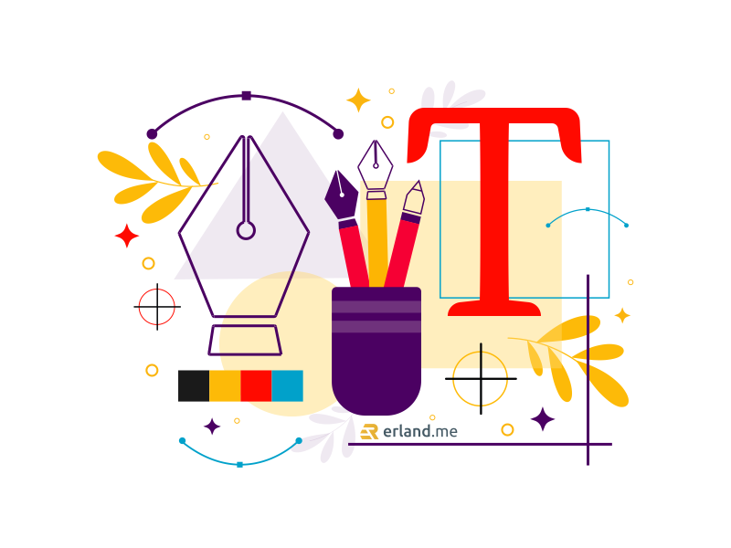

Sebenarnya bahasa desain grafis sering kita dengarkan dalam berbagai kesempatan. Hanya saja, kita tidak terlalu memperhatikan dan memahaminya.

Bagi kalian yang bekerja di dunia grafis, maka penting untuk mengerti berbagai hal mengenai desain grafis terlebih dahulu, seperti pengertian, arti katanya, keterampilan yang dimiliki, dan lain sebagainya. Dengan demikian, pengetahuan dan keterampilan kita dalam desain grafis akan meningkat.

## Pengertian Desain Grafis

Desain grafis adalah seni dalam berkomunikasi visual melalui ruang, gambar, dan tulisan. Jika kita lihat, desain grafis terdiri dari dua kata, yaitu desain dan grafis. Kata desain memiliki arti suatu perbuatan atau proses dengan mengatur segala sesuatu sebelum berbuat atau lebih mudahnya adalah merancang. Sementara, grafis artinya adalah garis atau titik yang berhubungan dengan cetak-mencetak.

Jika kedua kata tersebut dijadikan satu, maka pengertian desain grafis adalah kombinasi kompleks antara grafik, gambar, kata-kata, angka, ilustrasi, dan foto yang membutuhkan pemikiran khusus untuk bisa digabungkan sehingga menghasilkan sesuatu yang khusus dan berguna dalam bidang visual.

## Prinsip dan Unsur Desain Grafis

Pada dasarnya, desain grafis memiliki prinsip dan unsur yang sama dengan disiplin desain lainnya. Hal ini tentunya sesuai dengan pengertian [dasar desain grafis](/blog/dasar-desain-grafis/) yang telah disebutkan.

### Unsur-unsur desain grafis

- Garis

- Bentuk

- Warna

- Ruang

### Prinsip-prinsip dasar desain grafis

- Keseimbangan

- Ritme

- Tekanan

- Proporsi

## Keterampilan Desain Grafis

Untuk bisa melakukan desain grafis dengan baik, bukan hanya harus memahami pengertian desain grafis. Kalian juga harus memiliki beberapa keterampilan, berikut ini:

### Seni visual

Seni visual harus dimiliki oleh kalian yang hobi desain grafis. Fotografi dan digital imaging adalah ilmu yang termasuk seni visual.

### Tipografi

Tipografi adalah seni dalam menyusun, merancang dan memodifikasi huruf. Pengaturan yang sering dilakukan dalam tipografi adalah jenis huruf, ukuran huruf, kerning (jarak antar-dua huruf secara spesifik), tracking (jarak antar-huruf secara umum), dan leading (jarak antar-baris). Keterampilan ini wajib dimiliki, terlebih untuk mendesain grafis yang mengandung tulisan.

### Tata letak

Tata letak merupakan seni penyusunan konten atau elemen yang ada pada suatu halaman, seperti penempatan teks atau penempatan gambar. Keterampilan ini biasanya digunakan dalam pembuatan buku, majalah, tabloid, koran dan lain sebagainya. Melalui keterampilan ini, kita bisa membuat layout menjadi lebih nyaman dan menarik untuk dibaca atau dilihat.

### Desain interaksi

Para desainer grafis sudah berperan dalam perancangan tampilan perangkat lunak dan tampilan halaman website sejak perkembangan dunia teknologi informasi. Mereka bekerja sama dengan pengembang perangkat lunak atau pengembang situs web untuk meningkatkan kenyamanan pengunjung atau pengguna.

## Alat Desain Grafis Kekinian

Untuk bisa menyalurkan ide dan kreativitas dalam desain grafis dengan mudah, kalian membutuhkan peralatan yang lengkap. Saat ini, sudah banyak alat-alat kekinian yang bisa membantu kalian dalam desain grafis, yaitu:

- MacBook

- Wacom

- Ipad Pen

- Scanner

- Perlengkapan alat tulis

- Handphone

- Color tester

Memiliki hobi atau pekerjaan yang berkaitan dengan desain grafis, memaksa kita untuk mempelajari informasi mengenai desain grafis, termasuk pengertian desain grafis untuk meningkatkan keterampilan kita. Banyak hal yang harus kita pelajari sebelum melakukan praktik atau melanjutkan hobi desain grafis.

Hobi desain grafis bisa kalian manfaatkan untuk mencari pekerjaan sesuai dengan kegemaran. Banyak software desain grafis yang bisa kalian andalkan dalam membuat berbagai desain, seperti sketsa, logo, foto, dan lain sebagainya. Demikian artikel mengenai pengertian desain grafis dan hal-hal lainnya. Semoga bermanfaat.
