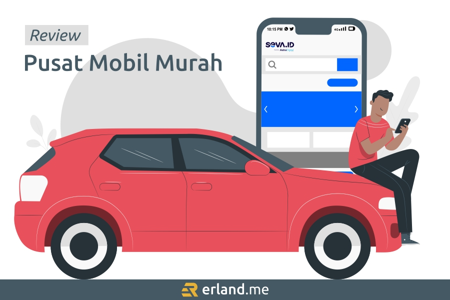
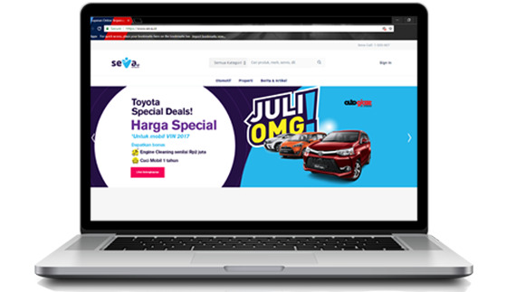
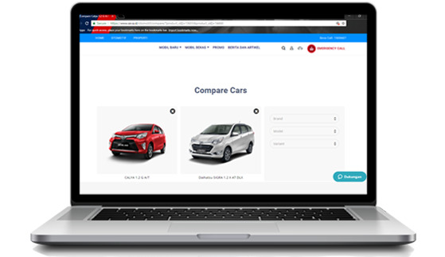
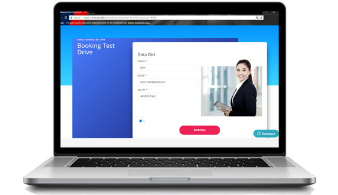
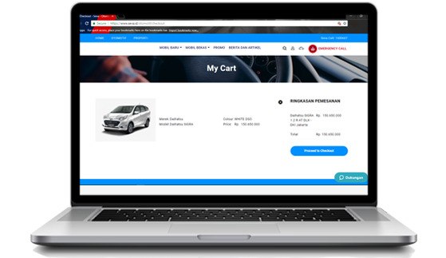

> Review SEVA pusat mobil murah terlengkap No. 1 di Indonesia, marketplace otomotif terpercaya untuk jual beli mobil bekas.

Sebelumnya, saya adalah pencinta sepeda motor. Kendaraan roda dua tersebut menurut saya adalah kendaraan paling praktis untuk dipakai sehari-hari. Saking sukanya, saya memiliki lebih dari satu sepeda motor pribadi. Tapi seiring berjalannya waktu, saya tersadar bahwa akan lebih banyak keunggulan yang saya dapat jika memiliki mobil.

Kesadaran itu datang pada awal tahun lalu saat saya kerap kali kehujanan ketika pulang-pergi kerja naik motor, saya mulai berpikir untuk membeli mobil. Kemudian iseng-iseng saya telusur harga mobil, lalu _speechless_ melihat daftar harganya jauh dari _budget_ yang saya miliki. Hahaha.

Jujur aja, sebagai seorang _middle class_, harga mobil masih tergolong mahal bagi saya. Jika mengandalkan gaji kantor, itu akan butuh waktu puluhan tahun menabung agar bisa beli mobil. Pun jika ditambah penghasilan rutin dari _side job_ saya mengelola _moneysite_ menjadi _publisher_ Google Adsense dan dari pemasukan layanan [jasa SEO](/blog/jasa-seo-bogor/) saya, masih butuh waktu bertahun-tahun juga.

Lalu saya bertanya kepada diri sendiri, kenapa tidak membeli mobil bekas aja? Harganya bisa lebih murah, atau setidaknya mendekati dengan _budget_ yang saya miliki. Saya mencoba menurunkan ego dan hasrat yang ingin membeli mobil mewah keluaran terbaru. Atau lebih tepatnya, berusaha sadar diri kalau isi dompet tidak mendukung. Hahaha.  
Saat itu saya mulai gencar mencari mobil bekas yang banyak dijual di _marketplace_. Sebenarnya saya mendapat banyak sekali rekomendasi tempat beli mobil bekas dari teman-teman saya saat itu, tapi ada satu rekomendasi _marketplace_ yang paling menarik perhatian saya untuk beli mobil bekas di sana, yaitu <a href="https://www.seva.id/otomotif/in/oto/mobil/bekas/tipe/c/USEDCARTYPE?utm_source=referral&utm_medium=blog&utm_campaign=ssgxseva20&utm_content=contest_p1">SEVA pusat mobil bekas</a>.

Setelah beberapa lama saya mencari-cari mobil bekas di SEVA yang sesuai dengan selara dan _budget_ saya, akhirnya saya berjodoh dengan seunit Suzuki Karimun Wagon keluaran tahun 2014, dibeli dengan harga Rp70.000.000. Senang sekali rasanya punya mobil hasil dari keringat sendiri, walau saya harus merelakan untuk menjual salah satu sepeda motor kesayangan saya. Karena _budget_\-nya saat itu masih kurang. Hahaha.

Oke, setelah membeli mobil di SEVA, tentu saya di sini ingin merekomendasikan _marketplace_ otomotif ini kepada kalian. Untuk kalian yang belum tau tentang **[SEVA pusat mobil murah](/blog/seva-pusat-mobil-murah/)**, sini saya kasih tau!

## Tentang SEVA Pusat Mobil Murah

Saya anggap keterlaluan kalau Anda tidak kenal dengan Astra. Kalau pun tidak, minimal Anda pernah sekadar mendengar namanya. PT Astra International Tbk adalah perusahaan konglomerat multinasional yang hingga saat ini memiliki setidaknya tujuh lini bisnis dan juga memiliki banyak sekali anak perusahaan, salah satunya adalah Astra Digital.

Astra Digital didirikan pada 19 April 2018. Hingga saat ini, Astra Digital telah meluncurkan empat produk ke pasar Indonesia yaitu Movic, CariParkir, Sejalan, dan terakhir SEVA pusat mobil murah yang akan saya bahas secara khusus pada artikel ini.

SEVA yang memiliki alamat web **www.seva.id** adalah _marketplace_ jual beli mobil bekas, tapi tidak sebatas itu aja, ada banyak layanan lainnya. Kalau hasil riset saya tidak salah, _marketplace_ ini mulai ramai dikenal di kalangan pencinta mobil pada September 2018 ketika hadir di beberapa pameran otomotif. Kalau salah, saya mohon maaf karena sebelumnya saya penggemar kendaraan roda dua yang tidak mengikuti _update_ tentang mobil. Hehe.

## Layanan SEVA

Seperti yang saya tulis di atas, _marketplace_ ini tidak sebatas sebagai pusat tempat beli mobil bekas murah aja, ada beberapa layanan lainnya. Berikut ini adalah beragam layanan yang ada di seva.id.

### Jual Mobil Saya

Anda punya mobil yang ingin dijual? Ingin <a href="https://www.seva.id/otomotif/in/oto/mobil/bekas/tipe/c/USEDCARTYPE">jual mobil bekas</a> tapi bingung mau memasarkannya di mana? SEVA adalah tempatnya! Melalui layanan "Jual Mobil Saya", SEVA akan membantu mengiklankan mobil yang dijual tersebut, dan Anda akan dipertemukan dengan pembeli yang tepat.

Sejak beli mobil, saya mulai bergabung ke forum-forum pencinta mobil. Dari situ saya mendapatkan banyak teman, dan saya menjadi saksi suksesnya beberapa teman saya menjual mobil di seva.id. Melihat hal itu, tentu dengan keyakinan hati saya merekomendasikan SEVA kepada Anda yang ingin menjual mobil bekas.

### Tukar Tambah Kendaraan

Tukar tambah adalah solusi bagi Anda yang ingin beli kendaraan idaman tapi kekurangan anggaran. Tukar tambah aja! Dengan tukar tambah, Anda dapat meminimalisir pengeluaran. Kendaraan bekas Anda bisa dihargai tinggi lalu membayar sisa harga seminim mungkin.

Saya juga ada rencana ingin tukar tambah mobil saya di SEVA pusat mobil murah ini, tapi mungkin tidak dalam waktu dekat-dekat ini karena belum lama mobil ini saya beli dan saya masih memikirkan akan menukar tambah dengan mobil apa. Mobil idaman saya saat ini sebenarnya banyak, tapi yaitu, lagi-lagi harus sadar diri dengan isi dompet. Hahaha. Mobil idaman yang ada di pikiran saya adalah mobil mewah semua.

### Pengadaan Suku Cadang

Selain penjualan unit kendaraan, _marketplace_ otomotif ini juga menyediakan penjualan suku cadang kendaraan. Kapan pun Anda butuhkan, tinggal telusuri beragam _spare part_ yang dapat dipilih sesuai dengan keperluan dan spesifikasi unit kendaraan Anda. Pastinya, mutu produk suku cadangnya terjamin berkualitas, dan terdapat berbagai penawaran harga menarik.

### _Booking Service_

Anda tentu sepakat jika saya katakan _service_ adalah salah satu cara ampuh untuk menjaga kondisi kendaraan selalu dalam keadaan prima. Walaupun mobil saya beli bekas, kondisinya saat ini masih sangat bagus berkat perawatan berkala.

Di seva.id, Anda dapat menggunakan layanan "_Booking Service_" ini untuk kemudahan perawatan kendaraan. SEVA bekerja sama dengan bengkel-bengkel resmi sehingga dapat memberikan jaminan perawatan yang terpercaya. Caranya juga sangat mudah, cukup isi data diri lalu pihak SEVA akan menghubungi Anda.

### Kalkulator Kredit

Jika Anda belum mampu membeli kendaraan idaman dengan membayar secara tunai, jangan terlalu memaksakan diri. Ada pilihan untuk memperingan pembayaran, yaitu kredit. Dengan kredit, Anda tidak harus membayar banyak uang di muka, Anda dapat mencicilnya, sesuaikan dengan pemasukan yang Anda miliki.

Untuk merencanakan membeli secara kredit, tentu Anda menginginkan transparansi dan harga yang jelas, kan? Untungnya, situs seva.id memiliki layanan "Kalkulator Kredit". SEVA akan membantu Anda untuk mengetahui kisaran biaya pembelian kendaraan yang akan dikeluarkan. Anda dapat menyimulasikan uang muka, pembayaran bulanan, hingga tenor kredit agar sesuai dengan kemampuan Anda.

### Properti

Iya, properti. _Marketplace_ ini tidak hanya menyediakan produk dan layanan otomotif aja, tapi juga ada properti yang dijual di seva.id. Terdapat berbagai macam hunian khusus untuk Anda di web seva.id, mulai dari rumah, apartemen, dan bangunan komersial. Properti yang dibangun berada di wilayah yang sangat strategis sehingga memudahkan mobilisasi dan bisnis Anda.

### Jasa Keuangan

Satu lagi jenis produk dan layanan di luar otomotif dari _marketplace_ ini, jasa keuangan. Terdapat berbagai jenis jasa keuangan yang ditawarkan untuk memudahkan urusan finansial Anda. Mulai dari pinjaman, tabungan, asuransi, hingga edukasi keuangan.

Anda tidak yakin dengan kapasitas perusahaan otomotif menangani masalah keuangan? Tenang. Astra adalah perusahaan besar, bisnisnya menyebar berbagai sektor, memiliki banyak mitra. Dalam hal jasa keuangan di situs seva.id ini tentu saja telah berkerja sama dengan pihak-pihak yang yang memiliki kredibilitas tinggi di bidangnya.

## Keunggulan SEVA

Jika merekomendasikan sesuatu, pasti karena sesuatu yang direkomendasikan tersebut memiliki keunggulan. Iya, kan? Nih, saya kasih tau beberapa keunggulan dari SEVA pusat mobil murah.

### Reputasi Berkredibilitas

Takut dengan penipuan jual beli kendaraan secara _online_? Anda tidak perlu khawatir akan hal itu. Situs seva.id dikelola oleh Astra Digital, dan Astra Digital adalah anak perusahaan dari perusahaan konglomerat multinasional ternama yang tidak diragukan lagi kredibilitasnya di Indonesia. PT Astra International Tbk, didirikan sejak tahun 1957, jaringan bisnisnya bagaikan menggurita di seluruh Indonesia.

### Produk Berkualitas

Saya berani jamin, kendaraan yang dijual di SEVA adalah produk berkualitas walaupun bekas. Begaimana tidak? Terdapat pilihan _expert_ jika Anda ingin membeli mobil. Maksudnya, mobil yang dijual tersebut terlebih dahulu diinspeksi oleh para _expert_ yang berpengalaman di bidang otomotif.

Tim inspeksi ini sangat paham menilai kondisi kendaraan sampai ke hal-hal terkecil. Pengecekannya menyeluruh meliputi bagian eksterior hingga bagian interior mobil. Dan kabar baik juga bagi Anda yang ingin jual mobil bekas di SEVA, layanan inspeksi mobil bekas ini gratis. Dengan begitu, penjual dan pembeli mobil sama-sama diuntungkan.

### Promo Berkala

Anda suka promo? Tentu saya juga. Dan kebanyakan orang pun juga. Kabar baiknya, dalam beberapa periode, SEVA acap kali mengadakan promo menarik yang dipersembahkan untuk pelanggannya. Beberapa promo yang diberikan berupa produk _bundling_, _stock clearance_, properti dengan tawaran harga menarik, dll.

Jangan sampai ketinggalan masa promonya. Untuk mengetahui promo yang sedang berlangsung, pastikan Anda sering mengunjungi situs seva.id dan mengikuti berbagai media sosialnya.

## Cara Beli Mobil Bekas di SEVA

Sampai di sini, apakah Anda mulai tertarik mengikuti jejak saya untuk beli <a href="https://www.seva.id/otomotif/in/oto/mobil/bekas/tipe/c/USEDCARTYPE">mobil bekas murah</a> di SEVA? Kalau iya, itu kabar bagus. Di bagian ini, saya akan memberi empat langkah sederhana cara beli mobil bekas sesuai pengalaman saya. Berikut langkah-langkahnya.

### 1\. Kunjungi situs seva.id

Buka situs web **www.seva.id** lalu cari mobil bekas yang sesuai dengan selera dan anggaran Anda.

### 2\. Bandingkan Produk

Jika Anda masih bingung mau beli mobil yang mana, manfaatkan fitur "**Bandingkan Produk**" untuk mendapatkan pilihan yang tepat.

### 3\. _Request Test Drive_

Masih ragu? Mau _test drive_ dulu? Klik aja tombol "_**Request Test Drive**_" untuk menambah keyakinan Anda.

### 4\. Pesan Kendaraan

Jika sudah menemukan mobil yang cocok sesuai dengan keinginan Anda dan sudah yakin dengan pilihan tersebut, klik tombol "**Pesan Sekarang**".

## Lokasi Dealer

<a href="https://micamandiri.com/seva-tempat-mobil-online-terpercaya/">SEVA tempat mobil online</a> sebagai _marketplace_ otomotif besar di Indonesia memiliki banyak mitra, salah satunya adalah dealer rekanan yang tersebar di berbagai kota. Anda dapat menelusuri dealer terdekat dengan lokasi Anda untuk menikmati layanan-layanan mereka yang memanjakan pelanggan.

Sebenarnya ada ratusan lokasi dealer, di sini saya hanya mencantumkan sebagian kecilnya saja. Jika ingin versi lengkapnya, silakan kunjungi situs **www.seva.id**.  
Berikut ini beberapa lokasi dealer rekanan SEVA di berbagai kota Indonesia.

### Astra Daihatsu Banda Aceh

Jl. DR Muhammad Hasan No. 1-2-3A, Batoh, Banda Aceh.  
Telepon: (0651) 32151

### Mobil88 Medan

Jl. T. Amir Hamzah No. 46 Kelurahan Silalas Medan Barat 20117  
Telepon: (061) 50100390

### Mobil88 Pekanbaru

Jl. Soekarno Hatta KM 9 no. 46 A Sidomulyo Barat - Pekanbaru  
Telepon: (0761) 588999

### Astra Daihatsu Padang

Jl. Khatib Sulaiman No 101, Padang  
Telepon: (0751) 7052222

### Astra Daihatsu Palembang

Jl. Veteran No 175 ABC , Palembang  
Telepon: (0711) 350098

### acctrade Lampung

Jl. Jend. Sudirman No.6, Enggal, Engal, Kota Bandar Lampung 35213  
Telepon: (0721) 259999

### Auto2000 Serang

Jl. Raya Pandeglang KM 6,5, Kampung Kramat RT 5 RW 2 Desa Sukajaya, Kec Curug, Kotamadya Serang.  
Telepon: (0254) 8242000

### Auto2000 Tangerang

Area Business Park Tangerang City Jl. Jend. Sudirman, Babakan-Tangerang  
Telepon: (021) 55732000

### Mobil88 Serpong

Jl. Raya Serpong Km.7 Kel Pakualam Kec. Serpong Utara Kota Tangerang Selatan  
Telepon: (021) 53132552

### BMW Astra Cilandak

Jl. R.A. Kartini Kav. 203, Cilandak, Jakarta Selatan  
Telepon: (021) 7500335

### Auto2000 Bogor Siliwangi

Jl. Siliwangi No. 76, Bogor  
Telepon: (0251) 8342000

### Auto2000 Grand Depok City

Jl. Boulevard Grand Depok City, Tirtajaya, Sukmajaya  
Telepon: (021) 29502000

### Mobil88 Bekasi

Jl. Jendral Sudirman Km. 32 No. 1 Kranji, Bekasi Barat - Jawa Barat 17135  
Telepon: (021) 88855775

### Auto2000 Karawang

Jl. Surotokunto No. 80, Karawang 41313  
Telepon: (0267) 412000

### acctrade Bandung

Jl. Naripan No. 24-26, Kota Bandung  
Telepon: (022) 1500599

### BMW Astra Semarang

Jl. Jend. Sudirman No. 295, Semarang.  
Telepon: (024) 760 4666

### Astra Daihatsu Yogyakarta Mataram

Jl. Mataram No 72, Yogyakarta  
Telepon: (0274) 587747

### acctrade Surabaya

Jl. Panglima Sudirman 24-30  
Telepon: (031) 1500599

### BMW Astra Bali

Jl. Gatot SubrotoTimur No. 168A, Denpasar, Bali  
Telepon: (0361) 4713347

### BMW Astra Makassar

Jl. Andi Pangeran Pettarani No. 98A, Makassar  
Telepon: (0411) 466 9495

* * *
