> Rekomendasi jasa sewa bus pariwisata Semarang dengan harga murah dan fasilitas mewah. Driver handal, layanan profesional.

Siapa coba yang tidak mengenal Semarang? Saya rasa nyaris tidak ada. Semarang adalah salah satu kota besar di Indonesia dan merupakan ibu kota dari Provinsi Jawa Tengah. Dengan label kota besar itu menjadikan Semarang menjadi salah satu destinasi wisata menarik yang patut dikunjungi untuk mengisi liburan kalian bersama teman-teman atau keluarga.

_')

Ada banyak tempat wisata di Semarang dan sekitarnya yang nyaman, seru, dan murah. Di antaranya yang paling populer tentu saja Lawang Sewu sebagai ikon pariwisata kota Semarang. Sampai-sampai ada yang mengatakan "_Belum ke Semarang kalau belum ke Lawang Sewu_". Selain itu, masih banyak sekali objek wisata di Semarang seperti Ayana Gedong Songo, Lereng Kelir, Brown Canyon, Pantai Tirang, Taman Bunga Celosia, dll. Saking banyaknya, saya sampai malas untuk menyebutkan. Hahaha. Di lain kesempatan, saya akan buat artikel khusus _review_ cerita perjalanan ke tempat wisata yang disebutkan di atas, karena kebetulan saya sudah pernah mengunjungi semuanya tahun 2016 silam, sepulang dari [Gunung Argopuro](/blog/menjelajah-gunung-argopuro/).

> **Baca juga: [Rekomendasi Tempat Wisata di Bogor](/blog/tempat-wisata-bogor/)**

Salah satu faktor penting dari sebuah perjalanan liburan adalah perkara transportasi. Di sini saya akan mengulas layanan salah satu agen sewa bus pariwisata di kota Semarang. Terkhusus untuk Anda yang punya rencana liburan di Semarang dengan banyak orang, menggunakan transportasi bus tentu saja menjadi pilihan yang tepat karena kita semua tahu bus dapat mengangkut banyak orang sekaligus. Selain untuk yang merencanakan liburan, saya pikir artikel ini juga dapat bermanfaat untuk siapa pun yang sedang mencari informasi terkait tempat penyewaan bus di Semarang. Karena adanya penyedia jasa rental bus bukan semata untuk mereka yang ingin liburan, tapi bisa untuk berbagai keperluan lainnya seperti manasik haji, besanan pengantin, ziarah kubur, pengajian, kunjungan kerja, _study tour_, dan lain-lain.

Penyedia jasa sewa bus pariwisata yang saya rekomendasikan adalah **Ranggawarsita Tour** yang merupakan biro perjalanan wisata terbaik di Semarang. Ada cukup banyak alasan mengapa Anda harus memilih Ranggawarsita. Berikut ini akan saya jelaskan, mari disimak.

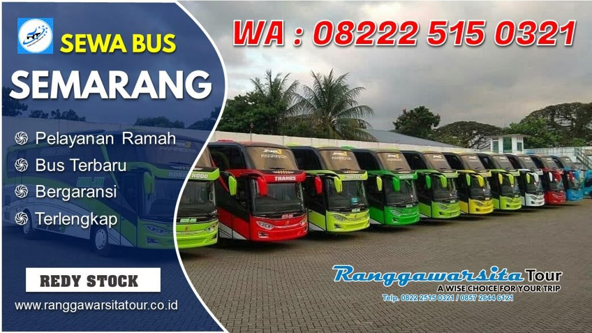

## Tentang Ranggawarsita Tour

Ranggawarsita Tour merupakan agen sewa bus Semarang terpercaya, terlengkap dan terbesar. Mereka telah berpengalaman lebih dari lima tahun di bidang biro perjalanan wisata. Berdiri sejak tahun 2013, Ranggawarsita berada di bawah naungan **CV. Dimensi Cakrawala**. Kantor pusatnya berada di Jl. Soekarno Hatta No. 10, Kota Semarang. Memiliki alamat yang jelas merupakan salah satu ciri perusahaan yang kredibel.

<iframe src="https://www.google.com/maps/embed?pb=!1m18!1m12!1m3!1d3960.2789843837463!2d110.44567831414533!3d-6.97637387025048!2m3!1f0!2f0!3f0!3m2!1i1024!2i768!4f13.1!3m3!1m2!1s0x2e708b28c85f53fd%3A0xe1c6efcc64f66727!2sRanggawarsita%20Tour!5e0!3m2!1sid!2sid!4v1583842084009!5m2!1sid!2sid" width="450" height="338" frameborder="0" style="border:0;" allowfullscreen aria-hidden="false" tabindex="0"></iframe>

Yang menjadi salah satu alasan saya merekomendasikan agen bus pariwisata ini adalah mereka didukung oleh manajemen yang profesional dan tim yang sudah berpengalaman di bidangnya. Dengan itu, saya berani meyakini bahwa mereka memang pelayan jasa sewa bus semarang yang terpercaya.

## Keunggulan Ranggawarsita Tour

Jika merekomendasikan sesuatu, pasti karena sesuatu yang direkomendasikan tersebut memiliki keunggulan. Beberapa keunggulan dari Ranggawarsita Tour yang bisa menjadi bahan pertimbangan Anda untuk memilih penyedia jasa sewa bus Semarang adalah sebagai berikut:

### Jasa Sewa Bus Profesional

Mereka bekerja secara profesional, selalu menawarkan solusi terbaik untuk bus pariwisata yang Anda butuhkan, dan mereka bertanggung jawab penuh selama masa penyewaan berjalanan, mulai dari awal sewa sampai dengan selesainya acara Anda.

### Harga Sewa Terbaik

Mereka dapat memastikan jasa penyewaannya tidak ada pihak ketiga yang dapat mempengaruhi harga sewa yang sudah ditetapkan. Itu artinya, Anda akan mendapatkan harga sewa bus murah yang terbaik sesuai dengan spesifikasi armanda bus yang Anda pilih sehingga terhindar dari kemungkinan _over budget_.

### Fasilitas Bus Memandai

Karena mereka perusahaan jasa yang profesional, mereka sangat paham akan kebutuhan, kenyamanan, dan keamanan pelanggan. Mereka menyediakan berbagai fasilitas lengkap di dalam bus selama perjalanan. Anda dapat menanyakan kepada _customer service_ mereka terkait fasilitas dan layanan yang Anda dapatkan selama masa menyewaan.

### Memiliki Mitra

Sebagai perusahaan besar, sudah selayaknya memiliki banyak mitra yang bekerja sama. Ranggawarsita Tour memiliki mitra di berbagai daerah, sebagai langkah khususnya untuk antisipasi terjadinya suatu kejadian yang tidak diinginkan bersama terhadap bus dan penumpang. Karena kita tidak pernah tau apa yang akan terjadi bahkan lima menit ke depan setelah Anda membaca ini. Itu menjadi salah satu alasan Ranggawarsita menjalin mitra di berbagai kota demi ketenangan perjalanan Anda.

### Memberi Garansi

Ranggawarsita Tour mengklaim berani memberikan garansi uang kembali hingga 120% dari total harga sewa apabila mereka mengingkari kesepakatan awal jasa sewa. Itu menunjukan keseriusan mereka dalam berkomitmen kepada pelanggan agar tidak terjadi salah paham di awal mau pun di akhir perjanjian sewa dan menjamin serta melindungi hak-hak konsumen.

## Harga Sewa Bus di Ranggawarsita Tour

Di Ranggawarsita Tour, <a href="https://ranggawarsitatour.co.id/sewa-bus-pariwisata/">harga sewa bus pariwisata</a> yang mereka tawarkan terbilang kompetitif, berani diadu murahnya dengan yang lain. Mereka memiliki prinsip "_yang kami berikan harus lebih dari yang Anda bayarkan_". Itu menunjukan betapa seriusnya mereka dalam memberikan layanan prima kepada pelanggan dengan tarif sewa yang terjangkau. Ranggawarsita Tour tidak hanya melayani penyewaan bus untuk tujuan Semarang saja, mereka juga melayani penyewaan bus untuk tujuan luar kota Semarang. Oleh karena itu, tarif sewanya secara garis besar terbagi berdasarkan harga dalam kota dan harga luar kota. Berikut ini saya coba meringkas daftar harga sewa bus Semarang di Ranggawarsita Tour.

### Harga Sewa Bus Dalam Kota Semarang

| Jenis Armanda             | Kapasitas | Harga       |
| ------------------------- | --------- | ----------- |
| Elf Short                 | 14 seat   | Rp1.300.000 |
| Toyota Hiace              | 14 seat   | Rp1.400.000 |
| Elf Long                  | 19 seat   | Rp1.400.000 |
| Bus Medium                | 35 seat   | Rp1.800.000 |
| Bus Pariwisata New Setra  | 47 seat   | Rp2.500.000 |
| Bus Pariwisata HD         | 59 seat   | Rp2.700.000 |
| Bus Pariwisata SHD Jet 3+ | 45 set    | Rp2.800.000 |

### Harga Sewa Bus Luar Kota Semarang

| Jenis Armanda             | Kapasitas | Harga       |
| ------------------------- | --------- | ----------- |
| Elf Short                 | 14 seat   | Rp1.500.000 |
| Toyota Hiace              | 14 seat   | Rp1.700.000 |
| Elf Long                  | 19 seat   | Rp1.700.000 |
| Bus Medium                | 35 seat   | Rp2.000.000 |
| Bus Pariwisata New Setra  | 47 seat   | Rp3.000.000 |
| Bus Pariwisata HD         | 59 seat   | Rp3.000.000 |
| Bus Pariwisata SHD Jet 3+ | 45 set    | Rp3.500.000 |

Harga di atas adalah harga sewa yang saya ringkas secara garis besar karena terdapat banyak tarif sewa berdasarkan jenis armanda, kapasitas armanda, tujuan wisata, dan paket wisata. Ya, mereka juga menyediakan harga paket perjalanan (yang tentunya lebih murah) ke berbagai destinasi wisata di kota-kota besar Pulau Jawa, dan bahkan luar Pulau Jawa seperti Bali dan Lombok. Saking lengkapnya penawaran harga menarik dari mereka, saya memilih untuk tidak mencantumkan semuanya di sini dan sangat merekomendasikan Anda menanyakan langsung ke _customer service_ mereka yang ramah, atau mengunjungi _website_ resmi mereka untuk mengetahui lebih lengkap terkait harga penyewaan bus yang mereka tawarkan.

## Fasilitas Ranggawarsita Tour

Bagi para pelaku bisnis, fasilitas adalah salah satu yang harus Ada, khususnya fasilitas-fasilitas yang memanjakan pelanggan sehingga berpotensi pelanggan tersebut akan memilih produk/jasa itu kembali di lain waktu. Dalam hal ini, Ranggawarsita Tour sebagai penyedia jasa sewa bus memberikan beberapa fasilitas yang dapat memanjakan Anda selama berada di bus.

### Fasilitas Bus Pariwisata

- Armanda terbaru
- _Reclining seat_
- _Air conditioner_
- Pengharum ruangan
- _Free WiFi_
- _Mic_
- Bantal
- Selimut
- _Leg rest_
- _DVD karaoke_
- _Cool box_
- _TV LED_
- Stop kontak
- Alat pemecah kaca (_emergency tool_)

Masih banyak fasilitas lain yang dapat memanjakan Anda selama perjalanan, tergantung pada armanda yang dipilih. Kami sarankan Anda menanyakan fasilitas yang Anda dapat ketika memilih [jenis bus](/blog/jenis-jenis-bus/) saat _reservasi_. Dan, ah iya. Seperti yang saya bilang tadi, selain sewa bus pariwisata, mereka juga memiliki paket-paket menarik yang dapat Anda pilih sesuai keperluan Anda, di antaranya adalah:

### Paket Bus Pariwisata

- Paket wisata Jawa-Bali-Lombok
- Paket _family gathering_
- Paket _city tour_ (Semarang, Jogja, dan Solo)
- Paket ziarah keagamaan
- Paket _study tour_ dan KKL
- Paket kunjungan kerja

Pilihan paket menarik tersebut tentu saja memiliki keunggulan harga yang lebih murah, layak Anda pertimbangkan untuk memilih paket harga sewa bus semarang tersebut jika Anda merencanakan acara perjalanan khusus. Hubungi langsung _customer service_ Ranggawarsita Tour untuk mendapatkan penawaran harga terbaik.

## Mitra PO Bus Ranggawarsita Tour

Seperti yang saya bilang tadi, Ranggawarsita Tour memiliki banyak mitra, salah satunya adalah kemitraan dengan beberapa PO. bus ternama. Dengan banyaknya koneksi dengan berbagai PO. bus, akan menjamin ketersediaan armanda yang memandai untuk melayani Anda yang akan menggunakan jasa sewa bus di Ranggawarsita Tour. Berikut ini saya lampirkan ringkasannya.

| PO. 44 Trans          | PO. Barito           | PO. Falisa         |
| --------------------- | -------------------- | ------------------ |
| PO. Ababil            | PO. Bromo Indah      | PO. Galatama       |
| PO. Agam Tunggal Jaya | PO. Cahaya Borneo    | PO. Haryanto       |
| PO. Alina             | PO. Cipta Raharjo    | PO. Jaya Slamet    |
| PO. Alimun Hidayah    | PO. Citra Dewi       | PO. Kurnia Jaya    |
| PO. Anaking           | PO. Clariss          | PO. Makmur Mandiri |
| PO. Arwania           | PO. Dadi Berkah Jaya | PO. Nusa Bhakti    |
| PO. Aurel             | PO. Dana Trans       | PO. Putra Malindo  |
| PO. Bagus Jaya        | PO. Dream Liner      | PO. Subur Jaya     |
| PO. Bangun Rejeki     | PO. Endah Trans      | PO. Trans Wijaya   |

Daftar di atas hanya sebagian kecil dari mitra PO. bus yang bermitra dengan Ranggawarsita Tour, sebenarnya lebih banyak lagi. Jika Anda ingin mengetahui daftar lengkapnya, Anda dapat mengunjungi situs web Ranggawarsita Tour secara langsung.

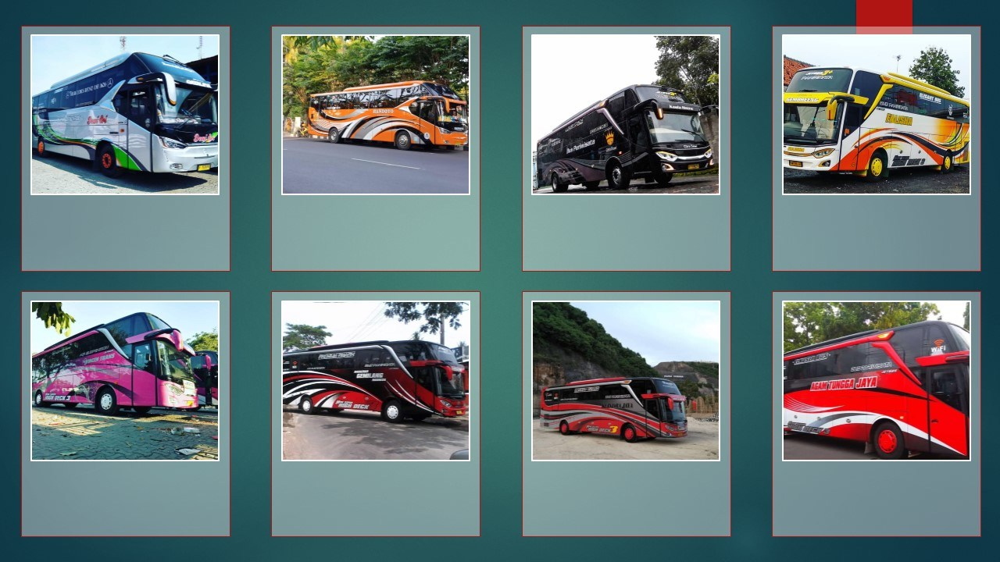

## Reputasi Ranggawarsita Tour

Sebagai penyedia jasa penyewaan bus terbesar di Semarang, Ranggawarsita Tour pastilah mempunyai reputasi baik di mata pelanggan, tidak diragukan lagi. Mereka memiliki testimoni dan ulasan positif dari pelanggan yang telah menggunakan jasa mereka, dan saya yakin Anda adalah pelanggan selanjutnya yang akan puas menerima pelayanan prima dari Ranggawarsita. Berikut ini saya lampirkan sebagian testimoni asli dari mereka yang telah memilih Ranggawarsita Tour sebagai mitra perjalanan.

[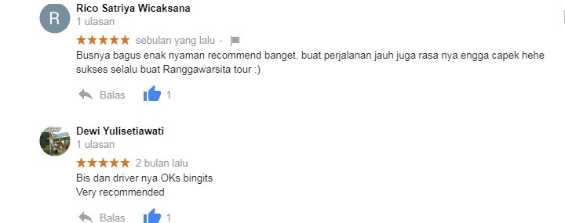](/wp-content/uploads/2020/03/Testimoni-Ranggawarsita.jpg)

[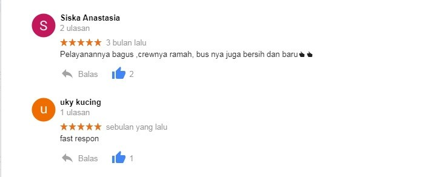](/wp-content/uploads/2020/03/Testimoni-Ranggawarsita-3.jpg)

[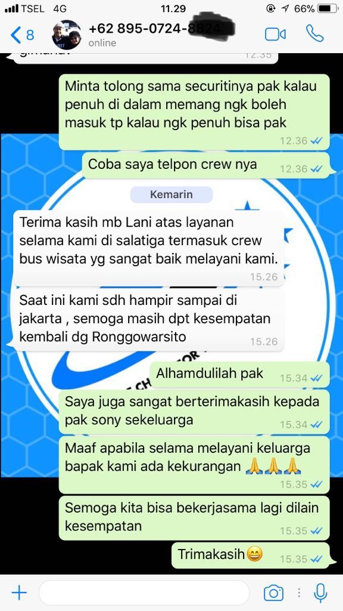](/wp-content/uploads/2020/03/Testimoni-Ranggawarsita-4.jpeg)

[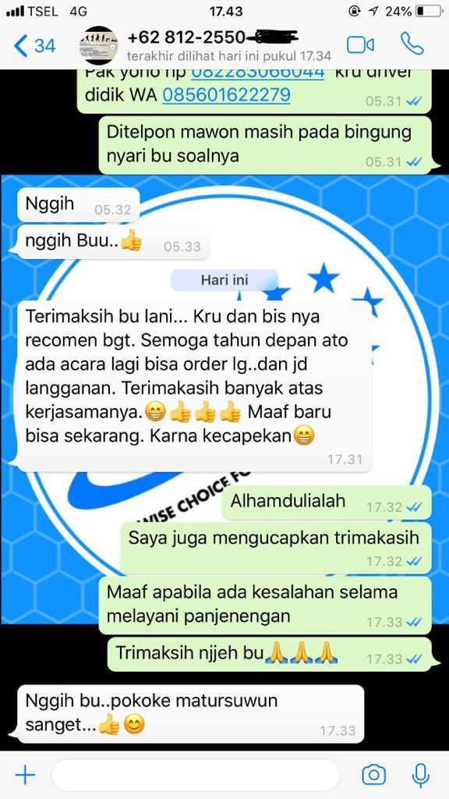](/wp-content/uploads/2020/03/Testimoni-Ranggawarsita-5.jpeg)

[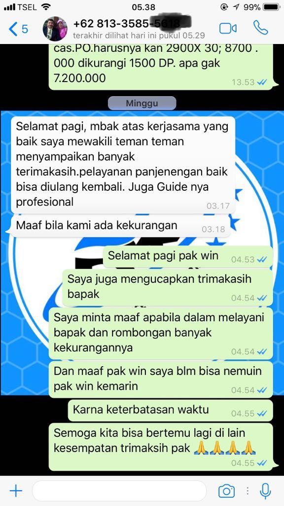](/wp-content/uploads/2020/03/Testimoni-Ranggawarsita-7.jpeg)

Itu hanya sebagian kecil testimoni yang saya ambil dari _website_ mereka. Sebagai biro jasa penyewaan bus terbesar di Semarang, pasti mereka punya lebih banyak testimoni dengan _review_ positif yang mereka dapat dari pelanggan sejak 2013 hingga sekarang. Mereka telah dipercaya oleh perusahaan dan instansi ternama yang menggunakan jasa sewa bus mereka untuk berbagai keperluan. Sebut saja Telkom Indonesia, Unilever, Garuda Indonesia, Indofood, Pertamina, Indocement, Maspion Group, KOMINFO, KEMENKES, dan masih banyak yang lainnya.

> Baca juga: **[SEVA Pusat Mobil Murah](/blog/seva-pusat-mobil-murah/)**

[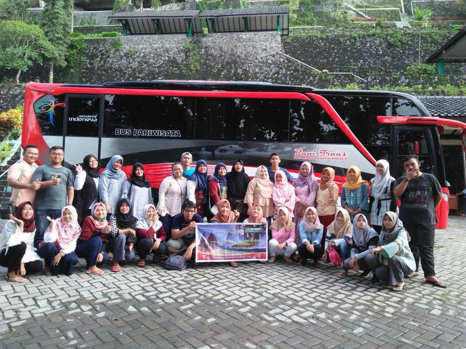](/wp-content/uploads/2020/04/sewa-bus-semarang-pariwisata.jpg)

[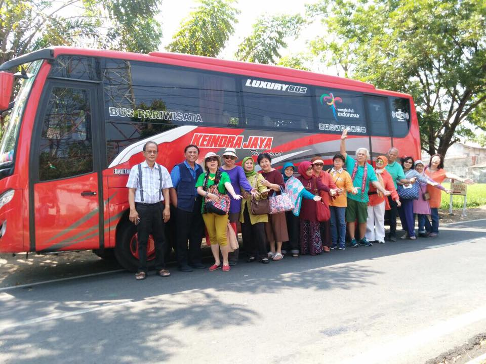](/wp-content/uploads/2020/04/harga-sewa-bus-semarang.jpg)

[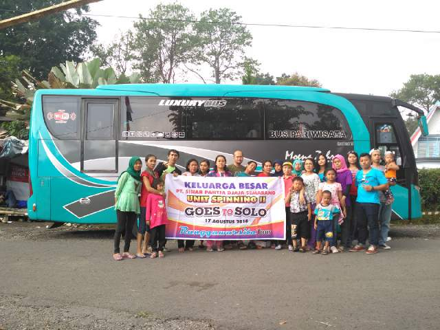](/wp-content/uploads/2020/04/sewa-bus-semarang-murah.jpg)

[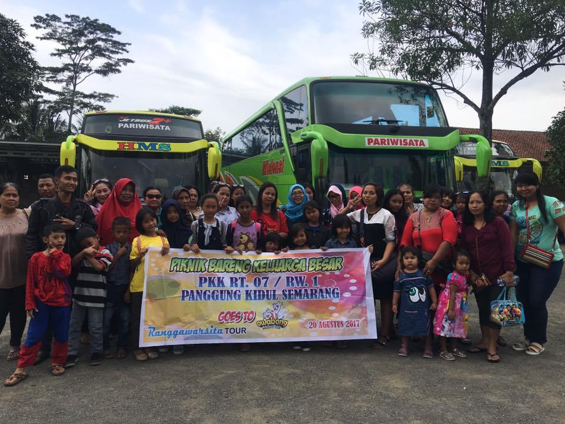](/wp-content/uploads/2020/03/Sewa-Bus-Pariwisata.jpg)

Saya rasa sudah banyak alasan kuat untuk memilih Ranggawarsita Tour sebagai pilihan Anda untuk menggunakan jasa sewa bus Semarang dan Jawa Tengah, keunggulan-keunggulan tersebut belum tentu Anda dapatkan di tempat lain. Dan yang terpenting, meskipun dengan banyak keunggulan yang terdapat pada layanan Ranggawarsita Tour, Anda tetap akan mendapatkan harga terbaik yang _worth it_, saya jamin. Jangan lupa pula, mereka berani memberi garansi. Sebagai tambahan, saya lampirkan juga nomor telepon Ranggawarsita Tour yang sebaiknya Anda simpan untuk dihubungi kapan pun Anda membutuhkan jasa sewa bus pariwisata terbaik di Semarang.  
Telepon/WhatsApp: **0822-2515-0321**  
Telepon/SMS: **0857-2644-6121**

---

## _Frequently Asked Questions_

---

### Bagaimana prosedur untuk sewa bus pariwisata?

Gampang. Seperti belanja online, Anda tinggal menghubungi narahubung dan mengajukan pemesanan. Selanjutnya, Anda akan ditanya tanggal keberangkatan, armanda yang dipilih, tujuan penyewaan, lalu kemudian membayar uang muka.

### Berapa uang muka yang harus dibayar untuk sewa bus?

Pada umumnya, ketentuan pembayaran uang muka adalah setengah dari total harga sewa atau 50%. Sisanya bisa saat hari keberangkatan atau setelah acara selesai. Tergantung pada kebijakan setiap agen.

### Apakah harga sewa bus sudah mencakup seluruh biaya selama perjalanan?

Biasanya, tarif sewa sudah termasuk biaya bensin, tol, dan parkir. Namun, pada beberapa kasus jika Anda pergi ke tempat wisata, biaya masuk tempat wisata itu tidak ditanggung oleh penyedia jasa sewa bus.

### Bagaimana jika terdapat kendala terhadap bus di perjalanan?

Biro jasa sewa bus pariwisata yang profesional pasti akan bertanggung jawab penuh dengan mengirim kendaraan pengganti melalui mitra terdekat dari lokasi kendala. Jika memungkinkan, Anda juga akan diberikan kompensasi.

### Bagaimana ciri jasa sewa bus pariwisata yang profesional?

Punya alamat yang jelas, punya nomor telepon yang mudah dihubungi, punya website resmi, memberi garansi, bertanggung jawab penuh terhadap kenyamanan dan keselamatan penumpang selama perjalanan di bus.

### Tips dalam memesan jasa sewa bus pariwisata?

Cobalah usahakan sebisa mungkin untuk melakukan pemesanan sejak jauh-jauh hari dari tanggal keberangkatan, terutama jika tanggal keberangkatan tepat saat musim mudik atau liburan.

### Jadi, di mana tempat sewa bus semarang yang terbaik?

Ya jelas, hanya Ranggawarsita Tour yang terbaik yang pernah ada. Harga sewa terjangkau, fasilitas banyak, pelayanan ramah, memberi garansi pula. Saya sudah membuktikannya sendiri. Dijamin!
