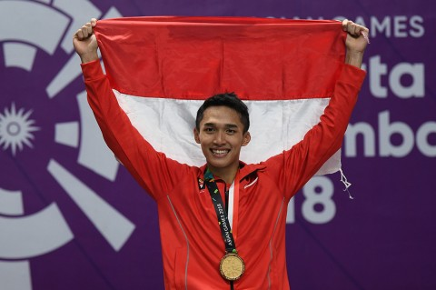

Perhelatan <a href="https://id.wikipedia.org/wiki/Pesta_Olahraga_Asia_2018">Asian Games 2018</a> yang diselenggarakan di Indonesia telah berakhir pada tanggal 2 September 2018 yang mulai dilaksakan pada 18 Agustus 2018. Meskipun telah berakhir, namun masih terasa euforianya hingga sekarang.

Masih begitu hangat diperbincangkan mengenai persembahan tari Ratoh Jaroe dari 1500 penari yang spektakuler, Presiden Jokowi naik moge yang menjadi perdebatan, hingga lagu Mari “Meraih Bintang” Via Vallen yang begitu hits sekarang.

Terlepas dari kemeriahan _Opening Ceremony_ Asian Games 2018, kita wajib berbangga dengan peringkat keempat yang diperoleh Negara Indonesia kita tercinta ini. Semoga kedepannya kita semakin meningkatkan kualitas para Atlet dan bukanlah hal mustahil suatu saat nanti Indonesia akan berada di peringkat pertama.

Selama perhelatan akbar itu berlangsung, banyak sekali kejadian-kejadian yang menjadi sorot perhatian masyarakat Indonesia. Namun yang paling menjadi sorotan yaitu di bidang olahraga Bulu Tangkis. Sebut saja Anthony Sinisuka Ginting, yang tiba-tiba menjadi Trending Topic dunia dikarenakan harus menyudahi pertandingan di nomer beregu akibat cedera. Atau bagaimana 'tengilnya' _duo minions_, Marcus Gideon dan Kevin Sanjaya pada pertandingan bulu tangkis ganda putra. Bahkan Kevin membuat heboh netizen Indonesia dengan membuat meme dirinya, saat Kevin mengejek tim ganda putra China yang membuatnya kesal dengan posisi mengangkat tangan sejajar telinga.

Terakhir yang menjadi pusat perhatian pada babak final bulu tangkis Asian Games 2018 adalah Jonatan Cristie atau yang akrab disapa Jojo. Setelah memastikan medali emas di laga final bulutangkis tunggal putra perorangan Asian Games 2018 di Istora Senayan, Jojo berselebrasi dengan membuka kaos putihnya yang basah karena peluh dan mempertontonkan tubuhnya yang atletis di depan publik. Sontak saja ini menjadi pusat perhatian netizen Indonesia.

Ramai bermunculan komentar-komentar di sosial media Instagram mengenai tubuh atletis Jojo. Komentar-komentar tersebut dapat dikatakan sebagai _sexual harassment_ terhadap laki-laki. Beberapa komentar yang ditujukan oleh wanita kepada Jojo seperti “rahim hangat”, “hamil online”, dan lain sebagainya. Hal ini sempat menjadi _Trending Topic_ di Twitter mengenai perbedaan perlakuan antara laki-laki dan perempuan dalam _sexual harassment_.

Bicara tentang _sexual harassment_ pengertiannya adalah pelecehan seksual yang berarti perilaku pendekatan terkait dengan seks yang tak diinginkan, termasuk permintaan untuk melakukan seks, dan perilaku lainnya yang secara verbal ataupun fisik yang merujuk pada seks. Pelecehan seksual bisa terjadi dimana saja kita berada.

Bukan hanya Jojo, sebelumnya sudah pernah menjadi perbincangan di jagat netizen mengenai figur publik yang mengalami _sexual harassment_ seperti Via Vallen dan Gita Savitri. Pelecehan seksual adalah suatu keadaan yang tidak bisa diterima, baik secara lisan, fisik atau isyarat seksual, pernyataan yang bersifat menghina secara tegas, atau keterangan secara seksual yang membuat orang lain merasa terancam, dipermalukan, dibodohi, dilecehkan, atau bahkan intimidasi. Segala tindakan yang berbau seksual dan membuat si korban merasa tidak nyaman dan dirugikan bisa dikategorikan sebagai pelecehan seksual.

Diketahui bahwa sebagian besar korban pelecehan seksual adalah perempuan. Di kehidupan sosial, laki-laki memiliki kondisi kekuasaan sosial lebih tinggi dibandingkan perempuan. Dengan begitu terkadang laki-laki menyalahgunakan 'kekuasaannya' untuk mendapatkan keuntungan seksual terhadap perempuan.

Terlepas dari jenis kelamin yang mengalami _sexual harassment_, entah perempuan maupun laki-laki. Perbuatan yang menjurus pada _sexual harassment_ tidak dibenarkan adanya. Sebagai manusia yang beriman dan berakal, jadilah manusia yang memanusiakan manusia. Dalam **Undang-Undang Hak Asasi Manusia No. 39/1999** yang menyatakan dengan tegas bahwa setiap manusia memiliki hak dan martabat yang sama dan sederajat, berhak atas jaminan dan perlindungan hak asasi manusia tanpa diskriminasi.

> Lalu apa yang harus dilakukan ketika mendapatkan sexual harassment?

Sedikit tips yang bisa saya berikan, apa yang harus dilakukan ketika mendapatkan _sexual harassment_.

1. Apabila di tempat umum, berteriaklah. Agar orang di sekitarmu mengalihkan pandangan padamu dan menggagalkan niat si pelaku.

3. Apabila melalui media sosial berupa pesan singkat, maka _screen shoot-_lah isi percakapan dan akun pelaku, kemudian _share_ di media sosial Anda.

5. Apabila di tempat tertutup yang tidak banyak diketahui orang lain, cobalah mencatat tentang kejadian (identitas pelaku, tempat kejadian, waktu, saksi dan apa saja yang diperbuat  oleh pelaku). Karena data ini bisa digunakan sebagai bentuk laporan kamu kepada pihak berwajib.

7. Jangan menutup diri dan merasa malu karena telah mengalami pelecehan seksual. Bicaralah pada orang lain tentang pelecehan seksual yang kamu alami. Ceritakan pada teman, rekan kerja, keluarga, atasan atau siapa pun yang kamu percayai dan mau mengerti situasi yang kamu alami.

9. Berilah pelajaran kepada pelaku. Apabila kamu punya ilmu beladiri, berilah dia pelajaran agar menciptakan efek jera. Atau katakan langsung padanya bahwa kamu tidak bisa terima dengan tindakannya.

11. Laporkan perbuatan pelecehan seksual tersebut kepada yang berwajib, karena pelecehan seksual jelas telah melanggar hukum.

Selain hal di atas, untuk perempuan jaga diri dan jaga perilaku, kemudian untuk laki-laki jaga pandangan dan jaga pikiran. Hal tersebut dilakukan untuk menghindari perbuatan dilecehkan maupun melecehkan. Karena _sexual harassment_ ini bisa terjadi di mana saja dan kapan saja. Entah sejak kapan _sexual harassment_ ini muncul di muka bumi dan belum bisa hilang hingga sekarang. Semoga Tuhan melindungi kita dari hal yang berbau _sexual harassment_.
