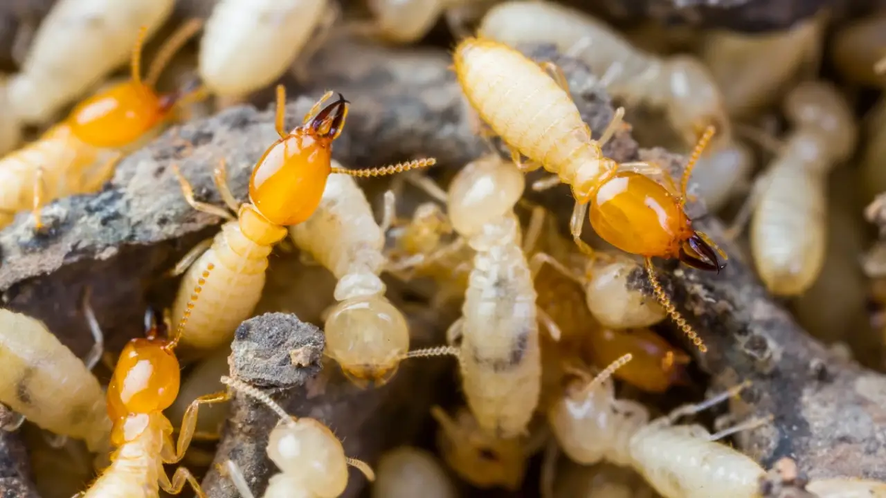

Tangga kayu sering menjadi elemen rumah yang membuat interior terlihat lebih hangat, elegan, dan natural. Selain berfungsi sebagai akses antar lantai, tangga juga sering menjadi bagian visual yang cukup menonjol di dalam rumah. Namun, jika area bawah tangga lembap atau jarang diperiksa, bagian ini bisa menjadi titik rawan serangan rayap.

Rayap dapat bergerak dari lantai dasar, celah dinding, pondasi, atau area bawah tangga yang tertutup. Karena posisinya sering tidak terlihat langsung, kerusakan pada tangga kayu bisa terlambat disadari.

## Kenapa Tangga Kayu Bisa Rawan Rayap?

Tangga kayu biasanya memiliki banyak sambungan, celah, dan bagian bawah yang sulit dijangkau. Area seperti ini bisa menjadi tempat ideal bagi rayap karena gelap, tertutup, dan jarang terganggu.

Jika area bawah tangga digunakan untuk menyimpan barang seperti kardus, sepatu, dokumen lama, atau kayu bekas, risikonya bisa semakin besar. Barang-barang tersebut mengandung selulosa yang bisa menjadi sumber makanan tambahan bagi rayap.

## Area Bawah Tangga Sering Terlupakan

Banyak rumah memanfaatkan ruang bawah tangga sebagai gudang kecil. Sekilas terlihat praktis, tetapi jika barang menumpuk terlalu lama, area tersebut bisa menjadi lembap dan pengap.

Kondisi ini membuat rayap lebih mudah bergerak tanpa terlihat. Dari bawah tangga, rayap bisa menyebar ke anak tangga, railing kayu, lemari dekat tangga, panel dinding, atau furniture lain di sekitarnya.

## Tanda Rayap pada Tangga Kayu

Beberapa tanda yang perlu diperhatikan adalah anak tangga terasa kurang kokoh, kayu terdengar kopong saat diketuk, muncul serbuk halus di sudut tangga, atau ada jalur tanah kecil di dinding sekitar tangga.

Selain itu, perhatikan jika bagian bawah tangga mulai rapuh, warna kayu berubah, atau permukaannya menggelembung. Jika tanda ini muncul, jangan langsung dianggap sebagai kerusakan karena usia material saja.

## Jangan Hanya Memperbaiki Bagian yang Rusak

Saat tangga mulai rapuh, pemilik rumah sering langsung memperbaiki atau mengganti bagian kayu yang rusak. Namun, jika penyebabnya adalah rayap, perbaikan material saja belum tentu cukup.

Rayap bisa tetap aktif di jalur tersembunyi dan menyerang bagian lain setelah tangga diperbaiki. Karena itu, sebelum mengganti anak tangga, railing, atau panel kayu, area sekitar perlu diperiksa terlebih dahulu.

## Cara Mengurangi Risiko Rayap di Area Tangga

Langkah pertama adalah menjaga area bawah tangga tetap rapi dan kering. Hindari menumpuk kardus, kertas, sepatu lama, atau barang kayu terlalu lama di area tersebut.

Kedua, pastikan sirkulasi udara tetap baik. Jika ruang bawah tangga tertutup, buka dan bersihkan secara berkala agar tidak menjadi pengap.

Ketiga, cek sambungan kayu, celah dinding, dan bagian bawah tangga secara rutin. Tanda kecil seperti serbuk halus atau jalur tanah bisa menjadi petunjuk awal sebelum kerusakan semakin parah.

Untuk pemilik rumah di Jogja yang menggunakan tangga kayu atau memiliki ruang penyimpanan di bawah tangga, pemeriksaan berkala sangat penting dilakukan. Jika mulai muncul kayu kopong, serbuk halus, atau jalur tanah, layanan [jasa basmi rayap jogja](https://fumida.co.id/jasa-pembasmi-rayap-di-yogyakarta-jawa-tengah/) bisa menjadi pilihan untuk membantu mengecek sumber masalah sebelum menyebar ke bagian rumah lainnya.

## Kesimpulan

Tangga kayu bisa menjadi area rawan rayap jika bagian bawahnya lembap, tertutup, dan jarang diperiksa. Risiko semakin besar jika ruang bawah tangga digunakan untuk menyimpan barang berbahan kertas, kardus, atau kayu.

Dengan menjaga area tangga tetap kering, mengurangi tumpukan barang, dan mengenali tanda awal rayap, kerusakan pada struktur tangga dan bagian rumah lainnya bisa dicegah sejak dini.