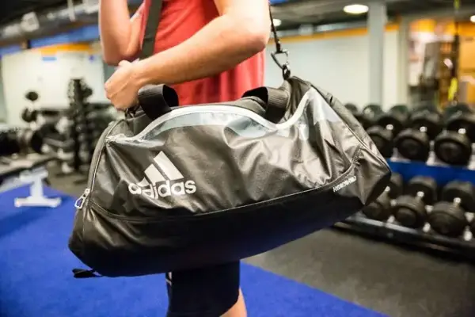

<a href="https://www.zalora.co.id/sports/sports-pria/tas-backpack/">Tas olahraga berkualitas</a> biasanya bisa didapatkan dengan cukup memilih merek yang akan dibeli. Seperti merek sportwear yang menawarkan kualitas bagus dari berbagai produknya, sehingga tas yang didapatkan juga akan mempunyai kualitas terbaik.

Merek seperti Nike, Adidas, Puma, dan merek lainnya bisa menjamin kualitas tas olahraga yang didapatkan mempunyai kualitas baik sehingga bisa awet. Selain itu dari mereknya, bagi yang ingin membeli tas olahraga yang berkualitas juga bisa menggunakan beberapa langkah berikut ini:

## Model Tas yang Nyaman

Tas olahraga berkualitas akan memberikan kenyamanan ketika digunakan. Kenyamanan tersebut juga dipengaruhi dari model tas olahraga yang akan dipilih. Di mana untuk pilihan model tas yang tersedia di pasaran biasanya ada dua jenis tas olahraga.

Pertama adalah tas duffle yang merupakan tas untuk gym. Bagi yang suka gym bisa memilih tas ini yang mempunyai cara dijinjing ataupun digantungkan pada pundak. Keuntungan model tas gym ini mempunyai kapasitas yang besar dan bisa digunakan untuk aktivitas lainnya selain olahraga.

Jenis tas kedua yaitu tas punggung atau ransel untuk olahraga. Tas punggung ini lebih praktis digunakan dan tentunya mempunyai kapasitas yang bisa disesuaikan dengan kebutuhan dari yang kecil hingga yang besar.

## Ukuran Tas Olahraga

Tips untuk membeli tas olahraga yang mempunyai kualitas bagus juga dari ukurannya. Bagi yang mempunyai banyak peralatan olahraga atau barang yang dibawa saat berolahraga, maka sebaiknya pilih tas olahraga yang mempunyai kapasitas besar. Sehingga tas tersebut akan muat untuk tempat barang agar bisa masuk ke dalam tas dan bisa tertata dengan rapi.

Tawaran kapasitas tas olahraga juga beragam yaitu mulai dari 15 liter hingga 120 liter, ukuran tersebut bisa disesuaikan dengan kebutuhan sehingga mendapatkan tas olahraga yang tidak terlalu besar atau justru terlalu kecil. Pastikan kapasitas tas olahraga yang dipilih muat untuk tempat handuk, sepatu olahraga, baju ganti, peralatan mandi, tempat minum, dan juga barang lainnya yang dibawa saat olahraga.

## Pilih Tas dari Desainnya

Saat akan memilih tas olahraga, selain dari kualitas terbaik yang membuatnya awet juga penting untuk memilih tas yang stylish. Oleh karena itulah pilih tas yang praktis dengan desain sesuai dengan selera Anda. Bagi yang mempunyai hobi yang perlu untuk mengganti baju dan menyimpan baju basah setelah olahraga disarankan untuk memilih tas dengan desain yang mempunyai kompartemen khusus. Sehingga hal tersebut akan membuat isi lainnya akan aman dan tidak basah.

## Berdasarkan Bahan Tas

Selain dari mereknya, cara mudah untuk mendapatkan tas olahraga dengan kualitas terbaik adalah dari bahan yang digunakan. Tas dari brand ternama biasanya mempunyai kualitas bahan yang tidak perlu diragukan, sehingga bisa memberikan kualitas tas yang bagus. Bahan tas olahraga yang bisa dipilih adalah kanvas yang terbuat dari katun woven. Bahan ini mempunyai keunggulan lebih murah dan perawatannya lebih mudah. Selain itu pilih tas olahraga dari bahan nylon yang memberikan keunggulan sebagai bahan tidak mudah robek sehingga awet.

Bagi yang tidak ingin ribet memilih tas olahraga, cara mudah mendapatkan tas yang berkualitas adalah dari harga dan mereknya. Beli merek tas olahraga yang sudah terkenal tersebut dengan mudah dan jaminan produk asli di ZALORA. Membeli online di ZALORA bisa mendapatkan tas olahraga yang sesuai kebutuhan baik dari merek yang diinginkan, disesuaikan dengan jenis olahraga yang dilakukan, material tas, dan desain tas yang beragam.
