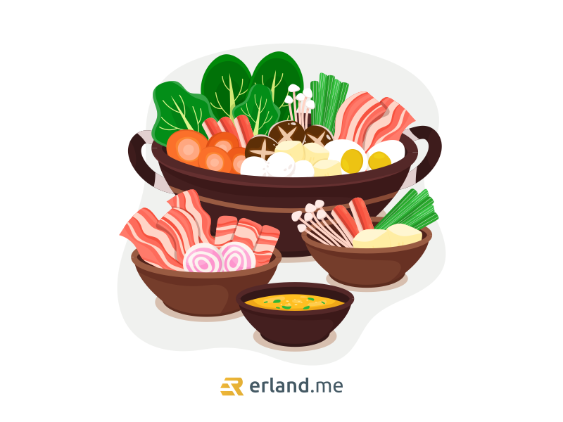

Siapa disini yang suka makan dan selalu berburu kuliner-kuliner terbaru? Kalau aku sih iya, karena aku suka makan. Apalagi di jaman sekarang banyak banget kuliner dengan tema serta promo yang unik-unik! Ya, salah satunya adalah restoran atau tempat makan yang menyediakan sistem All You Can Eat (AYCE).

Kalian udah gak asing lagi ya dengan kata All You Can Eat? Bagaimana tidak, sekarang banyak lho restoran atau tempat makan yang menyediakan sistem AYCE. Kiranya, sudah tersebar di kota-kota besar Indonesia.

## Apa itu All You Can Eat?

Sesuai dengan namanya, All You Can Eat adalah sistem di mana restoran atau tempat makan yang memakai konsep para pengunjung bisa makan serta menikmati sepuasnya menu hidangan yang disajikan hanya dengan sekali bayar.

Walau begitu, resto yang menyediakan sistem All You Can Eat ini tetap memiliki peraturan, ya. Apa sih peraturannya? Kalian cukup membayar dengan harga yang sudah ditentukan resto. Biasanya harga yang ditentukan ialah harga untuk perorang. Setelah itu kalian baru deh bisa makan apa saja yang telah disediakan resto, bebas, dan boleh nambah.

Siapa yang tak tertarik? Banyak pula orang-orang yang berburu Resto berbasis sitem All You Can Eat!

## Hal-hal yang Tidak Boleh Dilakukan Saat Makan All You Can Eat

Restoran atau tempat makan yang menyediakan sistem All You Can Eat memang cukup menggiurkan para pecinta kuliner dari kalangan remaja, dewasa, juga para orang tua.

Namun siapa sangka sih kalau sistem All You Can Eat ini juga memiliki syarat dan ketentuan tersendiri? Tentunya juga ada beberapa hal yang tidak boleh dilakukan.

### Bawa pulang makanan

Kebanyakan resto yang menyediakan sistem All You Can Eat melarang keras para pengunjung atau konsumen membawa pulang makanannya ya, guys. Jadi ya, makanan yang dihidangkan hanya bisa dimakan di tempatnya saja. Walau tidak semua, dan walaupun bisa dibawa pulang biasanya akan terkena charge yang sudah ditentukan.

### Makanan bersisa

Tidak semua resto dengan sistem All You Can Eat membolehkan para pengunjungnya tuk menyisakan makanan. Biasanya ada resto yang akan menerapkan sistem denda jika ada customer yang menyisakan makanan. Ini tidak semua, ya! Dan biasanya dendanya pun tidak sampai mahal.

Namun tetap saja walau tidak didenda pun sayang jika makanan yang kita ambil terlalu banyak dan bersisa. Jadi kalau bisa kita sebagai Customer mengambil makanan secukupnya dulu aja, kalau kurang kan bisa nambah.

## Tips dan Trik Saat di All You Can Eat

Yang dari tadi baca dari atas sambil ngedumel sambil nyariin mana sih Tips & Tricknya mohon bersabar ini baru mau aku kasih nih! Jangan ngamuk dulu.

Bukan hanya satu atau dua, tapi banyak sekali para pecinta Kuliner jika ingin kulineran ya pengennya gak mau rugi. Termasuk aku sendiri. Apa lagi kalau kita sudah pengen banget makan All You Can Eat, ya sebisa mungkin pengennya makan banyak tanpa rugi. Kenapa demikian? Yah, sebab harga yang ditentukan biasanya relatif tidak murah-murah banget. Nah aku bakal kasih tau nih Tipsnya buat kalian yang mau makan di Resto All You Can Eat.

### Jangan berpakaian ketat

Salah satu yang harus diperhatikan adalah pakaian kalian guys, kalau bisa jangan pakai pakaian yang terlalu ketat ya! Sebab kita kan mau makan dengan porsi banyak. Jangan sampai deh karena pakaian ketat kita jadi gak nyaman karena terlalu begah dan perut kalian tidak nyaman akibat pakaian yang terlalu ketat.

### Ketahui menu makanan / kuah rebusan di AYCE

Wajib untuk kalian semua yang baru ingin mencoba resto dengan sistem All You Can Eat ini untuk mengetahui jenis makanan atau menu makanan yang dihidangkan resto, antara lain; Makanan siap santap, makanan rebusan / yang harus direbus terlebih dulu, ada pula makanan yang harus dipanggang.

Selain menu makanan pula kita harus mengetahui jenis kuah rebusan. Biasanya petugas kasir atau pramusaji akan menanyakan perihal pilihan kuah rebusan yang akan kita santap nantinya. Jika kamu masih tak paham atau tak mengetahui jenis-jenis rebusannya. Kalian bisa memilih yang paling sering dipilih oleh pengunjung lain ya kawan alias yang best seller. Jika kuah rebusan sudah mengering atau tersisa sedikit, kita bisa minta tambah guys.

### Ketahui kegunaan jenis alat makan dan alat masak

Ketahuilah kegunaan alat makan serta alat masak saat kalian sedang makan di Resto AYCE. Keduanya jelas berbeda ya. Biasanya saat kalian makan, akan tersedia pencapit, sendok sayur, serta sumpit. Pencapit digunakan untuk membantu kita dalam memasak, sendok sayur juga tersedia untuk membantu kita mengambil makanan dalam kuah rebusan, kalau sumpit memiliki fungsi untuk makan. Jangan sampai salah ya guys.

### Makan dalam jumlah sedikit

Memang biasanya hidangan di dalam Resto All You Can Eat selalu berhasil membuat kita semua tergiur. Eits, tapi jangan pernah kita serakah dan langsung makan dalam jumlah banyak ya! Itu menyebabkan perut kita cepat penuh dan berakhir kekenyangan, lho. Alangkah baiknya kita cicipi setiap menu dengan porsi makan dalam jumlah sedikit. Ya, sedikit-sedikit tidak apa. Yang penting habis semua kan?

### Hindari minum manis dan bersoda

Seperti yang kita tahu kalau minuman manis dan bersoda hanya akan membuat perut kita cepat kembung. Kalau perut sudah kembung? Bisa dipastikan deh kita udah gabisa menampung makanan lain kedalam perut. Bila dipaksa bisa menyebabkan mual-mual nanti. Agak riskan. Aku saranin kalian mending minum Air putih aja.

### Gunakan Pen panggang dengan baik

Jika kalian pergi makan ramai-ramai, gunakan lah Pen panggang secara gantian ya! Karena bisa repot nanti.  
Jika pen terasa sudah kotor, terdapat daging mengering yang gosong serta pen yang memulai hitam. Sebaiknya minta ganti pen ke pramusaji. Agar terhindar dari penyakit, karena biasanya gosongan serta minyak itulah yang mengandung kolesterol tinggi.

### Beri jeda saat perut terasa penuh.

Seperti yang aku bilang sebelumnya, kita bisa makan semua menu hidangan dengan pelan-pelan. Jika perut sudah terasa penuh, cobalah untuk berhenti sejenak! Lagi pula, pihak Resto tidak akan memberi batas waktu, kan? Jadi santai saja dan jangan terlalu memaksakan diri untuk memakan semuanya dengan cepat.

### Perhatikan penggunaan api saat masak

Memanggang, merebus makanan secara langsung tentu saja membutuhkan api masak yang harus tetap menyala. Jika saat sedang memanggang menimbulkan asap yang terlalu banyak, kita bisa meminta pramusaji untuk mengecilkan api, menghindari makanan cepat gosong. Begitu juga sebaliknya, jika makanan tak kunjung matang alias lama banget kayak tunggu antrian sembako, mintalah pramusaji untuk sedikit membesarkan apinya.

### Sisihkan hidangan Dessert untuk terakhir

Kalau resto menyediakan menu dessert, sebaiknya kita santap disaat-saat terakhir saja. Kenapa begitu? Karena Dessert adalah makanan manis biasanya. Manis bisa menyebabkan perut kita mual, makanya lebih baik disantap saat kita sudah selesai menyantap hidangan yang lain agar terhindarnya kita dari kemualan guys.

Nah, mungkin itu aja tips dan trik yang bisa aku kasih buat kalian yang mau coba atau mau makan di Resto All You Can Eat. Semoga bermanfaat buat kalian yang baca ya! Oh ya, jangan lupa juga olahraga agar badan tetap sehat. Bagaimana pun juga, banyak sebagian orang yang tidak biasa memakan makanan dalam jumlah banyak. Jadi ya yang bisa kita lakukan adalah perbanyak minum air putih juga olahraga rutin agar tubuh tidak kaget kalau sewaktu-waktu kita makan-makanan yang cukup banyak!
