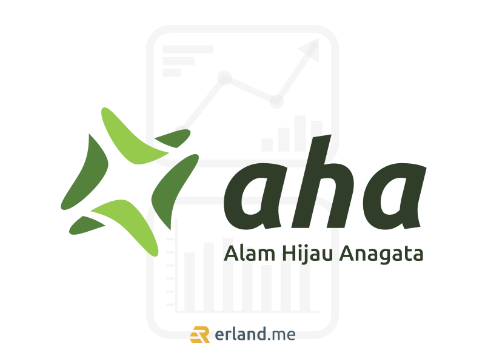

Kembali lagi kita membahas cryptocurrency! Seolah tak pernah ada habisnya memang membahas topik crypto, selalu ada saja pembahasannya di setiap obrolan dengan kerabat dan teman-teman saat sedang berkumpul bersama. Berbicara tentang cryptocurrency di Indonesia, pertumbuhannya memang begitu pesat dalam beberapa tahun terakhir.

Saat ini ada salah satu token cryptocurrency asal Indonesia yang sedang ramai diperbincangkan, namanya Alam Hijau Anagata, atau nama ringkasnya adalah AHA. Yang menarik dari token crypto ini adalah token ini dirancang khusus untuk mendukung industri [crypto](/blog/tag/crypto/) agar lebih ramah lingkungan dengan mengusung misi mengurangi emisi karbon. Hal ini tentu sangat bagus mengingat memang kegiatan dalam penambangan cryptocurrency itu membutuhkan energi dan daya listrik yang sangat besar.

Inilah yang membuat token crypto ini populer, project-nya sangat kontras dengan apa yang selama ini dihasilkan dari kegiatan crypto. Di saat banyak yang mencemari lingkungan dengan aktivitas yang menghasilkan emisi karbon, polusi udara, limbah, dan sebagainya, tetapi token AHA ini justru memiliki misi untuk melestarikan lingkungan. Ingin tau lebih lanjut tentang token AHA? Mari kita bahas!

## Token Crypto Eco Friendly

Jika kamu sudah akrab dengan crypto, tentu kamu sepakat pada fakta bahwa investasi dengan crypto dapat mendatangkan keuntungan yang sangat menggiurkan. Namun, tahukah kamu bahwa konsekuensi dari crypto bukan saja dari fluktuasi harganya yang dapat menimbulkan kerugian, tetapi juga dari kegiatan penambangan crypto sangat berpotensi merusak lingkungan karena kegiatannya membutuhkan daya listrik yang sangat besar. Faktanya memang kegiatan transaksi crypto yang terjadi selama ini sangat tidak ramah lingkungan.

Dan yang tak kalah miris, bahan bakar fosil saat ini semakin terus menipis, sementara penambangan crypto semakin masif dimana-mana dan dilakukan secara besar-besaran. Jika kamu pernah mendengar tentang isu pemanasan global yang ramai diperbincangkan di dunia, ketahuilah bahwa salah satu penyebabnya adalah dari konsumsi sumber daya listrik besar-besaran di kegiatan penambangan crypto ini.

Nah, untungnya saat ini telah hadir token AHA yang mengusung konsep eco friendly, khususnya dalam pengurangan emisi karbon. Token crypto ini memang berbeda dari yang lain, token AHA ini menjadi token pertama yang mengusung misi tersebut.

## Lebih Lanjut Mengenai AHA

<a href="https://token-aha.org">Token AHA</a> hadir dengan mengusung misi mengurangi emisi karbon yang semakin merusak lingkungan. Kehadiran token AHA diharapkan dapat membantu mengurangi kerusakan yang terjadi pada lingkungan akibat dari penambangan token crypto.

Nantinya, token AHA akan mengawasi transisi energi serta berkontribusi dalam proyek energi hijau. Beberapa contoh di antaranya seperti konservasi pengolahan air, perdagangan karbon, dan juga entitas lain-lainnya yang bernilai bisnis.

Token AHA ini juga memiliki fokus utama untuk dapat menjalin kerjasama dengan pemerintah Indonesia. Seperti diketahui, pemerintah memiliki target untuk mencapai bauran energi sebanyak 23% dari energi baru terbarukan (EBT) pada tahun 2025 nanti, dan token AHA ingin berkontribusi untuk merealisasikan target pemerintah tersebut dengan bekerja sama.

Berbicara tentang teknologinya, token AHA ini berbasis pada teknologi Binance Smart Chain (BSC). Token AHA ini juga mampu menciptakan transaksi yang aman dan menguntungkan bagi para investor berkat dukungan teknologi decentralized yield-generation utility eco-token.

Kalian sebagai investor pastilah penasaran dengan keunggulan dari token AHA ini. Apasih yang membuat token ini layak dipertimbangkan untuk dimiliki? Keunggulan dari AHA adalah diperdagangkan dalam bentuk koin dan token yang harganya stabil, tidak begitu fluktuatif seperti crypto pada umumnya. Kalian bisa bertransaksi dengan mudah dan aman karena terkoneksi langsung ke sistem yang sepenuhnya terdesentralisasi.

Token Anagata mematok biaya transaksi yang kecil, yaitu hanya 6% per transaksi. Biaya tersebut dibagi untuk pemeliharaan sistem 1%, dana amal 2%, refleksi ke pemegang lain 3%. Bahkan bukan hanya koin kripto, token AHA kedepannya juga berencana akan merilis produk game yang memberikan dukungan terhadap penanaman pohon asli di sejumlah wilayah, sekaligus membuat NFT yang melibatkan komunitas berpola pikir go green.
